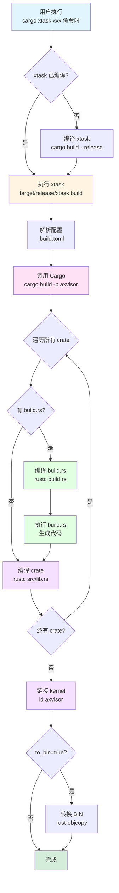
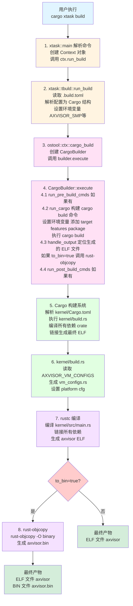

# 第1章 AxVisor 构建指南

本文档全面介绍 AxVisor 的构建系统，包括环境准备、构建流程深度分析、平台差异对比以及常见问题解决。

---

## 1 构建系统概述

AxVisor 使用 `xtask` 模式进行构建管理，这是一种 Rust 项目中常见的构建自动化模式。

### 1.1 构建命令

xtask 提供了一系列便捷的命令来管理 AxVisor 的构建、配置和运行流程。通过这些命令，开发者可以快速完成从配置选择到编译运行的全流程操作，无需记忆复杂的 cargo 参数和构建脚本。

```bash
# 查看所有可用命令
cargo xtask --help

# 主要命令：
cargo xtask defconfig <board>    # 设置默认构建配置
cargo xtask menuconfig           # 交互式配置界面
cargo xtask build                # 编译项目
cargo xtask qemu                 # 在 QEMU 中运行
cargo xtask uboot                # 通过 U-Boot 运行
cargo xtask clippy               # 代码质量检查
cargo xtask image                # Guest 镜像管理
cargo xtask vmconfig             # 生成 VM 配置 schema
```

### 1.2 构建框架

AxVisor 的构建流程采用分阶段的设计模式，从配置选择到最终运行，每个阶段都有明确的职责和接口。

#### 1.2.1 构建流程概览

AxVisor 的构建系统由三个主要部分组成，每个部分都有自己的编译和执行流程：

```
┌─────────────────────────────────────────────────────────────────┐
│                    AxVisor 构建系统                              │
├─────────────────────────────────────────────────────────────────┤
│                                                                 │
│  1. xtask（构建工具）                                           │
│     ├─ 编译：cargo build --release                              │
│     ├─ 产物：target/release/xtask                               │
│     └─ 执行：cargo xtask <command>                              │
│                                                                 │
│  2. build.rs（构建脚本）                                        │
│     ├─ 编译：每个 crate 的 build.rs                             │
│     ├─ 产物：target/.../build/<crate>-<hash>/build/build        │
│     └─ 执行：生成代码、设置编译选项                              │
│                                                                 │
│  3. Rust 源码（业务逻辑）                                       │
│     ├─ 编译：各个 crate 的主代码                                │
│     ├─ 产物：target/<triple>/release/axvisor                    │
│     └─ 链接：生成最终可执行文件                                 │
│                                                                 │
└─────────────────────────────────────────────────────────────────┘
```

#### 1.2.2 完整构建流程

xtask 作为构建工具本身，需要先编译，然后各个 crate 的构建脚本 build.rs，也都需要先编译后执行，最后才是按依赖关系顺序编译其他源代码。



**阶段 1: 编译 xtask**

```bash
# 用户执行: cargo xtask xxx 命令
#         ↓
# Cargo 检测到 xtask 需要编译
#         ↓
# 编译 xtask
cargo build --release --manifest-path xtask/Cargo.toml
#         ↓
# 生成可执行文件
target/release/xtask
#         ↓
# 执行 xtask
target/release/xtask xxx
```

| 步骤 | 说明 | 产物 |
|------|------|------|
| **编译 xtask** | 首次运行或 xtask 源码变化时，Cargo 编译 xtask | `target/release/xtask` |
| **执行 xtask** | 运行编译好的 xtask 可执行文件 | 解析配置、调用 Cargo |
| **触发条件** | - 首次运行<br>- xtask 源码变化<br>- xtask 依赖变化 | 自动重新编译 |

**阶段 2: xtask 执行构建命令**

```bash
# xtask 解析命令和配置
#         ↓
# 读取 .build.toml 配置文件
#         ↓
# 转换为 Cargo 构建配置
#         ↓
# 调用 Cargo 执行构建
cargo build -p axvisor --target <triple> --features <features>
```

**阶段 3: Cargo 编译各个 crate**

对于每个 crate（如 axstd、axhal、axruntime、kernel 等）：

```bash
# 3.1 如果有 build.rs，先编译 build.rs
rustc --crate-type bin --target <triple> \
    crate-name build \
    <crate>/build.rs \
    -o target/<triple>/debug/build/<crate>-<hash>/build/build
#         ↓
# 3.2 执行 build.rs
CARGO_CFG_TARGET_ARCH=... \
OUT_DIR=target/<triple>/debug/build/<crate>-<hash>/out \
    target/<triple>/debug/build/<crate>-<hash>/build/build
#         ↓
# 3.3 build.rs 生成代码到 OUT_DIR
# target/<triple>/debug/build/<crate>-<hash>/out/generated.rs
#         ↓
# 3.4 编译 crate 的主代码
rustc --crate-type lib --target <triple> \
    --cfg platform="..." \
    --features <features> \
    <crate>/src/lib.rs \
    -o target/<triple>/debug/lib<crate>.rlib
```

| 步骤 | 说明 | 产物 |
|------|------|------|
| **编译 build.rs** | 对于每个有 build.rs 的 crate，先编译它 | `target/.../build/build` |
| **执行 build.rs** | 运行 build.rs，生成代码或配置 | - `cargo::` 指令<br>- OUT_DIR 中的文件 |
| **触发条件** | - 首次构建<br>- build.rs 变化<br>- 依赖文件变化<br>- 环境变量变化 | 自动重新编译执行 |

| 步骤 | 说明 | 产物 |
|------|------|------|
| **编译各个 crate** | 按依赖顺序编译所有 crate | `.rlib` 或 `.a` 文件 |
| **编译 kernel** | 最后编译 kernel crate | `axvisor-*.o` |
| **链接** | 链接所有目标文件 | `axvisor` (ELF) |
| **可选转换** | ARM 平台转换为二进制 | `axvisor.bin` |

**阶段 4: 链接生成最终可执行文件**

```bash
# 链接所有依赖库
ld -o target/<triple>/release/axvisor \
    axvisor-*.o \
    libaxstd.a \
    libaxhal.a \
    libaxruntime.a \
    libaxvm.a \
    ... \
    -T link.x  # 链接脚本
```

**阶段 5: 可选的后处理**

```bash
# 如果 to_bin = true（ARM 平台）
rust-objcopy -O binary \
    target/<triple>/release/axvisor \
    target/<triple>/release/axvisor.bin
```

#### 1.2.3 构建产物

```
target/
├── release/
│   ├── xtask              # xtask 可执行文件
│   └── <triple>/
│       └── release/
│           ├── axvisor    # 最终产物（ELF）
│           └── axvisor.bin # 最终产物（BIN，仅 ARM）
└── debug/
    └── <triple>/
        ├── build/         # build.rs 编译产物
        │   ├── axvisor-*/
        │   │   ├── out/   # build.rs 生成文件
        │   │   └── build/ # build.rs 可执行文件
        │   └── ...
        └── deps/          # 依赖库
```

### 1.3 配置系统

AxVisor 采用灵活的分层配置系统，将硬件平台配置与虚拟机配置分离，实现了配置的可重用性和可扩展性。本节详细介绍配置文件的组织结构、格式规范以及如何通过配置文件定制构建和运行时行为。

#### 1.3.1 配置文件结构

AxVisor 的配置文件按照功能和用途进行分层组织。硬件平台配置定义了构建参数和编译选项，虚拟机配置定义了运行时行为。这种分离设计使得配置可以独立管理和复用。

```
configs/
├── defconfig.toml          # 默认配置模板
├── board/                  # 硬件平台配置
│   ├── qemu-aarch64.toml
│   ├── qemu-x86_64.toml
│   ├── orangepi-5-plus.toml
│   ├── phytiumpi.toml
│   └── roc-rk3568-pc.toml
└── vms/                    # 虚拟机配置
    ├── arceos-aarch64-qemu-smp1.toml
    ├── linux-aarch64-qemu-smp1.toml
    └── ...
```

#### 1.3.2 板级配置文件格式

板级配置文件采用 TOML 格式，定义了特定硬件平台的构建参数。通过修改这些配置，开发者可以定制编译选项、启用特定功能、调整日志级别等，而无需修改源代码。

板级配置文件（TOML 格式）定义了构建参数：

```toml
# Cargo 参数
cargo_args = []              # 额外的 cargo 参数

# 功能特性
features = [
    "ept-level-4",           # 4级 EPT（扩展页表）
    "axstd/bus-mmio",        # MMIO 总线支持
    "dyn-plat",              # 动态平台支持
    "fs",                    # 文件系统支持
]

# 日志级别
log = "Info"                 # 可选: Trace, Debug, Info, Warn, Error

# 目标架构
target = "aarch64-unknown-none-softfloat"

# 输出二进制文件
to_bin = true                # 是否生成裸二进制文件

# SMP 配置
smp = 1                      # CPU 核心数（可选，覆盖 defconfig.toml）

# 虚拟机配置列表
vm_configs = []              # VM 配置文件路径列表
```

#### 1.3.3 虚拟机配置文件格式

虚拟机配置文件定义了 Guest OS 的运行参数，包括 CPU 分配、内存布局、设备配置等。这些配置在构建时被嵌入到 AxVisor 二进制文件中，运行时直接读取使用，无需额外的配置文件。

虚拟机配置文件定义了 guest OS 的运行参数：

```toml
# 基本信息
[base]
id = 1                       # VM ID
name = "arceos-qemu"         # VM 名称
vm_type = 1                  # 虚拟化类型
cpu_num = 1                  # 虚拟 CPU 数量
phys_cpu_ids = [0]           # 物理 CPU ID 列表

# 内核配置
[kernel]
entry_point = 0x8020_0000    # 内核入口点
image_location = "memory"    # 镜像位置: "memory" | "fs"
kernel_path = "path/to/kernel.bin"
kernel_load_addr = 0x8020_0000
dtb_path = "path/to.dtb"     # 设备树 blob（可选）
dtb_load_addr = 0x8000_0000

# 内存区域（格式：base_paddr, size, flags, map_type）
memory_regions = [
    [0x8000_0000, 0x4000_0000, 0x7, 1],  # 1GB 系统内存
]

# 设备配置
[devices]
passthrough_devices = [["/",]]           # 直通设备
excluded_devices = [["/pcie@10000000"]] # 排除设备
emu_devices = []                        # 模拟设备
interrupt_mode = "passthrough"          # 中断模式
```

---

## 2 核心依赖分析

AxVisor 的构建依赖于三个核心组件：**ostool**（构建工具）、**ArceOS**（系统核心库）和**平台特定库**。这些组件共同构成了 AxVisor 的构建基础，理解它们的作用和相互关系对于掌握整个构建系统至关重要。

### 2.1 ostool

`ostool` 是构建工具核心，提供构建、配置、运行的一体化工具链

#### 2.1.1 核心模块

ostool 由多个功能模块组成，每个模块负责构建流程中的特定环节。这种模块化设计使得代码结构清晰，便于维护和扩展。

| 模块 | 文件 | 功能 |
|------|------|------|
| **CargoBuilder** | [ostool/src/build/cargo_builder.rs](../tmp/ostool/ostool/src/build/cargo_builder.rs) | 执行 cargo build，处理特性、环境变量 |
| **BuildConfig** | [ostool/src/build/config.rs](../tmp/ostool/ostool/src/build/config.rs) | 构建配置结构定义 |
| **AppContext** | [ostool/src/ctx.rs](../tmp/ostool/ostool/src/ctx.rs) | 应用上下文，路径管理 |
| **QemuRunner** | [ostool/src/run/qemu.rs](../tmp/ostool/ostool/src/run/qemu.rs) | QEMU 运行管理 |

#### 2.1.2 CargoBuilder

CargoBuilder 是 ostool 的核心组件，负责构建和执行 cargo 命令。它通过一系列精心设计的方法，将配置信息转换为实际的编译命令，并处理输出文件的生成和转换。

```rust
// 1. 构建 cargo 命令
async fn build_cargo_command(&mut self) -> anyhow::Result<Command> {
    let mut cmd = self.ctx.command("cargo");
    cmd.arg(&self.command);  // "build" 或 "run"

    // 设置环境变量
    for (k, v) in &self.config.env {
        cmd.env(k, v);
    }

    // 添加目标和包名
    cmd.arg("-p").arg(&self.config.package);
    cmd.arg("--target").arg(&self.config.target);

    // 添加特性
    let features = self.build_features();
    cmd.arg("--features").arg(features.join(","));

    // 添加额外参数
    for arg in &self.config.args {
        cmd.arg(arg);
    }

    Ok(cmd)
}

// 2. 处理输出
async fn handle_output(&mut self) -> anyhow::Result<()> {
    let elf_path = target_dir
        .join(&self.config.target)
        .join(if self.ctx.debug { "debug" } else { "release" })
        .join(&self.config.package);

    self.ctx.set_elf_path(elf_path).await;

    // 如果需要，转换为二进制
    if self.config.to_bin && !self.skip_objcopy {
        self.ctx.objcopy_output_bin()?;
    }
}
```

### 2.2 ArceOS

ArceOS 提供操作系统基础功能, 采用模块化架构，由多个功能独立的 crate 组成。每个 crate 都专注于特定的系统功能，通过清晰的接口协同工作，为 AxVisor 提供完整的操作系统服务。

#### 2.2.1 核心组件

| Crate | 功能 | 在 AxVisor 中的用途 |
|-------|------|-------------------|
| **axstd** | 标准库替代 | 提供 alloc、paging、irq、multitask、smp |
| **axhal** | 硬件抽象层 | 提供平台无关的硬件访问接口 |
| **axruntime** | 运行时支持 | 初始化系统、管理任务、提供平台接口 |
| **axalloc** | 内存分配器 | 物理页帧分配、虚拟内存管理 |
| **axdriver** | 设备驱动框架 | 统一的设备驱动接口 |
| **axlog** | 日志系统 | 内核日志输出 |
| **axmm** | 内存管理 | 页表管理、地址空间 |
| **axtask** | 任务管理 | 任务调度、多任务支持 |

#### 2.2.2 依赖来源

ArceOS 的依赖通过 Git 仓库和本地路径两种方式引入，这种混合模式既保证了核心组件的版本一致性，又允许本地模块的灵活定制。

在 [Cargo.toml](../Cargo.toml) 中定义：

```toml
[workspace.dependencies]
# 系统依赖模块，由 ArceOS 提供
axstd = {git = "https://github.com/arceos-org/arceos.git", tag = "dev-251216", features = [
  "alloc-level-1",
  "paging",
  "irq",
  "multitask",
  "smp",
]}

axalloc = {git = "https://github.com/arceos-org/arceos.git", tag = "dev-251216"}
axhal = {git = "https://github.com/arceos-org/arceos.git", tag = "dev-251216"}
axruntime = {path = "modules/axruntime"}  # 本地覆盖
# ... 其他依赖
```

### 2.3 平台特定依赖

除了通用的系统依赖外，AxVisor 还需要针对不同硬件平台的特定支持库。这些平台依赖提供了硬件抽象、设备驱动和虚拟化支持等平台相关功能，确保 AxVisor 能够在多种硬件架构上正常运行。

#### 2.3.1 ARM64 平台

ARM64 平台对应的组件为 `axplat-aarch64-dyn`，提供 ARM64 平台的硬件虚拟化支持

```toml
# modules/axplat-aarch64-dyn/Cargo.toml
[features]
hv = ["somehal/hv", "page_table_entry/arm-el2", "percpu/arm-el2"]

[dependencies]
somehal = "0.4"  # 硬件抽象层，支持 EL2
arm-gic-driver = {version = "0.15.3", features = ["rdif"]}
```

**关键特性**:
- `hv`: 硬件虚拟化支持（ARM EL2 特权级）
- `arm-el2`: ARM EL2 特定功能
- `irq`: 中断控制器支持（GIC）

#### 2.3.2 x86_64 平台

x86_64 平台对应的组件为 `x86-qemu-q35`，提供 x86_64 平台的硬件支持

```toml
# platform/x86-qemu-q35/Cargo.toml
[features]
default = ["irq", "smp", "reboot-on-system-off"]
irq = ["axplat/irq"]
smp = ["axplat/smp"]

[dependencies]
x86 = "0.52"
x86_64 = "0.15.2"
x2apic = "0.5"  # x86 APIC 支持
```

**关键特性**:
- `irq`: x86 APIC 中断支持
- `smp`: 多核支持
- `reboot-on-system-off`: 系统关机时重启

---

## 3 构建流程

当我们执行 `cargo xtask build` 时，系统会按照以下步骤逐步编译出最终可执行文件。本节将详细分析 x86_64 和 ARM64 两个平台的构建过程，包括参数传递、工具链选择等关键细节。

通过对比 x86_64 和 ARM64 两个平台的构建过程，我们可以总结出以下关键差异。这些差异不仅体现在构建参数上，更反映了两个平台在系统架构、启动方式和应用场景上的根本不同。

| 项目 | x86_64 | ARM64 |
|------|--------|-------|
| **目标三元组** | `x86_64-unknown-none` | `aarch64-unknown-none-softfloat` |
| **平台标识** | `x86-qemu-q35` | `aarch64-generic` |
| **主要特性** | `axstd/myplat`, `ept-level-4` | `dyn-plat`, `axstd/bus-mmio` |
| **平台 Crate** | `axplat-x86-qemu-q35` | `axplat-aarch64-dyn` |
| **中断控制器** | APIC (x2apic) | GIC (arm-gic-driver) |
| **生成产物** | ELF | ELF + BIN |
| **启动方式** | Multiboot (ELF) | 裸机加载 (BIN) |

### 3.1 通用构建流程

x86_64 和 Arm64 两个平台都遵循相同的构建流程，但在具体实现上有所差异。下图展示了从用户命令到最终产物的完整构建链路，帮助开发者理解整个构建系统的数据流转和处理逻辑。



### 3.2 x86_64 平台构建

本节深入分析 x86_64 平台的构建过程，包括配置文件解析、工具链选择、参数传递和编译执行等各个环节。通过理解这些细节，开发者可以更好地掌握 x86_64 平台的构建机制和调试方法。

#### 3.2.1 配置文件分析

以 [configs/board/qemu-x86_64.toml](../configs/board/qemu-x86_64.toml) 为例，先由 xtask 转换为 `.build.toml` 后读取并解析为 `Config` 结构体，然后转换为 `ostool::build::config::Cargo` 结构用于构建。详细的解析过程参见下文的编译过程章节。

```toml
cargo_args = []
features = [
    "axstd/myplat",      # 使用 myplat 特性（静态平台配置）
    "ept-level-4",       # 4级扩展页表
    "fs",                # 文件系统支持
]
log = "Info"
target = "x86_64-unknown-none"  # 目标三元组
to_bin = false                    # 不生成 .bin 文件
vm_configs = []
```

#### 3.2.2 工具链选择

x86_64 平台使用 `x86_64-unknown-none` 目标三元组，工具链选择过程由 Rust 工具链管理系统自动处理。

1. **rust-toolchain.toml 定义** ([rust-toolchain.toml](../rust-toolchain.toml)):

    ```toml
    [toolchain]
    profile = "minimal"
    channel = "nightly-2025-12-12"
    components = ["rust-src", "llvm-tools", "rustfmt", "clippy"]
    targets = ["x86_64-unknown-none", "riscv64gc-unknown-none-elf", "aarch64-unknown-none-softfloat"]
    ```

2. **工具链自动安装**:
   - 首次构建时，rustup 自动安装 `nightly-2025-12-12` 工具链
   - 自动添加 `x86_64-unknown-none` 目标

3. **工具链位置**:
   ```
   ~/.rustup/toolchains/nightly-2025-12-12-x86_64-unknown-linux-gnu/
   └── lib/rustlib/x86_64-unknown-none/
       ├── bin/          # rustc, cargo 等工具
       └── lib/          # 标准库和核心库
   ```

#### 3.2.3 编译过程

本节详细追踪从配置文件到最终可执行文件的完整构建链路，深入分析参数如何在各个层级之间传递和转换，以及 Cargo 编译系统的内部工作机制。理解这个完整流程对于掌握构建系统、调试构建问题以及进行定制化开发都至关重要。

##### 3.2.3.1 加载配置文件

配置加载是构建流程的第一步，负责将板级配置文件转换为 Cargo 可以理解的构建配置结构。这个过程涉及多个数据结构的转换和环境变量的设置。

**1.1 读取板级配置文件**

当用户执行 `cargo xtask defconfig qemu-x86_64` 时，xtask 会执行以下操作：

```rust
// xtask/src/tbuld.rs 中的简化流程
pub fn run_defconfig(&mut self, board: &str) -> anyhow::Result<()> {
    // 1. 定位板级配置文件
    let board_config_path = format!("configs/board/{}.toml", board);
    // 例如: configs/board/qemu-x86_64.toml

    // 2. 读取板级配置内容
    let board_config_str = std::fs::read_to_string(&board_config_path)?;

    // 3. 解析为 Config 结构体
    let config: Config = toml::from_str(&board_config_str)?;

    // 4. 转换并保存为 .build.toml（供后续使用）
    let build_config_path = ".build.toml";
    std::fs::write(build_config_path, board_config_str)?;

    Ok(())
}
```

**1.2 解析配置为 Cargo 结构**

在执行 `cargo xtask build` 时，xtask 会读取 `.build.toml` 并进行详细解析：

```rust
// xtask/src/tbuld.rs
pub fn load_config(&mut self) -> anyhow::Result<Cargo> {
    // 1. 读取 .build.toml（由 defconfig 生成）
    let config_path = ".build.toml";
    let config_str = std::fs::read_to_string(config_path)?;

    // 2. 解析 TOML 为 Config 结构体
    let config: Config = toml::from_str(&config_str)?;

    // Config 结构包含以下字段：
    // - target: "x86_64-unknown-none"
    // - features: ["axstd/myplat", "ept-level-4", "fs"]
    // - log: Some("Info")
    // - cargo_args: []
    // - to_bin: false
    // - smp: Some(1)
    // - vm_configs: []

    // 3. 转换为 ostool 的 Cargo 结构
    let mut cargo = Cargo {
        target: config.target,
        package: "axvisor".to_string(),
        features: config.features,
        log: config.log,
        args: config.cargo_args,
        to_bin: config.to_bin,
        env: HashMap::new(),  // 环境变量容器
        ..Default::default()
    };

    // 4. 处理 VM 配置文件
    let vm_config_paths = if config.vm_configs.is_empty() {
        vec![]  // 使用默认配置
    } else {
        // 解析 VM 配置文件路径
        config.vm_configs.iter()
            .map(|vm_path| std::path::PathBuf::from(vm_path))
            .collect()
    };

    // 5. 设置环境变量（关键步骤）
    // 5.1 设置 SMP 核心数
    if let Some(smp) = config.smp {
        cargo.env.insert(
            "AXVISOR_SMP".to_string(),
            smp.to_string()
        );
        // 例如: AXVISOR_SMP=1
    }

    // 5.2 设置 VM 配置文件路径列表
    if !vm_config_paths.is_empty() {
        // 将多个路径用系统路径分隔符连接
        let value = std::env::join_paths(&vm_config_paths)?;
        cargo.env.insert(
            "AXVISOR_VM_CONFIGS".to_string(),
            value
        );
        // 例如: AXVISOR_VM_CONFIGS=configs/vms/vm1.toml:configs/vms/vm2.toml
    }

    // 6. 处理日志级别
    if let Some(log_level) = config.log {
        // 将日志级别转换为 feature
        let log_feature = format!("log/release_max_level_{}", log_level.to_lowercase());
        cargo.features.push(log_feature);
        // 例如: log/release_max_level_info
    }

    Ok(cargo)
}
```

**配置转换的关键点**：

1. **数据结构转换**：从板级配置的 `Config` 结构转换为 ostool 的 `Cargo` 结构
2. **环境变量设置**：将配置项转换为环境变量，供后续 build.rs 使用
3. **特性扩展**：根据日志级别自动添加对应的 feature
4. **路径处理**：将 VM 配置文件路径转换为系统可识别的路径列表

##### 3.2.3.2 生成编译命令

在配置加载完成后，ostool 的 CargoBuilder 负责构建实际的 cargo 命令。这个过程涉及多个参数的组装和环境变量的传递。

**2.1 创建基础命令**

```rust
// tmp/ostool/ostool/src/build/cargo_builder.rs
async fn build_cargo_command(&mut self) -> anyhow::Result<Command> {
    // 1. 创建 cargo 命令
    let mut cmd = self.ctx.command("cargo");
    cmd.arg("build");  // 指定子命令

    // 2. 设置环境变量（从配置中获取）
    for (key, value) in &self.config.env {
        cmd.env(key, value);
        // 设置的环境变量包括：
        // - AXVISOR_SMP=1
        // - AXVISOR_VM_CONFIGS=...
    }

    // 3. 指定要构建的包
    cmd.arg("-p").arg(&self.config.package);
    // 例如: -p axvisor

    // 4. 指定目标三元组
    cmd.arg("--target").arg(&self.config.target);
    // 例如: --target x86_64-unknown-none

    Ok(cmd)
}
```

**2.2 处理编译特性**

```rust
// 继续在 build_cargo_command 中
// 5. 构建特性列表
let features = self.build_features();

fn build_features(&self) -> Vec<String> {
    let mut features = self.config.features.clone();

    // 添加日志级别特性（已在 3.2.3.1 加载配置文件中添加）
    // features 现在包含:
    // - "axstd/myplat"
    // - "ept-level-4"
    // - "fs"
    // - "log/release_max_level_info"

    features
}

// 6. 添加特性参数
cmd.arg("--features").arg(features.join(","));
// 例如: --features axstd/myplat,ept-level-4,fs,log/release_max_level_info
```

**2.3 设置编译模式**

```rust
// 7. 根据调试/发布模式设置参数
if !self.ctx.debug {
    cmd.arg("--release");
    // 如果不是 debug 模式，添加 --release 参数
}

// 8. 添加额外的 cargo 参数
for arg in &self.config.args {
    cmd.arg(arg);
    // 添加用户指定的额外参数
}

Ok(cmd)  // 返回完整的 Command 对象
```

**2.4 实际执行的命令**

经过上述步骤，最终生成的 cargo 命令为：

```bash
cargo build \
    -p axvisor \
    --target x86_64-unknown-none \
    --features axstd/myplat,ept-level-4,fs,log/release_max_level_info \
    --release
```

**命令参数详解**：

- `cargo build`: Cargo 的构建子命令
- `-p axvisor`: 指定构建 axvisor 包（对应 kernel/Cargo.toml）
- `--target x86_64-unknown-none`: 指定目标平台为 x86_64 裸机
- `--features ...`: 启用指定的编译特性
  - `axstd/myplat`: 使用静态平台配置
  - `ept-level-4`: 启用 4 级扩展页表
  - `fs`: 启用文件系统支持
  - `log/release_max_level_info`: 设置日志级别为 Info
- `--release`: 使用 release 模式编译（优化）

##### 3.2.3.3 解析 Cargo.toml

AxVisor 是一个 Cargo workspace 项目，包含多个 crate，每个都有自己的 `Cargo.toml` 文件。Cargo 按照以下顺序处理这些文件：

**3.1 完整处理流程**

```
1. 用户执行: cargo build --target x86_64-unknown-none
   │
   ▼
2. Cargo 解析命令行参数
   获取 --target 参数: "x86_64-unknown-none"
   │
   ▼
3. Cargo 解析根 Cargo.toml (workspace root)
   ├── 识别 workspace 成员（members = ["crates/*", "modules/*", "platform/*", "xtask", "kernel"]）
   ├── 解析 workspace.dependencies
   └── 确定要构建的包（-p axvisor，对应 kernel 包）
   │
   ▼
4. Cargo 解析所有 workspace 成员的 Cargo.toml
   ├── 并行读取所有成员的 Cargo.toml 文件
   ├── 解析每个包的 [dependencies] 和 [target.'cfg(...)'.dependencies]
   ├── 根据命令行参数 --target 判断条件依赖 ⭐
   │   例如：[target.'cfg(target_arch = "x86_64")'.dependencies]
   └── 构建完整的依赖图（dependency graph）
   │
   ▼
5. Cargo 拓扑排序确定编译顺序
   ├── 从依赖图中找出无依赖的包（叶子节点）
   ├── 按拓扑顺序排列所有包
   └── 确保被依赖的包先编译
   │
   ▼
6. Cargo 设置环境变量 ⭐ (在执行 build.rs 之前)
   从目标三元组提取信息并设置 CARGO_CFG_* 环境变量
   │
   ▼
7. Cargo 按拓扑顺序执行 build.rs（如果有）
   ├── 从底层依赖开始（如 axstd, axhal）
   ├── 逐步向上（如 axruntime, axvm）
   └── 最后执行 kernel/build.rs
   │
   ▼
8. Cargo 按拓扑顺序编译每个 crate
   ├── 从底层依赖开始（axstd, axhal, ...）
   ├── 编译中间层（axruntime, axvm, ...）
   ├── 编译平台相关（axplat-x86-qemu-q35）
   └── 最后编译 kernel（生成 axvisor 可执行文件）
```

**3.2 条件依赖的解析时机**

关键点：**Cargo 在解析每个 Cargo.toml 时（在 3.2.3.3 的步骤 4 中），直接根据命令行参数 `--target` 判断条件依赖，不依赖环境变量**

- 每个 `Cargo.toml` 在被解析时，Cargo 都会根据命令行参数 `--target` 判断其中的条件依赖
- 这意味着 `axruntime/Cargo.toml` 中的 `[target.'cfg(target_arch = "x86_64")'.dependencies]` 会在解析该文件时立即判断
- 不匹配平台的依赖（如 ARM 平台编译时的 x86 依赖）会被完全忽略，不会下载或编译
- 环境变量是在后续执行 build.rs 之前才设置的

**3.2.1 条件依赖的判断机制**

根据 [Cargo 官方文档 - Platform Specific Dependencies](https://doc.rust-lang.org/cargo/reference/specifying-dependencies.html#platform-specific-dependencies)，Cargo 使用以下机制判断条件依赖：

**判断流程**：

```
1. Cargo 读取命令行参数 --target
   例如：--target x86_64-unknown-none

2. Cargo 调用 rustc 获取该平台的 cfg 配置
   命令：rustc --print=cfg --target x86_64-unknown-none

3. rustc 返回该平台的所有 cfg 配置
   输出示例：
   target_arch="x86_64"
   target_os="none"
   target_vendor="unknown"
   target_endian="little"
   target_pointer_width="64"
   target_feature=""
   ...

4. Cargo 将这些 cfg 配置与 Cargo.toml 中的条件匹配
   [target.'cfg(target_arch = "x86_64")'.dependencies]
   └─ 匹配成功 ✓（因为 target_arch="x86_64" 存在）

   [target.'cfg(target_arch = "aarch64")'.dependencies]
   └─ 匹配失败 ✗（因为 target_arch="aarch64" 不存在）

5. 只包含匹配成功的依赖到依赖图中
```

**实际示例**：

以 [modules/axruntime/Cargo.toml](../modules/axruntime/Cargo.toml) 为例：

```toml
[dependencies]
# 通用依赖（所有平台都包含）
axhal = {workspace = true}
axlog = {workspace = true}
# ... 其他通用依赖

# x86_64 平台特定依赖
[target.'cfg(target_arch = "x86_64")'.dependencies]
axplat-x86-qemu-q35 = {workspace = true}

# ARM64 平台特定依赖
[target.'cfg(target_arch = "aarch64")'.dependencies]
axplat-aarch64-dyn = {git = "https://github.com/arceos-hypervisor/axplat-aarch64-dyn.git", tag = "v0.4.0", features = ["irq", "smp", "hv"]}
somehal = "0.4"
```

**x86_64 平台编译时**：

```bash
# 1. 执行编译命令
cargo build --target x86_64-unknown-none

# 2. Cargo 获取 x86_64 平台的 cfg 配置
rustc --print=cfg --target x86_64-unknown-none
# 输出包含：target_arch="x86_64"

# 3. Cargo 判断条件依赖
# [target.'cfg(target_arch = "x86_64")'.dependencies] ✓ 匹配
#   └─ axplat-x86-qemu-q35 被包含到依赖图中
# [target.'cfg(target_arch = "aarch64")'.dependencies] ✗ 不匹配
#   └─ axplat-aarch64-dyn 和 somehal 被忽略

# 4. 最终依赖图包含：
# axhal, axlog, axplat-x86-qemu-q35, ...
# 但不包含：axplat-aarch64-dyn, somehal
```

**ARM64 平台编译时**：

```bash
# 1. 执行编译命令
cargo build --target aarch64-unknown-none-softfloat

# 2. Cargo 获取 ARM64 平台的 cfg 配置
rustc --print=cfg --target aarch64-unknown-none-softfloat
# 输出包含：target_arch="aarch64"

# 3. Cargo 判断条件依赖
# [target.'cfg(target_arch = "x86_64")'.dependencies] ✗ 不匹配
#   └─ axplat-x86-qemu-q35 被忽略
# [target.'cfg(target_arch = "aarch64")'.dependencies] ✓ 匹配
#   └─ axplat-aarch64-dyn 和 somehal 被包含到依赖图中

# 4. 最终依赖图包含：
# axhal, axlog, axplat-aarch64-dyn, somehal, ...
# 但不包含：axplat-x86-qemu-q35
```

**关键要点**：

1. **不依赖环境变量**：判断条件依赖时，Cargo 不使用 `CARGO_CFG_*` 环境变量，而是直接调用 `rustc --print=cfg`
2. **早期判断**：在解析 Cargo.toml 时就立即判断，而不是等到编译时
3. **完全忽略**：不匹配的依赖会被完全忽略，不会下载、编译或链接
4. **平台隔离**：不同平台的依赖可以共存于同一个 Cargo.toml 中，互不干扰

##### 3.2.3.4 设置 Cargo 环境变量

在解析完所有 Cargo.toml 并确定编译顺序后，Cargo 在**执行 build.rs 之前**会设置一系列 `CARGO_CFG_*` 环境变量，供 build.rs 使用。

**官方文档依据**：

根据 [Cargo Build Scripts 官方文档](https://doc.rust-lang.org/cargo/reference/build-scripts.html#inputs-to-the-build-script)：

> When the build script is run, there are a number of inputs to the build script, all passed in the form of environment variables.

**环境变量的作用**：

这些 `CARGO_CFG_*` 环境变量（如 `CARGO_CFG_TARGET_ARCH`、`CARGO_CFG_TARGET_OS` 等）是：
- **设置时机**：在执行 build.rs 之前
- **用途**：供 build.rs 脚本读取和使用
- **不用于**：解析 Cargo.toml 中的条件依赖

**重要区别**：

| 阶段 | 时机 | 依据 | 用途 |
|------|------|------|------|
| **解析条件依赖** | 解析 Cargo.toml 时 | 命令行参数 `--target` | 判断 `[target.'cfg(...)'.dependencies]` |
| **设置环境变量** | 执行 build.rs 之前 | 从目标三元组提取 | 供 build.rs 脚本使用 |

**环境变量示例**：

```bash
# Cargo 在执行 build.rs 之前设置的环境变量示例
CARGO_CFG_TARGET_ARCH=x86_64
CARGO_CFG_TARGET_OS=none
CARGO_CFG_TARGET_VENDOR=unknown
CARGO_CFG_TARGET_ENDIAN=little
CARGO_CFG_TARGET_POINTER_WIDTH=64
CARGO_CFG_TARGET_FEATURE=
```

这些环境变量可以在 build.rs 中通过 `std::env::var()` 读取，用于生成平台特定的代码或配置。

##### 3.2.3.5 build.rs 执行

build.rs 是 Cargo 的构建脚本，在编译主代码之前执行。它可以根据环境变量和配置文件生成代码、设置编译选项等。

**build.rs 的编译和执行流程**：

根据 [Cargo 官方文档 - Build Scripts](https://doc.rust-lang.org/cargo/reference/build-scripts.html#life-cycle-of-a-build-script)，build.rs 的执行分为以下阶段：

```
阶段 1: 编译 build.rs
├─ Cargo 检测到 kernel/build.rs 文件存在
├─ Cargo 调用 rustc 编译 build.rs
│  ├─ 使用目标平台的 rustc（交叉编译时使用交叉编译器）
│  ├─ 编译输出: target/<triple>/debug/build/<package>-<hash>/build/build
│  └─ 生成可执行文件（构建脚本本身）
│
阶段 2: 执行 build.rs
├─ Cargo 运行编译好的 build 可执行文件
├─ 设置环境变量（CARGO_CFG_* 等）
├─ build.rs 读取环境变量和配置文件
├─ build.rs 生成代码到 OUT_DIR
│  └─ target/<triple>/debug/build/<package>-<hash>/out/vm_configs.rs
└─ build.rs 输出 cargo:: 指令到 stdout
│  ├─ cargo:rustc-cfg=platform="..."
│  ├─ cargo:rerun-if-changed=...
│  └─ cargo:rerun-if-env-changed=...
│
阶段 3: 解析 build.rs 输出
├─ Cargo 捕获 build.rs 的 stdout 输出
├─ 解析 cargo:: 指令
├─ 设置编译参数（如 --cfg）
└─ 准备编译主代码
│
阶段 4: 编译主代码
└─ Cargo 使用 build.rs 生成的配置编译主代码
```

**实际示例**：

```bash
# 1. 编译 build.rs（由 Cargo 自动执行）
rustc --edition=2021 \
    --crate-type bin \
    --target x86_64-unknown-none \
    --crate-name build \
    kernel/build.rs \
    -o target/x86_64-unknown-none/debug/build/axvisor-<hash>/build/build

# 2. 执行 build.rs（由 Cargo 自动执行）
# 设置环境变量
CARGO_CFG_TARGET_ARCH=x86_64 \
CARGO_CFG_TARGET_OS=none \
CARGO_CFG_TARGET_VENDOR=unknown \
CARGO_CFG_TARGET_ENDIAN=little \
CARGO_CFG_TARGET_POINTER_WIDTH=64 \
AXVISOR_VM_CONFIGS=configs/vms/vm1.toml:configs/vms/vm2.toml \
OUT_DIR=target/x86_64-unknown-none/debug/build/axvisor-<hash>/out \
TARGET=x86_64-unknown-none \
HOST=x86_64-unknown-linux-gnu \
    target/x86_64-unknown-none/debug/build/axvisor-<hash>/build/build

# 3. build.rs 输出到 stdout（被 Cargo 捕获）
cargo:rustc-cfg=platform="x86-qemu-q35"
cargo:rerun-if-changed=kernel/build.rs
cargo:rerun-if-env-changed=AXVISOR_VM_CONFIGS

# 4. build.rs 生成文件到 OUT_DIR
# target/x86_64-unknown-none/debug/build/axvisor-<hash>/out/vm_configs.rs
```

**关键要点**：

1. **先编译后执行**：build.rs 首先被编译成可执行文件，然后才被执行
2. **独立编译**：build.rs 的编译与主代码的编译是独立的
3. **环境变量传递**：Cargo 通过环境变量向 build.rs 传递构建信息
4. **输出机制**：build.rs 通过 stdout 输出 `cargo::` 指令与 Cargo 通信
5. **文件生成**：build.rs 可以在 `OUT_DIR` 中生成文件，供主代码使用

**build.rs 的执行时机**：

- **首次构建**：build.rs 会被编译并执行
- **文件变化**：如果 build.rs 或其依赖发生变化，会重新编译并执行
- **环境变量变化**：如果 `rerun-if-env-changed` 指定的环境变量变化，会重新执行
- **增量编译**：如果没有变化，Cargo 会缓存 build.rs 的输出，跳过执行

**4.1 获取目标架构**

```rust
fn main() -> anyhow::Result<()> {
    // 1. 获取目标架构（由 Cargo 自动设置的环境变量）
    let arch = std::env::var("CARGO_CFG_TARGET_ARCH").unwrap(); // "x86_64"

    // 2. 确定平台标识
    let platform = if arch == "aarch64" {
        "aarch64-generic"
    } else if arch == "x86_64" {
        "x86-qemu-q35"  // x86 平台
    } else {
        "dummy"
    };

    // 3. 设置 platform cfg（编译时条件）
    println!("cargo:rustc-cfg=platform=\"{platform}\"");
    // 这会在编译时设置 #[cfg(platform = "x86-qemu-q35")]
    // 使得代码中可以使用条件编译
}
```

**4.2 读取 VM 配置**

```rust
// 4. 读取 VM 配置文件
fn get_configs() -> anyhow::Result<Vec<VmConfig>> {
    // 从 AXVISOR_VM_CONFIGS 环境变量获取配置文件路径
    let env_var = std::env::var("AXVISOR_VM_CONFIGS");

    let config_paths = match env_var {
        Ok(paths) => {
            // 解析路径列表（用 : 分隔）
            std::env::split_paths(&paths)
                .collect()
        }
        Err(_) => vec![],  // 没有指定 VM 配置
    };

    // 读取每个配置文件的内容
    let mut configs = Vec::new();
    for path in config_paths {
        let content = std::fs::read_to_string(&path)?;
        configs.push(VmConfig {
            path: path.to_string_lossy().to_string(),
            content,
        });
    }

    Ok(configs)
}

let config_files = get_configs()?;  // 从 AXVISOR_VM_CONFIGS 环境变量
let mut output_file = open_output_file();  // $(OUT_DIR)/vm_configs.rs
```

**4.3 生成 vm_configs.rs**

```rust
// 5. 生成 vm_configs.rs 文件
match config_files {
    Ok(config_files) => {
        // 写入函数签名
        writeln!(output_file, "pub fn static_vm_configs() -> Vec<&'static str> {{")?;

        if config_files.is_empty() {
            // 没有配置文件时使用默认配置
            writeln!(output_file, "    default_static_vm_configs()")?;
        } else {
            // 有配置文件时，将配置内容嵌入代码
            writeln!(output_file, "    vec![")?;
            for config_file in &config_files {
                // 使用原始字符串字面量嵌入 TOML 内容
                writeln!(output_file, "        r###\"{}\"###,", config_file.content)?;

                // 添加重新构建触发器
                // 如果配置文件改变，需要重新运行 build.rs
                println!(
                    "cargo:rerun-if-changed={}",
                    PathBuf::from(config_file.path.clone()).display()
                );
            }
            writeln!(output_file, "    ]")?;
        }
        writeln!(output_file, "}}\n")?;

        // 生成 Guest 镜像加载函数
        generate_guest_img_loading_functions(&mut output_file, config_files)?;
    }
    Err(error) => {
        // 配置文件读取失败时生成编译错误
        writeln!(output_file, "    compile_error!(\"{error}\")")?;
        writeln!(output_file, "}}\n")?;
    }
}
```

**4.4 设置重新构建触发器**

```rust
// 6. 设置重新构建触发器
// 如果环境变量改变，重新运行 build.rs
println!("cargo:rerun-if-env-changed=AXVISOR_VM_CONFIGS");
println!("cargo:rerun-if-changed=build.rs");

Ok(())
}
```

**build.rs 的作用总结**：
1. **平台识别**：根据目标架构确定平台标识
2. **条件编译设置**：设置 `platform` cfg 供代码使用
3. **配置嵌入**：将 VM 配置文件内容嵌入到生成的代码中
4. **增量编译**：设置重新构建触发器，确保配置变化时重新构建

##### 3.2.3.6 rustc 编译

Cargo 调用 rustc 编译每个 crate：

```bash
# 实际执行的 rustc 命令（简化版）
rustc --edition=2024 \
    --crate-type bin \
    --target x86_64-unknown-none \
    --crate-name axvisor \
    -C link-arg=-nostartfiles \
    -C link-arg=-Tlink.x \
    --cfg 'platform="x86-qemu-q35"' \
    --features 'axstd/myplat,ept-level-4,fs' \
    kernel/src/main.rs \
    -o target/x86_64-unknown-none/release/axvisor
```

**关键参数说明**:
- `--target x86_64-unknown-none`: 指定目标三元组
- `--cfg 'platform="x86-qemu-q35"'`: 编译时条件，选择 x86 平台代码
- `--features`: 启用特性，影响代码编译
- `-C link-arg=-Tlink.x`: 使用链接脚本（由 platform/x86-qemu-q35/build.rs 从 linker.lds.S 生成）

##### 3.2.3.7 链接生成 ELF

链接器将所有目标文件链接成最终的 ELF 可执行文件：

```
输入文件:
├── axvisor-*.o (主程序)
├── libaxstd.a (标准库)
├── libaxhal.a (硬件抽象层)
├── libaxruntime.a (运行时)
├── libaxplat_x86_qemu_q35.a (x86 平台代码)
├── libaxvm.a (虚拟机管理)
└── ... (其他依赖)

链接脚本: link.x (由 platform/x86-qemu-q35/build.rs 生成)
输出: target/x86_64-unknown-none/release/axvisor (ELF)
```

##### 3.2.3.8 完成

由于 `to_bin = false`，x86 平台不生成 .bin 文件，只生成 ELF 文件。

#### 3.2.4 最终产物

构建完成后，x86_64 平台会生成 ELF 格式的可执行文件。这些文件包含了完整的程序代码、符号信息和调试数据，可以直接在 QEMU 或其他支持 ELF 格式的环境中加载运行。

```
target/x86_64-unknown-none/
├── debug/
│   ├── axvisor              # ELF 可执行文件
│   ├── axvisor.d            # 依赖文件
│   └── build/
│       └── axvisor-*/
│           └── out/
│               └── vm_configs.rs  # 生成的配置
└── release/
    └── axvisor              # Release 版本
```

---

### 3.3 ARM64 平台构建

本节深入分析 ARM64 平台的构建过程，重点介绍与 x86_64 平台的差异之处，包括软浮点 ABI、二进制文件生成等 ARM 平台特有的构建特性。

#### 3.3.1 配置文件分析

以 [configs/board/phytiumpi.toml](../configs/board/phytiumpi.toml) 为例，由 xtask 转换为 `.build.toml` 后读取并解析为 `Config` 结构体，然后转换为 `ostool::build::config::Cargo` 结构用于构建。详细的解析过程参见下文的 [3.3.3.1 加载配置文件](#3331-加载配置文件)。

```toml
cargo_args = []
features = [
    "dyn-plat",           # 动态平台配置
    "axstd/bus-mmio",     # MMIO 总线支持
    "fs",                 # 文件系统支持
    "driver/sdmmc",       # SD/MMC 驱动
    "driver/phytium-blk", # 飞腾块设备驱动
]
log = "Info"
target = "aarch64-unknown-none-softfloat"  # 软浮点 ABI
to_bin = true                              # 生成 .bin 文件
vm_configs = []
```

#### 3.3.2 工具链选择

ARM64 平台使用 `aarch64-unknown-none-softfloat` 目标三元组，与 x86 有显著差异。软浮点 ABI 的选择确保了与各种 ARM 硬件的兼容性，但也意味着性能上的权衡。

1. **目标三元组解析**:
   ```
   aarch64-unknown-none-softfloat
   │      │       │     │
   │      │       │     └─ 软浮点 ABI（不使用硬件浮点）
   │      │       └───── 无厂商（裸机）
   │      └───────────── 未知系统（裸机）
   └───────────────────── ARM64 架构
   ```

2. **工具链安装**:
   ```bash
   # rustup 自动安装
   rustup target add aarch64-unknown-none-softfloat
   ```

3. **工具链位置**:
   ```
   ~/.rustup/toolchains/nightly-2025-12-12-x86_64-unknown-linux-gnu/
   └── lib/rustlib/aarch64-unknown-none-softfloat/
       ├── bin/          # 交叉编译工具
       └── lib/          # ARM64 标准库
   ```

#### 3.3.3 编译过程

ARM64 平台的构建流程与 x86_64 平台在整体架构上保持一致，但在具体实现细节上存在一些关键差异。本节详细追踪 ARM64 平台的完整构建链路，重点分析与 x86_64 平台的不同之处，包括软浮点 ABI、二进制文件生成等 ARM 平台特有的构建特性。

##### 3.3.3.1 加载配置文件

ARM64 平台的配置加载流程与 x86_64 类似，但处理的是 ARM 特定的配置参数。

**1.1 读取板级配置文件**

当用户执行 `cargo xtask defconfig phytiumpi` 时，xtask 会执行以下操作：

```rust
// xtask/src/tbuld.rs 中的简化流程
pub fn run_defconfig(&mut self, board: &str) -> anyhow::Result<()> {
    // 1. 定位板级配置文件
    let board_config_path = format!("configs/board/{}.toml", board);
    // 例如: configs/board/phytiumpi.toml

    // 2. 读取板级配置内容
    let board_config_str = std::fs::read_to_string(&board_config_path)?;

    // 3. 解析为 Config 结构体
    let config: Config = toml::from_str(&board_config_str)?;

    // 4. 转换并保存为 .build.toml（供后续使用）
    let build_config_path = ".build.toml";
    std::fs::write(build_config_path, board_config_str)?;

    Ok(())
}
```

**1.2 解析配置为 Cargo 结构**

在执行 `cargo xtask build` 时，xtask 会读取 `.build.toml` 并进行详细解析：

```rust
// xtask/src/tbuld.rs
pub fn load_config(&mut self) -> anyhow::Result<Cargo> {
    // 1. 读取 .build.toml（由 defconfig 生成）
    let config_path = ".build.toml";
    let config_str = std::fs::read_to_string(config_path)?;

    // 2. 解析 TOML 为 Config 结构体
    let config: Config = toml::from_str(&config_str)?;

    // Config 结构包含以下字段：
    // - target: "aarch64-unknown-none-softfloat"
    // - features: ["dyn-plat", "axstd/bus-mmio", "fs", ...]
    // - log: Some("Info")
    // - cargo_args: []
    // - to_bin: true（与 x86 的关键差异）
    // - smp: Some(1)
    // - vm_configs: []

    // 3. 转换为 ostool 的 Cargo 结构
    let mut cargo = Cargo {
        target: config.target,
        package: "axvisor".to_string(),
        features: config.features,
        log: config.log,
        args: config.cargo_args,
        to_bin: config.to_bin,  // true（ARM 平台需要生成 .bin 文件）
        env: HashMap::new(),
        ..Default::default()
    };

    // 4. 处理 VM 配置文件
    let vm_config_paths = if config.vm_configs.is_empty() {
        vec![]  // 使用默认配置
    } else {
        // 解析 VM 配置文件路径
        config.vm_configs.iter()
            .map(|vm_path| std::path::PathBuf::from(vm_path))
            .collect()
    };

    // 5. 设置环境变量（关键步骤）
    // 5.1 设置 SMP 核心数
    if let Some(smp) = config.smp {
        cargo.env.insert(
            "AXVISOR_SMP".to_string(),
            smp.to_string()
        );
        // 例如: AXVISOR_SMP=1
    }

    // 5.2 设置 VM 配置文件路径列表
    if !vm_config_paths.is_empty() {
        let value = std::env::join_paths(&vm_config_paths)?;
        cargo.env.insert(
            "AXVISOR_VM_CONFIGS".to_string(),
            value
        );
    }

    // 6. 处理日志级别
    if let Some(log_level) = config.log {
        let log_feature = format!("log/release_max_level_{}", log_level.to_lowercase());
        cargo.features.push(log_feature);
    }

    Ok(cargo)
}
```

**ARM64 配置的关键差异**：
- `to_bin = true`：需要生成纯二进制文件用于裸机启动
- `target = "aarch64-unknown-none-softfloat"`：使用软浮点 ABI
- `features` 包含 ARM 特定特性：`dyn-plat`、`axstd/bus-mmio`、驱动支持等

##### 3.3.3.2 生成构建命令

**2.1 创建基础命令**

```rust
// tmp/ostool/ostool/src/build/cargo_builder.rs
async fn build_cargo_command(&mut self) -> anyhow::Result<Command> {
    // 1. 创建 cargo 命令
    let mut cmd = self.ctx.command("cargo");
    cmd.arg("build");

    // 2. 设置环境变量
    for (key, value) in &self.config.env {
        cmd.env(key, value);
    }

    // 3. 指定要构建的包
    cmd.arg("-p").arg(&self.config.package);

    // 4. 指定目标三元组（ARM64 软浮点）
    cmd.arg("--target").arg(&self.config.target);
    // 例如: --target aarch64-unknown-none-softfloat

    Ok(cmd)
}
```

**2.2 处理编译特性**

```rust
// 5. 构建特性列表
let features = self.build_features();

fn build_features(&self) -> Vec<String> {
    let mut features = self.config.features.clone();

    // features 现在包含:
    // - "dyn-plat"（动态平台配置）
    // - "axstd/bus-mmio"（MMIO 总线支持）
    // - "fs"（文件系统）
    // - "driver/sdmmc"（SD/MMC 驱动）
    // - "driver/phytium-blk"（飞腾块设备驱动）
    // - "log/release_max_level_info"

    features
}

// 6. 添加特性参数
cmd.arg("--features").arg(features.join(","));
```

**2.3 设置编译模式**

```rust
// 7. 根据调试/发布模式设置参数
if !self.ctx.debug {
    cmd.arg("--release");
}

// 8. 添加额外的 cargo 参数
for arg in &self.config.args {
    cmd.arg(arg);
}

Ok(cmd)
```

**2.4 实际执行的命令**

```bash
cargo build \
    -p axvisor \
    --target aarch64-unknown-none-softfloat \
    --features dyn-plat,axstd/bus-mmio,fs,driver/sdmmc,driver/phytium-blk,log/release_max_level_info \
    --release
```

**命令参数详解**：
- `--target aarch64-unknown-none-softfloat`: ARM64 软浮点目标
- `--features dyn-plat`: 动态平台配置（与 x86 的 myplat 相对）
- `--features axstd/bus-mmio`: MMIO 总线支持（ARM 特有）
- `--features driver/sdmmc`: SD/MMC 卡驱动
- `--features driver/phytium-blk`: 飞腾平台块设备驱动

##### 3.3.3.3 解析 Cargo.toml

与 x86_64 平台一样，ARM64 平台的 Cargo 也按照以下顺序处理多个 `Cargo.toml` 文件：

**3.1 完整处理流程**

```
1. 用户执行: cargo build --target aarch64-unknown-none-softfloat
   │
   ▼
2. Cargo 解析命令行参数
   获取 --target 参数: "aarch64-unknown-none-softfloat"
   │
   ▼
3. Cargo 解析根 Cargo.toml (workspace root)
   ├── 识别 workspace 成员
   ├── 解析 workspace.dependencies
   └── 确定要构建的包（-p axvisor）
   │
   ▼
4. Cargo 解析所有 workspace 成员的 Cargo.toml
   ├── 并行读取所有成员的 Cargo.toml 文件
   ├── 解析每个包的 [dependencies] 和 [target.'cfg(...)'.dependencies]
   ├── 根据命令行参数 --target 判断条件依赖 ⭐
   │   例如：[target.'cfg(target_arch = "aarch64")'.dependencies]
   └── 构建完整的依赖图
   │
   ▼
5. Cargo 拓扑排序确定编译顺序
   ├── 从依赖图中找出无依赖的包
   ├── 按拓扑顺序排列所有包
   └── 确保被依赖的包先编译
   │
   ▼
6. Cargo 设置环境变量 ⭐ (在执行 build.rs 之前)
   从目标三元组提取信息并设置 CARGO_CFG_* 环境变量
   │
   ▼
7. Cargo 按拓扑顺序执行 build.rs（如果有）
   ├── 从底层依赖开始（如 axstd, axhal）
   ├── 逐步向上（如 axruntime, axvm）
   └── 最后执行 kernel/build.rs
   │
   ▼
8. Cargo 按拓扑顺序编译每个 crate
   ├── 从底层依赖开始（axstd, axhal, ...）
   ├── 编译中间层（axruntime, axvm, ...）
   ├── 编译平台相关（axplat-aarch64-dyn）
   └── 最后编译 kernel（生成 axvisor 可执行文件）
```

**3.2 条件依赖的解析时机**

关键点：**Cargo 在解析每个 Cargo.toml 时（在 3.3.3.3 的步骤 4 中），直接根据命令行参数 `--target` 判断条件依赖，不依赖环境变量**

- 每个 `Cargo.toml` 在被解析时，Cargo 都会根据命令行参数 `--target` 判断其中的条件依赖
- 这意味着 `axruntime/Cargo.toml` 中的 `[target.'cfg(target_arch = "aarch64")'.dependencies]` 会在解析该文件时立即判断
- 不匹配平台的依赖（如 x86 平台编译时的 ARM 依赖）会被完全忽略
- 环境变量是在后续执行 build.rs 之前才设置的

**3.2.1 条件依赖的判断机制**

根据 [Cargo 官方文档 - Platform Specific Dependencies](https://doc.rust-lang.org/cargo/reference/specifying-dependencies.html#platform-specific-dependencies)，Cargo 使用以下机制判断条件依赖：

**判断流程**：

```
1. Cargo 读取命令行参数 --target
   例如：--target aarch64-unknown-none-softfloat

2. Cargo 调用 rustc 获取该平台的 cfg 配置
   命令：rustc --print=cfg --target aarch64-unknown-none-softfloat

3. rustc 返回该平台的所有 cfg 配置
   输出示例：
   target_arch="aarch64"
   target_os="none"
   target_vendor="unknown"
   target_endian="little"
   target_pointer_width="64"
   target_feature=""
   ...

4. Cargo 将这些 cfg 配置与 Cargo.toml 中的条件匹配
   [target.'cfg(target_arch = "aarch64")'.dependencies]
   └─ 匹配成功 ✓（因为 target_arch="aarch64" 存在）

   [target.'cfg(target_arch = "x86_64")'.dependencies]
   └─ 匹配失败 ✗（因为 target_arch="x86_64" 不存在）

5. 只包含匹配成功的依赖到依赖图中
```

**实际示例**：

以 [modules/axruntime/Cargo.toml](../modules/axruntime/Cargo.toml) 为例：

```toml
[dependencies]
# 通用依赖（所有平台都包含）
axhal = {workspace = true}
axlog = {workspace = true}
# ... 其他通用依赖

# x86_64 平台特定依赖
[target.'cfg(target_arch = "x86_64")'.dependencies]
axplat-x86-qemu-q35 = {workspace = true}

# ARM64 平台特定依赖
[target.'cfg(target_arch = "aarch64")'.dependencies]
axplat-aarch64-dyn = {git = "https://github.com/arceos-hypervisor/axplat-aarch64-dyn.git", tag = "v0.4.0", features = ["irq", "smp", "hv"]}
somehal = "0.4"
```

**ARM64 平台编译时**：

```bash
# 1. 执行编译命令
cargo build --target aarch64-unknown-none-softfloat

# 2. Cargo 获取 ARM64 平台的 cfg 配置
rustc --print=cfg --target aarch64-unknown-none-softfloat
# 输出包含：target_arch="aarch64"

# 3. Cargo 判断条件依赖
# [target.'cfg(target_arch = "x86_64")'.dependencies] ✗ 不匹配
#   └─ axplat-x86-qemu-q35 被忽略
# [target.'cfg(target_arch = "aarch64")'.dependencies] ✓ 匹配
#   └─ axplat-aarch64-dyn 和 somehal 被包含到依赖图中

# 4. 最终依赖图包含：
# axhal, axlog, axplat-aarch64-dyn, somehal, ...
# 但不包含：axplat-x86-qemu-q35
```

**x86_64 平台编译时**：

```bash
# 1. 执行编译命令
cargo build --target x86_64-unknown-none

# 2. Cargo 获取 x86_64 平台的 cfg 配置
rustc --print=cfg --target x86_64-unknown-none
# 输出包含：target_arch="x86_64"

# 3. Cargo 判断条件依赖
# [target.'cfg(target_arch = "x86_64")'.dependencies] ✓ 匹配
#   └─ axplat-x86-qemu-q35 被包含到依赖图中
# [target.'cfg(target_arch = "aarch64")'.dependencies] ✗ 不匹配
#   └─ axplat-aarch64-dyn 和 somehal 被忽略

# 4. 最终依赖图包含：
# axhal, axlog, axplat-x86-qemu-q35, ...
# 但不包含：axplat-aarch64-dyn, somehal
```

**关键要点**：

1. **不依赖环境变量**：判断条件依赖时，Cargo 不使用 `CARGO_CFG_*` 环境变量，而是直接调用 `rustc --print=cfg`
2. **早期判断**：在解析 Cargo.toml 时就立即判断，而不是等到编译时
3. **完全忽略**：不匹配的依赖会被完全忽略，不会下载、编译或链接
4. **平台隔离**：不同平台的依赖可以共存于同一个 Cargo.toml 中，互不干扰

##### 3.3.3.4 设置 Cargo 环境变量

在解析完所有 Cargo.toml 并确定编译顺序后，Cargo 在**执行 build.rs 之前**会设置一系列 `CARGO_CFG_*` 环境变量，供 build.rs 使用。

**官方文档依据**：

根据 [Cargo Build Scripts 官方文档](https://doc.rust-lang.org/cargo/reference/build-scripts.html#inputs-to-the-build-script)：

> When the build script is run, there are a number of inputs to the build script, all passed in the form of environment variables.

**环境变量的作用**：

这些 `CARGO_CFG_*` 环境变量（如 `CARGO_CFG_TARGET_ARCH`、`CARGO_CFG_TARGET_OS` 等）是：
- **设置时机**：在执行 build.rs 之前
- **用途**：供 build.rs 脚本读取和使用
- **不用于**：解析 Cargo.toml 中的条件依赖

**重要区别**：

| 阶段 | 时机 | 依据 | 用途 |
|------|------|------|------|
| **解析条件依赖** | 解析 Cargo.toml 时 | 命令行参数 `--target` | 判断 `[target.'cfg(...)'.dependencies]` |
| **设置环境变量** | 执行 build.rs 之前 | 从目标三元组提取 | 供 build.rs 脚本使用 |

**环境变量示例**：

```bash
# Cargo 在执行 build.rs 之前设置的环境变量示例（ARM64 平台）
CARGO_CFG_TARGET_ARCH=aarch64
CARGO_CFG_TARGET_OS=none
CARGO_CFG_TARGET_VENDOR=unknown
CARGO_CFG_TARGET_ENDIAN=little
CARGO_CFG_TARGET_POINTER_WIDTH=64
CARGO_CFG_TARGET_FEATURE=
```

这些环境变量可以在 build.rs 中通过 `std::env::var()` 读取，用于生成平台特定的代码或配置。

##### 3.3.3.5 build.rs 执行

ARM64 平台的 build.rs 执行流程与 x86_64 类似，但会识别为 ARM 平台。

**build.rs 的编译和执行流程**：

根据 [Cargo 官方文档 - Build Scripts](https://doc.rust-lang.org/cargo/reference/build-scripts.html#life-cycle-of-a-build-script)，build.rs 的执行分为以下阶段：

```
阶段 1: 编译 build.rs
├─ Cargo 检测到 kernel/build.rs 文件存在
├─ Cargo 调用 rustc 编译 build.rs
│  ├─ 使用目标平台的 rustc（交叉编译时使用交叉编译器）
│  ├─ 编译输出: target/<triple>/debug/build/<package>-<hash>/build/build
│  └─ 生成可执行文件（构建脚本本身）
│
阶段 2: 执行 build.rs
├─ Cargo 运行编译好的 build 可执行文件
├─ 设置环境变量（CARGO_CFG_* 等）
├─ build.rs 读取环境变量和配置文件
├─ build.rs 生成代码到 OUT_DIR
│  └─ target/<triple>/debug/build/<package>-<hash>/out/vm_configs.rs
└─ build.rs 输出 cargo:: 指令到 stdout
│  ├─ cargo:rustc-cfg=platform="..."
│  ├─ cargo:rerun-if-changed=...
│  └─ cargo:rerun-if-env-changed=...
│
阶段 3: 解析 build.rs 输出
├─ Cargo 捕获 build.rs 的 stdout 输出
├─ 解析 cargo:: 指令
├─ 设置编译参数（如 --cfg）
└─ 准备编译主代码
│
阶段 4: 编译主代码
└─ Cargo 使用 build.rs 生成的配置编译主代码
```

**实际示例（ARM64 平台）**：

```bash
# 1. 编译 build.rs（由 Cargo 自动执行）
rustc --edition=2021 \
    --crate-type bin \
    --target aarch64-unknown-none-softfloat \
    --crate-name build \
    kernel/build.rs \
    -o target/aarch64-unknown-none-softfloat/debug/build/axvisor-<hash>/build/build

# 2. 执行 build.rs（由 Cargo 自动执行）
# 设置环境变量
CARGO_CFG_TARGET_ARCH=aarch64 \
CARGO_CFG_TARGET_OS=none \
CARGO_CFG_TARGET_VENDOR=unknown \
CARGO_CFG_TARGET_ENDIAN=little \
CARGO_CFG_TARGET_POINTER_WIDTH=64 \
AXVISOR_VM_CONFIGS=configs/vms/vm1.toml:configs/vms/vm2.toml \
OUT_DIR=target/aarch64-unknown-none-softfloat/debug/build/axvisor-<hash>/out \
TARGET=aarch64-unknown-none-softfloat \
HOST=x86_64-unknown-linux-gnu \
    target/aarch64-unknown-none-softfloat/debug/build/axvisor-<hash>/build/build

# 3. build.rs 输出到 stdout（被 Cargo 捕获）
cargo:rustc-cfg=platform="aarch64-generic"
cargo:rerun-if-changed=kernel/build.rs
cargo:rerun-if-env-changed=AXVISOR_VM_CONFIGS

# 4. build.rs 生成文件到 OUT_DIR
# target/aarch64-unknown-none-softfloat/debug/build/axvisor-<hash>/out/vm_configs.rs
```

**关键要点**：

1. **先编译后执行**：build.rs 首先被编译成可执行文件，然后才被执行
2. **独立编译**：build.rs 的编译与主代码的编译是独立的
3. **环境变量传递**：Cargo 通过环境变量向 build.rs 传递构建信息
4. **输出机制**：build.rs 通过 stdout 输出 `cargo::` 指令与 Cargo 通信
5. **文件生成**：build.rs 可以在 `OUT_DIR` 中生成文件，供主代码使用

**build.rs 的执行时机**：

- **首次构建**：build.rs 会被编译并执行
- **文件变化**：如果 build.rs 或其依赖发生变化，会重新编译并执行
- **环境变量变化**：如果 `rerun-if-env-changed` 指定的环境变量变化，会重新执行
- **增量编译**：如果没有变化，Cargo 会缓存 build.rs 的输出，跳过执行

**4.1 获取目标架构**

```rust
fn main() -> anyhow::Result<()> {
    // 1. 获取目标架构（由 Cargo 自动设置的环境变量）
    let arch = std::env::var("CARGO_CFG_TARGET_ARCH").unwrap(); // "aarch64"

    // 2. 确定平台标识
    let platform = if arch == "aarch64" {
        "aarch64-generic"  // ARM 平台
    } else if arch == "x86_64" {
        "x86-qemu-q35"
    } else {
        "dummy"
    };

    // 3. 设置 platform cfg（编译时条件）
    println!("cargo:rustc-cfg=platform=\"{platform}\"");
    // 这会在编译时设置 #[cfg(platform = "aarch64-generic")]
}
```

**4.2 读取 VM 配置**

```rust
// 4. 读取 VM 配置文件
fn get_configs() -> anyhow::Result<Vec<VmConfig>> {
    let env_var = std::env::var("AXVISOR_VM_CONFIGS");
    let config_paths = match env_var {
        Ok(paths) => std::env::split_paths(&paths).collect(),
        Err(_) => vec![],
    };

    let mut configs = Vec::new();
    for path in config_paths {
        let content = std::fs::read_to_string(&path)?;
        configs.push(VmConfig {
            path: path.to_string_lossy().to_string(),
            content,
        });
    }
    Ok(configs)
}

let config_files = get_configs()?;
let mut output_file = open_output_file();
```

**4.3 生成 vm_configs.rs**

```rust
// 5. 生成 vm_configs.rs 文件
match config_files {
    Ok(config_files) => {
        writeln!(output_file, "pub fn static_vm_configs() -> Vec<&'static str> {{")?;
        if config_files.is_empty() {
            writeln!(output_file, "    default_static_vm_configs()")?;
        } else {
            writeln!(output_file, "    vec![")?;
            for config_file in &config_files {
                writeln!(output_file, "        r###\"{}\"###,", config_file.content)?;
                println!("cargo:rerun-if-changed={}", PathBuf::from(config_file.path.clone()).display());
            }
            writeln!(output_file, "    ]")?;
        }
        writeln!(output_file, "}}\n")?;
        generate_guest_img_loading_functions(&mut output_file, config_files)?;
    }
    Err(error) => {
        writeln!(output_file, "    compile_error!(\"{error}\")")?;
        writeln!(output_file, "}}\n")?;
    }
}
```

**4.4 设置重新构建触发器**

```rust
// 6. 设置重新构建触发器
println!("cargo:rerun-if-env-changed=AXVISOR_VM_CONFIGS");
println!("cargo:rerun-if-changed=build.rs");

Ok(())
}
```

**build.rs 的作用总结**：
1. **平台识别**：识别为 ARM64 平台
2. **条件编译设置**：设置 `platform = "aarch64-generic"`
3. **配置嵌入**：将 VM 配置嵌入到生成的代码中
4. **增量编译**：设置重新构建触发器

##### 3.3.3.6 rustc 编译

```bash
# 实际执行的 rustc 命令（简化版）
rustc --edition=2024 \
    --crate-type bin \
    --target aarch64-unknown-none-softfloat \
    --crate-name axvisor \
    -C link-arg=-nostartfiles \
    -C link-arg=-Tlink.ld \
    --cfg 'platform="aarch64-generic"' \
    --features 'dyn-plat,axstd/bus-mmio,fs,driver/sdmmc,driver/phytium-blk' \
    kernel/src/main.rs \
    -o target/aarch64-unknown-none-softfloat/release/axvisor
```

**关键参数说明**:
- `--target aarch64-unknown-none-softfloat`: 指定 ARM64 软浮点目标
- `--cfg 'platform="aarch64-generic"'`: 编译时条件，选择 ARM 平台代码
- `--features`: 启用特性，包括驱动支持
- `-C link-arg=-Tlink.ld`: 使用链接脚本

##### 3.3.3.7 链接生成 ELF

```
输入文件:
├── axvisor-*.o (主程序)
├── libaxstd.a (标准库)
├── libaxhal.a (硬件抽象层)
├── libaxruntime.a (运行时)
├── libaxplat_aarch64_dyn.a (ARM 平台代码)
├── libarm_gic_driver.a (GIC 驱动)
├── libdriver.a (设备驱动)
├── libaxvm.a (虚拟机管理)
└── ... (其他依赖)

链接脚本: link.ld
输出: target/aarch64-unknown-none-softfloat/release/axvisor (ELF)
```

##### 3.3.3.8 转换 BIN

由于 `to_bin = true`，ostool 会调用 rust-objcopy 将 ELF 转换为纯二进制文件：

```bash
# 由 ostool 自动执行
rust-objcopy --strip-all \
    -O binary \
    target/aarch64-unknown-none-softfloat/release/axvisor \
    target/aarch64-unknown-none-softfloat/release/axvisor.bin
```

**参数说明**:
- `--strip-all`: 移除所有符号，减小文件大小
- `-O binary`: 输出为纯二进制格式（无 ELF 头）
- 输入: ELF 文件
- 输出: 纯二进制文件

**为什么 ARM 需要二进制文件？**

1. **裸机启动**: ARM 开发板通常从裸机启动，bootloader 期望纯二进制格式
2. **固定地址加载**: 二进制文件可以直接加载到固定的内存地址
3. **简单性**: 纯二进制格式更简单，适合资源受限的 bootloader

#### 3.3.4 最终产物

ARM64 平台构建完成后会同时生成 ELF 和 BIN 两种格式的文件。ELF 文件用于调试和分析，BIN 文件用于实际部署和硬件启动，这种双格式输出满足了开发和部署的不同需求。

```
target/aarch64-unknown-none-softfloat/
├── debug/
│   ├── axvisor              # ELF 可执行文件
│   ├── axvisor.bin          # 纯二进制文件 ✨
│   ├── axvisor.d
│   └── build/
│       └── axvisor-*/
│           └── out/
│               └── vm_configs.rs
└── release/
    ├── axvisor              # ELF 可执行文件
    └── axvisor.bin          # 纯二进制文件 ✨
```

---

## 4 构建产物分析

构建完成后，AxVisor 会生成不同格式的可执行文件和调试信息。本节详细分析构建产物的目录结构、文件格式、内容组织以及如何使用各种工具查看和分析这些产物。理解构建产物的结构对于调试、优化和部署至关重要。

### 4.1 目录结构

构建产物按照目标平台和构建类型组织在不同的目录中。理解这个目录结构有助于快速定位所需的文件，并在不同构建配置之间进行切换。

```
target/
├── aarch64-unknown-none-softfloat/
│   ├── debug/
│   │   ├── axvisor          # ELF 可执行文件
│   │   ├── axvisor.bin      # 裸二进制文件（如果 to_bin = true）
│   │   └── *.d              # 依赖文件
│   └── release/             # Release 构建（如果使用 --release）
├── x86_64-unknown-none/
│   └── debug/
│       └── axvisor          # ELF 可执行文件
└── CACHEDIR.TAG             # Cargo 缓存标记
```

### 4.2 文件说明

构建过程中生成的各类文件各有其特定用途。了解这些文件的作用和格式，有助于开发者进行调试、优化和部署工作。

- **axvisor**: ELF 格式的可执行文件，包含符号信息和调试信息
- **axvisor.bin**: 纯二进制文件，可直接烧录到硬件或由 bootloader 加载
- **.d 文件**: 依赖关系文件，用于增量编译

### 4.3 ELF 文件结构

ELF（Executable and Linkable Format）文件是 Unix 系统中常用的可执行文件格式。通过分析 ELF 文件的内部结构，开发者可以了解程序的内存布局、段信息和符号表等关键数据。

使用 `rust-objdump` 查看 ELF 文件信息：

```bash
# x86_64 平台
rust-objdump -h target/x86_64-unknown-none/debug/axvisor

# ARM64 平台
rust-objdump -h target/aarch64-unknown-none-softfloat/debug/axvisor
```

**典型输出**:

```
Sections:
Idx Name          Size      VMA               LMA               File off  Algn
  0 .text         00012345  0xffffffff80200000 0xffffffff80200000  00001000  2**2
                  CONTENTS, ALLOC, LOAD, READONLY, CODE
  1 .rodata       00000678  0xffffffff80212345 0xffffffff80212345  00013345  2**2
                  CONTENTS, ALLOC, LOAD, DATA, READONLY
  2 .data         00000abc  0xffffffff80213000 0xffffffff80213000  00013c00  2**2
                  CONTENTS, ALLOC, LOAD, DATA, RW
  3 .bss          00000def  0xffffffff80214000 0xffffffff80214000  00014700  2**2
                  ALLOC
  4 .boot         00000100  0xffffffff80200000 0xffffffff80200000  00001000  2**2
                  CONTENTS, ALLOC, LOAD, READONLY, CODE
```

### 4.4 二进制文件结构 (仅 ARM)

纯二进制文件（BIN 格式）是 ARM 平台常用的部署格式，它去除了所有元数据，只保留纯粹的机器码。这种格式简单直接，适合由 bootloader 直接加载到固定内存地址执行。

使用 `hexdump` 查看二进制文件：

```bash
hexdump -C target/aarch64-unknown-none-softfloat/debug/axvisor.bin | head -20
```

**典型输出**:

```
00000000  00 00 00 14 00 00 00 00  00 00 00 00 00 00 00 00  |................|
00000010  00 00 00 00 00 00 00 00  00 00 00 00 00 00 00 00  |................|
*
00000100  00 00 3f 18 00 00 00 00  00 00 00 00 00 00 00 00  |..?.............|
00000110  00 00 00 00 00 00 00 00  00 00 00 00 00 00 00 00  |................|
```

### 4.5 符号表分析

符号表记录了程序中所有函数和变量的地址信息，是调试和逆向分析的重要工具。通过查看符号表，开发者可以快速定位函数地址、理解程序结构和分析调用关系。

```bash
# 查看符号表
rust-nm target/x86_64-unknown-none/debug/axvisor | grep -E "main|enable_virtualization"

# 输出示例:
ffffffff80200100 T main
ffffffff80200500 T enable_virtualization
```

### 4.6 清理构建产物

在开发过程中，经常需要清理构建产物以重新开始或释放磁盘空间。Cargo 提供了灵活的清理命令，可以清理所有产物，也可以只清理特定平台或配置的产物。

```bash
# 清理所有构建产物
cargo clean

# 清理特定目标
cargo clean --target aarch64-unknown-none-softfloat

# 清理后重新构建
cargo clean && cargo xtask build
```

---

## 5 高级构建选项

除了基本的构建和运行命令外，AxVisor 还提供了丰富的高级构建选项，满足开发者在不同场景下的定制需求。本节介绍交互式配置、自定义构建目录、多虚拟机配置、自定义 QEMU 参数、代码质量检查以及 Guest 镜像管理等高级功能，帮助开发者充分利用构建系统的强大能力。

### 5.1 交互式配置

menuconfig 提供了一个基于终端的图形化配置界面，使得配置调整变得直观和便捷。开发者可以通过菜单选择来启用或禁用功能，而无需手动编辑配置文件。

使用 `menuconfig` 进行可视化配置：

```bash
cargo xtask menuconfig
```

这将启动一个交互式配置界面，可以调整：
- 目标架构
- 功能特性
- 日志级别
- SMP 核心数
- VM 配置

### 5.2 自定义构建目录

默认情况下，构建产物输出到 `target` 目录。通过指定自定义构建目录，开发者可以将不同配置的构建产物分开存放，便于管理和比较。

```bash
# 指定构建输出目录
cargo xtask build --build-dir /path/to/build

# 指定二进制输出目录
cargo xtask build --bin-dir /path/to/bin
```

### 5.3 多 VM 配置

AxVisor 支持同时运行多个虚拟机，每个虚拟机可以有独立的配置。通过指定多个 VM 配置文件，开发者可以构建复杂的虚拟化场景，测试不同 Guest OS 的协同运行。

```bash
# 同时加载多个 VM 配置
cargo xtask qemu \
    --vmconfigs configs/vms/arceos-aarch64-qemu-smp1.toml \
    --vmconfigs configs/vms/linux-aarch64-qemu-smp1.toml
```

### 5.4 自定义 QEMU 配置

虽然 AxVisor 提供了默认的 QEMU 配置，但开发者可以根据需要自定义 QEMU 参数。这对于测试特定的硬件配置或调试特殊场景非常有用。

```bash
# 使用自定义 QEMU 配置文件
cargo xtask qemu --qemu-config /path/to/custom-qemu.toml
```

### 5.5 代码质量检查

Clippy 是 Rust 的官方 linter，能够检测代码中的常见错误和潜在问题。定期运行 Clippy 可以提高代码质量，避免一些常见的编程陷阱。

```bash
# 运行 Clippy 检查
cargo xtask clippy

# 自动修复问题
cargo xtask clippy --fix

# 检查特定包
cargo xtask clippy --packages axvisor,axruntime

# 继续检查（遇到错误不退出）
cargo xtask clippy --continue-on-error
```

### 5.6 Guest 镜像管理

Guest 镜像是虚拟机运行的核心文件，AxVisor 提供了便捷的镜像管理工具。开发者可以下载预构建的镜像，也可以根据需要构建自定义镜像。

```bash
# 查看镜像管理帮助
cargo xtask image --help

# 下载预构建的 guest 镜像
cargo xtask image download arceos-aarch64

# 构建自定义 guest 镜像
cargo xtask image build --config configs/vms/arceos-aarch64-qemu-smp1.toml
```

---

## 6 更新日志

本节记录文档的修订历史，包括每次更新的日期、内容和贡献者，帮助读者了解文档的演进过程和最新变化。

- **2025-01-16**: 初始版本，涵盖主要平台构建流程
- **2025-01-16**: 合并构建过程深度分析，增加核心依赖、构建流程详解、平台差异分析等章节
- **2025-01-16**: 完善构建流程详解，拆分为 x86 和 ARM 两个详细子章节，增加参数传递和工具链选择说明
