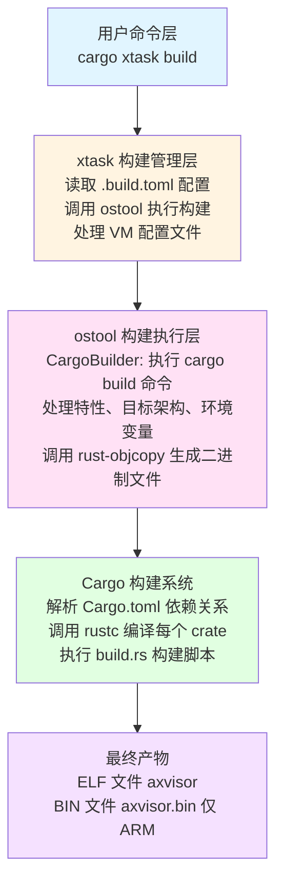
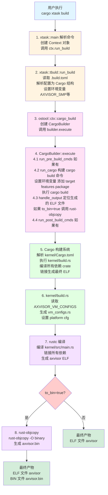

# AxVisor 构建指南

本文档全面介绍 AxVisor 的构建系统，包括环境准备、构建流程深度分析、平台差异对比以及常见问题解决。

---

## 构建系统概述

AxVisor 使用 `xtask` 模式进行构建管理，这是一种 Rust 项目中常见的构建自动化模式。构建系统提供以下功能：

### xtask 命令概览

```bash
# 查看所有可用命令
cargo xtask --help

# 主要命令：
cargo xtask defconfig <board>    # 设置默认构建配置
cargo xtask menuconfig           # 交互式配置界面
cargo xtask build                # 编译项目
cargo xtask qemu                 # 在 QEMU 中运行
cargo xtask uboot                # 通过 U-Boot 运行
cargo xtask clippy               # 代码质量检查
cargo xtask image                # Guest 镜像管理
cargo xtask vmconfig             # 生成 VM 配置 schema
```

### 构建流程

1. **配置选择**：使用 `defconfig` 选择目标平台配置
2. **配置调整**：使用 `menuconfig` 或直接编辑 `.build.toml` 调整配置
3. **编译构建**：使用 `build` 命令执行编译
4. **运行测试**：使用 `qemu` 或 `uboot` 命令运行

### 构建系统架构

AxVisor 采用分层构建系统架构，由以下核心组件构成：



---

## 核心依赖分析

AxVisor 的构建依赖于三个核心组件：**ostool**（构建工具）、**ArceOS**（系统核心库）和**平台特定库**。

### 1. ostool - 构建工具核心

**位置**: [tmp/ostool](../tmp/ostool)
**版本**: 0.8.4
**作用**: 提供构建、配置、运行的一体化工具链

#### 核心模块

| 模块 | 文件 | 功能 |
|------|------|------|
| **CargoBuilder** | [ostool/src/build/cargo_builder.rs](../tmp/ostool/ostool/src/build/cargo_builder.rs) | 执行 cargo build，处理特性、环境变量 |
| **BuildConfig** | [ostool/src/build/config.rs](../tmp/ostool/ostool/src/build/config.rs) | 构建配置结构定义 |
| **AppContext** | [ostool/src/ctx.rs](../tmp/ostool/ostool/src/ctx.rs) | 应用上下文，路径管理 |
| **QemuRunner** | [ostool/src/run/qemu.rs](../tmp/ostool/ostool/src/run/qemu.rs) | QEMU 运行管理 |

#### CargoBuilder 工作流程

```rust
// 1. 构建 cargo 命令
async fn build_cargo_command(&mut self) -> anyhow::Result<Command> {
    let mut cmd = self.ctx.command("cargo");
    cmd.arg(&self.command);  // "build" 或 "run"

    // 设置环境变量
    for (k, v) in &self.config.env {
        cmd.env(k, v);
    }

    // 添加目标和包名
    cmd.arg("-p").arg(&self.config.package);
    cmd.arg("--target").arg(&self.config.target);

    // 添加特性
    let features = self.build_features();
    cmd.arg("--features").arg(features.join(","));

    // 添加额外参数
    for arg in &self.config.args {
        cmd.arg(arg);
    }

    Ok(cmd)
}

// 2. 处理输出
async fn handle_output(&mut self) -> anyhow::Result<()> {
    let elf_path = target_dir
        .join(&self.config.target)
        .join(if self.ctx.debug { "debug" } else { "release" })
        .join(&self.config.package);

    self.ctx.set_elf_path(elf_path).await;

    // 如果需要，转换为二进制
    if self.config.to_bin && !self.skip_objcopy {
        self.ctx.objcopy_output_bin()?;
    }
}
```

### 2. ArceOS - 系统核心依赖

**位置**: [tmp/arceos](../tmp/arceos) (Git 依赖)
**作用**: 提供操作系统基础功能

#### 核心 Crate

| Crate | 功能 | 在 AxVisor 中的用途 |
|-------|------|-------------------|
| **axstd** | 标准库替代 | 提供 alloc、paging、irq、multitask、smp |
| **axhal** | 硬件抽象层 | 提供平台无关的硬件访问接口 |
| **axruntime** | 运行时支持 | 初始化系统、管理任务、提供平台接口 |
| **axalloc** | 内存分配器 | 物理页帧分配、虚拟内存管理 |
| **axdriver** | 设备驱动框架 | 统一的设备驱动接口 |
| **axlog** | 日志系统 | 内核日志输出 |
| **axmm** | 内存管理 | 页表管理、地址空间 |
| **axtask** | 任务管理 | 任务调度、多任务支持 |

#### ArceOS 依赖来源

在 [Cargo.toml](../Cargo.toml) 中定义：

```toml
[workspace.dependencies]
# 系统依赖模块，由 ArceOS 提供
axstd = {git = "https://github.com/arceos-org/arceos.git", tag = "dev-251216", features = [
  "alloc-level-1",
  "paging",
  "irq",
  "multitask",
  "smp",
]}

axalloc = {git = "https://github.com/arceos-org/arceos.git", tag = "dev-251216"}
axhal = {git = "https://github.com/arceos-org/arceos.git", tag = "dev-251216"}
axruntime = {path = "modules/axruntime"}  # 本地覆盖
# ... 其他依赖
```

### 3. 平台特定依赖

#### ARM64 平台: axplat-aarch64-dyn

**位置**: [modules/axplat-aarch64-dyn](../modules/axplat-aarch64-dyn)
**作用**: 提供 ARM64 平台的硬件虚拟化支持

```toml
# modules/axplat-aarch64-dyn/Cargo.toml
[features]
hv = ["somehal/hv", "page_table_entry/arm-el2", "percpu/arm-el2"]

[dependencies]
somehal = "0.4"  # 硬件抽象层，支持 EL2
arm-gic-driver = {version = "0.15.3", features = ["rdif"]}
```

**关键特性**:
- `hv`: 硬件虚拟化支持（ARM EL2 特权级）
- `arm-el2`: ARM EL2 特定功能
- `irq`: 中断控制器支持（GIC）

#### x86_64 平台: axplat-x86-qemu-q35

**位置**: [platform/x86-qemu-q35](../platform/x86-qemu-q35)
**作用**: 提供 x86_64 平台的硬件支持

```toml
# platform/x86-qemu-q35/Cargo.toml
[features]
default = ["irq", "smp", "reboot-on-system-off"]
irq = ["axplat/irq"]
smp = ["axplat/smp"]

[dependencies]
x86 = "0.52"
x86_64 = "0.15.2"
x2apic = "0.5"  # x86 APIC 支持
```

**关键特性**:
- `irq`: x86 APIC 中断支持
- `smp`: 多核支持
- `reboot-on-system-off`: 系统关机时重启

---

## 构建流程详解

当我们执行 `cargo xtask build` 时，系统会按照以下步骤逐步编译出最终可执行文件。本节将详细分析 x86_64 和 ARM64 两个平台的构建过程，包括参数传递、工具链选择等关键细节。

### 通用构建流程

两个平台都遵循相同的构建流程，但在具体实现上有所差异：



### x86_64 平台构建详解

#### 配置文件分析

以 [configs/board/qemu-x86_64.toml](../configs/board/qemu-x86_64.toml) 为例：

```toml
cargo_args = []
features = [
    "axstd/myplat",      # 使用 myplat 特性（静态平台配置）
    "ept-level-4",       # 4级扩展页表
    "fs",                # 文件系统支持
]
log = "Info"
target = "x86_64-unknown-none"  # 目标三元组
to_bin = false                    # 不生成 .bin 文件
vm_configs = []
```

#### 工具链选择

x86_64 平台使用 `x86_64-unknown-none` 目标三元组，工具链选择过程：

1. **rust-toolchain.toml 定义** ([rust-toolchain.toml](../rust-toolchain.toml)):

```toml
[toolchain]
profile = "minimal"
channel = "nightly-2025-12-12"
components = ["rust-src", "llvm-tools", "rustfmt", "clippy"]
targets = ["x86_64-unknown-none", "riscv64gc-unknown-none-elf", "aarch64-unknown-none-softfloat"]
```

2. **工具链自动安装**:
   - 首次构建时，rustup 自动安装 `nightly-2025-12-12` 工具链
   - 自动添加 `x86_64-unknown-none` 目标

3. **工具链位置**:
   ```
   ~/.rustup/toolchains/nightly-2025-12-12-x86_64-unknown-linux-gnu/
   └── lib/rustlib/x86_64-unknown-none/
       ├── bin/          # rustc, cargo 等工具
       └── lib/          # 标准库和核心库
   ```

#### 参数传递流程

**步骤 1: 配置加载** ([xtask/src/tbuld.rs](../xtask/src/tbuld.rs))

```rust
pub fn load_config(&mut self) -> anyhow::Result<Cargo> {
    // 1. 读取 .build.toml
    let config_str = std::fs::read_to_string(&config_path)?;
    let config: Config = toml::from_str(&config_str)?;

    // 2. 构建 ostool::build::config::Cargo 结构
    let mut cargo = Cargo {
        target: config.target,           // "x86_64-unknown-none"
        package: "axvisor".to_string(),
        features: config.features,        // ["axstd/myplat", "ept-level-4", "fs"]
        log: config.log,                  // Some(Info)
        args: config.cargo_args,
        to_bin: config.to_bin,            // false
        ..Default::default()
    };

    // 3. 设置环境变量
    if let Some(smp) = config.smp {
        cargo.env.insert("AXVISOR_SMP".to_string(), smp.to_string());
    }

    if !vm_config_paths.is_empty() {
        let value = std::env::join_paths(&vm_config_paths)?;
        cargo.env.insert("AXVISOR_VM_CONFIGS".to_string(), value);
    }

    Ok(cargo)
}
```

**步骤 2: Cargo 命令构建** ([tmp/ostool/ostool/src/build/cargo_builder.rs](../tmp/ostool/ostool/src/build/cargo_builder.rs))

```rust
async fn build_cargo_command(&mut self) -> anyhow::Result<Command> {
    let mut cmd = self.ctx.command("cargo");
    cmd.arg("build");

    // 环境变量
    for (k, v) in &self.config.env {
        cmd.env(k, v);
    }

    // 包和目标
    cmd.arg("-p").arg(&self.config.package);
    cmd.arg("--target").arg(&self.config.target); // --target x86_64-unknown-none

    // 特性
    let features = self.build_features();
    cmd.arg("--features").arg(features.join(",")); // --features axstd/myplat,ept-level-4,fs

    // Release 模式
    if !self.ctx.debug {
        cmd.arg("--release");
    }

    Ok(cmd)
}
```

**实际执行的命令**:

```bash
cargo build -p axvisor \
    --target x86_64-unknown-none \
    --features axstd/myplat,ept-level-4,fs,log/release_max_level_info \
    --release
```

#### 编译过程详解

**步骤 3: Cargo 设置环境变量（关键步骤）**

在 Cargo 解析任何 `Cargo.toml` 文件**之前**，它会根据命令行参数 `--target x86_64-unknown-none` 自动设置一系列环境变量。这个操作发生在 Cargo 启动的早期阶段。

```bash
# Cargo 从目标三元组 x86_64-unknown-none 中提取信息并设置环境变量
CARGO_CFG_TARGET_ARCH=x86_64
CARGO_CFG_TARGET_VENDOR=unknown
CARGO_CFG_TARGET_OS=none
CARGO_CFG_TARGET_ENDIAN=little
CARGO_CFG_TARGET_POINTER_WIDTH=64
CARGO_CFG_TARGET_FEATURE="fxsr,sse,sse2"
# ... 等等
```

**环境变量设置的时机**：

```
1. 用户执行: cargo build --target x86_64-unknown-none
   │
   ▼
2. Cargo 解析命令行参数
   获取 --target 参数: "x86_64-unknown-none"
   │
   ▼
3. Cargo 设置环境变量 ⭐ (在解析 Cargo.toml 之前)
   从目标三元组提取信息并设置环境变量
   │
   ▼
4. Cargo 解析 Cargo.toml
   读取 [target.'cfg(target_arch = "x86_64")'.dependencies]
   检查 CARGO_CFG_TARGET_ARCH 环境变量
   │
   ▼
5. Cargo 执行 build.rs
   build.rs 可以读取 CARGO_CFG_TARGET_ARCH 等环境变量
```

**关键点**：
- 环境变量是在 Cargo 解析 `Cargo.toml` **之前**设置的
- 这些环境变量在整个构建过程中都可用
- `build.rs` 可以读取这些环境变量
- 后续的条件编译检查只是读取这些已经设置好的环境变量

**步骤 4: build.rs 执行** ([kernel/build.rs](../kernel/build.rs))

```rust
fn main() -> anyhow::Result<()> {
    // 1. 获取目标架构（由 Cargo 自动设置）
    let arch = std::env::var("CARGO_CFG_TARGET_ARCH").unwrap(); // "x86_64"

    // 2. 确定平台
    let platform = if arch == "aarch64" {
        "aarch64-generic"
    } else if arch == "x86_64" {
        "x86-qemu-q35"  // x86 平台
    } else {
        "dummy"
    };

    // 3. 设置 platform cfg（编译时条件）
    println!("cargo:rustc-cfg=platform=\"{platform}\"");
    // 等价于: #[cfg(platform = "x86-qemu-q35")]

    // 4. 读取 VM 配置
    let config_files = get_configs();  // 从 AXVISOR_VM_CONFIGS 环境变量
    let mut output_file = open_output_file();  // $(OUT_DIR)/vm_configs.rs

    // 5. 生成 vm_configs.rs
    match config_files {
        Ok(config_files) => {
            writeln!(output_file, "pub fn static_vm_configs() -> Vec<&'static str> {{")?;
            for config_file in &config_files {
                writeln!(output_file, "        r###\"{}\"###,", config_file.content)?;
            }
            writeln!(output_file, "    }}")?;
            generate_guest_img_loading_functions(&mut output_file, config_files)?;
        }
        Err(error) => {
            writeln!(output_file, "    compile_error!(\"{error}\")")?;
        }
    }

    // 6. 设置重新构建触发器
    println!("cargo:rerun-if-env-changed=AXVISOR_VM_CONFIGS");
    println!("cargo:rerun-if-changed=build.rs");

    Ok(())
}
```

**步骤 5: Cargo 解析依赖**

Cargo 解析 [kernel/Cargo.toml](../kernel/Cargo.toml)，根据目标架构选择依赖：

```toml
[dependencies]
# 通用依赖
axstd = {workspace = true, features = [
  "alloc-level-1",
  "paging",
  "irq",
  "multitask",
  "smp",
]}

# 条件依赖
[target.'cfg(target_arch = "x86_64")'.dependencies]
# x86_64 特定依赖（如果有）

# 特性依赖
[features]
ept-level-4 = ["axaddrspace/4-level-ept"]
fs = ["axstd/fs", "axruntime/fs"]
```

**步骤 6: axruntime 平台选择（条件匹配检查）**

[modules/axruntime/Cargo.toml](../modules/axruntime/Cargo.toml) 根据目标架构选择平台 crate：

```toml
[target.'cfg(target_arch = "x86_64")'.dependencies]
axplat-x86-qemu-q35 = {workspace = true}  # x86 平台特定实现
```

**条件编译的匹配过程**：

当 Cargo 解析到 `[target.'cfg(target_arch = "x86_64")']` 时，会进行以下检查：

1. **读取已设置的环境变量**：
   ```bash
   # 这些环境变量在步骤 3 中已经设置好了
   CARGO_CFG_TARGET_ARCH=x86_64
   CARGO_CFG_TARGET_VENDOR=unknown
   CARGO_CFG_TARGET_OS=none
   CARGO_CFG_TARGET_ENDIAN=little
   ```

2. **条件匹配检查**：
   - Cargo 读取 `CARGO_CFG_TARGET_ARCH` 环境变量的值
   - 检查是否等于 `"x86_64"`
   - 如果匹配，包含这部分依赖
   - 如果不匹配（如 ARM64 平台），完全跳过这部分依赖

3. **依赖包含结果**：
   - ✅ **x86_64 平台**: `axplat-x86-qemu-q35` 被编译和链接
   - ❌ **ARM64 平台**: `axplat-x86-qemu-q35` 被忽略，不会编译

4. **代码中的条件编译**：
   ```rust
   // 在 Rust 代码中也可以使用相同的条件
   #[cfg(target_arch = "x86_64")]
   fn platform_init() {
       axplat_x86_qemu_q35::init();
   }
   
   #[cfg(target_arch = "aarch64")]
   fn platform_init() {
       axplat_aarch64_dyn::init();
   }
   ```

**重要说明**：
- 步骤 6 只是做**检查匹配**，不涉及环境变量的提取
- 环境变量的提取和设置在**步骤 3**已经完成
- 这里只是读取已经设置好的 `CARGO_CFG_TARGET_ARCH` 环境变量并进行匹配

这就是为什么相同的代码库，通过指定不同的 `--target`，可以编译出不同平台的版本！

**步骤 7: rustc 编译**

Cargo 调用 rustc 编译每个 crate：

```bash
# 实际执行的 rustc 命令（简化版）
rustc --edition=2024 \
    --crate-type bin \
    --target x86_64-unknown-none \
    --crate-name axvisor \
    -C link-arg=-nostartfiles \
    -C link-arg=-Tlink.ld \
    --cfg 'platform="x86-qemu-q35"' \
    --features 'axstd/myplat,ept-level-4,fs' \
    kernel/src/main.rs \
    -o target/x86_64-unknown-none/release/axvisor
```

**关键参数说明**:
- `--target x86_64-unknown-none`: 指定目标三元组
- `--cfg 'platform="x86-qemu-q35"'`: 编译时条件，选择 x86 平台代码
- `--features`: 启用特性，影响代码编译
- `-C link-arg=-Tlink.ld`: 使用链接脚本

**步骤 8: 链接生成 ELF**

链接器将所有目标文件链接成最终的 ELF 可执行文件：

```
输入文件:
├── axvisor-*.o (主程序)
├── libaxstd.a (标准库)
├── libaxhal.a (硬件抽象层)
├── libaxruntime.a (运行时)
├── libaxplat_x86_qemu_q35.a (x86 平台代码)
├── libaxvm.a (虚拟机管理)
└── ... (其他依赖)

链接脚本: link.ld
输出: target/x86_64-unknown-none/release/axvisor (ELF)
```

**步骤 9: 完成**

由于 `to_bin = false`，x86 平台不生成 .bin 文件，只生成 ELF 文件。

#### 最终产物

```
target/x86_64-unknown-none/
├── debug/
│   ├── axvisor              # ELF 可执行文件
│   ├── axvisor.d            # 依赖文件
│   └── build/
│       └── axvisor-*/
│           └── out/
│               └── vm_configs.rs  # 生成的配置
└── release/
    └── axvisor              # Release 版本
```

---

### ARM64 平台构建详解

#### 配置文件分析

以 [configs/board/phytiumpi.toml](../configs/board/phytiumpi.toml) 为例：

```toml
cargo_args = []
features = [
    "dyn-plat",           # 动态平台配置
    "axstd/bus-mmio",     # MMIO 总线支持
    "fs",                 # 文件系统支持
    "driver/sdmmc",       # SD/MMC 驱动
    "driver/phytium-blk", # 飞腾块设备驱动
]
log = "Info"
target = "aarch64-unknown-none-softfloat"  # 软浮点 ABI
to_bin = true                              # 生成 .bin 文件
vm_configs = []
```

#### 工具链选择

ARM64 平台使用 `aarch64-unknown-none-softfloat` 目标三元组，与 x86 有显著差异：

1. **目标三元组解析**:
   ```
   aarch64-unknown-none-softfloat
   │      │       │     │
   │      │       │     └─ 软浮点 ABI（不使用硬件浮点）
   │      │       └───── 无厂商（裸机）
   │      └───────────── 未知系统（裸机）
   └───────────────────── ARM64 架构
   ```

2. **工具链安装**:
   ```bash
   # rustup 自动安装
   rustup target add aarch64-unknown-none-softfloat
   ```

3. **工具链位置**:
   ```
   ~/.rustup/toolchains/nightly-2025-12-12-x86_64-unknown-linux-gnu/
   └── lib/rustlib/aarch64-unknown-none-softfloat/
       ├── bin/          # 交叉编译工具
       └── lib/          # ARM64 标准库
   ```

#### 参数传递流程

**步骤 1: 配置加载**

```rust
pub fn load_config(&mut self) -> anyhow::Result<Cargo> {
    let config_str = std::fs::read_to_string(&config_path)?;
    let config: Config = toml::from_str(&config_str)?;

    let mut cargo = Cargo {
        target: config.target,           // "aarch64-unknown-none-softfloat"
        package: "axvisor".to_string(),
        features: config.features,        // ["dyn-plat", "axstd/bus-mmio", "fs", ...]
        log: config.log,                  // Some(Info)
        args: config.cargo_args,
        to_bin: config.to_bin,            // true（关键差异）
        ..Default::default()
    };

    // 设置环境变量
    if let Some(smp) = config.smp {
        cargo.env.insert("AXVISOR_SMP".to_string(), smp.to_string());
    }

    if !vm_config_paths.is_empty() {
        let value = std::env::join_paths(&vm_config_paths)?;
        cargo.env.insert("AXVISOR_VM_CONFIGS".to_string(), value);
    }

    Ok(cargo)
}
```

**步骤 2: Cargo 命令构建**

```rust
async fn build_cargo_command(&mut self) -> anyhow::Result<Command> {
    let mut cmd = self.ctx.command("cargo");
    cmd.arg("build");

    // 环境变量
    for (k, v) in &self.config.env {
        cmd.env(k, v);
    }

    // 包和目标
    cmd.arg("-p").arg(&self.config.package);
    cmd.arg("--target").arg(&self.config.target); // --target aarch64-unknown-none-softfloat

    // 特性
    let features = self.build_features();
    cmd.arg("--features").arg(features.join(",")); // --features dyn-plat,axstd/bus-mmio,fs,...

    // Release 模式
    if !self.ctx.debug {
        cmd.arg("--release");
    }

    Ok(cmd)
}
```

**实际执行的命令**:

```bash
cargo build -p axvisor \
    --target aarch64-unknown-none-softfloat \
    --features dyn-plat,axstd/bus-mmio,fs,driver/sdmmc,driver/phytium-blk,log/release_max_level_info \
    --release
```

#### 编译过程详解

**步骤 3: Cargo 设置环境变量（关键步骤）**

与 x86_64 平台一样，在 Cargo 解析任何 `Cargo.toml` 文件**之前**，它会根据命令行参数 `--target aarch64-unknown-none-softfloat` 自动设置一系列环境变量。

```bash
# Cargo 从目标三元组 aarch64-unknown-none-softfloat 中提取信息并设置环境变量
CARGO_CFG_TARGET_ARCH=aarch64
CARGO_CFG_TARGET_VENDOR=unknown
CARGO_CFG_TARGET_OS=none
CARGO_CFG_TARGET_ENDIAN=little
CARGO_CFG_TARGET_POINTER_WIDTH=64
CARGO_CFG_TARGET_FEATURE="neon,v8a"
# ... 等等
```

**环境变量设置的时机**：

```
1. 用户执行: cargo build --target aarch64-unknown-none-softfloat
   │
   ▼
2. Cargo 解析命令行参数
   获取 --target 参数: "aarch64-unknown-none-softfloat"
   │
   ▼
3. Cargo 设置环境变量 ⭐ (在解析 Cargo.toml 之前)
   从目标三元组提取信息并设置环境变量
   │
   ▼
4. Cargo 解析 Cargo.toml
   读取 [target.'cfg(target_arch = "aarch64")'.dependencies]
   检查 CARGO_CFG_TARGET_ARCH 环境变量
   │
   ▼
5. Cargo 执行 build.rs
   build.rs 可以读取 CARGO_CFG_TARGET_ARCH 等环境变量
```

**关键点**：
- 环境变量是在 Cargo 解析 `Cargo.toml` **之前**设置的
- 这些环境变量在整个构建过程中都可用
- `build.rs` 可以读取这些环境变量
- 后续的条件编译检查只是读取这些已经设置好的环境变量

**步骤 4: build.rs 执行**

```rust
fn main() -> anyhow::Result<()> {
    // 1. 获取目标架构
    let arch = std::env::var("CARGO_CFG_TARGET_ARCH").unwrap(); // "aarch64"

    // 2. 确定平台
    let platform = if arch == "aarch64" {
        "aarch64-generic"  // ARM 平台
    } else if arch == "x86_64" {
        "x86-qemu-q35"
    } else {
        "dummy"
    };

    // 3. 设置 platform cfg
    println!("cargo:rustc-cfg=platform=\"{platform}\"");
    // 等价于: #[cfg(platform = "aarch64-generic")]

    // 4-6. 与 x86 相同的 VM 配置处理
    // ...
}
```

**步骤 5: Cargo 解析依赖**

```toml
[dependencies]
# 通用依赖
axstd = {workspace = true, features = [...]}

# ARM64 特定依赖
[target.'cfg(target_arch = "aarch64")'.dependencies]
aarch64-cpu-ext = "0.1"           # ARM CPU 扩展
arm-gic-driver = {version = "0.15.5", features = ["rdif"]}  # GIC 中断控制器

# 特性依赖
[features]
dyn-plat = ["axstd/myplat", "axstd/driver-dyn", "axruntime/driver-dyn"]
fs = ["axstd/fs", "axruntime/fs"]
```

**步骤 6: axruntime 平台选择（条件匹配检查）**

```toml
[target.'cfg(target_arch = "aarch64")'.dependencies]
axplat-aarch64-dyn = {git = "...", tag = "v0.4.0", features = ["irq", "smp", "hv"]}
somehal = "0.4"  # ARM 硬件抽象层
```

**条件编译的匹配过程**：

当 Cargo 解析到 `[target.'cfg(target_arch = "aarch64")']` 时，会进行以下检查：

1. **读取已设置的环境变量**：
   ```bash
   # 这些环境变量在步骤 3 中已经设置好了
   CARGO_CFG_TARGET_ARCH=aarch64
   CARGO_CFG_TARGET_VENDOR=unknown
   CARGO_CFG_TARGET_OS=none
   CARGO_CFG_TARGET_ENDIAN=little
   ```

2. **条件匹配检查**：
   - Cargo 读取 `CARGO_CFG_TARGET_ARCH` 环境变量的值
   - 检查是否等于 `"aarch64"`
   - 如果匹配，包含这部分依赖
   - 如果不匹配（如 x86_64 平台），完全跳过这部分依赖

3. **依赖包含结果**：
   - ✅ **ARM64 平台**: `axplat-aarch64-dyn` 和 `somehal` 被编译和链接
   - ❌ **x86_64 平台**: 这些 ARM 特定依赖被忽略，不会编译

4. **与 x86 平台的对比**：
   ```toml
   # x86_64 平台编译时：
   [target.'cfg(target_arch = "x86_64")'.dependencies]
   axplat-x86-qemu-q35 = {workspace = true}  # ✅ 包含
   # axplat-aarch64-dyn = {...}              # ❌ 忽略
   
   # ARM64 平台编译时：
   [target.'cfg(target_arch = "aarch64")'.dependencies]
   # axplat-x86-qemu-q35 = {workspace = true}  # ❌ 忽略
   axplat-aarch64-dyn = {...}              # ✅ 包含
   somehal = "0.4"                          # ✅ 包含
   ```

5. **代码中的条件编译**：
   ```rust
   // 在 Rust 代码中也可以使用相同的条件
   #[cfg(target_arch = "aarch64")]
   fn platform_init() {
       axplat_aarch64_dyn::init();
   }
   
   #[cfg(target_arch = "x86_64")]
   fn platform_init() {
       axplat_x86_qemu_q35::init();
   }
   ```

**重要说明**：
- 步骤 6 只是做**检查匹配**，不涉及环境变量的提取
- 环境变量的提取和设置在**步骤 3**已经完成
- 这里只是读取已经设置好的 `CARGO_CFG_TARGET_ARCH` 环境变量并进行匹配

**步骤 7: rustc 编译**

```bash
# 实际执行的 rustc 命令（简化版）
rustc --edition=2024 \
    --crate-type bin \
    --target aarch64-unknown-none-softfloat \
    --crate-name axvisor \
    -C link-arg=-nostartfiles \
    -C link-arg=-Tlink.ld \
    --cfg 'platform="aarch64-generic"' \
    --features 'dyn-plat,axstd/bus-mmio,fs,driver/sdmmc,driver/phytium-blk' \
    kernel/src/main.rs \
    -o target/aarch64-unknown-none-softfloat/release/axvisor
```

**关键参数说明**:
- `--target aarch64-unknown-none-softfloat`: 指定 ARM64 软浮点目标
- `--cfg 'platform="aarch64-generic"'`: 编译时条件，选择 ARM 平台代码
- `--features`: 启用特性，包括驱动支持

**步骤 8: 链接生成 ELF**

```
输入文件:
├── axvisor-*.o (主程序)
├── libaxstd.a (标准库)
├── libaxhal.a (硬件抽象层)
├── libaxruntime.a (运行时)
├── libaxplat_aarch64_dyn.a (ARM 平台代码)
├── libarm_gic_driver.a (GIC 驱动)
├── libdriver.a (设备驱动)
├── libaxvm.a (虚拟机管理)
└── ... (其他依赖)

链接脚本: link.ld
输出: target/aarch64-unknown-none-softfloat/release/axvisor (ELF)
```

**步骤 9: rust-objcopy 转换（ARM 特有）**

由于 `to_bin = true`，ostool 会调用 rust-objcopy 将 ELF 转换为纯二进制文件：

```bash
# 由 ostool 自动执行
rust-objcopy --strip-all \
    -O binary \
    target/aarch64-unknown-none-softfloat/release/axvisor \
    target/aarch64-unknown-none-softfloat/release/axvisor.bin
```

**参数说明**:
- `--strip-all`: 移除所有符号，减小文件大小
- `-O binary`: 输出为纯二进制格式（无 ELF 头）
- 输入: ELF 文件
- 输出: 纯二进制文件

**为什么 ARM 需要二进制文件？**

1. **裸机启动**: ARM 开发板通常从裸机启动，bootloader 期望纯二进制格式
2. **固定地址加载**: 二进制文件可以直接加载到固定的内存地址
3. **简单性**: 纯二进制格式更简单，适合资源受限的 bootloader

#### 最终产物

```
target/aarch64-unknown-none-softfloat/
├── debug/
│   ├── axvisor              # ELF 可执行文件
│   ├── axvisor.bin          # 纯二进制文件 ✨
│   ├── axvisor.d
│   └── build/
│       └── axvisor-*/
│           └── out/
│               └── vm_configs.rs
└── release/
    ├── axvisor              # ELF 可执行文件
    └── axvisor.bin          # 纯二进制文件 ✨
```

---

### 平台差异总结

| 项目 | x86_64 | ARM64 |
|------|--------|-------|
| **目标三元组** | `x86_64-unknown-none` | `aarch64-unknown-none-softfloat` |
| **平台标识** | `x86-qemu-q35` | `aarch64-generic` |
| **主要特性** | `axstd/myplat`, `ept-level-4` | `dyn-plat`, `axstd/bus-mmio` |
| **平台 Crate** | `axplat-x86-qemu-q35` | `axplat-aarch64-dyn` |
| **中断控制器** | APIC (x2apic) | GIC (arm-gic-driver) |
| **生成产物** | ELF | ELF + BIN |
| **启动方式** | Multiboot (ELF) | 裸机加载 (BIN) |

---

## 构建产物分析

### 目录结构

```
target/
├── aarch64-unknown-none-softfloat/
│   ├── debug/
│   │   ├── axvisor          # ELF 可执行文件
│   │   ├── axvisor.bin      # 裸二进制文件（如果 to_bin = true）
│   │   └── *.d              # 依赖文件
│   └── release/             # Release 构建（如果使用 --release）
├── x86_64-unknown-none/
│   └── debug/
│       └── axvisor          # ELF 可执行文件
└── CACHEDIR.TAG             # Cargo 缓存标记
```

### 文件说明

- **axvisor**: ELF 格式的可执行文件，包含符号信息和调试信息
- **axvisor.bin**: 纯二进制文件，可直接烧录到硬件或由 bootloader 加载
- **.d 文件**: 依赖关系文件，用于增量编译

### ELF 文件结构

使用 `rust-objdump` 查看 ELF 文件信息：

```bash
# x86_64 平台
rust-objdump -h target/x86_64-unknown-none/debug/axvisor

# ARM64 平台
rust-objdump -h target/aarch64-unknown-none-softfloat/debug/axvisor
```

**典型输出**:

```
Sections:
Idx Name          Size      VMA               LMA               File off  Algn
  0 .text         00012345  0xffffffff80200000 0xffffffff80200000  00001000  2**2
                  CONTENTS, ALLOC, LOAD, READONLY, CODE
  1 .rodata       00000678  0xffffffff80212345 0xffffffff80212345  00013345  2**2
                  CONTENTS, ALLOC, LOAD, DATA, READONLY
  2 .data         00000abc  0xffffffff80213000 0xffffffff80213000  00013c00  2**2
                  CONTENTS, ALLOC, LOAD, DATA, RW
  3 .bss          00000def  0xffffffff80214000 0xffffffff80214000  00014700  2**2
                  ALLOC
  4 .boot         00000100  0xffffffff80200000 0xffffffff80200000  00001000  2**2
                  CONTENTS, ALLOC, LOAD, READONLY, CODE
```

### 二进制文件结构 (仅 ARM)

使用 `hexdump` 查看二进制文件：

```bash
hexdump -C target/aarch64-unknown-none-softfloat/debug/axvisor.bin | head -20
```

**典型输出**:

```
00000000  00 00 00 14 00 00 00 00  00 00 00 00 00 00 00 00  |................|
00000010  00 00 00 00 00 00 00 00  00 00 00 00 00 00 00 00  |................|
*
00000100  00 00 3f 18 00 00 00 00  00 00 00 00 00 00 00 00  |..?.............|
00000110  00 00 00 00 00 00 00 00  00 00 00 00 00 00 00 00  |................|
```

### 符号表分析

```bash
# 查看符号表
rust-nm target/x86_64-unknown-none/debug/axvisor | grep -E "main|enable_virtualization"

# 输出示例:
ffffffff80200100 T main
ffffffff80200500 T enable_virtualization
```

### 清理构建产物

```bash
# 清理所有构建产物
cargo clean

# 清理特定目标
cargo clean --target aarch64-unknown-none-softfloat

# 清理后重新构建
cargo clean && cargo xtask build
```

---

## 参考资源

### 项目文档

- [AxVisor 主页](https://github.com/arceos-hypervisor/axvisor)
- [ArceOS 文档](https://arceos-hypervisor.github.io/axvisorbook)
- [AxVisor 架构文档](./00_AXVISOR_STARTUP.md)
- [AxVisor 调度器分析](./01_AXVISOR_SCHEDULER_ANALYSIS.md)

### 外部资源

- [Rust 嵌入式文档](https://rust-embedded.github.io/book/)
- [QEMU 文档](https://www.qemu.org/documentation/)
- [ostool 项目](https://github.com/ZR233/ostool)

### 源码参考

- [xtask/src/main.rs](../xtask/src/main.rs) - xtask 入口
- [xtask/src/tbuld.rs](../xtask/src/tbuld.rs) - 构建逻辑
- [kernel/build.rs](../kernel/build.rs) - 构建脚本
- [kernel/Cargo.toml](../kernel/Cargo.toml) - 内核依赖
- [configs/board/qemu-x86_64.toml](../configs/board/qemu-x86_64.toml) - x86 配置
- [configs/board/phytiumpi.toml](../configs/board/phytiumpi.toml) - ARM 配置
- [tmp/ostool](../tmp/ostool) - ostool 源码
- [tmp/arceos](../tmp/arceos) - ArceOS 源码

---

## 配置系统

AxVisor 使用分层配置系统，包括硬件平台配置和虚拟机配置。

### 配置文件结构

```
configs/
├── defconfig.toml          # 默认配置模板
├── board/                  # 硬件平台配置
│   ├── qemu-aarch64.toml
│   ├── qemu-x86_64.toml
│   ├── orangepi-5-plus.toml
│   ├── phytiumpi.toml
│   └── roc-rk3568-pc.toml
└── vms/                    # 虚拟机配置
    ├── arceos-aarch64-qemu-smp1.toml
    ├── linux-aarch64-qemu-smp1.toml
    └── ...
```

### 板级配置文件格式

板级配置文件（TOML 格式）定义了构建参数：

```toml
# Cargo 参数
cargo_args = []              # 额外的 cargo 参数

# 功能特性
features = [
    "ept-level-4",           # 4级 EPT（扩展页表）
    "axstd/bus-mmio",        # MMIO 总线支持
    "dyn-plat",              # 动态平台支持
    "fs",                    # 文件系统支持
]

# 日志级别
log = "Info"                 # 可选: Trace, Debug, Info, Warn, Error

# 目标架构
target = "aarch64-unknown-none-softfloat"

# 输出二进制文件
to_bin = true                # 是否生成裸二进制文件

# SMP 配置
smp = 1                      # CPU 核心数（可选，覆盖 defconfig.toml）

# 虚拟机配置列表
vm_configs = []              # VM 配置文件路径列表
```

### 虚拟机配置文件格式

虚拟机配置文件定义了 guest OS 的运行参数：

```toml
# 基本信息
[base]
id = 1                       # VM ID
name = "arceos-qemu"         # VM 名称
vm_type = 1                  # 虚拟化类型
cpu_num = 1                  # 虚拟 CPU 数量
phys_cpu_ids = [0]           # 物理 CPU ID 列表

# 内核配置
[kernel]
entry_point = 0x8020_0000    # 内核入口点
image_location = "memory"    # 镜像位置: "memory" | "fs"
kernel_path = "path/to/kernel.bin"
kernel_load_addr = 0x8020_0000
dtb_path = "path/to.dtb"     # 设备树 blob（可选）
dtb_load_addr = 0x8000_0000

# 内存区域（格式：base_paddr, size, flags, map_type）
memory_regions = [
    [0x8000_0000, 0x4000_0000, 0x7, 1],  # 1GB 系统内存
]

# 设备配置
[devices]
passthrough_devices = [["/",]]           # 直通设备
excluded_devices = [["/pcie@10000000"]] # 排除设备
emu_devices = []                        # 模拟设备
interrupt_mode = "passthrough"          # 中断模式
```

---

## 平台构建指南

### QEMU 平台

QEMU 是最常用的开发和测试平台，支持多种架构。

#### QEMU AArch64 构建

```bash
# 1. 设置板级配置
cargo xtask defconfig qemu-aarch64

# 2. （可选）调整配置
cargo xtask menuconfig
# 或直接编辑 .build.toml

# 3. 编译
cargo xtask build

# 4. 在 QEMU 中运行
cargo xtask qemu

# 5. 指定 VM 配置运行
cargo xtask qemu --vmconfigs configs/vms/arceos-aarch64-qemu-smp1.toml
```

**生成的文件位置**：
- 构建输出：`target/aarch64-unknown-none-softfloat/debug/axvisor`
- 二进制文件：`target/aarch64-unknown-none-softfloat/debug/axvisor.bin`

**QEMU AArch64 配置** ([qemu-aarch64.toml](../scripts/ostool/qemu-aarch64.toml))：
```toml
args = [
  "-nographic",
  "-cpu", "cortex-a72",
  "-machine", "virt,virtualization=on,gic-version=3",
  "-smp", "4",
  "-m", "8g",
]
```

#### QEMU x86_64 构建

```bash
# 1. 设置板级配置
cargo xtask defconfig qemu-x86_64

# 2. 编译
cargo xtask build

# 3. 在 QEMU 中运行
cargo xtask qemu

# 4. 指定 VM 配置运行
cargo xtask qemu --vmconfigs configs/vms/nimbos-x86_64-qemu-smp1.toml
```

**生成的文件位置**：
- 构建输出：`target/x86_64-unknown-none/debug/axvisor`
- ELF 文件（不生成 .bin）

**QEMU x86_64 配置** ([qemu-x86_64.toml](../scripts/ostool/qemu-x86_64.toml))：
```toml
args = [
  "-nographic",
  "-cpu", "host",
  "-machine", "q35",
  "-smp", "1",
  "-accel", "kvm",
  "-m", "128M",
]
```

---

## 平台差异分析

本节对比 x86_64 和 ARM64 两个平台的关键差异。

### 配置文件对比

#### x86_64 平台 ([configs/board/qemu-x86_64.toml](../configs/board/qemu-x86_64.toml))

```toml
cargo_args = []
features = [
    "axstd/myplat",      # 使用 myplat 特性
    "ept-level-4",       # 4级 EPT
    "fs",                # 文件系统
]
log = "Info"
target = "x86_64-unknown-none"  # 目标三元组
to_bin = false                    # 不生成 .bin 文件
vm_configs = []
```

#### ARM64 平台 ([configs/board/phytiumpi.toml](../configs/board/phytiumpi.toml))

```toml
cargo_args = []
features = [
    "dyn-plat",           # 动态平台
    "axstd/bus-mmio",     # MMIO 总线
    "fs",                 # 文件系统
    "driver/sdmmc",       # SD/MMC 驱动
    "driver/phytium-blk", # 飞腾块设备驱动
]
log = "Info"
target = "aarch64-unknown-none-softfloat"  # 软浮点 ABI
to_bin = true                              # 生成 .bin 文件
vm_configs = []
```

### 特性差异

| 特性 | x86_64 | ARM64 | 说明 |
|------|--------|-------|------|
| **myplat** | ✅ | ❌ | x86 使用静态平台配置 |
| **dyn-plat** | ❌ | ✅ | ARM 使用动态平台配置 |
| **bus-mmio** | ❌ | ✅ | ARM 需要显式 MMIO 总线 |
| **ept-level-4** | ✅ | 可选 | 扩展页表级数 |
| **driver/sdmmc** | ❌ | ✅ | ARM 开发板常用 SD 卡 |
| **driver/phytium-blk** | ❌ | ✅ | 飞腾平台专用 |

### 平台 Crate 差异

#### x86_64 平台依赖

```toml
# kernel/Cargo.toml
[target.'cfg(target_arch = "x86_64")'.dependencies]
# 无特定依赖，平台代码在 axruntime 中

# modules/axruntime/Cargo.toml
[target.'cfg(target_arch = "x86_64")'.dependencies]
axplat-x86-qemu-q35 = {workspace = true}  # 平台特定 crate
```

**平台代码位置**: [platform/x86-qemu-q35](../platform/x86-qemu-q35)

```rust
// platform/x86-qemu-q35/src/
├── lib.rs          // 平台初始化
├── apic.rs         // APIC 中断控制器
├── serial.rs       // 串口驱动
├── timer.rs        // 定时器
└── pci.rs          // PCI 支持
```

#### ARM64 平台依赖

```toml
# kernel/Cargo.toml
[target.'cfg(target_arch = "aarch64")'.dependencies]
aarch64-cpu-ext = "0.1"           // ARM CPU 扩展
arm-gic-driver = {version = "0.15.5", features = ["rdif"]}  // GIC 驱动

# modules/axruntime/Cargo.toml
[target.'cfg(target_arch = "aarch64")'.dependencies]
axplat-aarch64-dyn = {git = "...", tag = "v0.4.0", features = ["irq", "smp", "hv"]}
somehal = "0.4"  # 硬件抽象层
```

**平台代码位置**: [modules/axplat-aarch64-dyn](../modules/axplat-aarch64-dyn)

```rust
// modules/axplat-aarch64-dyn/src/
├── lib.rs          // 平台初始化
├── gic.rs          // GIC 中断控制器
├── timer.rs        // ARM 架构定时器
├── smp.rs          // 多核支持
└── vm.rs           // 虚拟化支持 (EL2)
```

### 构建产物差异

#### x86_64 平台

```
target/x86_64-unknown-none/
├── debug/
│   ├── axvisor              # ELF 可执行文件
│   ├── axvisor.d            # 依赖文件
│   └── build/
│       └── axvisor-*/
│           ├── output       # 链接输出
│           └── out/
│               └── vm_configs.rs  # 生成的配置
└── release/
    └── axvisor              # Release 版本
```

**特点**:
- 只生成 ELF 文件
- 可以被 QEMU 或 multiboot bootloader 直接加载
- 包含符号信息，便于调试

#### ARM64 平台

```
target/aarch64-unknown-none-softfloat/
├── debug/
│   ├── axvisor              # ELF 可执行文件
│   ├── axvisor.bin          # 纯二进制文件 ✨
│   ├── axvisor.d
│   └── build/
│       └── axvisor-*/
│           └── out/
│               └── vm_configs.rs
└── release/
    ├── axvisor
    └── axvisor.bin          # 纯二进制文件 ✨
```

**特点**:
- 同时生成 ELF 和 BIN 文件
- BIN 文件用于裸机启动
- ELF 文件用于调试

### 启动方式差异

#### x86_64 启动流程

```
1. QEMU/BIOS 启动
   ↓
2. Multiboot bootloader (GRUB/QEMU 内置)
   ↓
3. 加载 ELF 文件
   - 读取 program headers
   - 加载各个 segment 到指定内存
   - 跳转到入口点
   ↓
4. axvisor::main()
```

**QEMU 启动命令** ([scripts/ostool/qemu-x86_64.toml](../scripts/ostool/qemu-x86_64.toml)):

```toml
args = [
  "-nographic",
  "-cpu", "host",
  "-machine", "q35",
  "-smp", "1",
  "-accel", "kvm",
  "-kernel", "target/x86_64-unknown-none/debug/axvisor",  # 直接加载 ELF
]
```

#### ARM64 启动流程

```
1. QEMU/U-Boot 启动
   ↓
2. Bootloader 加载二进制文件
   - 直接读取 .bin 文件
   - 加载到固定内存地址
   ↓
3. 跳转到入口点
   ↓
4. axvisor::main()
```

**QEMU 启动命令** ([scripts/ostool/qemu-aarch64.toml](../scripts/ostool/qemu-aarch64.toml)):

```toml
args = [
  "-nographic",
  "-cpu", "cortex-a72",
  "-machine", "virt,virtualization=on,gic-version=3",
  "-smp", "4",
  "-kernel", "target/aarch64-unknown-none-softfloat/debug/axvisor.bin",  # 加载 BIN
]
```

---

## 高级构建选项

### 1. 交互式配置

使用 `menuconfig` 进行可视化配置：

```bash
cargo xtask menuconfig
```

这将启动一个交互式配置界面，可以调整：
- 目标架构
- 功能特性
- 日志级别
- SMP 核心数
- VM 配置

### 2. 自定义构建目录

```bash
# 指定构建输出目录
cargo xtask build --build-dir /path/to/build

# 指定二进制输出目录
cargo xtask build --bin-dir /path/to/bin
```

### 3. 多 VM 配置

```bash
# 同时加载多个 VM 配置
cargo xtask qemu \
    --vmconfigs configs/vms/arceos-aarch64-qemu-smp1.toml \
    --vmconfigs configs/vms/linux-aarch64-qemu-smp1.toml
```

### 4. 自定义 QEMU 配置

```bash
# 使用自定义 QEMU 配置文件
cargo xtask qemu --qemu-config /path/to/custom-qemu.toml
```

### 5. 代码质量检查

```bash
# 运行 Clippy 检查
cargo xtask clippy

# 自动修复问题
cargo xtask clippy --fix

# 检查特定包
cargo xtask clippy --packages axvisor,axruntime

# 继续检查（遇到错误不退出）
cargo xtask clippy --continue-on-error
```

### 6. Guest 镜像管理

```bash
# 查看镜像管理帮助
cargo xtask image --help

# 下载预构建的 guest 镜像
cargo xtask image download arceos-aarch64

# 构建自定义 guest 镜像
cargo xtask image build --config configs/vms/arceos-aarch64-qemu-smp1.toml
```

---

## 故障排除

### 常见问题

#### 1. Rust 工具链版本不匹配

**问题**：编译时出现版本错误

```bash
error: rustc version `nightly-2025-12-12` is required
```

**解决方案**：

```bash
# 安装正确的工具链版本
rustup install nightly-2025-12-12
rustup override set nightly-2025-12-12

# 或让项目自动管理（推荐）
rm rustup.override.toml  # 如果存在
```

#### 2. 目标架构未安装

**问题**：编译时提示目标架构不存在

```bash
error: target `aarch64-unknown-none-softfloat` not installed
```

**解决方案**：

```bash
# 添加目标架构
rustup target add aarch64-unknown-none-softfloat
rustup target add x86_64-unknown-none
rustup target add riscv64gc-unknown-none-elf
```

#### 3. 配置文件不存在

**问题**：`defconfig` 命令失败

```bash
error: Board configuration 'xxx' not found
```

**解决方案**：

```bash
# 查看可用的板级配置
ls configs/board/

# 使用正确的配置名称
cargo xtask defconfig qemu-aarch64
```

#### 4. VM 配置文件路径错误

**问题**：运行时找不到 VM 配置

```bash
error: VM config file 'configs/vms/xxx.toml' does not exist
```

**解决方案**：

```bash
# 使用绝对路径
cargo xtask qemu --vmconfigs /absolute/path/to/vm.toml

# 或确保相对路径正确
cargo xtask qemu --vmconfigs ./configs/vms/arceos-aarch64-qemu-smp1.toml
```

#### 5. QEMU 未安装或版本过低

**问题**：运行 QEMU 时失败

```bash
error: failed to run qemu: No such file or directory
```

**解决方案**：

```bash
# 安装 QEMU
sudo apt-get install -y qemu-system-x86 qemu-system-arm qemu-system-riscv64

# 验证安装
qemu-system-aarch64 --version
qemu-system-x86_64 --version
```

#### 6. 编译时内存不足

**问题**：大型项目编译时系统内存耗尽

```bash
error: process didn't exit successfully: `rustc` (signal: 9, SIGKILL)
```

**解决方案**：

```bash
# 限制并行编译数
export CARGO_BUILD_JOBS=2
cargo xtask build

# 或使用 swap 文件增加虚拟内存
sudo fallocate -l 4G /swapfile
sudo chmod 600 /swapfile
sudo mkswap /swapfile
sudo swapon /swapfile
```

#### 7. 设备树 blob (DTB) 问题

**问题**：在真实硬件上启动失败

**解决方案**：

```bash
# 检查 DTB 文件是否存在
ls configs/board/*.dtb

# 验证 DTB 语法
dtc -I dtb -O dts configs/board/orangepi-5-plus.dtb

# 确保使用正确的 DTB 文件
cp configs/board/orangepi-5-plus.dtb /boot/
```

### 调试技巧

#### 1. 启用详细日志

编辑 `.build.toml`，设置日志级别：

```toml
log = "Trace"  # 最详细的日志
```

#### 2. 查看 Cargo 构建详情

```bash
# 显示详细的编译输出
cargo xtask build --verbose

# 显示 Cargo 的内部调用
cargo xtask build --display=bytecode
```

#### 3. 检查生成的二进制文件

```bash
# 查看二进制文件信息
rust-objdump -d target/aarch64-unknown-none-softfloat/debug/axvisor

# 查看符号表
rust-nm target/aarch64-unknown-none-softfloat/debug/axvisor

# 查看文件大小
ls -lh target/*/debug/axvisor*
```

#### 4. 使用 GDB 调试

```bash
# 启动 QEMU 并等待 GDB 连接
qemu-system-aarch64 -S -s -nographic -machine virt,virtualization=on -kernel axvisor.bin

# 在另一个终端启动 GDB
gdb-multi-file target/aarch64-unknown-none-softfloat/debug/axvisor
(gdb) target remote :1234
(gdb) break main
(gdb) continue
```

---

## 总结

### 构建流程关键点

1. **配置驱动**: `.build.toml` 决定了整个构建过程
2. **三层架构**: xtask → ostool → Cargo
3. **平台差异**: 通过 features 和 target 区分
4. **VM 配置嵌入**: build.rs 将 VM 配置编译进二进制
5. **产物差异**: x86 生成 ELF，ARM 生成 ELF + BIN

### 核心依赖总结

| 依赖 | 类型 | 作用 |
|------|------|------|
| **ostool** | 构建工具 | 执行 cargo build，处理配置 |
| **ArceOS** | 系统库 | 提供操作系统基础功能 |
| **axplat-*** | 平台库 | 提供平台特定硬件支持 |
| **axvm/axvcpu** | 虚拟化 | 提供 VMM 和 VCPU 功能 |
| **driver** | 设备驱动 | 提供硬件设备驱动 |

### 平台选择建议

- **x86_64**: 适合快速开发和测试，QEMU 支持好
- **ARM64**: 适合实际硬件部署，支持多种开发板

---

## 更新日志

- **2025-01-16**: 初始版本，涵盖主要平台构建流程
- **2025-01-16**: 合并构建过程深度分析，增加核心依赖、构建流程详解、平台差异分析等章节
- **2025-01-16**: 完善构建流程详解，拆分为 x86 和 ARM 两个详细子章节，增加参数传递和工具链选择说明
