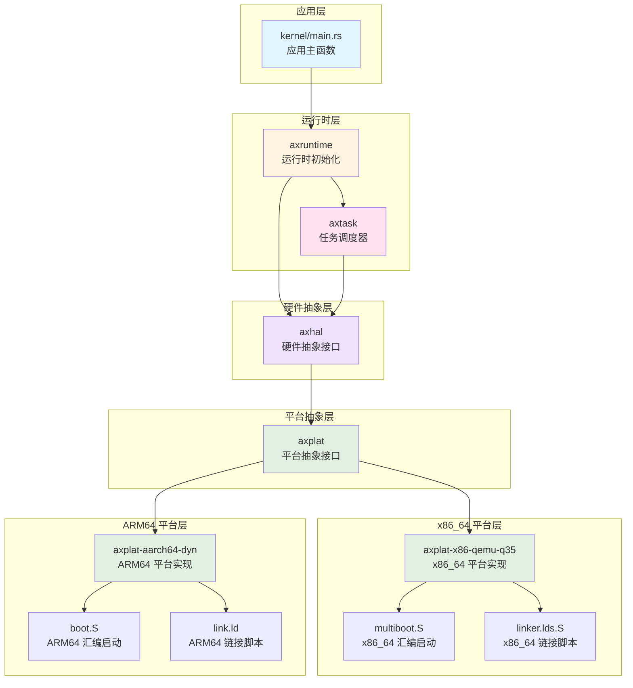
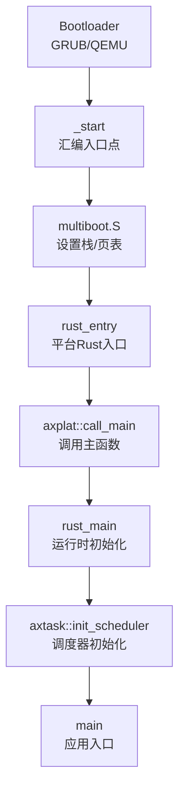
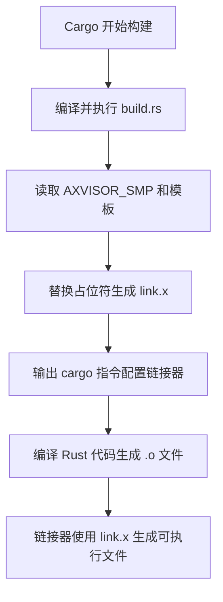
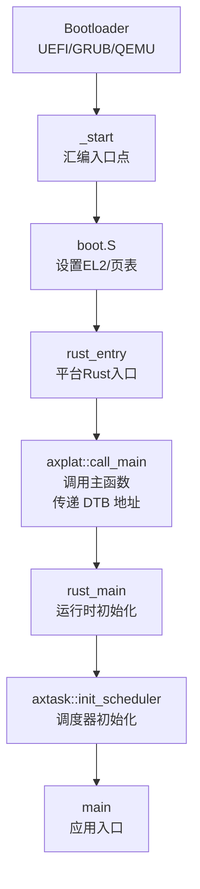
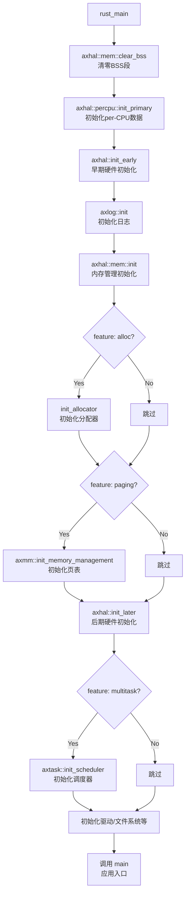
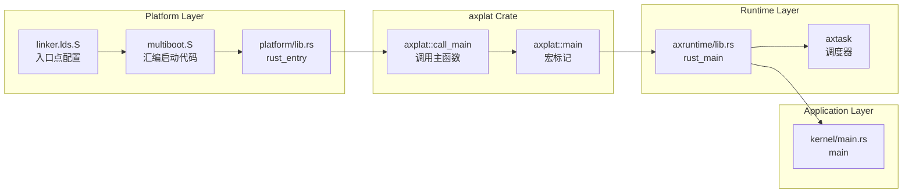
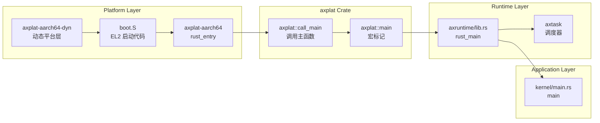

# AxVisor 系统启动与初始化流程分析

本文档详细分析 AxVisor 从系统启动到调度器初始化的完整流程，涵盖 x86_64 和 ARM64 两种主要架构。

---

## 一、整体启动流程

AxVisor 的启动是从 [kernel/src/main.rs](kernel/src/main.rs) 中的 `main()` 函数开始的，然后依次初始化其自己的各个模块。实际上，在进入 `main()` 函数之前，[modules/axruntime/src/lib.rs](modules/axruntime/src/lib.rs) 中的 `rust_main()` 会先执行来准备运行环境。这涉及到一个完整的启动链路，不同架构有显著差异。

### 1.1 模块依赖关系

AxVisor 的启动流程涉及多个层次的模块协作，下图展示了核心模块之间的依赖关系：



### 1.2 应用层

应用层是 AxVisor 的最顶层，负责实现具体的虚拟化业务逻辑，主要实现实现虚拟化管理功能及管理虚拟机生命周期，其入口为 [kernel/src/main.rs](kernel/src/main.rs)，其中会依次初始化各个模块。

```rust
#[unsafe(no_mangle)]
fn main() {
    logo::print_logo();

    info!("Starting virtualization...");
    info!("Hardware support: {:?}", axvm::has_hardware_support());
    hal::enable_virtualization();

    vmm::init();
    vmm::start();

    info!("[OK] Default guest initialized");

    shell::console_init();
}
```

- 初始化虚拟机监控器（VMM）
- 启动客户机操作系统
- 提供用户交互界面（shell）

此时的 AxVisor 已经不在关心底层硬件差异，它依赖运行时层提供的功能：

```rust
use axtask::init_scheduler;  // 任务调度
use axvm::has_hardware_support;  // 虚拟化支持检测
use axvmm::{init, start};  // 虚拟机管理
```

### 1.3 运行时层

运行时层负责提供系统运行的基础设施，包括内存管理、任务调度、硬件抽象等。

**核心模块**：
- **[modules/axruntime](modules/axruntime)**：运行时初始化
    ```rust
    // 运行时入口（modules/axruntime/src/lib.rs）
    #[axplat::main]
    pub fn rust_main(cpu_id: usize, arg: usize) -> ! {
        axhal::mem::clear_bss();           // 清零 BSS 段
        axhal::percpu::init_primary(cpu_id);  // 初始化 per-CPU 数据
        axhal::init_early(cpu_id, arg);    // 早期硬件初始化
        axlog::init();                     // 初始化日志
        axhal::mem::init();                // 内存管理初始化
        axhal::init_later(cpu_id, arg);   // 后期硬件初始化
        
        #[cfg(feature = "multitask")]
        axtask::init_scheduler();          // 初始化调度器（调用 axtask）
        
        unsafe { main() };                 // 调用应用层 main
    }
    ```
  - 实现 `rust_main()` 作为运行时入口
  - 初始化内存管理、日志、驱动等
  - **调用 axtask 初始化调度器**
  - 调用应用层 `main()` 函数
  
- **[tmp/arceos/modules/axtask](tmp/arceos/modules/axtask)**：任务调度器
  - **与 axruntime 同级的独立模块**
  - 实现多任务调度
  - 管理任务运行队列
  - 提供任务创建、切换、销毁接口
  - **依赖 axhal，不依赖 axruntime**

### 1.3 平台抽象层

平台抽象层（axplat）提供跨平台的统一接口，屏蔽不同架构的差异。其通过在构建时根据目标架构选择对应的平台实现，实现依赖注入，解耦平台代码和运行时代码。

**核心模块**：
- **[axplat](modules/axruntime/Cargo.toml)**：平台抽象接口
  - 定义平台无关的 trait（如 `InitIf`、`MemIf`、`TimeIf`）
  - 提供 `#[axplat::main]` 宏实现依赖注入
  - 提供 `axplat::call_main()` 函数调用运行时入口

**平台选择机制**：
```toml
# modules/axruntime/Cargo.toml
# x86_64 平台
[target.'cfg(target_arch = "x86_64")'.dependencies]
axplat-x86_64 = { git = "https://github.com/arceos-org/axplat", tag = "v0.4.0", features = ["irq", "smp", "hv"] }

# ARM64 平台
[target.'cfg(target_arch = "aarch64")'.dependencies]
axplat-aarch64-dyn = { git = "https://github.com/arceos-hypervisor/axplat-aarch64-dyn.git", tag = "v0.4.0", features = ["irq", "smp", "hv"] }
```

### 1.5 平台层

平台层包含具体架构的硬件抽象实现，每个平台都有自己的启动代码、链接脚本和硬件初始化逻辑。

**x86_64 平台**：
- **位置**：[platform/x86-qemu-q35](platform/x86-qemu-q35)
- **核心文件**：
  - `linker.lds.S`：链接器脚本模板
  - `multiboot.S`：汇编启动代码
  - `build.rs`：构建脚本，处理链接器模板
  - `src/lib.rs`：平台 Rust 入口点
  
- **技术特点**：
  - 使用 Multiboot 协议与引导加载器通信
  - 支持 64 位长模式
  - 使用 APIC（本地 APIC + I/O APIC）进行中断管理
  - 通过 LAPIC Timer 提供定时器功能

**ARM64 平台**：
- **位置**：[modules/axplat-aarch64-dyn](modules/axplat-aarch64-dyn)
- **核心文件**：
  - `link.ld`：链接器脚本模板
  - `src/boot.rs`：启动代码（使用 `somehal` crate）
  - `build.rs`：构建脚本，处理链接器模板
  - `src/init.rs`：平台初始化实现
  - `src/mem.rs`：内存管理实现
  - `src/irq/`：中断控制器实现（GICv2/GICv3）
  - `src/time.rs`：定时器实现（ARM Generic Timer）
  
- **技术特点**：
  - 使用设备树（Device Tree）描述硬件配置
  - 在 EL2 特权级运行以支持虚拟化
  - 使用 GIC（Generic Interrupt Controller）进行中断管理
  - 通过 ARM Generic Timer 提供定时器功能
  - 支持 Stage-2 页表用于虚拟机地址转换

### 1.6 依赖调用链

完整的启动调用链如下：

```
应用层: kernel/main.rs::main()
    ↑
运行时层: axruntime::rust_main()
    ├─> axtask::init_scheduler()  (axruntime 调用 axtask)
    ↑
平台抽象层: axplat::call_main()
    ↑
平台层: 
    ├─ x86_64: platform/x86-qemu-q35::rust_entry()
    │          ↑
    │       multiboot.S:_start (汇编入口)
    │
    └─ ARM64: axplat-aarch64-dyn::main()
               ↑
            somehal 提供的启动入口
```

**模块依赖关系**：
- **axruntime** 依赖 **axtask**（通过 `axtask = { workspace = true, optional = true }`）
- **axtask** 不依赖 **axruntime**，它是独立的调度器模块
- **axruntime** 和 **axtask** 都依赖 **axhal**（硬件抽象层）
- **axruntime** 通过 `#[cfg(feature = "multitask")]` 条件编译来决定是否调用 axtask

---

## 二、x86_64 平台启动流程

对于 x86_64 平台，当前使用支持 Multiboot 协议的 GRUB/QEMU 引导加载器来启动。

### 2.1 启动流程图



### 2.2 链接器入口点配置

链接器脚本定义了程序的内存布局和入口点。x86_64 平台使用模板化的链接器脚本，通过构建系统动态生成最终配置。

#### 2.2.1 链接器脚本模板

链接器脚本模板位于 [platform/x86-qemu-q35/linker.lds.S](platform/x86-qemu-q35/linker.lds.S) 中：

```assembly
OUTPUT_ARCH(%ARCH%)              /* 架构占位符 */

BASE_ADDRESS = %KERNEL_BASE%;    /* 内核基地址占位符 */
SMP = %SMP%;                     /* CPU 核心数占位符 */

ENTRY(_start)                    /* 设置入口点为 _start */
SECTIONS
{
    . = BASE_ADDRESS;
    _skernel = .;

    /* 代码段 */
    .text : ALIGN(4K) {
        _stext = .;
        *(.text.boot)            /* 启动代码段 */
        *(.text .text.*)
        . = ALIGN(4K);
        _etext = .;
    }

    /* 只读数据段 */
    .rodata : ALIGN(4K) {
        _srodata = .;
        *(.rodata .rodata.*)
        *(.srodata .srodata.*)
        *(.sdata2 .sdata2.*)
        . = ALIGN(4K);
        _erodata = .;
    }

    /* 数据段 */
    .data : ALIGN(4K) {
        _sdata = .;
        *(.data.boot_page_table)    /* 启动页表 */
        . = ALIGN(4K);

        /* 驱动注册段 */
        __sdriver_register = .;
        KEEP(*(.driver.register*))
        __edriver_register = .;

        *(.data .data.*)
        *(.sdata .sdata.*)
        *(.got .got.*)
    }

    /* 线程局部存储 */
    .tdata : ALIGN(0x10) {
        _stdata = .;
        *(.tdata .tdata.*)
        _etdata = .;
    }

    .tbss : ALIGN(0x10) {
        _stbss = .;
        *(.tbss .tbss.*)
        *(.tcommon)
        _etbss = .;
    }

    /* Per-CPU 数据段 */
    . = ALIGN(4K);
    _percpu_start = .;
    _percpu_end = _percpu_start + SIZEOF(.percpu);
    .percpu 0x0 : AT(_percpu_start) {
        _percpu_load_start = .;
        *(.percpu .percpu.*)
        _percpu_load_end = .;
        . = _percpu_load_start + ALIGN(64) * SMP;  /* 每个CPU 64字节对齐 */
    }
    . = _percpu_end;

    . = ALIGN(4K);
    _edata = .;

    /* BSS 段 */
    .bss : ALIGN(4K) {
        boot_stack = .;
        *(.bss.stack)
        . = ALIGN(4K);
        boot_stack_top = .;

        _sbss = .;
        *(.bss .bss.*)
        *(.sbss .sbss.*)
        *(COMMON)
        . = ALIGN(4K);
        _ebss = .;
    }

    _ekernel = .;

    /* 丢弃不需要的段 */
    /DISCARD/ : {
        *(.comment) *(.gnu*) *(.note*) *(.eh_frame*)
    }
}

/* 中断处理和链接器优化段 */
SECTIONS {
    linkme_IRQ : { *(linkme_IRQ) }
    linkm2_IRQ : { *(linkm2_IRQ) }
    linkme_PAGE_FAULT : { *(linkme_PAGE_FAULT) }
    linkm2_PAGE_FAULT : { *(linkm2_PAGE_FAULT) }
    linkme_SYSCALL : { *(linkme_SYSCALL) }
    linkm2_SYSCALL : { *(linkm2_SYSCALL) }
    scope_local : { *(scope_local) }
}
INSERT AFTER .tbss;
```

**模板占位符**：
- `%ARCH%`：目标架构（如 `i386:x86-64`）
- `%KERNEL_BASE%`：内核虚拟基地址（如 `0xffff800000200000`）
- `%SMP%`：CPU 核心数（从环境变量 `AXVISOR_SMP` 读取）

#### 2.2.2 构建脚本处理

构建脚本 [platform/x86-qemu-q35/build.rs](platform/x86-qemu-q35/build.rs) 负责处理模板并生成最终的链接器脚本：

```rust
fn main() {
    // 监听环境变量和源文件变化
    println!("cargo:rerun-if-env-changed=AXVISOR_SMP");
    println!("cargo:rerun-if-changed=linker.lds.S");

    // 读取 SMP 配置（默认为 1）
    let mut smp = 1;
    if let Ok(s) = std::env::var("AXVISOR_SMP") {
        smp = s.parse::<usize>().unwrap_or(1);
    }

    // 读取模板文件
    let ld_content = include_str!("linker.lds.S");

    // 替换占位符
    let ld_content = ld_content.replace("%ARCH%", "i386:x86-64");
    let ld_content = ld_content.replace(
        "%KERNEL_BASE%", 
        &format!("{:#x}", 0xffff800000200000usize)
    );
    let ld_content = ld_content.replace("%SMP%", &format!("{smp}"));

    // 输出到构建目录
    let out_dir = std::env::var("OUT_DIR").unwrap();
    let out_path = std::path::Path::new(&out_dir).join("link.x");
    
    // 告诉 cargo 链接器搜索路径
    println!("cargo:rustc-link-search={out_dir}");
    
    // 写入最终的链接器脚本
    std::fs::write(out_path, ld_content).unwrap();
}
```

**Cargo 编译过程与处理流程**：



**处理步骤**：

1. **构建脚本阶段**：Cargo 编译并运行 `build.rs`，读取 `AXVISOR_SMP` 环境变量和 `linker.lds.S` 模板，替换占位符后生成 `link.x` 到 `OUT_DIR`

2. **指令配置阶段**：通过 `cargo:rustc-link-search` 和 `cargo:rustc-link-arg=-Tlink.x` 告诉链接器使用生成的脚本

3. **编译链接阶段**：编译 Rust 源代码生成目标文件，链接器根据 `link.x` 定义的内存布局进行符号解析和重定位，生成最终可执行文件

**关键环境变量**：

| 环境变量 | 值示例 | 说明 |
|---------|--------|------|
| `OUT_DIR` | `target/.../build/axplat-x86-q35-xxxxx/out` | 构建脚本输出目录 |
| `TARGET` | `x86_64-unknown-none` | 目标三元组 |
| `AXVISOR_SMP` | `1`、`4`、`8` | CPU 核心数（用户设置） |

**增量编译**：通过 `cargo:rerun-if-env-changed=AXVISOR_SMP` 和 `cargo:rerun-if-changed=linker.lds.S` 实现智能重新构建

#### 2.2.3 最终生成的链接器脚本

经过构建脚本处理后，生成的 `link.x` 文件内容如下（以 SMP=1 为例）：

```assembly
OUTPUT_ARCH(i386:x86-64)

BASE_ADDRESS = 0xffff800000200000;
SMP = 1;

ENTRY(_start)
SECTIONS
{
    . = 0xffff800000200000;
    _skernel = .;

    .text : ALIGN(4K) {
        _stext = .;
        *(.text.boot)
        *(.text .text.*)
        . = ALIGN(4K);
        _etext = .;
    }

    /* ... 其他段配置 ... */

    .percpu 0x0 : AT(_percpu_start) {
        _percpu_load_start = .;
        *(.percpu .percpu.*)
        _percpu_load_end = .;
        . = _percpu_load_start + ALIGN(64) * 1;  /* SMP=1 */
    }
    /* ... */
}
```

#### 2.2.4 内存布局

链接器脚本定义的内存布局如下：

| 段名称 | 起始地址 | 大小 | 说明 |
|--------|----------|------|------|
| `.text` | `0xffff800000200000` | 可变 | 代码段，包含启动代码 |
| `.rodata` | 紧接 `.text` | 可变 | 只读数据段 |
| `.data` | 紧接 `.rodata` | 可变 | 数据段，包含启动页表和驱动注册表 |
| `.percpu` | 紧接 `.data` | `64 × SMP` 字节 | Per-CPU 数据段 |
| `.bss` | 紧接 `.percpu` | 可变 | 零初始化数据段，包含启动栈 |

**关键特点**：
- **高位内核地址**：使用 `0xffff800000200000` 作为内核基地址
- **页对齐**：所有段按 4KB 页对齐
- **启动代码段**：通过 `*(.text.boot)` 收集启动代码
- **Per-CPU 支持**：每个 CPU 的数据按 64 字节对齐
- **驱动注册**：通过 `KEEP(*(.driver.register*))` 保留驱动注册表
- **Multiboot 兼容**：支持 Multiboot 协议的引导加载器

### 2.3 汇编启动代码

在 [platform/x86-qemu-q35/src/boot.rs](platform/x86-qemu-q35/src/boot.rs) 中，通过 `global_asm!` 宏嵌入 `multiboot.S` 这个汇编代码：

```rust
global_asm!(
    include_str!("multiboot.S"),
    mb_magic = const MULTIBOOT_BOOTLOADER_MAGIC,
    entry = sym crate::rust_entry,           // Rust 入口点
    entry_secondary = sym crate::rust_entry_secondary,
    // ...
);
```

`multiboot.S` 汇编代码实现 CPU 上电后的第一条要执行的指令（准确的说是，链接脚本中定义的程序入口点）

```assembly
/* multiboot.S - x86_64 启动代码 */
.set MAGIC, 0x1BADB002            /* Multiboot 魔数 */
.set FLAGS, 0                     /* Multiboot 标志 */
.set CHECKSUM, -(MAGIC + FLAGS)   /* 校验和 */

.section .text.boot
.global _start
.type _start, @function

_start:
    /* 1. 设置 Multiboot 头部 */
    .long MAGIC
    .long FLAGS
    .long CHECKSUM

    /* 2. 设置栈指针 */
    mov $stack_top, %rsp

    /* 3. 设置页表并开启 64 位模式 */
    call setup_page_tables

    /* 4. 跳转到 Rust 入口点 */
    jmp rust_entry
```

1. 设置 Multiboot 头部
2. 配置 CPU（CR0, CR4, EFER 寄存器）
3. 设置页表（开启 64 位长模式）
4. 设置栈指针
5. 跳转到 `rust_entry`


### 2.4 平台 Rust 入口

平台 Rust 入口在 [platform/x86-qemu-q35/src/lib.rs](platform/x86-qemu-q35/src/lib.rs#L40-L50) 中定义，其中会直接跳转到统一的平台处理接口 `axplat::call_main` 中（详见第四章）。

```rust
unsafe extern fn rust_entry(magic: usize, mbi: usize) {
    if magic == self::boot::MULTIBOOT_BOOTLOADER_MAGIC {
        axplat::call_main(current_cpu_id(), mbi);
    }
}

unsafe extern fn rust_entry_secondary(_magic: usize) {
    #[cfg(feature = "smp")]
    if _magic == self::boot::MULTIBOOT_BOOTLOADER_MAGIC {
        axplat::call_secondary_main(current_cpu_id());
    }
}
```

**参数说明**：
- `magic`: Multiboot 魔数（`0x2BADB002`），用于验证引导加载器
- `mbi`: Multiboot 信息结构体指针，包含内存布局、命令行参数等

---

## 三、ARM64 平台启动流程

ARM64 平台使用设备树（Device Tree）和 UEFI/GRUB/QEMU 引导加载器，启动流程如下：

### 3.1 启动流程图



### 3.2 链接器入口点配置

ARM64 平台的链接器脚本由 [modules/axplat-aarch64-dyn/link.ld](modules/axplat-aarch64-dyn/link.ld) 提供：

```assembly
OUTPUT_ARCH(aarch64)

__SMP = {{SMP}};              /* 由 build.rs 动态替换 */
STACK_SIZE = 0x40000;         /* 256KB 栈空间 */

ENTRY(_start)

INCLUDE "pie_boot.x"          /* PIE（位置无关可执行）引导支持 */

SECTIONS
{
    _skernel = .;

    /* 代码段 */
    .text : ALIGN(4K) {
        _stext = .;
        *(.text.boot)         /* 启动代码段，必须在 EL2 执行 */
        *(.text .text.*)
        . = ALIGN(4K);
        _etext = .;
    }

    /* 只读数据段 */
    .rodata : ALIGN(4K) {
        *(.rodata .rodata.*)
        *(.srodata .srodata.*)
    }

    /* 初始化数组 */
    .init_array : ALIGN(0x10) {
        __init_array_start = .;
        *(.init_array .init_array.*)
        __init_array_end = .;
    }

    /* 数据段 */
    .data : ALIGN(4K) {
        *(.data.boot_page_table)    /* 启动页表 */
        . = ALIGN(4K);

        /* 驱动注册段 */
        __sdriver_register = .;
        KEEP(*(.driver.register*))
        __edriver_register = .;

        *(.data .data.*)
        *(.got .got.*)
    }

    /* 线程局部存储 */
    .tdata : ALIGN(0x10) {
        _stdata = .;
        *(.tdata .tdata.*)
        _etdata = .;
    }

    .tbss : ALIGN(0x10) {
        _stbss = .;
        *(.tbss .tbss.*)
        *(.tcommon)
        _etbss = .;
    }

    /* Per-CPU 数据段 */
    . = ALIGN(4K);
    _percpu_start = .;
    _percpu_end = _percpu_start + SIZEOF(.percpu);
    .percpu 0x0 : AT(_percpu_start) {
        _percpu_load_start = .;
        *(.percpu .percpu.*)
        _percpu_load_end = .;
        . = _percpu_load_start + ALIGN(64) * __SMP;  /* 每个CPU 64字节对齐 */
    }
    . = _percpu_end;

    /* BSS 段 */
    .bss : AT(.) ALIGN(4K) {
        /* CPU0 栈 */
        __cpu0_stack = .;
        . += STACK_SIZE;
        __cpu0_stack_top = .;

        /* 启动栈 */
        boot_stack = .;
        *(.bss.stack)
        . = ALIGN(4K);
        boot_stack_top = .;

        _sbss = .;
        *(.bss .bss.*)
        *(.sbss .sbss.*)
        *(COMMON)
        . = ALIGN(4K);
        _ebss = .;
    }

    _ekernel = .;
}
```

**关键特点**：
- 使用 `OUTPUT_ARCH(aarch64)` 指定 ARM64 架构
- 通过 `INCLUDE "pie_boot.x"` 支持位置无关可执行文件
- 动态 SMP 数量（由 `build.rs` 在编译时替换）
- 256KB 栈空间（`STACK_SIZE = 0x40000`）
- 支持 per-CPU 数据段，每个 CPU 的数据按 64 字节对齐
- 包含驱动注册段（`.driver.register*`）
- 启动页表段（`.data.boot_page_table`）

**构建脚本**（[modules/axplat-aarch64-dyn/build.rs](modules/axplat-aarch64-dyn/build.rs)）：

```rust
fn main() {
    // 设置链接器搜索路径
    println!("cargo:rustc-link-search={}", out_dir().display());

    // 使用自定义链接器脚本
    println!("cargo::rustc-link-arg=-Tlink.x");
    println!("cargo:rustc-link-arg=-no-pie");           /* 禁用 PIE */
    println!("cargo:rustc-link-arg=-znostart-stop-gc"); /* 保留启动和停止代码 */

    // 读取链接器脚本模板
    let ld_content = std::fs::read_to_string("link.ld").unwrap();

    // 替换 SMP 占位符（默认为 16 核）
    let ld_content = ld_content.replace("{{SMP}}", &format!("{}", 16));

    // 写入最终的链接器脚本
    std::fs::write(out_dir().join("link.x"), ld_content)
        .expect("link.x write failed");
}
```

**平台配置**（[modules/axplat-aarch64-dyn/axconfig.toml](modules/axplat-aarch64-dyn/axconfig.toml)）：

```toml
[plat]
cpu-num = 1                                   # CPU 核心数
kernel-base-vaddr = "0xffff_8000_0000_0000"    # 内核虚拟地址
kernel-aspace-base = "0xffff_8000_0000_0000"   # 内核地址空间基址
kernel-aspace-size = "0x0000_7fff_ffff_f000"   # 内核地址空间大小

[devices]
timer-irq = 30  # 定时器中断号（PPI，物理定时器）
```

### 3.3 汇编启动代码

ARM64 平台的启动代码在 [modules/axplat-aarch64-dyn/src/boot.rs](modules/axplat-aarch64-dyn/src/boot.rs) 中实现：

```rust
use core::arch::naked_asm;
use aarch64_cpu_ext::cache::{CacheOp, dcache_all};
use somehal::BootInfo;

const BOOT_STACK_SIZE: usize = 0x40000; // 256KB

/* 启动栈（BSS 段） */
#[unsafe(link_section = ".bss.stack")]
static mut BOOT_STACK: [u8; BOOT_STACK_SIZE] = [0; BOOT_STACK_SIZE];

/* 主 CPU 入口点（由 somehal::entry 宏标记） */
#[somehal::entry]
fn main(args: &BootInfo) -> ! {
    unsafe {
        switch_sp(args);
    }
}

/* 切换栈指针（naked 函数，纯汇编） */
#[unsafe(naked)]
unsafe extern "C" fn switch_sp(_args: &BootInfo) -> ! {
    naked_asm!(
        "
        /* 计算新栈顶地址 */
        adrp x8, {sp}              /* 获取 BOOT_STACK 的页地址 */
        add  x8, x8, :lo12:{sp}    /* 加上低 12 位偏移 */
        add  x8, x8, {size}        /* 加上栈大小，得到栈顶 */
        mov  sp, x8                /* 设置栈指针 */

        /* 跳转到下一个函数 */
        bl   {next}
        ",
        sp = sym BOOT_STACK,
        size = const BOOT_STACK_SIZE,
        next = sym sp_reset,
    )
}

/* 栈重置后的入口点 */
fn sp_reset(args: &BootInfo) -> ! {
    /* 调用 axplat::call_main，传递 FDT 地址 */
    axplat::call_main(
        0,  /* CPU ID（主 CPU 为 0） */
        args.fdt.map(|p| p.as_ptr() as usize).unwrap_or_default()
    );
}

/* 次级 CPU 入口点（仅在 smp feature 启用时编译） */
#[cfg(feature = "smp")]
#[somehal::secondary_entry]
fn secondary(cpu_id: usize) {
    /* 使数据缓存失效 */
    dcache_all(CacheOp::Invalidate);

    /* 将硬件 CPU ID 转换为逻辑 CPU 索引 */
    let cpu_idx = crate::smp::cpu_id_to_idx(cpu_id);

    /* 调用次级 CPU 主函数 */
    axplat::call_secondary_main(cpu_idx)
}
```

**关键特点**：
1. **使用 `somehal` crate**：提供硬件抽象层，包括 `BootInfo` 结构
2. **`#[somehal::entry]` 宏**：标记主 CPU 入口点
3. **`#[somehal::secondary_entry]` 宏**：标记次级 CPU 入口点
4. **naked_asm**：使用 naked 函数和内联汇编切换栈指针
5. **数据缓存失效**：次级 CPU 启动时使数据缓存失效（`dcache_all`）
6. **CPU ID 转换**：将硬件 CPU ID（MPIDR）转换为逻辑 CPU 索引

**BootInfo 结构**（由 `somehal` 提供）：

```rust
/* somehal 提供的启动信息结构（简化） */
pub struct BootInfo {
    /* FDT（设备树）物理地址 */
    pub fdt: Option<PhysAddr>,

    /* CPU ID（硬件 ID，来自 MPIDR_EL1） */
    pub cpu_id: usize,

    /* 内核镜像加载地址（物理地址） */
    pub kimage_start_lma: PhysAddr,

    /* 内核镜像虚拟地址 */
    pub kimage_start_vma: VirtAddr,

    /* 内核代码偏移（虚拟地址 - 物理地址） */
    pub kcode_offset: usize,

    /* 页表起始地址（物理地址） */
    pub pg_start: PhysAddr,

    /* 内存区域列表 */
    pub memory_regions: &'static [MemoryRegion],

    /* 调试控制台配置 */
    pub debug_console: Option<DebugConsole>,
}
```

### 3.4 平台 Rust 入口

ARM64 平台的 Rust 入口由 `axplat-aarch64-dyn` crate 提供，实际实现如上节所示（[boot.rs](modules/axplat-aarch64-dyn/src/boot.rs)）：

```rust
/* 主 CPU 入口点 */
#[somehal::entry]
fn main(args: &BootInfo) -> ! {
    unsafe {
        switch_sp(args);
    }
}

/* 栈重置后调用 axplat::call_main */
fn sp_reset(args: &BootInfo) -> ! {
    axplat::call_main(
        0,  /* CPU ID（主 CPU 为 0） */
        args.fdt.map(|p| p.as_ptr() as usize).unwrap_or_default()
    );
}

/* 次级 CPU 入口点 */
#[cfg(feature = "smp")]
#[somehal::secondary_entry]
fn secondary(cpu_id: usize) {
    dcache_all(CacheOp::Invalidate);
    let cpu_idx = crate::smp::cpu_id_to_idx(cpu_id);
    axplat::call_secondary_main(cpu_idx)
}
```

**参数说明**：
- `cpu_id`: CPU 逻辑 ID（主 CPU 为 0，次级 CPU 由 `smp::cpu_id_to_idx` 转换）
- `fdt_ptr`: 设备树（Device Tree Blob）物理地址，包含硬件配置信息

### 3.5 设备树解析

**设备树解析**（[modules/axplat-aarch64-dyn/src/lib.rs](modules/axplat-aarch64-dyn/src/lib.rs)）：

```rust
use fdt_parser::Fdt;
use axplat::mem::phys_to_virt;

/* 获取 FDT 解析器 */
fn fdt() -> Fdt<'static> {
    /* 从 somehal 获取 FDT 物理地址 */
    let paddr = somehal::boot_info()
        .fdt
        .expect("FDT is not available, please check the bootloader configuration");

    /* 将物理地址转换为虚拟地址 */
    let addr = phys_to_virt((paddr.as_ptr() as usize).into());

    /* 创建 FDT 解析器 */
    Fdt::from_ptr(NonNull::new(addr.as_mut_ptr()).unwrap())
        .expect("Failed to parse FDT")
}
```

**CPU ID 转换**（[modules/axplat-aarch64-dyn/src/smp.rs](modules/axplat-aarch64-dyn/src/smp.rs)）：

```rust
use alloc::vec::Vec;
use fdt_parser::Status;
use somehal::boot_info;
use spin::Once;

static CPU_ID_LIST: Once<Vec<usize>> = Once::new();

/* 初始化 CPU ID 列表 */
pub fn init() {
    CPU_ID_LIST.call_once(|| {
        let mut ls = Vec::new();
        let current = boot_info().cpu_id;
        ls.push(current);

        /* 从设备树中解析所有 CPU */
        let cpu_id_ls = cpu_id_list();
        for cpu_id in cpu_id_ls {
            if cpu_id != current {
                ls.push(cpu_id);
            }
        }
        ls
    });
}

/* 从设备树中获取 CPU ID 列表 */
fn cpu_id_list() -> Vec<usize> {
    let fdt = fdt();
    let nodes = fdt.find_nodes("/cpus/cpu");
    nodes
        .filter(|node| node.name().contains("cpu@"))
        .filter(|node| !matches!(node.status(), Some(Status::Disabled)))
        .map(|node| {
            /* 获取 CPU 的 reg 属性（MPIDR） */
            let reg = node
                .reg()
                .unwrap_or_else(|| panic!("cpu {} reg not found", node.name()))
                .next()
                .expect("cpu reg 0 not found");
            reg.address as usize
        })
        .collect()
}

/* 将逻辑 CPU 索引转换为硬件 CPU ID */
pub fn cpu_idx_to_id(cpu_idx: usize) -> usize {
    let cpu_id_list = CPU_ID_LIST.wait();
    if cpu_idx < cpu_id_list.len() {
        cpu_id_list[cpu_idx]
    } else {
        panic!("CPU index {} out of range", cpu_idx);
    }
}

/* 将硬件 CPU ID 转换为逻辑 CPU 索引 */
pub fn cpu_id_to_idx(cpu_id: usize) -> usize {
    let cpu_id_list = CPU_ID_LIST.wait();
    if let Some(idx) = cpu_id_list.iter().position(|&id| id == cpu_id) {
        idx
    } else {
        panic!("CPU ID {} not found in the list", cpu_id);
    }
}
```

---

## 四、通用运行时初始化流程

无论是 x86_64 还是 ARM64 平台，在进入应用 `main()` 函数之前，都需要经过 ArceOS 运行时的初始化流程。这一部分是跨平台通用的。

### 4.1 axplat 宏系统

`axplat` crate 提供了 `#[axplat::main]` 宏，用于标记运行时的主入口函数。在 [modules/axruntime/src/lib.rs](modules/axruntime/src/lib.rs#L111) 中：

```rust
/// The main entry point of the ArceOS runtime.
///
/// It is called from the bootstrapping code in the specific platform crate (see
/// [`axplat::main`]).
///
/// `cpu_id` is the logic ID of the current CPU, and `arg` is passed from the
/// bootloader (typically the device tree blob address).
///
/// In multi-core environment, this function is called on the primary core, and
/// secondary cores call [`rust_main_secondary`].
#[cfg_attr(not(test), axplat::main)]
pub fn rust_main(cpu_id: usize, arg: usize) -> ! {
    // ... 初始化代码 ...
}
```

`#[axplat::main]` 宏的工作原理：
1. 将 `rust_main` 函数标记为程序的主入口点
2. `axplat::call_main` 会查找并调用被此宏标记的函数
3. 这是一种依赖注入模式，允许平台代码调用运行时代码

**平台抽象层依赖**（[modules/axruntime/Cargo.toml](modules/axruntime/Cargo.toml)）：

```toml
# x86_64 平台
[target.'cfg(target_arch = "x86_64")'.dependencies]
axplat-x86_64 = { git = "https://github.com/arceos-org/axplat", tag = "v0.4.0", features = ["irq", "smp", "hv"] }

# ARM64 平台
[target.'cfg(target_arch = "aarch64")'.dependencies]
axplat-aarch64-dyn = { git = "https://github.com/arceos-hypervisor/axplat-aarch64-dyn.git", tag = "v0.4.0", features = ["irq", "smp", "hv"] }
```

### 4.2 完整的初始化流程



**平台特定的初始化差异**：

| 初始化步骤 | x86_64 | ARM64 |
|-----------|--------|-------|
| **axhal::init_early** | 解析 Multiboot 信息 | 解析设备树（DTB） |
| **axhal::mem::init** | 从 Multiboot 获取内存区域 | 从 `somehal::boot_info()` 获取内存区域 |
| **axhal::init_later** | 初始化 APIC/IOAPIC | 初始化 GIC（中断控制器） |
| **中断控制器** | Local APIC + I/O APIC | GICv2 或 GICv3 |
| **定时器** | LAPIC Timer | ARM Generic Timer |

**ARM64 特定的初始化步骤**（[modules/axplat-aarch64-dyn/src/init.rs](modules/axplat-aarch64-dyn/src/init.rs)）：

```rust
use axplat::init::InitIf;
use log::debug;

struct InitIfImpl;

/* 实现 InitIf trait */
#[impl_plat_interface]
impl InitIf for InitIfImpl {
    /* 早期初始化（主 CPU） */
    fn init_early(_cpu_id: usize, _arg: usize) {
        /* 1. 设置早期控制台 */
        console::setup_early();

        /* 2. 初始化陷阱处理（异常向量表） */
        axcpu::init::init_trap();

        /* 3. 设置内存管理 */
        crate::mem::setup();
    }

    /* 早期初始化（次级 CPU） */
    #[cfg(feature = "smp")]
    fn init_early_secondary(_cpu_id: usize) {
        /* 仅初始化陷阱处理 */
        axcpu::init::init_trap();
    }

    /* 后期初始化（主 CPU） */
    fn init_later(_cpu_id: usize, _arg: usize) {
        /* 1. 刷新 TLB */
        somehal::mem::flush_tlb(None);

        /* 2. 初始化 SMP（多核支持） */
        #[cfg(feature = "smp")]
        crate::smp::init();

        /* 3. 启用定时器 */
        crate::time::enable();

        /* 4. 设置驱动 */
        debug!("drivers setup...");
        driver::setup();

        /* 5. 初始化中断控制器 */
        #[cfg(feature = "irq")]
        {
            crate::irq::init();              /* 初始化 GIC */
            crate::irq::init_current_cpu();  /* 初始化当前 CPU 的中断接口 */
            crate::time::enable_irqs();      /* 启用定时器中断 */
        }
    }

    /* 后期初始化（次级 CPU） */
    #[cfg(feature = "smp")]
    fn init_later_secondary(_cpu_id: usize) {
        /* 1. 刷新 TLB */
        somehal::mem::flush_tlb(None);

        /* 2. 启用定时器 */
        crate::time::enable();

        /* 3. 初始化当前 CPU 的中断接口 */
        #[cfg(feature = "irq")]
        {
            crate::irq::init_current_cpu();
            crate::time::enable_irqs();
        }
    }
}
```

**内存管理初始化**（[modules/axplat-aarch64-dyn/src/mem.rs](modules/axplat-aarch64-dyn/src/mem.rs)）：

```rust
use axplat::mem::{MemIf, PhysAddr, VirtAddr};
use somehal::{boot_info, MemoryRegionKind};
use spin::Once;

struct MemIfImpl;

static RAM_LIST: Once<Vec<RawRange, 32>> = Once::new();
static RESERVED_LIST: Once<Vec<RawRange, 32>> = Once::new();
static MMIO: Once<Vec<RawRange, 32>> = Once::new();

/* 设置内存管理 */
pub fn setup() {
    /* 计算虚拟地址偏移 */
    unsafe {
        VA_OFFSET = boot_info().kimage_start_vma as usize
                  - boot_info().kimage_start_lma as usize;
    };

    /* 初始化 RAM 列表 */
    RAM_LIST.call_once(|| {
        let mut ram_list = Vec::new();
        for region in boot_info()
            .memory_regions
            .iter()
            .filter(|one| matches!(one.kind, MemoryRegionKind::Ram))
            .map(|one| (one.start, one.end - one.start))
        {
            let _ = ram_list.push(region);
        }
        ram_list
    });

    /* 初始化保留区域列表 */
    RESERVED_LIST.call_once(|| {
        let mut rsv_list = Vec::new();

        /* 添加内核镜像区域 */
        let head_start = boot_info().kimage_start_lma as usize;
        let head_section = (head_start, (_skernel as usize) - va_offset() - head_start);
        rsv_list.push(head_section).unwrap();

        /* 添加保留区域 */
        for region in boot_info()
            .memory_regions
            .iter()
            .filter(|one| {
                matches!(
                    one.kind,
                    MemoryRegionKind::Reserved | MemoryRegionKind::Bootloader
                )
            })
            .map(|one| {
                (
                    one.start.align_down_4k(),
                    one.end.align_up_4k() - one.start.align_down_4k(),
                )
            })
        {
            let _ = rsv_list.push(region);
        }

        rsv_list
    });

    /* 初始化 MMIO 区域 */
    MMIO.call_once(|| {
        let mut mmio_list = Vec::new();
        if let Some(debug) = &boot_info().debug_console {
            let start = debug.base_phys.align_down_4k();
            let _ = mmio_list.push((start, 0x1000));
        }
        mmio_list
    });
}

/* 实现 MemIf trait */
#[impl_plat_interface]
impl MemIf for MemIfImpl {
    /* 返回所有物理内存区域 */
    fn phys_ram_ranges() -> &'static [RawRange] {
        RAM_LIST.wait()
    }

    /* 返回所有保留的物理内存区域 */
    fn reserved_phys_ram_ranges() -> &'static [RawRange] {
        RESERVED_LIST.wait()
    }

    /* 返回所有 MMIO 区域 */
    fn mmio_ranges() -> &'static [RawRange] {
        MMIO.wait()
    }

    /* 物理地址到虚拟地址转换 */
    fn phys_to_virt(p: PhysAddr) -> VirtAddr {
        if kimage_range_phys().contains(&p) {
            /* 内核镜像区域 */
            VirtAddr::from_usize(p.as_usize() + va_offset())
        } else {
            /* MMIO 或其他保留区域 */
            VirtAddr::from_usize(p.as_usize() + KLINER_OFFSET)
        }
    }

    /* 虚拟地址到物理地址转换 */
    fn virt_to_phys(p: VirtAddr) -> PhysAddr {
        if (KIMAGE_VADDR..KIMAGE_VADDR + KIMAGE_VSIZE).contains(&p.as_usize()) {
            PhysAddr::from_usize(p.as_usize() - va_offset())
        } else {
            PhysAddr::from_usize(p.as_usize() - KLINER_OFFSET)
        }
    }

    /* 返回内核地址空间 */
    fn kernel_aspace() -> (VirtAddr, usize) {
        #[cfg(feature = "hv")]
        {
            /* 虚拟化模式：使用较小的地址空间 */
            (VirtAddr::from_usize(0), 0xffff_ffff_f000)
        }
        #[cfg(not(feature = "hv"))]
        {
            /* 非虚拟化模式：使用完整的地址空间 */
            (
                VirtAddr::from_usize(0xffff_8000_0000_0000),
                0x0000_7fff_ffff_f000,
            )
        }
    }
}
```

**中断控制器初始化**（[modules/axplat-aarch64-dyn/src/irq/mod.rs](modules/axplat-aarch64-dyn/src/irq/mod.rs)）：

```rust
use arm_gic_driver::{v2::Gic, v3::Gic};
use rdrive::Device;
use rdif_intc::Intc;
use core::sync::atomic::AtomicI32;

static VERSION: AtomicI32 = AtomicI32::new(0);

/* 初始化 GIC（分发器） */
pub(crate) fn init() {
    let intc = get_gicd();
    debug!("Initializing GICD...");
    let mut gic = intc.lock().unwrap();
    gic.open().unwrap();
    debug!("GICD initialized");
}

/* 初始化当前 CPU 的中断接口 */
pub(crate) fn init_current_cpu() {
    let mut intc = get_gicd().lock().unwrap();

    /* 检测 GIC 版本并初始化 */
    if let Some(v) = intc.typed_mut::<v2::Gic>() {
        let cpu = v.cpu_interface();
        v2::TRAP.call_once(|| cpu.trap_operations());
        v2::CPU_IF.with_current(|c| {
            c.call_once(|| Mutex::new(cpu));
        });
        VERSION.store(2, core::sync::atomic::Ordering::SeqCst);
    }

    if let Some(v) = intc.typed_mut::<v3::Gic>() {
        let cpu = v.cpu_interface();
        v3::TRAP.call_once(|| cpu.trap_operations());
        v3::CPU_IF.with_current(|c| {
            c.call_once(|| Mutex::new(cpu));
        });
        VERSION.store(3, core::sync::atomic::Ordering::SeqCst);
    }

    /* 调用特定版本的初始化函数 */
    match gic_version() {
        2 => v2::init_current_cpu(),
        3 => v3::init_current_cpu(),
        _ => panic!("Unsupported GIC version"),
    }

    debug!("GIC initialized for current CPU");
}

/* 获取 GIC 版本 */
fn gic_version() -> i32 {
    VERSION.load(core::sync::atomic::Ordering::SeqCst)
}
```

**定时器初始化**（[modules/axplat-aarch64-dyn/src/time.rs](modules/axplat-aarch64-dyn/src/time.rs)）：

```rust
use aarch64_cpu::registers::*;
use axplat::time::TimeIf;
use rdrive::{IrqConfig, PlatformDevice, module_driver};

static TIMER_IRQ_CONFIG: LazyInit<IrqConfig> = LazyInit::new();

struct TimeIfImpl;

/* 实现 TimeIf trait */
#[impl_plat_interface]
impl TimeIf for TimeIfImpl {
    /* 获取当前硬件时钟滴答数 */
    fn current_ticks() -> u64 {
        CNTPCT_EL0.get()  /* 物理计数寄存器 */
    }

    /* 将硬件滴答转换为纳秒 */
    fn ticks_to_nanos(ticks: u64) -> u64 {
        let freq = CNTFRQ_EL0.get();  /* 计数器频率 */
        (ticks * axplat::time::NANOS_PER_SEC) / freq
    }

    /* 将纳秒转换为硬件滴答 */
    fn nanos_to_ticks(nanos: u64) -> u64 {
        let freq = CNTFRQ_EL0.get();
        (nanos * freq) / axplat::time::NANOS_PER_SEC
    }

    /* 获取定时器中断号 */
    #[cfg(feature = "irq")]
    fn irq_num() -> usize {
        TIMER_IRQ_CONFIG.irq.into()
    }

    /* 设置单次定时器 */
    #[cfg(feature = "irq")]
    fn set_oneshot_timer(deadline_ns: u64) {
        let cnptct = CNTPCT_EL0.get();
        let cnptct_deadline = Self::nanos_to_ticks(deadline_ns);
        if cnptct < cnptct_deadline {
            let interval = cnptct_deadline - cnptct;
            debug_assert!(interval <= u32::MAX as u64);
            set_tval(interval);
        } else {
            set_tval(0);
        }
    }
}

/* 设置定时器值寄存器 */
fn set_tval(tval: u64) {
    #[cfg(feature = "hv")]
    unsafe {
        /* 虚拟化模式：使用 EL2 物理定时器 */
        core::arch::asm!("msr CNTHP_TVAL_EL2, {0:x}", in(reg) tval);
    }
    #[cfg(not(feature = "hv"))]
    {
        /* 非虚拟化模式：使用 EL0 物理定时器 */
        CNTP_TVAL_EL0.set(tval);
    }
}

/* 启用定时器 */
#[cfg(feature = "hv")]
pub fn enable() {
    CNTHP_CTL_EL2.write(CNTHP_CTL_EL2::ENABLE::SET);
    set_tval(0);
}
#[cfg(not(feature = "hv"))]
pub fn enable() {
    CNTP_CTL_EL0.write(CNTP_CTL_EL0::ENABLE::SET);
    set_tval(0);
}

/* 驱动探测（通过设备树） */
module_driver!(
    name: "ARMv8 Timer",
    level: ProbeLevel::PreKernel,
    priority: ProbePriority::DEFAULT,
    probe_kinds: &[
        ProbeKind::Fdt {
            compatibles: &["arm,armv8-timer"],
            on_probe: probe
        }
    ],
);

fn probe(_fdt: FdtInfo<'_>, _dev: PlatformDevice) -> Result<(), OnProbeError> {
    #[cfg(not(feature = "irq"))]
    let irq = IrqConfig {
        irq: 0.into(),
        trigger: rdif_intc::Trigger::EdgeBoth,
        is_private: true,
    };
    #[cfg(feature = "irq")]
    let irq = {
        /* 从设备树中解析定时器中断配置 */
        #[cfg(not(feature = "hv"))]
        let irq_idx = 1;  /* 非虚拟化模式 */
        #[cfg(feature = "hv")]
        let irq_idx = 3;  /* 虚拟化模式 */
        crate::irq::parse_fdt_irqs(&_fdt.interrupts()[irq_idx])
    };
    TIMER_IRQ_CONFIG.call_once(|| irq);
    Ok(())
}
```

关键代码（[modules/axruntime/src/lib.rs:115-180](modules/axruntime/src/lib.rs#L115-L180)）：

```rust
#[cfg_attr(not(test), axplat::main)]
pub fn rust_main(cpu_id: usize, arg: usize) -> ! {
    unsafe { axhal::mem::clear_bss() };
    axhal::percpu::init_primary(cpu_id);
    axhal::init_early(cpu_id, arg);

    ax_println!("{}", LOGO);
    ax_println!("smp = {}", cpu_count());

    axlog::init();
    log::set_max_level(log::LevelFilter::Trace);
    info!("Logging is enabled.");
    info!("Primary CPU {cpu_id} started, arg = {arg:#x}.");

    axhal::mem::init();
    info!("Found physical memory regions:");
    for r in axhal::mem::memory_regions() {
        info!(
            "  [{:x?}, {:x?}) {} ({:?})",
            r.paddr,
            r.paddr + r.size,
            r.name,
            r.flags
        );
    }

    #[cfg(feature = "alloc")]
    init_allocator();

    let (kernel_space_start, kernel_space_size) = axhal::mem::kernel_aspace();

    info!(
        "kernel aspace: [{:#x?}, {:#x?})",
        kernel_space_start,
        kernel_space_start + kernel_space_size,
    );

    #[cfg(feature = "paging")]
    axmm::init_memory_management();

    #[cfg(feature = "driver-dyn")]
    axdriver::setup(arg);

    info!("Initialize platform devices...");
    axhal::init_later(cpu_id, arg);

    #[cfg(feature = "multitask")]
    axtask::init_scheduler();  // 初始化调度器

    #[cfg(any(feature = "fs", feature = "net", feature = "display"))]
    {
        #[allow(unused_variables)]
        let all_devices = axdriver::init_drivers();

        #[cfg(feature = "fs")]
        axfs::init_filesystems(all_devices.block, axhal::dtb::get_chosen_bootargs());

        #[cfg(feature = "net")]
        axnet::init_network(all_devices.net);

        #[cfg(feature = "display")]
        axdisplay::init_display(all_devices.display);
    }

    #[cfg(feature = "smp")]
    self::mp::start_secondary_cpus(cpu_id);

    #[cfg(feature = "irq")]
    {
        info!("Initialize interrupt handlers...");
        init_interrupt();
    }

    #[cfg(all(feature = "tls", not(feature = "multitask")))]
    {
        info!("Initialize thread local storage...");
        init_tls();
    }

    ctor_bare::call_ctors();  // 调用 C++ 风格构造函数

    info!("Primary CPU {cpu_id} init OK.");
    INITED_CPUS.fetch_add(1, Ordering::Release);

    while !is_init_ok() {
        core::hint::spin_loop();
    }

    unsafe { main() };  // 调用应用 main 函数

    #[cfg(feature = "multitask")]
    axtask::exit(0);
    #[cfg(not(feature = "multitask"))]
    {
        debug!("main task exited: exit_code={}", 0);
        axhal::power::system_off();
    }
}
```

### 4.3 依赖关系图

#### x86_64 平台



#### ARM64 平台



**关键差异**：

| 特性 | x86_64 | ARM64 |
|------|--------|-------|
| **平台层位置** | `platform/x86-qemu-q35/` | `axplat-aarch64-dyn`（外部 crate） |
| **链接器脚本** | 本地文件 `linker.lds.S` | 由 `axplat-aarch64-dyn` 提供 |
| **汇编启动代码** | `multiboot.S` | `boot.S`（EL2 特定） |
| **硬件描述** | Multiboot 信息结构体 | 设备树（DTB） |
| **中断控制器** | APIC（本地 + I/O） | GIC（Generic Interrupt Controller） |

### 4.4 关键技术点

#### 通用技术点（跨平台）

1. **链接器脚本**：定义入口点和内存布局
2. **全局汇编**：通过 `global_asm!` 嵌入启动代码
3. **宏系统**：`#[axplat::main]` 实现依赖注入
4. **外部函数声明**：`extern { fn main(); }` 声明应用入口
5. **unsafe 调用**：`unsafe { main(); }` 调用应用代码

这种设计使得：
- 平台代码（boot、multiboot）与运行时代码解耦
- 运行时代码与应用代码解耦
- 支持多种平台和多种调度策略
- 通过 feature flags 灵活配置功能
