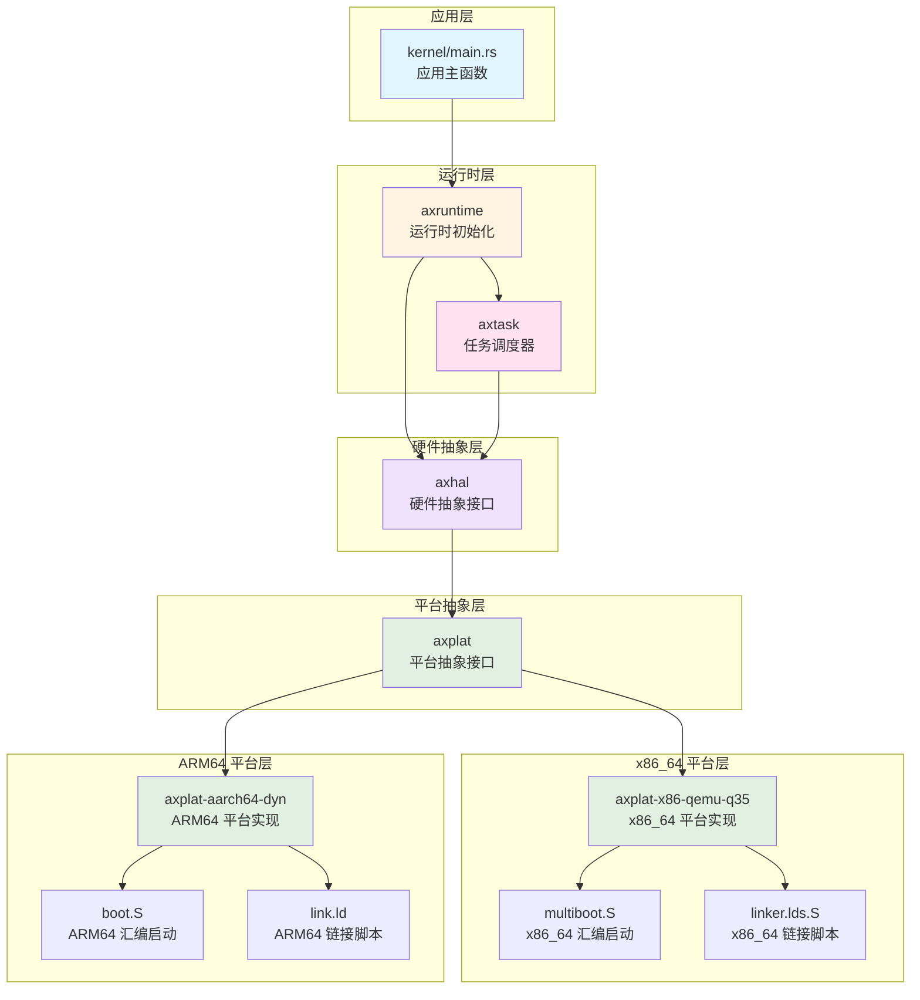
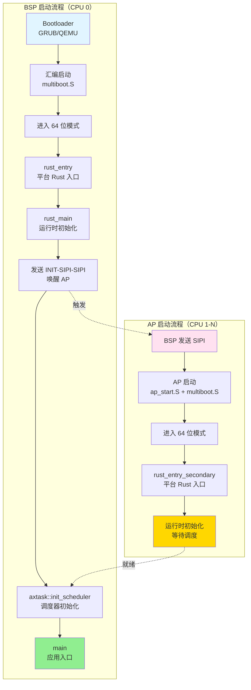
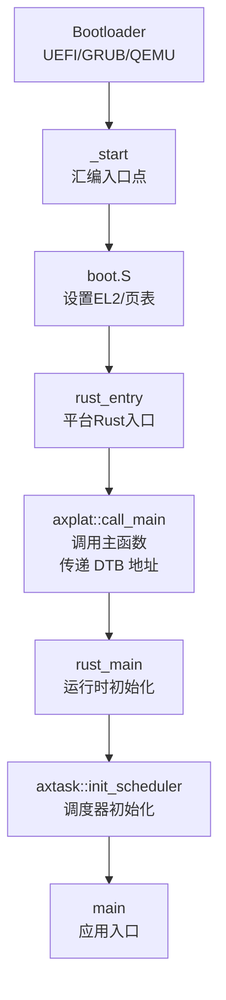
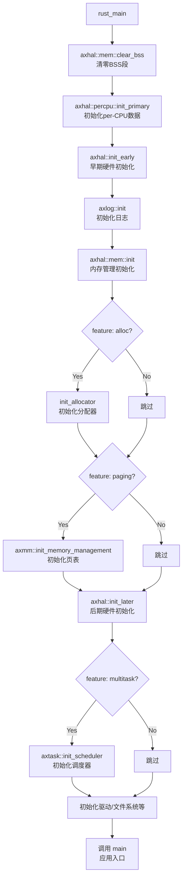
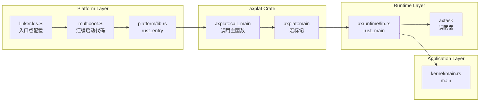
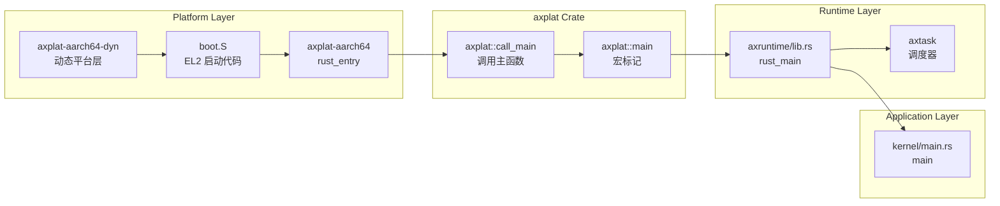

# AxVisor 系统启动与初始化流程分析

本文档详细分析 AxVisor 从系统启动到调度器初始化的完整流程，涵盖 x86_64 和 ARM64 两种主要架构。

---

## 一、整体启动流程

AxVisor 的启动是从 [kernel/src/main.rs](kernel/src/main.rs) 中的 `main()` 函数开始的，然后依次初始化其自己的各个模块。实际上，在进入 `main()` 函数之前，[modules/axruntime/src/lib.rs](modules/axruntime/src/lib.rs) 中的 `rust_main()` 会先执行来准备运行环境。这涉及到一个完整的启动链路，不同架构有显著差异。

### 1.1 模块依赖关系

AxVisor 的启动流程涉及多个层次的模块协作，下图展示了核心模块之间的依赖关系：



### 1.2 应用层

应用层是 AxVisor 的最顶层，负责实现具体的虚拟化业务逻辑，主要实现实现虚拟化管理功能及管理虚拟机生命周期，其入口为 [kernel/src/main.rs](kernel/src/main.rs)，其中会依次初始化各个模块。

```rust
#[unsafe(no_mangle)]
fn main() {
    logo::print_logo();

    info!("Starting virtualization...");
    info!("Hardware support: {:?}", axvm::has_hardware_support());
    hal::enable_virtualization();

    vmm::init();
    vmm::start();

    info!("[OK] Default guest initialized");

    shell::console_init();
}
```

- 初始化虚拟机监控器（VMM）
- 启动客户机操作系统
- 提供用户交互界面（shell）

此时的 AxVisor 已经不在关心底层硬件差异，它依赖运行时层提供的功能：

```rust
use axtask::init_scheduler;  // 任务调度
use axvm::has_hardware_support;  // 虚拟化支持检测
use axvmm::{init, start};  // 虚拟机管理
```

### 1.3 运行时层

运行时层负责提供系统运行的基础设施，包括内存管理、任务调度、硬件抽象等。

**核心模块**：
- **[modules/axruntime](modules/axruntime)**：运行时初始化
    ```rust
    // 运行时入口（modules/axruntime/src/lib.rs）
    #[axplat::main]
    pub fn rust_main(cpu_id: usize, arg: usize) -> ! {
        axhal::mem::clear_bss();           // 清零 BSS 段
        axhal::percpu::init_primary(cpu_id);  // 初始化 per-CPU 数据
        axhal::init_early(cpu_id, arg);    // 早期硬件初始化
        axlog::init();                     // 初始化日志
        axhal::mem::init();                // 内存管理初始化
        axhal::init_later(cpu_id, arg);   // 后期硬件初始化
        
        #[cfg(feature = "multitask")]
        axtask::init_scheduler();          // 初始化调度器（调用 axtask）
        
        unsafe { main() };                 // 调用应用层 main
    }
    ```
  - 实现 `rust_main()` 作为运行时入口
  - 初始化内存管理、日志、驱动等
  - **调用 axtask 初始化调度器**
  - 调用应用层 `main()` 函数
  
- **[tmp/arceos/modules/axtask](tmp/arceos/modules/axtask)**：任务调度器
  - **与 axruntime 同级的独立模块**
  - 实现多任务调度
  - 管理任务运行队列
  - 提供任务创建、切换、销毁接口
  - **依赖 axhal，不依赖 axruntime**

### 1.3 平台抽象层

平台抽象层（axplat）提供跨平台的统一接口，屏蔽不同架构的差异。其通过在构建时根据目标架构选择对应的平台实现，实现依赖注入，解耦平台代码和运行时代码。

**核心模块**：
- **[axplat](modules/axruntime/Cargo.toml)**：平台抽象接口
  - 定义平台无关的 trait（如 `InitIf`、`MemIf`、`TimeIf`）
  - 提供 `#[axplat::main]` 宏实现依赖注入
  - 提供 `axplat::call_main()` 函数调用运行时入口

**平台选择机制**：
```toml
# modules/axruntime/Cargo.toml
# x86_64 平台
[target.'cfg(target_arch = "x86_64")'.dependencies]
axplat-x86_64 = { git = "https://github.com/arceos-org/axplat", tag = "v0.4.0", features = ["irq", "smp", "hv"] }

# ARM64 平台
[target.'cfg(target_arch = "aarch64")'.dependencies]
axplat-aarch64-dyn = { git = "https://github.com/arceos-hypervisor/axplat-aarch64-dyn.git", tag = "v0.4.0", features = ["irq", "smp", "hv"] }
```

### 1.5 平台层

平台层包含具体架构的硬件抽象实现，每个平台都有自己的启动代码、链接脚本和硬件初始化逻辑。

**x86_64 平台**：
- **位置**：[platform/x86-qemu-q35](platform/x86-qemu-q35)
- **核心文件**：
  - `linker.lds.S`：链接器脚本模板
  - `multiboot.S`：汇编启动代码
  - `build.rs`：构建脚本，处理链接器模板
  - `src/lib.rs`：平台 Rust 入口点
  
- **技术特点**：
  - 使用 Multiboot 协议与引导加载器通信
  - 支持 64 位长模式
  - 使用 APIC（本地 APIC + I/O APIC）进行中断管理
  - 通过 LAPIC Timer 提供定时器功能

**ARM64 平台**：
- **位置**：[modules/axplat-aarch64-dyn](modules/axplat-aarch64-dyn)
- **核心文件**：
  - `link.ld`：链接器脚本模板
  - `src/boot.rs`：启动代码（使用 `somehal` crate）
  - `build.rs`：构建脚本，处理链接器模板
  - `src/init.rs`：平台初始化实现
  - `src/mem.rs`：内存管理实现
  - `src/irq/`：中断控制器实现（GICv2/GICv3）
  - `src/time.rs`：定时器实现（ARM Generic Timer）
  
- **技术特点**：
  - 使用设备树（Device Tree）描述硬件配置
  - 在 EL2 特权级运行以支持虚拟化
  - 使用 GIC（Generic Interrupt Controller）进行中断管理
  - 通过 ARM Generic Timer 提供定时器功能
  - 支持 Stage-2 页表用于虚拟机地址转换

### 1.6 依赖调用链

完整的启动调用链如下：

```
应用层: kernel/main.rs::main()
    ↑
运行时层: axruntime::rust_main()
    ├─> axtask::init_scheduler()  (axruntime 调用 axtask)
    ↑
平台抽象层: axplat::call_main()
    ↑
平台层: 
    ├─ x86_64: platform/x86-qemu-q35::rust_entry()
    │          ↑
    │       multiboot.S:_start (汇编入口)
    │
    └─ ARM64: axplat-aarch64-dyn::main()
               ↑
            somehal 提供的启动入口
```

**模块依赖关系**：
- **axruntime** 依赖 **axtask**（通过 `axtask = { workspace = true, optional = true }`）
- **axtask** 不依赖 **axruntime**，它是独立的调度器模块
- **axruntime** 和 **axtask** 都依赖 **axhal**（硬件抽象层）
- **axruntime** 通过 `#[cfg(feature = "multitask")]` 条件编译来决定是否调用 axtask

---

## 二、x86_64 平台启动流程

对于 x86_64 平台，当前使用支持 Multiboot 协议的 GRUB/QEMU 引导加载器来启动。

### 2.1 启动流程图

x86_64 平台的启动流程分为 BSP（Bootstrap Processor）和 AP（Application Processor）两条路径：



**流程说明**：

1. **BSP 启动流程**（左侧蓝色）：
   - 由引导加载器启动，执行汇编启动代码
   - 进入 64 位模式后调用 `rust_entry`
   - 完成运行时初始化后，通过 APIC 发送 INIT-SIPI-SIPI 序列唤醒 AP
   - 初始化调度器并进入应用主函数

2. **AP 启动流程**（右侧粉色）：
   - 由 BSP 通过 SIPI 中断唤醒
   - 执行启动代码（`ap_start.S` + `multiboot.S`）
   - 进入 64 位模式后调用 `rust_entry_secondary`
   - 完成运行时初始化后进入就绪状态

3. **汇合点**：
   - BSP 和 AP 最终都进入运行时环境
   - AP 就绪后，BSP 继续初始化调度器
   - 调度器开始工作时，所有 CPU 都可以参与任务调度

### 2.2 程序入口点

链接器脚本定义了程序的内存布局和入口点。x86_64 平台使用模板化的链接器脚本，通过构建系统动态生成最终链接脚本文件。关于链接器脚本的模板设计、构建脚本处理流程、内存布局等详细信息，请参阅 [构建文档 - 链接器脚本处理](00_AXVISOR_BUILD.md#3236-链接器脚本处理) 章节。

**核心要点**：

1. **入口点定义**：链接器脚本通过 `ENTRY(_start)` 指令定义程序入口点为 `_start` 符号
2. **模板机制**：使用占位符（如 `%ARCH%`、`%KERNEL_BASE%`、`%SMP%`）实现动态配置
3. **构建时处理**：构建脚本 `build.rs` 在编译时读取环境变量并替换占位符，生成最终的 `link.x` 文件
4. **内存布局**：定义了代码段、数据段、BSS 段等在内存中的位置，所有段按 4KB 页对齐

**关键文件**：
- **模板文件**：[platform/x86-qemu-q35/linker.lds.S](platform/x86-qemu-q35/linker.lds.S)
- **构建脚本**：[platform/x86-qemu-q35/build.rs](platform/x86-qemu-q35/build.rs)
- **生成文件**：`target/.../build/axplat-x86-q35-xxxxx/out/link.x`

### 2.3 boot.rs 与 multiboot.S

boot.rs 文件是整个 x86_64 平台的程序入口文件，其中通过 `global_asm!` 宏将启动的 `multiboot.S` 汇编文件以及其自身定义的一些寄存器值整合到一起。

```rust
use x86_64::registers::control::{Cr0Flags, Cr4Flags};
use x86_64::registers::model_specific::EferFlags;

// CR0: 保护模式 + 协处理器监控 + 数值错误 + 写保护 + 分页
const CR0: u64 = Cr0Flags::PROTECTED_MODE_ENABLE.bits()    // PE (bit 0): 启用保护模式
    | Cr0Flags::MONITOR_COPROCESSOR.bits()                 // MP (bit 1): 监控协处理器
    | Cr0Flags::NUMERIC_ERROR.bits()                       // NE (bit 5): 数值错误
    | Cr0Flags::WRITE_PROTECT.bits()                       // WP (bit 16): 写保护
    | Cr0Flags::PAGING.bits();                             // PG (bit 31): 启用分页

// CR4: 物理地址扩展 + 页表全局 + [可选] FXSR 保存
const CR4: u64 = Cr4Flags::PHYSICAL_ADDRESS_EXTENSION.bits() // PAE (bit 5): 物理地址扩展
    | Cr4Flags::PAGE_GLOBAL.bits()                          // PGE (bit 7): 页表全局
    | if cfg!(feature = "fp-simd") {
        Cr4Flags::OSFXSR.bits() | Cr4Flags::OSXMMEXCPT_ENABLE.bits()  // 条件编译
    } else {
        0
    };

// EFER: 长模式使能 + 不执行使能
const EFER: u64 = EferFlags::LONG_MODE_ENABLE.bits()    // LME (bit 8): 启用 x86-64 长模式
    | EferFlags::NO_EXECUTE_ENABLE.bits();               // NXE (bit 11): 启用不执行位

global_asm!(
    include_str!("multiboot.S"),
    cr0 = const CR0,        // 将 CR0 常量传递给汇编
    cr4 = const CR4,        // 将 CR4 常量传递给汇编
    efer = const EFER,      // 将 EFER 常量传递给汇编
    // ... 其他参数
);
```

`global_asm!` 是 Rust 提供的内联汇编宏，它允许在 Rust 代码中嵌入全局汇编代码。其工作流程如下：

1. **编译时求值**：Rust 编译器在编译时计算 `const CR0`、`const CR4`、`const EFER` 的值
2. **参数传递**：通过 `cr0 = const CR0` 这样的语法，将 Rust 常量传递给汇编代码
3. **占位符替换**：汇编代码中使用 `{cr0}`、`{cr4}`、`{efer}` 作为占位符
4. **文本替换**：编译器将汇编代码中的占位符替换为实际的常量值
5. **汇编编译**：替换后的汇编代码被传递给汇编器（如 GAS）进行编译

以 multiboot.S 中的使用为例，multiboot.S 中使用花括号 `{}` 包围的占位符来引用这些常量：

```assembly
# 在 ENTRY32_COMMON 宏中
.macro ENTRY32_COMMON
    # ... 其他代码 ...

    # set PAE, PGE bit in CR4
    mov     eax, {cr4}      # {cr4} 会被替换为 CR0 的实际值
    mov     cr4, eax

    # ... 其他代码 ...

    # set LME, NXE bit in IA32_EFER
    mov     ecx, {efer_msr} # {efer_msr} 会被替换为 IA32_EFER 的地址
    mov     edx, 0
    mov     eax, {efer}     # {efer} 会被替换为 EFER 的实际值
    wrmsr

    # set protected mode, write protect, paging bit in CR0
    mov     eax, {cr0}      # {cr0} 会被替换为 CR0 的实际值
    mov     cr0, eax
.endm
```
在执行编译时执行替换，假设编译时的实际值为：
- `CR0 = 0x80010031`（二进制：10000000000000010000000000110001）
- `CR4 = 0x00000060`（二进制：00000000000000000000000001100000）
- `EFER = 0x00001001`（二进制：00000000000000000000000100000001）

编译器会将汇编代码中的占位符替换为实际值：

```assembly
# 替换前（原始汇编代码）
mov     eax, {cr0}
mov     cr0, eax

# 替换后（编译后的汇编代码）
mov     eax, 0x80010031
mov     cr0, eax
```

**寄存器详细说明**：

1. **CR0 寄存器**（Control Register 0）
   - **PROTECTED_MODE_ENABLE (bit 0)**：启用保护模式，允许使用分段和分页机制
   - **MONITOR_COPROCESSOR (bit 1)**：监控协处理器，与 `TS` 标志配合使用
   - **NUMERIC_ERROR (bit 5)**：启用原生 FPU 错误报告，而非 PC 模拟
   - **WRITE_PROTECT (bit 16)**：写保护，禁止在特权级 3 向只读页面写入
   - **PAGING (bit 31)**：启用分页，必须与 PAE（CR4）和 LME（EFER）配合使用

2. **CR4 寄存器**（Control Register 4）
   - **PHYSICAL_ADDRESS_EXTENSION (bit 5)**：启用 PAE，支持 64 位物理地址（最大 64GB）
   - **PAGE_GLOBAL (bit 7)**：启用全局页表项，提高 TLB 效率
   - **OSFXSR (bit 9)**：条件编译，启用 FXSAVE/FXRSTOR 指令（`fp-simd` feature）
   - **OSXMMEXCPT_ENABLE (bit 10)**：条件编译，启用 SIMD 浮点异常（`fp-simd` feature）

3. **EFER 寄存器**（Extended Feature Enable Register）
   - **LONG_MODE_ENABLE (bit 8)**：启用 x86-64 长模式，必须先启用 PAE（CR4）和分页（CR0）
   - **NO_EXECUTE_ENABLE (bit 11)**：启用不执行位，允许标记页面为不可执行（安全特性）

根据 [2.2 链接器入口点配置](#22-链接器入口点配置) 章节的介绍，链接器脚本通过 `ENTRY(_start)` 指令定义了程序的入口点为 `_start` 符号。因此，[platform/x86-qemu-q35/src/multiboot.S](platform/x86-qemu-q35/src/multiboot.S) 中的 `_start` 是整个启动的第一条指令执行位置，也是 BSP 启动流程的真正起点。

```assembly
# Bootstrapping from 32-bit with the Multiboot specification.
.section .text.boot
.code32
.global _start
_start:
    mov     edi, eax        # arg1: magic = 0x2BADB002
    mov     esi, ebx        # arg2: multiboot info pointer
    jmp     bsp_entry32

# Multiboot 头部（引导加载器识别）
.balign 4
.type multiboot_header, STT_OBJECT
multiboot_header:
    .int    0x1BADB002                      # magic
    .int    0x00010002                      # flags (mem info + addr fields)
    .int    -(0x1BADB002 + 0x00010002)      # checksum
    .int    multiboot_header - offset       # header_addr
    .int    _skernel - offset               # load_addr
    .int    _edata - offset                 # load_end_addr
    .int    _ebss - offset                  # bss_end_addr
    .int    _start - offset                 # entry_addr
```

1. **CPU 上电后**，引导加载器（GRUB/QEMU）将内核镜像加载到内存
2. **跳转到 `_start`**：CPU 开始执行 `multiboot.S` 中的 `_start` 标签处的代码
3. **此时 CPU 处于 32 位保护模式**，已经由引导加载器完成了基本的模式切换

#### 2.4.1 _start

这是 CPU 上电后执行的第一条指令，也是整个 AxVisor 系统的真正起点。引导加载器（GRUB/QEMU）根据 Multiboot 协议将参数放入寄存器

```assembly
_start:
    mov     edi, eax        # 保存 Multiboot 魔数（0x2BADB002）
    mov     esi, ebx        # 保存 Multiboot 信息结构体指针
    jmp     bsp_entry32     # 跳转到 BSP 32 位入口
```

1. CPU 从 `_start` 开始执行，此时处于 32 位保护模式
2. 将 `EAX` 中的 Multiboot 魔数（0x2BADB002）保存到 `EDI` 寄存器
3. 将 `EBX` 中的 Multiboot 信息结构体指针保存到 `ESI` 寄存器
4. 直接跳转到 `bsp_entry32`，避免使用可能未初始化的栈

#### 2.4.2 bsp_entry32

bsp_entry32 完成 32 位保护模式的初始化，为切换到 64 位长模式做准备。

```assembly
bsp_entry32:
    lgdt    [.Ltmp_gdt_desc - offset]         # 加载临时 GDT
    ENTRY32_COMMON                            # 执行通用初始化
    ljmp    0x10, offset bsp_entry64 - offset # 远跳转到 64 位代码段
```

1. **加载临时 GDT**：使用 `lgdt` 指令加载临时全局描述符表（GDT），为后续的模式切换做准备
2. **调用通用初始化宏**：执行 `ENTRY32_COMMON` 宏，完成通用的硬件初始化（详见下一节）
3. **远跳转到 64 位代码段**：通过 `ljmp 0x10` 远跳转指令切换到 64 位代码段（选择子 0x10）

#### 2.4.3 ENTRY32_COMMON

ENTRY32_COMMON 宏是通用硬件初始化，BSP 和 AP 都会调用。它按顺序完成 5 个关键步骤，为从 32 位保护模式切换到 64 位长模式做好准备。

```assembly
.macro ENTRY32_COMMON
    # 1. 设置数据段选择子（0x18 = 数据段选择子）
    mov     ax, 0x18
    mov     ss, ax
    mov     ds, ax
    mov     es, ax
    mov     fs, ax
    mov     gs, ax

    # 2. 设置 CR4 寄存器（PAE + PGE）
    mov     eax, {cr4}
    mov     cr4, eax

    # 3. 加载临时页表（PML4）
    lea     eax, [.Ltmp_pml4 - {offset}]
    mov     cr3, eax

    # 4. 设置 IA32_EFER MSR（LME + NXE）
    mov     ecx, {efer_msr}
    mov     edx, 0
    mov     eax, {efer}
    wrmsr

    # 5. 设置 CR0 寄存器（保护模式 + 分页）
    mov     eax, {cr0}
    mov     cr0, eax
.endm
```

**步骤 1：设置数据段选择子**
- 将所有数据段寄存器（SS、DS、ES、FS、GS）设置为 0x18
- 0x18 指向 GDT 中的数据段描述符
- 确保所有段寄存器指向正确的数据段

**步骤 2：配置 CR4 寄存器**
- 将 `cr4_value`（由 boot.rs 中的 CR4 常量提供）加载到 CR4 寄存器
- 启用 PAE（Physical Address Extension）：支持 64 位物理地址（最大 64GB）
- 启用 PGE（Page Global Enable）：启用全局页表项，提高 TLB 效率
- 如果启用了 `fp-simd` feature，还会启用 FXSR 和 OSXMMEXCPT_ENABLE 位

**步骤 3：加载临时页表**
- 计算临时页表（PML4）的地址并加载到 CR3 寄存器
- 这个页表同时映射低地址空间（0x0000_0000_0000）和高地址空间（0xffff_8000_0000_0000）
- 使用 1GB 大页减少页表层级（详见 2.3.1.5 节）

**步骤 4：配置 IA32_EFER MSR**
- 将 `efer_msr`（IA32_EFER MSR 地址 = 0xC0000080）加载到 ECX
- 将 `efer_value`（由 boot.rs 中的 EFER 常量提供）加载到 EAX
- 使用 `wrmsr` 指令写入 IA32_EFER MSR
- 启用 LME（Long Mode Enable）：启用 x86-64 长模式
- 启用 NXE（No-Execute Enable）：启用不执行位（安全特性）

**步骤 5：配置 CR0 寄存器**
- 将 `cr0_value`（由 boot.rs 中的 CR0 常量提供）加载到 CR0 寄存器
- 启用 PE（Protection Enable）：启用保护模式
- 启用 WP（Write Protect）：启用写保护
- 启用 PG（Paging）：启用分页
- **注意**：设置 PG 位后，CPU 立即进入分页模式，此时页表必须已经配置好

#### 2.4.4 bsp_entry64

bsp_entry64 64 位长模式入口，此时 CPU 已经进入 64 位长模式，此阶段设置栈指针并调用 Rust 入口函数。

```assembly
bsp_entry64:
    ENTRY64_COMMON                    # 清零段选择子
    movabs  rsp, offset {boot_stack}  # 加载栈地址
    add     rsp, {boot_stack_size}    # 设置栈顶
    movabs  rax, offset {entry}       # 加载 Rust 入口点
    call    rax                        # 调用 rust_entry(magic, mbi)
    jmp     .Lhlt                      # 如果返回则停机
```

1. **清零段选择子**：调用 `ENTRY64_COMMON` 宏清零所有段选择子（64 位模式下不再使用段选择子）
2. **设置栈指针**：
   - 使用 `movabs` 加载 Boot Stack 的地址到 RSP
   - 加上栈大小，使 RSP 指向栈顶
3. **调用 Rust 入口**：
   - 使用 `movabs` 加载 `rust_entry` 函数地址到 RAX
   - 使用 `call rax` 调用该函数
   - 传递两个参数：`EDI`（magic）和 `ESI`（mbi）
4. **停机保护**：如果 `rust_entry` 返回（理论上不应该发生），跳转到 `.Lhlt` 停机

#### 2.4.5 临时页表结构

临时页表在 `ENTRY32_COMMON` 宏中被加载到 CR3 寄存器，它使用 1GB 大页同时映射低地址空间和高地址空间。

```assembly
.balign 4096
.Ltmp_pml4:
    # 低 512GB：0x0000_0000_0000 ~ 0x007f_ffff_ffff
    .quad .Ltmp_pdpt_low - {offset} + 0x3   # PRESENT | WRITABLE
    .zero 8 * 255
    # 高 512GB：0xffff_8000_0000_0000 ~ 0xffff_807f_ffff_ffff
    .quad .Ltmp_pdpt_high - {offset} + 0x3  # PRESENT | WRITABLE
    .zero 8 * 255

.Ltmp_pdpt_low:
.set i, 0
.rept 512
    .quad 0x40000000 * i | 0x83  # 1GB 页表项
    .set i, i + 1
.endr

.Ltmp_pdpt_high:
.set i, 0
.rept 512
    .quad 0x40000000 * i | 0x83  # 1GB 页表项
    .set i, i + 1
.endr
```

- **PML4（Page Map Level 4）**：第四级页表
  - 第 0 项：指向低地址空间的 PDPT（.Ltmp_pdpt_low）
  - 第 256 项：指向高地址空间的 PDPT（.Ltmp_pdpt_high）
  - 其他项：清零

- **PDPT（Page Directory Pointer Table）**：第三级页表
  - 使用 1GB 大页（页表项标志 0x83 = PRESENT | WRITABLE | HUGE_PAGE）
  - 每个页表项映射 1GB 地址空间
  - 512 个页表项 × 1GB = 512GB

**映射关系**：

```
低地址空间：
  0x0000_0000_0000 → 0x007f_ffff_ffff (512 GB)
  映射到物理内存：0x0000_0000_0000 → 0x007f_ffff_ffff

高地址空间：
  0xffff_8000_0000_0000 → 0xffff_807f_ffff_ffff (512 GB)
  映射到物理内存：0x0000_0000_0000 → 0x007f_ffff_ffff
```

### 2.4 mp.rs 与 ap_start.S

[platform/x86-qemu-q35/src/mp.rs](platform/x86-qemu-q35/src/mp.rs) 负责处理 AP（Application Processor）的启动。mp.rs 中通过的 global_asm! 将 `ap_start.S` 嵌入其中，这与 boot.rs 中嵌入 multiboot.S 的方式相同，都是通过 `global_asm!` 宏将汇编代码嵌入到 Rust 代码中

```rust
core::arch::global_asm!(
    include_str!("ap_start.S"),
    start_page_paddr = const START_PAGE_PADDR.as_usize(),  // 0x6000
);
```

由于 Intel MP 规范的要求，AP 启动时必须从低 64KB 地址空间内的 4KB 边界开始，AP 从实模式启动，需要专门的代码切换到保护模式，进入保护模式后，AP 可以与 BSP 共享 multiboot.S 中的通用初始化代码。而启动需要通过 BSP 发送的 **INIT-SIPI-SIPI** 序列来唤醒。它需要按照以下顺序执行两个汇编文件：

1. **ap_start.S**（优先执行）：实模式 → 保护模式
   - 位于固定物理页 0x6000
   - 负责从实模式切换到保护模式
   - 在 [mp.rs](platform/x86-qemu-q35/src/mp.rs) 中通过 `global_asm!` 嵌入

2. **multiboot.S**（后续执行）：保护模式 → 长模式
   - 与 BSP 共享 `ENTRY32_COMMON` 和 `ENTRY64_COMMON` 宏
   - 提供 `ap_entry32` 和 `ap_entry64` 入口点
   - 在 [boot.rs](platform/x86-qemu-q35/src/boot.rs) 中通过 `global_asm!` 嵌入

#### 2.4.1 setup_startup_page

在 AP 启动之前，BSP 必须先准备好启动页面。这是 AP 启动的第一步，由 BSP 的 `setup_startup_page` 函数完成。此函数在物理地址 0x6000 处准备 AP 的启动页面。

```rust
const START_PAGE_IDX: u8 = 6;
const START_PAGE_PADDR: PhysAddr = pa!(0x6000);  // 第 6 页

unsafe fn setup_startup_page(stack_top: PhysAddr) {
    const U64_PER_PAGE: usize = 512;  // 4096 / 8

    // 1. 将 ap_start.S 的二进制代码复制到 0x6000
    let start_page_ptr = phys_to_virt(START_PAGE_PADDR).as_mut_ptr() as *mut u64;
    core::ptr::copy_nonoverlapping(
        ap_start as *const u64,
        start_page_ptr,
        (ap_end as usize - ap_start as usize) / 8,
    );

    // 2. 在页面末尾写入栈顶和入口地址
    let start_page = core::slice::from_raw_parts_mut(start_page_ptr, U64_PER_PAGE);
    start_page[510] = stack_top.as_usize() as u64;      // 0x6ff0: 栈顶
    start_page[511] = ap_entry32 as usize as u64;       // 0x6ff8: 入口地址
}
```

**步骤 1：复制 ap_start.S 代码**
- 将 `ap_start` 符号到 `ap_end` 符号之间的二进制代码复制到物理地址 0x6000
- 使用 `core::ptr::copy_nonoverlapping` 确保内存复制的安全性
- AP 启动后会从 0x6000 开始执行这些代码

**步骤 2：写入启动参数**
- 在 0x6ff0 处写入栈顶指针（`stack_top`）
- 在 0x6ff8 处写入入口地址（`ap_entry32`，位于 multiboot.S 中）
- AP 的 `ap_start32` 代码会读取这些参数

**启动页面布局**：

```
物理地址 0x6000（4096 字节）：
┌─────────────────────────────────────────────────────┐
│ 0x6000 - 0x6fef: ap_start.S 的二进制代码            │
│              - ap_start（实模式入口）               │
│              - 临时 GDT                            │
│              - ap_start32（32 位入口）             │
├─────────────────────────────────────────────────────┤
│ 0x6ff0: 栈顶指针（8 字节）                        │
├─────────────────────────────────────────────────────┤
│ 0x6ff8: 入口地址 ap_entry32（8 字节）              │
└─────────────────────────────────────────────────────┘
```

#### 2.4.2 INIT-SIPI-SIPI

启动页面准备好后，BSP 通过 APIC 发送 INIT-SIPI-SIPI 序列来唤醒 AP。这是 Intel MP 规范定义的标准 AP 启动流程。

```rust
pub fn start_secondary_cpu(apic_id: usize, stack_top: PhysAddr) {
    // 1. 设置启动页面（复制代码并设置参数）
    unsafe { setup_startup_page(stack_top) };

    let apic_id = super::apic::raw_apic_id(apic_id as u8);
    let lapic = super::apic::local_apic();

    // 2. INIT-SIPI-SIPI 序列（Intel SDM Vol 3C, Section 8.4.4）
    unsafe { lapic.send_init_ipi(apic_id) };      // INIT IPI
    busy_wait(Duration::from_millis(10));          // 等待 10ms
    unsafe { lapic.send_sipi(START_PAGE_IDX, apic_id) };  // SIPI #1
    busy_wait(Duration::from_micros(200));         // 等待 200μs
    unsafe { lapic.send_sipi(START_PAGE_IDX, apic_id) };  // SIPI #2
}
```

**步骤 1：设置启动页面**
- 调用 `setup_startup_page(stack_top)` 准备启动页面
- 将 AP 的栈顶指针和入口地址写入 0x6ff0 和 0x6ff8

**步骤 2：发送 INIT IPI**
- 向目标 AP 发送 INIT IPI（Inter-Processor Interrupt）
- INIT IPI 使 AP 复位到实模式，等待 SIPI
- 等待 10ms，确保 AP 完成复位

**步骤 3：发送第一个 SIPI**
- SIPI（Startup Inter-Processor Interrupt）包含启动向量
- 启动向量 = 0x06，表示 AP 应该跳转到 0x6000
- 等待 200μs，给 AP 时间响应

**步骤 4：发送第二个 SIPI**
- 发送第二个 SIPI 确保可靠启动
- 根据 Intel SDM，某些情况下需要两个 SIPI

**关键技术点**：

- **时序要求**：INIT 和 SIPI 之间、两个 SIPI 之间都有严格的时序要求
- **启动向量**：SIPI 的低 8 位指定 AP 的启动地址（0x06 → 0x6000）
- **可靠性**：发送两个 SIPI 是为了确保 AP 能够可靠启动

#### 2.4.3 ap_start

AP 收到 SIPI 后，从物理地址 0x6000 开始执行 `ap_start.S` 的代码。此时 AP 处于实模式（16 位模式），这是 AP 启动的第一段代码，负责从实模式切换到保护模式。

```assembly
# Boot application processors into the protected mode.
# AP 必须从 4KB 边界开始，且位于低 64KB 地址空间内

.equ pa_ap_start32, ap_start32 - ap_start + 0x6000
.equ pa_ap_gdt, .Lap_tmp_gdt - ap_start + 0x6000
.equ pa_ap_gdt_desc, .Lap_tmp_gdt_desc - ap_start + 0x6000

.equ stack_ptr, 0x6000 + 0xff0   # 栈指针位置
.equ entry_ptr, 0x6000 + 0xff8   # 入口地址位置

# 0x6000: AP 启动入口（实模式）
.section .text
.code16
.p2align 12
.global ap_start
ap_start:
    cli                     # 关中断
    wbinvd                  # 回写并使缓存失效

    # 清空所有段寄存器
    xor     ax, ax
    mov     ds, ax
    mov     es, ax
    mov     ss, ax
    mov     fs, ax
    mov     gs, ax

    # 加载 64 位 GDT
    lgdt    [pa_ap_gdt_desc]

    # 设置 CR0.PE 位（进入保护模式）
    mov     eax, cr0
    or      eax, (1 << 0)
    mov     cr0, eax

    # 远跳转到 32 位代码段（0x08 = 32 位代码段选择子）
    ljmp    0x8, offset pa_ap_start32
```

**步骤 1：环境初始化**
- 关中断（`cli`）：防止中断干扰启动过程
- 回写并使缓存失效（`wbinvd`）：确保缓存一致性

**步骤 2：清空段寄存器**
- 将所有段寄存器（DS、ES、SS、FS、GS）清零
- 实模式下段寄存器表示段地址，清零后指向地址 0

**步骤 3：加载 GDT**
- 加载临时 GDT（全局描述符表）
- GDT 包含 32 位代码段、64 位代码段和数据段的描述符
- GDT 的物理地址在 0x6000 + 偏移

**步骤 4：进入保护模式**
- 设置 CR0 寄存器的 PE 位（bit 0）
- PE = 1 表示启用保护模式

**步骤 5：远跳转到 32 位代码**
- 使用 `ljmp 0x8` 远跳转到 `ap_start32`
- 0x08 是 32 位代码段选择子
- 同时更新 CS 段寄存器和指令指针

#### 2.4.4 ap_start32

远跳转后，AP 进入 32 位保护模式，开始执行 `ap_start32` 代码。此时 AP 仍然在 ap_start.S 中，但已经切换到 32 位模式。此阶段负责读取启动参数并跳转到 multiboot.S 中的 `ap_entry32`。

```assembly
# 32 位保护模式入口
.code32
ap_start32:
    mov     esp, [stack_ptr]    # 从 0x6ff0 读取栈指针
    mov     eax, [entry_ptr]    # 从 0x6ff8 读取入口地址
    jmp     eax                 # 跳转到 multiboot.S 的 ap_entry32

# 临时 GDT（与 multiboot.S 相同）
.balign 8
.Lap_tmp_gdt_desc:
    .short .Lap_tmp_gdt_end - .Lap_tmp_gdt - 1
    .long pa_ap_gdt

.balign 16
.Lap_tmp_gdt:
    .quad 0x0000000000000000    # 0x00: null
    .quad 0x00cf9b000000ffff    # 0x08: 32 位代码段
    .quad 0x00af9b000000ffff    # 0x10: 64 位代码段
    .quad 0x00cf93000000ffff    # 0x18: 数据段
.Lap_tmp_gdt_end:
```

**步骤 1：读取栈指针**
- 从 0x6ff0 读取栈顶指针
- 这个栈指针是 BSP 在 `setup_startup_page` 中设置的
- 将栈指针加载到 ESP 寄存器

**步骤 2：读取入口地址**
- 从 0x6ff8 读取入口地址
- 这个地址是 `ap_entry32`，位于 multiboot.S 中
- 将入口地址加载到 EAX 寄存器

**步骤 3：跳转到 multiboot.S**
- 使用 `jmp eax` 跳转到 `ap_entry32`
- 此时控制权从 ap_start.S 转移到 multiboot.S
- AP 开始执行 multiboot.S 中的代码

**关键技术点**：

- **参数传递**：通过固定内存位置传递参数（0x6ff0 和 0x6ff8）
- **代码切换**：从 ap_start.S 跳转到 multiboot.S
- **栈设置**：在跳转之前设置好栈指针

#### 2.4.5 ap_entry32

AP 跳转到 multiboot.S 后，执行 `ap_entry32` 代码。此时 AP 与 BSP 一样，可以共享 multiboot.S 中的通用初始化代码。

```assembly
# 32 位入口（由 ap_start.S 跳转而来）
.code32
.global ap_entry32
ap_entry32:
    ENTRY32_COMMON                            # 执行通用初始化（与 BSP 相同）
    ljmp    0x10, offset ap_entry64 - offset  # 远跳转到 64 位代码段
```

**步骤 1：执行通用初始化**
- 调用 `ENTRY32_COMMON` 宏
- 这个宏与 BSP 使用的完全相同
- 完成设置段选择子、配置寄存器、加载页表等操作

**步骤 2：远跳转到 64 位模式**
- 使用 `ljmp 0x10` 远跳转到 `ap_entry64`
- 0x10 是 64 位代码段选择子
- 同时切换到 64 位长模式

#### 2.4.6 ap_entry64

AP 进入 64 位长模式后，执行 `ap_entry64` 代码，最终调用 Rust 入口函数。

```assembly
# 64 位入口
.code64
ap_entry64:
    ENTRY64_COMMON                    # 清零段选择子
    mov     rax, offset               # 加载虚拟地址偏移
    add     rsp, rax                  # 调整栈指针
    mov     rdi, mb_magic             # 传递 Multiboot 魔数
    movabs  rax, offset rust_entry_secondary
    call    rax                        # 调用 rust_entry_secondary
    jmp     .Lhlt
```

**步骤 1：清零段选择子**
- 调用 `ENTRY64_COMMON` 宏清零所有段选择子
- 64 位模式下不再使用段选择子

**步骤 2：调整栈指针**
- 加载虚拟地址偏移到 RAX
- 将虚拟地址偏移加到 RSP
- 调整栈指针到高地址空间

**步骤 3：传递参数并调用 Rust 入口**
- 将 Multiboot 魔数加载到 RDI
- 加载 `rust_entry_secondary` 函数地址到 RAX
- 使用 `call rax` 调用该函数

**步骤 4：停机保护**
- 如果 `rust_entry_secondary` 返回，跳转到 `.Lhlt` 停机

#### 2.4.7 BSP 与 AP 启动流程对比

| 阶段 | BSP（multiboot.S） | AP（ap_start.S + multiboot.S） |
|------|-------------------|-------------------------------|
| **启动方式** | 引导加载器直接跳转 | BSP 通过 APIC 发送 INIT-SIPI-SIPI |
| **起始位置** | 内核镜像入口（链接脚本指定） | 固定物理页 0x6000 |
| **起始模式** | 32 位保护模式 | 16 位实模式 |
| **实模式代码** | 无 | ap_start（清空段寄存器、设置 GDT） |
| **保护模式入口** | bsp_entry32 | ap_start32 → ap_entry32 |
| **长模式入口** | bsp_entry64 | ap_entry64 |
| **栈设置** | 在 bsp_entry64 中设置 | 在 ap_start32 中从 0x6ff0 读取 |
| **Rust 入口** | rust_entry(magic, mbi) | rust_entry_secondary(magic) |
| **代码复用** | 独立执行 | 共享 ENTRY32_COMMON 和 ENTRY64_COMMON 宏 |

**关键差异总结**：

1. **启动触发**：BSP 由引导加载器启动，AP 由 BSP 通过 APIC 唤醒
2. **起始模式**：BSP 从 32 位保护模式开始，AP 从 16 位实模式开始
3. **代码文件**：BSP 只使用 multiboot.S，AP 需要先执行 ap_start.S 再跳转到 multiboot.S
4. **参数传递**：BSP 通过寄存器传递参数，AP 通过固定内存位置传递参数
5. **代码复用**：进入保护模式后，AP 与 BSP 共享相同的初始化代码

| 阶段 | BSP（multiboot.S） | AP（ap_start.S + multiboot.S） |
|------|-------------------|-------------------------------|
| **启动方式** | 引导加载器直接跳转 | BSP 通过 APIC 发送 INIT-SIPI-SIPI |
| **起始位置** | 内核镜像入口（链接脚本指定） | 固定物理页 0x6000 |
| **起始模式** | 32 位保护模式 | 16 位实模式 |
| **实模式代码** | 无 | ap_start（清空段寄存器、设置 GDT） |
| **保护模式入口** | bsp_entry32 | ap_start32 → ap_entry32 |
| **长模式入口** | bsp_entry64 | ap_entry64 |
| **栈设置** | 在 bsp_entry64 中设置 | 在 ap_start32 中从 0x6ff0 读取 |
| **Rust 入口** | rust_entry(magic, mbi) | rust_entry_secondary(magic) |
| **代码复用** | 独立执行 | 共享 ENTRY32_COMMON 和 ENTRY64_COMMON 宏 |

### 2.5 平台 Rust 入口

平台 Rust 入口在 [platform/x86-qemu-q35/src/lib.rs](platform/x86-qemu-q35/src/lib.rs#L40-L50) 中定义，其中会直接跳转到统一的平台处理接口 `axplat::call_main` 中（详见第四章）。

```rust
unsafe extern fn rust_entry(magic: usize, mbi: usize) {
    if magic == self::boot::MULTIBOOT_BOOTLOADER_MAGIC {
        axplat::call_main(current_cpu_id(), mbi);
    }
}

unsafe extern fn rust_entry_secondary(_magic: usize) {
    #[cfg(feature = "smp")]
    if _magic == self::boot::MULTIBOOT_BOOTLOADER_MAGIC {
        axplat::call_secondary_main(current_cpu_id());
    }
}
```

**参数说明**：
- `magic`: Multiboot 魔数（`0x2BADB002`），用于验证引导加载器
- `mbi`: Multiboot 信息结构体指针，包含内存布局、命令行参数等


## 三、ARM64 平台启动流程

ARM64 平台使用设备树（Device Tree）和 UEFI/GRUB/QEMU 引导加载器，启动流程如下：

### 3.1 启动流程图



### 3.2 链接器入口点配置

ARM64 平台的链接器脚本由 [modules/axplat-aarch64-dyn](modules/axplat-aarch64-dyn) crate 提供，与 x86_64 平台相比有显著差异。

**核心要点**：

1. **入口点定义**：链接器脚本通过 `ENTRY(_start)` 指令定义程序入口点为 `_start` 符号
2. **模板机制**：使用 `{{SMP}}` 占位符实现动态配置（与 x86 的 `%SMP%` 不同）
3. **PIE 支持**：通过 `INCLUDE "pie_boot.x"` 支持位置无关可执行文件
4. **固定栈空间**：为 CPU0 分配固定的 256KB 栈空间
5. **EL2 特权级**：启动代码必须在 EL2 特权级执行以支持硬件虚拟化

**关键文件**：
- **模板文件**：[modules/axplat-aarch64-dyn/link.ld](modules/axplat-aarch64-dyn/link.ld)
- **构建脚本**：[modules/axplat-aarch64-dyn/build.rs](modules/axplat-aarch64-dyn/build.rs)
- **平台配置**：[modules/axplat-aarch64-dyn/axconfig.toml](modules/axplat-aarch64-dyn/axconfig.toml)

**与 x86_64 平台的关键差异**：

| 特性 | x86_64 | ARM64 |
|------|--------|-------|
| **占位符格式** | `%SMP%` | `{{SMP}}` |
| **内核基地址** | `0xffff800000200000` | `0xffff_8000_0000_0000` |
| **PIE 支持** | 无 | 有（通过 `pie_boot.x`） |
| **CPU0 栈** | 无 | 固定 256KB |
| **特权级** | Long Mode | EL2 |

**详细处理流程**：

关于 ARM64 平台链接器脚本的模板设计、构建脚本处理流程、内存布局等详细信息，请参阅 [构建文档 - 链接器脚本处理](00_AXVISOR_BUILD.md#3336-链接器脚本处理) 章节。

### 3.3 汇编启动代码

ARM64 平台的启动代码在 [modules/axplat-aarch64-dyn/src/boot.rs](modules/axplat-aarch64-dyn/src/boot.rs) 中实现：

```rust
use core::arch::naked_asm;
use aarch64_cpu_ext::cache::{CacheOp, dcache_all};
use somehal::BootInfo;

const BOOT_STACK_SIZE: usize = 0x40000; // 256KB

/* 启动栈（BSS 段） */
#[unsafe(link_section = ".bss.stack")]
static mut BOOT_STACK: [u8; BOOT_STACK_SIZE] = [0; BOOT_STACK_SIZE];

/* 主 CPU 入口点（由 somehal::entry 宏标记） */
#[somehal::entry]
fn main(args: &BootInfo) -> ! {
    unsafe {
        switch_sp(args);
    }
}

/* 切换栈指针（naked 函数，纯汇编） */
#[unsafe(naked)]
unsafe extern "C" fn switch_sp(_args: &BootInfo) -> ! {
    naked_asm!(
        "
        /* 计算新栈顶地址 */
        adrp x8, {sp}              /* 获取 BOOT_STACK 的页地址 */
        add  x8, x8, :lo12:{sp}    /* 加上低 12 位偏移 */
        add  x8, x8, {size}        /* 加上栈大小，得到栈顶 */
        mov  sp, x8                /* 设置栈指针 */

        /* 跳转到下一个函数 */
        bl   {next}
        ",
        sp = sym BOOT_STACK,
        size = const BOOT_STACK_SIZE,
        next = sym sp_reset,
    )
}

/* 栈重置后的入口点 */
fn sp_reset(args: &BootInfo) -> ! {
    /* 调用 axplat::call_main，传递 FDT 地址 */
    axplat::call_main(
        0,  /* CPU ID（主 CPU 为 0） */
        args.fdt.map(|p| p.as_ptr() as usize).unwrap_or_default()
    );
}

/* 次级 CPU 入口点（仅在 smp feature 启用时编译） */
#[cfg(feature = "smp")]
#[somehal::secondary_entry]
fn secondary(cpu_id: usize) {
    /* 使数据缓存失效 */
    dcache_all(CacheOp::Invalidate);

    /* 将硬件 CPU ID 转换为逻辑 CPU 索引 */
    let cpu_idx = crate::smp::cpu_id_to_idx(cpu_id);

    /* 调用次级 CPU 主函数 */
    axplat::call_secondary_main(cpu_idx)
}
```

**关键特点**：
1. **使用 `somehal` crate**：提供硬件抽象层，包括 `BootInfo` 结构
2. **`#[somehal::entry]` 宏**：标记主 CPU 入口点
3. **`#[somehal::secondary_entry]` 宏**：标记次级 CPU 入口点
4. **naked_asm**：使用 naked 函数和内联汇编切换栈指针
5. **数据缓存失效**：次级 CPU 启动时使数据缓存失效（`dcache_all`）
6. **CPU ID 转换**：将硬件 CPU ID（MPIDR）转换为逻辑 CPU 索引

**BootInfo 结构**（由 `somehal` 提供）：

```rust
/* somehal 提供的启动信息结构（简化） */
pub struct BootInfo {
    /* FDT（设备树）物理地址 */
    pub fdt: Option<PhysAddr>,

    /* CPU ID（硬件 ID，来自 MPIDR_EL1） */
    pub cpu_id: usize,

    /* 内核镜像加载地址（物理地址） */
    pub kimage_start_lma: PhysAddr,

    /* 内核镜像虚拟地址 */
    pub kimage_start_vma: VirtAddr,

    /* 内核代码偏移（虚拟地址 - 物理地址） */
    pub kcode_offset: usize,

    /* 页表起始地址（物理地址） */
    pub pg_start: PhysAddr,

    /* 内存区域列表 */
    pub memory_regions: &'static [MemoryRegion],

    /* 调试控制台配置 */
    pub debug_console: Option<DebugConsole>,
}
```

### 3.4 平台 Rust 入口

ARM64 平台的 Rust 入口由 `axplat-aarch64-dyn` crate 提供，实际实现如上节所示（[boot.rs](modules/axplat-aarch64-dyn/src/boot.rs)）：

```rust
/* 主 CPU 入口点 */
#[somehal::entry]
fn main(args: &BootInfo) -> ! {
    unsafe {
        switch_sp(args);
    }
}

/* 栈重置后调用 axplat::call_main */
fn sp_reset(args: &BootInfo) -> ! {
    axplat::call_main(
        0,  /* CPU ID（主 CPU 为 0） */
        args.fdt.map(|p| p.as_ptr() as usize).unwrap_or_default()
    );
}

/* 次级 CPU 入口点 */
#[cfg(feature = "smp")]
#[somehal::secondary_entry]
fn secondary(cpu_id: usize) {
    dcache_all(CacheOp::Invalidate);
    let cpu_idx = crate::smp::cpu_id_to_idx(cpu_id);
    axplat::call_secondary_main(cpu_idx)
}
```

**参数说明**：
- `cpu_id`: CPU 逻辑 ID（主 CPU 为 0，次级 CPU 由 `smp::cpu_id_to_idx` 转换）
- `fdt_ptr`: 设备树（Device Tree Blob）物理地址，包含硬件配置信息

### 3.5 设备树解析

**设备树解析**（[modules/axplat-aarch64-dyn/src/lib.rs](modules/axplat-aarch64-dyn/src/lib.rs)）：

```rust
use fdt_parser::Fdt;
use axplat::mem::phys_to_virt;

/* 获取 FDT 解析器 */
fn fdt() -> Fdt<'static> {
    /* 从 somehal 获取 FDT 物理地址 */
    let paddr = somehal::boot_info()
        .fdt
        .expect("FDT is not available, please check the bootloader configuration");

    /* 将物理地址转换为虚拟地址 */
    let addr = phys_to_virt((paddr.as_ptr() as usize).into());

    /* 创建 FDT 解析器 */
    Fdt::from_ptr(NonNull::new(addr.as_mut_ptr()).unwrap())
        .expect("Failed to parse FDT")
}
```

**CPU ID 转换**（[modules/axplat-aarch64-dyn/src/smp.rs](modules/axplat-aarch64-dyn/src/smp.rs)）：

```rust
use alloc::vec::Vec;
use fdt_parser::Status;
use somehal::boot_info;
use spin::Once;

static CPU_ID_LIST: Once<Vec<usize>> = Once::new();

/* 初始化 CPU ID 列表 */
pub fn init() {
    CPU_ID_LIST.call_once(|| {
        let mut ls = Vec::new();
        let current = boot_info().cpu_id;
        ls.push(current);

        /* 从设备树中解析所有 CPU */
        let cpu_id_ls = cpu_id_list();
        for cpu_id in cpu_id_ls {
            if cpu_id != current {
                ls.push(cpu_id);
            }
        }
        ls
    });
}

/* 从设备树中获取 CPU ID 列表 */
fn cpu_id_list() -> Vec<usize> {
    let fdt = fdt();
    let nodes = fdt.find_nodes("/cpus/cpu");
    nodes
        .filter(|node| node.name().contains("cpu@"))
        .filter(|node| !matches!(node.status(), Some(Status::Disabled)))
        .map(|node| {
            /* 获取 CPU 的 reg 属性（MPIDR） */
            let reg = node
                .reg()
                .unwrap_or_else(|| panic!("cpu {} reg not found", node.name()))
                .next()
                .expect("cpu reg 0 not found");
            reg.address as usize
        })
        .collect()
}

/* 将逻辑 CPU 索引转换为硬件 CPU ID */
pub fn cpu_idx_to_id(cpu_idx: usize) -> usize {
    let cpu_id_list = CPU_ID_LIST.wait();
    if cpu_idx < cpu_id_list.len() {
        cpu_id_list[cpu_idx]
    } else {
        panic!("CPU index {} out of range", cpu_idx);
    }
}

/* 将硬件 CPU ID 转换为逻辑 CPU 索引 */
pub fn cpu_id_to_idx(cpu_id: usize) -> usize {
    let cpu_id_list = CPU_ID_LIST.wait();
    if let Some(idx) = cpu_id_list.iter().position(|&id| id == cpu_id) {
        idx
    } else {
        panic!("CPU ID {} not found in the list", cpu_id);
    }
}
```

---

## 四、通用运行时初始化流程

无论是 x86_64 还是 ARM64 平台，在进入应用 `main()` 函数之前，都需要经过 ArceOS 运行时的初始化流程。这一部分是跨平台通用的。

### 4.1 axplat 宏系统

`axplat` crate 提供了 `#[axplat::main]` 宏，用于标记运行时的主入口函数。在 [modules/axruntime/src/lib.rs](modules/axruntime/src/lib.rs#L111) 中：

```rust
/// The main entry point of the ArceOS runtime.
///
/// It is called from the bootstrapping code in the specific platform crate (see
/// [`axplat::main`]).
///
/// `cpu_id` is the logic ID of the current CPU, and `arg` is passed from the
/// bootloader (typically the device tree blob address).
///
/// In multi-core environment, this function is called on the primary core, and
/// secondary cores call [`rust_main_secondary`].
#[cfg_attr(not(test), axplat::main)]
pub fn rust_main(cpu_id: usize, arg: usize) -> ! {
    // ... 初始化代码 ...
}
```

`#[axplat::main]` 宏的工作原理：
1. 将 `rust_main` 函数标记为程序的主入口点
2. `axplat::call_main` 会查找并调用被此宏标记的函数
3. 这是一种依赖注入模式，允许平台代码调用运行时代码

**平台抽象层依赖**（[modules/axruntime/Cargo.toml](modules/axruntime/Cargo.toml)）：

```toml
# x86_64 平台
[target.'cfg(target_arch = "x86_64")'.dependencies]
axplat-x86_64 = { git = "https://github.com/arceos-org/axplat", tag = "v0.4.0", features = ["irq", "smp", "hv"] }

# ARM64 平台
[target.'cfg(target_arch = "aarch64")'.dependencies]
axplat-aarch64-dyn = { git = "https://github.com/arceos-hypervisor/axplat-aarch64-dyn.git", tag = "v0.4.0", features = ["irq", "smp", "hv"] }
```

### 4.2 完整的初始化流程



**平台特定的初始化差异**：

| 初始化步骤 | x86_64 | ARM64 |
|-----------|--------|-------|
| **axhal::init_early** | 解析 Multiboot 信息 | 解析设备树（DTB） |
| **axhal::mem::init** | 从 Multiboot 获取内存区域 | 从 `somehal::boot_info()` 获取内存区域 |
| **axhal::init_later** | 初始化 APIC/IOAPIC | 初始化 GIC（中断控制器） |
| **中断控制器** | Local APIC + I/O APIC | GICv2 或 GICv3 |
| **定时器** | LAPIC Timer | ARM Generic Timer |

**ARM64 特定的初始化步骤**（[modules/axplat-aarch64-dyn/src/init.rs](modules/axplat-aarch64-dyn/src/init.rs)）：

```rust
use axplat::init::InitIf;
use log::debug;

struct InitIfImpl;

/* 实现 InitIf trait */
#[impl_plat_interface]
impl InitIf for InitIfImpl {
    /* 早期初始化（主 CPU） */
    fn init_early(_cpu_id: usize, _arg: usize) {
        /* 1. 设置早期控制台 */
        console::setup_early();

        /* 2. 初始化陷阱处理（异常向量表） */
        axcpu::init::init_trap();

        /* 3. 设置内存管理 */
        crate::mem::setup();
    }

    /* 早期初始化（次级 CPU） */
    #[cfg(feature = "smp")]
    fn init_early_secondary(_cpu_id: usize) {
        /* 仅初始化陷阱处理 */
        axcpu::init::init_trap();
    }

    /* 后期初始化（主 CPU） */
    fn init_later(_cpu_id: usize, _arg: usize) {
        /* 1. 刷新 TLB */
        somehal::mem::flush_tlb(None);

        /* 2. 初始化 SMP（多核支持） */
        #[cfg(feature = "smp")]
        crate::smp::init();

        /* 3. 启用定时器 */
        crate::time::enable();

        /* 4. 设置驱动 */
        debug!("drivers setup...");
        driver::setup();

        /* 5. 初始化中断控制器 */
        #[cfg(feature = "irq")]
        {
            crate::irq::init();              /* 初始化 GIC */
            crate::irq::init_current_cpu();  /* 初始化当前 CPU 的中断接口 */
            crate::time::enable_irqs();      /* 启用定时器中断 */
        }
    }

    /* 后期初始化（次级 CPU） */
    #[cfg(feature = "smp")]
    fn init_later_secondary(_cpu_id: usize) {
        /* 1. 刷新 TLB */
        somehal::mem::flush_tlb(None);

        /* 2. 启用定时器 */
        crate::time::enable();

        /* 3. 初始化当前 CPU 的中断接口 */
        #[cfg(feature = "irq")]
        {
            crate::irq::init_current_cpu();
            crate::time::enable_irqs();
        }
    }
}
```

**内存管理初始化**（[modules/axplat-aarch64-dyn/src/mem.rs](modules/axplat-aarch64-dyn/src/mem.rs)）：

```rust
use axplat::mem::{MemIf, PhysAddr, VirtAddr};
use somehal::{boot_info, MemoryRegionKind};
use spin::Once;

struct MemIfImpl;

static RAM_LIST: Once<Vec<RawRange, 32>> = Once::new();
static RESERVED_LIST: Once<Vec<RawRange, 32>> = Once::new();
static MMIO: Once<Vec<RawRange, 32>> = Once::new();

/* 设置内存管理 */
pub fn setup() {
    /* 计算虚拟地址偏移 */
    unsafe {
        VA_OFFSET = boot_info().kimage_start_vma as usize
                  - boot_info().kimage_start_lma as usize;
    };

    /* 初始化 RAM 列表 */
    RAM_LIST.call_once(|| {
        let mut ram_list = Vec::new();
        for region in boot_info()
            .memory_regions
            .iter()
            .filter(|one| matches!(one.kind, MemoryRegionKind::Ram))
            .map(|one| (one.start, one.end - one.start))
        {
            let _ = ram_list.push(region);
        }
        ram_list
    });

    /* 初始化保留区域列表 */
    RESERVED_LIST.call_once(|| {
        let mut rsv_list = Vec::new();

        /* 添加内核镜像区域 */
        let head_start = boot_info().kimage_start_lma as usize;
        let head_section = (head_start, (_skernel as usize) - va_offset() - head_start);
        rsv_list.push(head_section).unwrap();

        /* 添加保留区域 */
        for region in boot_info()
            .memory_regions
            .iter()
            .filter(|one| {
                matches!(
                    one.kind,
                    MemoryRegionKind::Reserved | MemoryRegionKind::Bootloader
                )
            })
            .map(|one| {
                (
                    one.start.align_down_4k(),
                    one.end.align_up_4k() - one.start.align_down_4k(),
                )
            })
        {
            let _ = rsv_list.push(region);
        }

        rsv_list
    });

    /* 初始化 MMIO 区域 */
    MMIO.call_once(|| {
        let mut mmio_list = Vec::new();
        if let Some(debug) = &boot_info().debug_console {
            let start = debug.base_phys.align_down_4k();
            let _ = mmio_list.push((start, 0x1000));
        }
        mmio_list
    });
}

/* 实现 MemIf trait */
#[impl_plat_interface]
impl MemIf for MemIfImpl {
    /* 返回所有物理内存区域 */
    fn phys_ram_ranges() -> &'static [RawRange] {
        RAM_LIST.wait()
    }

    /* 返回所有保留的物理内存区域 */
    fn reserved_phys_ram_ranges() -> &'static [RawRange] {
        RESERVED_LIST.wait()
    }

    /* 返回所有 MMIO 区域 */
    fn mmio_ranges() -> &'static [RawRange] {
        MMIO.wait()
    }

    /* 物理地址到虚拟地址转换 */
    fn phys_to_virt(p: PhysAddr) -> VirtAddr {
        if kimage_range_phys().contains(&p) {
            /* 内核镜像区域 */
            VirtAddr::from_usize(p.as_usize() + va_offset())
        } else {
            /* MMIO 或其他保留区域 */
            VirtAddr::from_usize(p.as_usize() + KLINER_OFFSET)
        }
    }

    /* 虚拟地址到物理地址转换 */
    fn virt_to_phys(p: VirtAddr) -> PhysAddr {
        if (KIMAGE_VADDR..KIMAGE_VADDR + KIMAGE_VSIZE).contains(&p.as_usize()) {
            PhysAddr::from_usize(p.as_usize() - va_offset())
        } else {
            PhysAddr::from_usize(p.as_usize() - KLINER_OFFSET)
        }
    }

    /* 返回内核地址空间 */
    fn kernel_aspace() -> (VirtAddr, usize) {
        #[cfg(feature = "hv")]
        {
            /* 虚拟化模式：使用较小的地址空间 */
            (VirtAddr::from_usize(0), 0xffff_ffff_f000)
        }
        #[cfg(not(feature = "hv"))]
        {
            /* 非虚拟化模式：使用完整的地址空间 */
            (
                VirtAddr::from_usize(0xffff_8000_0000_0000),
                0x0000_7fff_ffff_f000,
            )
        }
    }
}
```

**中断控制器初始化**（[modules/axplat-aarch64-dyn/src/irq/mod.rs](modules/axplat-aarch64-dyn/src/irq/mod.rs)）：

```rust
use arm_gic_driver::{v2::Gic, v3::Gic};
use rdrive::Device;
use rdif_intc::Intc;
use core::sync::atomic::AtomicI32;

static VERSION: AtomicI32 = AtomicI32::new(0);

/* 初始化 GIC（分发器） */
pub(crate) fn init() {
    let intc = get_gicd();
    debug!("Initializing GICD...");
    let mut gic = intc.lock().unwrap();
    gic.open().unwrap();
    debug!("GICD initialized");
}

/* 初始化当前 CPU 的中断接口 */
pub(crate) fn init_current_cpu() {
    let mut intc = get_gicd().lock().unwrap();

    /* 检测 GIC 版本并初始化 */
    if let Some(v) = intc.typed_mut::<v2::Gic>() {
        let cpu = v.cpu_interface();
        v2::TRAP.call_once(|| cpu.trap_operations());
        v2::CPU_IF.with_current(|c| {
            c.call_once(|| Mutex::new(cpu));
        });
        VERSION.store(2, core::sync::atomic::Ordering::SeqCst);
    }

    if let Some(v) = intc.typed_mut::<v3::Gic>() {
        let cpu = v.cpu_interface();
        v3::TRAP.call_once(|| cpu.trap_operations());
        v3::CPU_IF.with_current(|c| {
            c.call_once(|| Mutex::new(cpu));
        });
        VERSION.store(3, core::sync::atomic::Ordering::SeqCst);
    }

    /* 调用特定版本的初始化函数 */
    match gic_version() {
        2 => v2::init_current_cpu(),
        3 => v3::init_current_cpu(),
        _ => panic!("Unsupported GIC version"),
    }

    debug!("GIC initialized for current CPU");
}

/* 获取 GIC 版本 */
fn gic_version() -> i32 {
    VERSION.load(core::sync::atomic::Ordering::SeqCst)
}
```

**定时器初始化**（[modules/axplat-aarch64-dyn/src/time.rs](modules/axplat-aarch64-dyn/src/time.rs)）：

```rust
use aarch64_cpu::registers::*;
use axplat::time::TimeIf;
use rdrive::{IrqConfig, PlatformDevice, module_driver};

static TIMER_IRQ_CONFIG: LazyInit<IrqConfig> = LazyInit::new();

struct TimeIfImpl;

/* 实现 TimeIf trait */
#[impl_plat_interface]
impl TimeIf for TimeIfImpl {
    /* 获取当前硬件时钟滴答数 */
    fn current_ticks() -> u64 {
        CNTPCT_EL0.get()  /* 物理计数寄存器 */
    }

    /* 将硬件滴答转换为纳秒 */
    fn ticks_to_nanos(ticks: u64) -> u64 {
        let freq = CNTFRQ_EL0.get();  /* 计数器频率 */
        (ticks * axplat::time::NANOS_PER_SEC) / freq
    }

    /* 将纳秒转换为硬件滴答 */
    fn nanos_to_ticks(nanos: u64) -> u64 {
        let freq = CNTFRQ_EL0.get();
        (nanos * freq) / axplat::time::NANOS_PER_SEC
    }

    /* 获取定时器中断号 */
    #[cfg(feature = "irq")]
    fn irq_num() -> usize {
        TIMER_IRQ_CONFIG.irq.into()
    }

    /* 设置单次定时器 */
    #[cfg(feature = "irq")]
    fn set_oneshot_timer(deadline_ns: u64) {
        let cnptct = CNTPCT_EL0.get();
        let cnptct_deadline = Self::nanos_to_ticks(deadline_ns);
        if cnptct < cnptct_deadline {
            let interval = cnptct_deadline - cnptct;
            debug_assert!(interval <= u32::MAX as u64);
            set_tval(interval);
        } else {
            set_tval(0);
        }
    }
}

/* 设置定时器值寄存器 */
fn set_tval(tval: u64) {
    #[cfg(feature = "hv")]
    unsafe {
        /* 虚拟化模式：使用 EL2 物理定时器 */
        core::arch::asm!("msr CNTHP_TVAL_EL2, {0:x}", in(reg) tval);
    }
    #[cfg(not(feature = "hv"))]
    {
        /* 非虚拟化模式：使用 EL0 物理定时器 */
        CNTP_TVAL_EL0.set(tval);
    }
}

/* 启用定时器 */
#[cfg(feature = "hv")]
pub fn enable() {
    CNTHP_CTL_EL2.write(CNTHP_CTL_EL2::ENABLE::SET);
    set_tval(0);
}
#[cfg(not(feature = "hv"))]
pub fn enable() {
    CNTP_CTL_EL0.write(CNTP_CTL_EL0::ENABLE::SET);
    set_tval(0);
}

/* 驱动探测（通过设备树） */
module_driver!(
    name: "ARMv8 Timer",
    level: ProbeLevel::PreKernel,
    priority: ProbePriority::DEFAULT,
    probe_kinds: &[
        ProbeKind::Fdt {
            compatibles: &["arm,armv8-timer"],
            on_probe: probe
        }
    ],
);

fn probe(_fdt: FdtInfo<'_>, _dev: PlatformDevice) -> Result<(), OnProbeError> {
    #[cfg(not(feature = "irq"))]
    let irq = IrqConfig {
        irq: 0.into(),
        trigger: rdif_intc::Trigger::EdgeBoth,
        is_private: true,
    };
    #[cfg(feature = "irq")]
    let irq = {
        /* 从设备树中解析定时器中断配置 */
        #[cfg(not(feature = "hv"))]
        let irq_idx = 1;  /* 非虚拟化模式 */
        #[cfg(feature = "hv")]
        let irq_idx = 3;  /* 虚拟化模式 */
        crate::irq::parse_fdt_irqs(&_fdt.interrupts()[irq_idx])
    };
    TIMER_IRQ_CONFIG.call_once(|| irq);
    Ok(())
}
```

关键代码（[modules/axruntime/src/lib.rs:115-180](modules/axruntime/src/lib.rs#L115-L180)）：

```rust
#[cfg_attr(not(test), axplat::main)]
pub fn rust_main(cpu_id: usize, arg: usize) -> ! {
    unsafe { axhal::mem::clear_bss() };
    axhal::percpu::init_primary(cpu_id);
    axhal::init_early(cpu_id, arg);

    ax_println!("{}", LOGO);
    ax_println!("smp = {}", cpu_count());

    axlog::init();
    log::set_max_level(log::LevelFilter::Trace);
    info!("Logging is enabled.");
    info!("Primary CPU {cpu_id} started, arg = {arg:#x}.");

    axhal::mem::init();
    info!("Found physical memory regions:");
    for r in axhal::mem::memory_regions() {
        info!(
            "  [{:x?}, {:x?}) {} ({:?})",
            r.paddr,
            r.paddr + r.size,
            r.name,
            r.flags
        );
    }

    #[cfg(feature = "alloc")]
    init_allocator();

    let (kernel_space_start, kernel_space_size) = axhal::mem::kernel_aspace();

    info!(
        "kernel aspace: [{:#x?}, {:#x?})",
        kernel_space_start,
        kernel_space_start + kernel_space_size,
    );

    #[cfg(feature = "paging")]
    axmm::init_memory_management();

    #[cfg(feature = "driver-dyn")]
    axdriver::setup(arg);

    info!("Initialize platform devices...");
    axhal::init_later(cpu_id, arg);

    #[cfg(feature = "multitask")]
    axtask::init_scheduler();  // 初始化调度器

    #[cfg(any(feature = "fs", feature = "net", feature = "display"))]
    {
        #[allow(unused_variables)]
        let all_devices = axdriver::init_drivers();

        #[cfg(feature = "fs")]
        axfs::init_filesystems(all_devices.block, axhal::dtb::get_chosen_bootargs());

        #[cfg(feature = "net")]
        axnet::init_network(all_devices.net);

        #[cfg(feature = "display")]
        axdisplay::init_display(all_devices.display);
    }

    #[cfg(feature = "smp")]
    self::mp::start_secondary_cpus(cpu_id);

    #[cfg(feature = "irq")]
    {
        info!("Initialize interrupt handlers...");
        init_interrupt();
    }

    #[cfg(all(feature = "tls", not(feature = "multitask")))]
    {
        info!("Initialize thread local storage...");
        init_tls();
    }

    ctor_bare::call_ctors();  // 调用 C++ 风格构造函数

    info!("Primary CPU {cpu_id} init OK.");
    INITED_CPUS.fetch_add(1, Ordering::Release);

    while !is_init_ok() {
        core::hint::spin_loop();
    }

    unsafe { main() };  // 调用应用 main 函数

    #[cfg(feature = "multitask")]
    axtask::exit(0);
    #[cfg(not(feature = "multitask"))]
    {
        debug!("main task exited: exit_code={}", 0);
        axhal::power::system_off();
    }
}
```

### 4.3 依赖关系图

#### x86_64 平台



#### ARM64 平台



**关键差异**：

| 特性 | x86_64 | ARM64 |
|------|--------|-------|
| **平台层位置** | `platform/x86-qemu-q35/` | `axplat-aarch64-dyn`（外部 crate） |
| **链接器脚本** | 本地文件 `linker.lds.S` | 由 `axplat-aarch64-dyn` 提供 |
| **汇编启动代码** | `multiboot.S` | `boot.S`（EL2 特定） |
| **硬件描述** | Multiboot 信息结构体 | 设备树（DTB） |
| **中断控制器** | APIC（本地 + I/O） | GIC（Generic Interrupt Controller） |

### 4.4 关键技术点

#### 通用技术点（跨平台）

1. **链接器脚本**：定义入口点和内存布局
2. **全局汇编**：通过 `global_asm!` 嵌入启动代码
3. **宏系统**：`#[axplat::main]` 实现依赖注入
4. **外部函数声明**：`extern { fn main(); }` 声明应用入口
5. **unsafe 调用**：`unsafe { main(); }` 调用应用代码

这种设计使得：
- 平台代码（boot、multiboot）与运行时代码解耦
- 运行时代码与应用代码解耦
- 支持多种平台和多种调度策略
- 通过 feature flags 灵活配置功能
