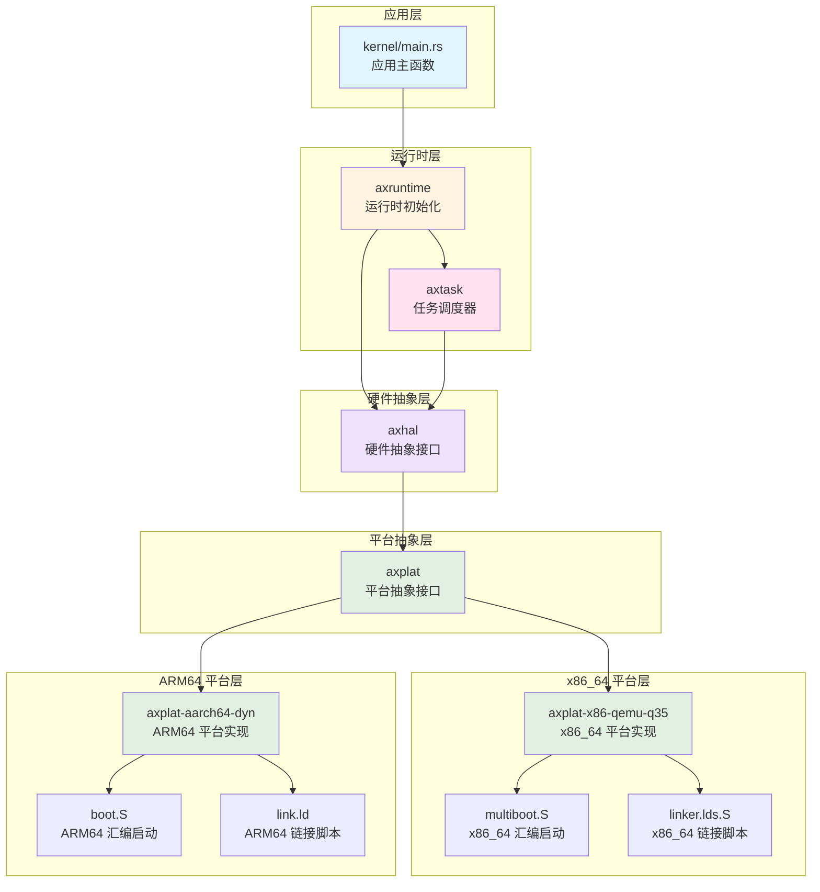
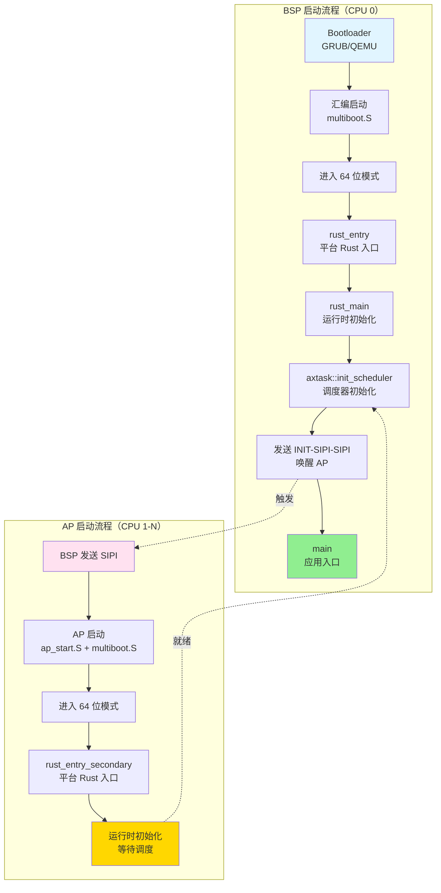
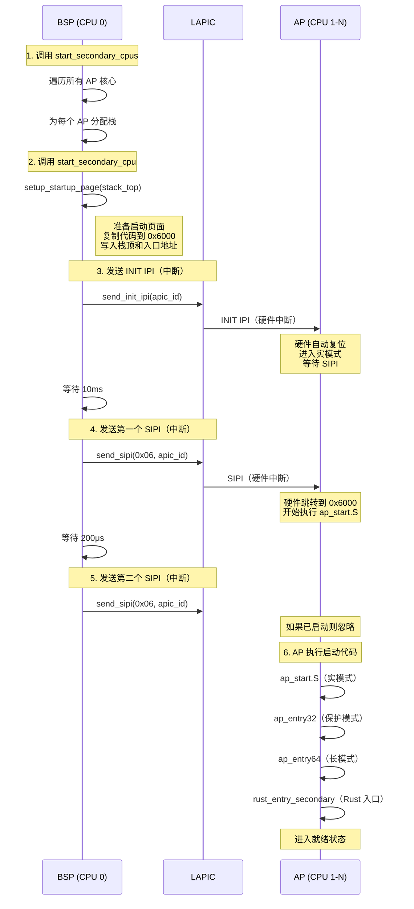
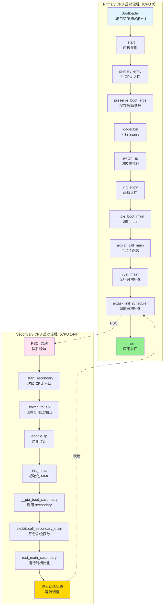
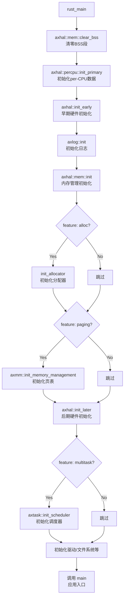
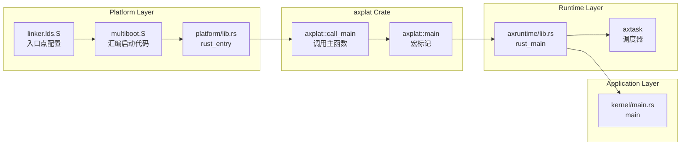
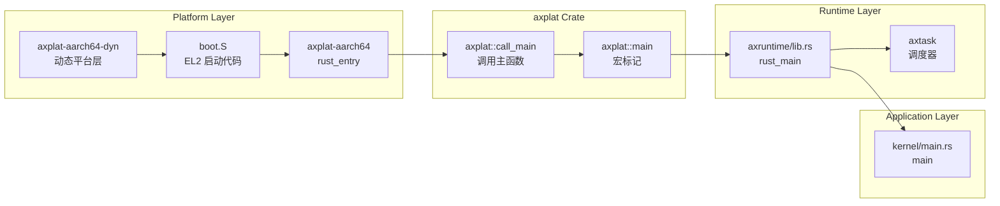

# AxVisor 系统启动与初始化流程分析

本文档详细分析 AxVisor 从系统启动到调度器初始化的完整流程，涵盖 x86_64 和 ARM64 两种主要架构。

---

## 一、整体启动流程

AxVisor 的启动是从 [kernel/src/main.rs](kernel/src/main.rs) 中的 `main()` 函数开始的，然后依次初始化其自己的各个模块。实际上，在进入 `main()` 函数之前，[modules/axruntime/src/lib.rs](modules/axruntime/src/lib.rs) 中的 `rust_main()` 会先执行来准备运行环境。这涉及到一个完整的启动链路，不同架构有显著差异。

### 1.1 模块依赖关系

AxVisor 的启动流程涉及多个层次的模块协作，下图展示了核心模块之间的依赖关系：



### 1.2 应用层

应用层是 AxVisor 的最顶层，负责实现具体的虚拟化业务逻辑，主要实现实现虚拟化管理功能及管理虚拟机生命周期，其入口为 [kernel/src/main.rs](kernel/src/main.rs)，其中会依次初始化各个模块。

```rust
#[unsafe(no_mangle)]
fn main() {
    logo::print_logo();

    info!("Starting virtualization...");
    info!("Hardware support: {:?}", axvm::has_hardware_support());
    hal::enable_virtualization();

    vmm::init();
    vmm::start();

    info!("[OK] Default guest initialized");

    shell::console_init();
}
```

- 初始化虚拟机监控器（VMM）
- 启动客户机操作系统
- 提供用户交互界面（shell）

此时的 AxVisor 已经不在关心底层硬件差异，它依赖运行时层提供的功能：

```rust
use axtask::init_scheduler;  // 任务调度
use axvm::has_hardware_support;  // 虚拟化支持检测
use axvmm::{init, start};  // 虚拟机管理
```

### 1.3 运行时层

运行时层负责提供系统运行的基础设施，包括内存管理、任务调度、硬件抽象等。

**核心模块**：
- **[modules/axruntime](modules/axruntime)**：运行时初始化
    ```rust
    // 运行时入口（modules/axruntime/src/lib.rs）
    #[axplat::main]
    pub fn rust_main(cpu_id: usize, arg: usize) -> ! {
        axhal::mem::clear_bss();           // 清零 BSS 段
        axhal::percpu::init_primary(cpu_id);  // 初始化 per-CPU 数据
        axhal::init_early(cpu_id, arg);    // 早期硬件初始化
        axlog::init();                     // 初始化日志
        axhal::mem::init();                // 内存管理初始化
        axhal::init_later(cpu_id, arg);   // 后期硬件初始化
        
        #[cfg(feature = "multitask")]
        axtask::init_scheduler();          // 初始化调度器（调用 axtask）
        
        unsafe { main() };                 // 调用应用层 main
    }
    ```
  - 实现 `rust_main()` 作为运行时入口
  - 初始化内存管理、日志、驱动等
  - **调用 axtask 初始化调度器**
  - 调用应用层 `main()` 函数
  
- **[tmp/arceos/modules/axtask](tmp/arceos/modules/axtask)**：任务调度器
  - **与 axruntime 同级的独立模块**
  - 实现多任务调度
  - 管理任务运行队列
  - 提供任务创建、切换、销毁接口
  - **依赖 axhal，不依赖 axruntime**

### 1.4 平台抽象层

平台抽象层（axplat）提供跨平台的统一接口，屏蔽不同架构的差异。其通过在构建时根据目标架构选择对应的平台实现，实现依赖注入，解耦平台代码和运行时代码。

**核心模块**：
- **[axplat](modules/axruntime/Cargo.toml)**：平台抽象接口
  - 定义平台无关的 trait（如 `InitIf`、`MemIf`、`TimeIf`）
  - 提供 `#[axplat::main]` 宏实现依赖注入
  - 提供 `axplat::call_main()` 函数调用运行时入口

**平台选择机制**：
```toml
# modules/axruntime/Cargo.toml
# x86_64 平台
[target.'cfg(target_arch = "x86_64")'.dependencies]
axplat-x86_64 = { git = "https://github.com/arceos-org/axplat", tag = "v0.4.0", features = ["irq", "smp", "hv"] }

# ARM64 平台
[target.'cfg(target_arch = "aarch64")'.dependencies]
axplat-aarch64-dyn = { git = "https://github.com/arceos-hypervisor/axplat-aarch64-dyn.git", tag = "v0.4.0", features = ["irq", "smp", "hv"] }
```

### 1.5 平台层

平台层包含具体架构的硬件抽象实现，每个平台都有自己的启动代码、链接脚本和硬件初始化逻辑。

**x86_64 平台**：
- **位置**：[platform/x86-qemu-q35](platform/x86-qemu-q35)
- **核心文件**：
  - `linker.lds.S`：链接器脚本模板
  - `multiboot.S`：汇编启动代码
  - `build.rs`：构建脚本，处理链接器模板
  - `src/lib.rs`：平台 Rust 入口点
  
- **技术特点**：
  - 使用 Multiboot 协议与引导加载器通信
  - 支持 64 位长模式
  - 使用 APIC（本地 APIC + I/O APIC）进行中断管理
  - 通过 LAPIC Timer 提供定时器功能

**ARM64 平台**：
- **位置**：[modules/axplat-aarch64-dyn](modules/axplat-aarch64-dyn)
- **核心文件**：
  - `link.ld`：链接器脚本模板
  - `src/boot.rs`：启动代码（使用 `somehal` crate）
  - `build.rs`：构建脚本，处理链接器模板
  - `src/init.rs`：平台初始化实现
  - `src/mem.rs`：内存管理实现
  - `src/irq/`：中断控制器实现（GICv2/GICv3）
  - `src/time.rs`：定时器实现（ARM Generic Timer）
  
- **技术特点**：
  - 使用设备树（Device Tree）描述硬件配置
  - 在 EL2 特权级运行以支持虚拟化
  - 使用 GIC（Generic Interrupt Controller）进行中断管理
  - 通过 ARM Generic Timer 提供定时器功能
  - 支持 Stage-2 页表用于虚拟机地址转换

### 1.6 依赖调用链

完整的启动调用链如下：

```
应用层: kernel/main.rs::main()
    ↑
运行时层: axruntime::rust_main()
    ├─> axtask::init_scheduler()  (axruntime 调用 axtask)
    ↑
平台抽象层: axplat::call_main()
    ↑
平台层: 
    ├─ x86_64: platform/x86-qemu-q35::rust_entry()
    │          ↑
    │       multiboot.S:_start (汇编入口)
    │
    └─ ARM64: axplat-aarch64-dyn::main()
               ↑
            somehal 提供的启动入口
```

**模块依赖关系**：
- **axruntime** 依赖 **axtask**（通过 `axtask = { workspace = true, optional = true }`）
- **axtask** 不依赖 **axruntime**，它是独立的调度器模块
- **axruntime** 和 **axtask** 都依赖 **axhal**（硬件抽象层）
- **axruntime** 通过 `#[cfg(feature = "multitask")]` 条件编译来决定是否调用 axtask

---

## 二、x86_64 平台启动流程

对于 x86_64 平台，当前使用支持 Multiboot 协议的 GRUB/QEMU 引导加载器来启动。

### 2.1 启动流程图

x86_64 平台的启动流程分为 BSP（Bootstrap Processor）和 AP（Application Processor）两条路径：



**流程说明**：

1. **BSP 启动流程**（左侧蓝色）：
   - 由引导加载器启动，执行汇编启动代码
   - 进入 64 位模式后调用 `rust_entry`
   - 完成运行时初始化后，初始化调度器
   - 通过 APIC 发送 INIT-SIPI-SIPI 序列唤醒 AP
   - 进入应用主函数

2. **AP 启动流程**（右侧粉色）：
   - 由 BSP 通过 SIPI 中断唤醒
   - 执行启动代码（`ap_start.S` + `multiboot.S`）
   - 进入 64 位模式后调用 `rust_entry_secondary`
   - 完成运行时初始化后进入就绪状态

3. **汇合点**：
   - BSP 和 AP 最终都进入运行时环境
   - AP 就绪后，调度器可以调度任务到所有 CPU
   - 调度器开始工作时，所有 CPU 都可以参与任务调度

### 2.2 程序入口点

链接器脚本定义了程序的内存布局和入口点。x86_64 平台使用模板化的链接器脚本，通过构建系统动态生成最终链接脚本文件。关于链接器脚本的模板设计、构建脚本处理流程、内存布局等详细信息，请参阅 [构建文档 - 链接器脚本处理](00_AXVISOR_BUILD.md#3236-链接器脚本处理) 章节。

**核心要点**：

1. **入口点定义**：链接器脚本通过 `ENTRY(_start)` 指令定义程序入口点为 `_start` 符号
2. **模板机制**：使用占位符（如 `%ARCH%`、`%KERNEL_BASE%`、`%SMP%`）实现动态配置
3. **构建时处理**：构建脚本 `build.rs` 在编译时读取环境变量并替换占位符，生成最终的 `link.x` 文件
4. **内存布局**：定义了代码段、数据段、BSS 段等在内存中的位置，所有段按 4KB 页对齐

**关键文件**：
- **模板文件**：[platform/x86-qemu-q35/linker.lds.S](platform/x86-qemu-q35/linker.lds.S)
- **构建脚本**：[platform/x86-qemu-q35/build.rs](platform/x86-qemu-q35/build.rs)
- **生成文件**：`target/.../build/axplat-x86-q35-xxxxx/out/link.x`

### 2.3 boot.rs 与 multiboot.S

boot.rs 文件是整个 x86_64 平台的程序入口文件，其中通过 `global_asm!` 宏将启动的 `multiboot.S` 汇编文件以及其自身定义的一些寄存器值整合到一起，实际处理启动过程的就是 `multiboot.S`。

```rust
use x86_64::registers::control::{Cr0Flags, Cr4Flags};
use x86_64::registers::model_specific::EferFlags;

// CR0: 保护模式 + 协处理器监控 + 数值错误 + 写保护 + 分页
const CR0: u64 = Cr0Flags::PROTECTED_MODE_ENABLE.bits()    // PE (bit 0): 启用保护模式
    | Cr0Flags::MONITOR_COPROCESSOR.bits()                 // MP (bit 1): 监控协处理器
    | Cr0Flags::NUMERIC_ERROR.bits()                       // NE (bit 5): 数值错误
    | Cr0Flags::WRITE_PROTECT.bits()                       // WP (bit 16): 写保护
    | Cr0Flags::PAGING.bits();                             // PG (bit 31): 启用分页

// CR4: 物理地址扩展 + 页表全局 + [可选] FXSR 保存
const CR4: u64 = Cr4Flags::PHYSICAL_ADDRESS_EXTENSION.bits() // PAE (bit 5): 物理地址扩展
    | Cr4Flags::PAGE_GLOBAL.bits()                          // PGE (bit 7): 页表全局
    | if cfg!(feature = "fp-simd") {
        Cr4Flags::OSFXSR.bits() | Cr4Flags::OSXMMEXCPT_ENABLE.bits()  // 条件编译
    } else {
        0
    };

// EFER: 长模式使能 + 不执行使能
const EFER: u64 = EferFlags::LONG_MODE_ENABLE.bits()    // LME (bit 8): 启用 x86-64 长模式
    | EferFlags::NO_EXECUTE_ENABLE.bits();               // NXE (bit 11): 启用不执行位

global_asm!(
    include_str!("multiboot.S"),
    cr0 = const CR0,        // 将 CR0 常量传递给汇编
    cr4 = const CR4,        // 将 CR4 常量传递给汇编
    efer = const EFER,      // 将 EFER 常量传递给汇编
    // ... 其他参数
);
```

`global_asm!` 是 Rust 提供的内联汇编宏，它允许在 Rust 代码中嵌入全局汇编代码。其工作流程如下：

1. **编译时求值**：Rust 编译器在编译时计算 `const CR0`、`const CR4`、`const EFER` 的值
2. **参数传递**：通过 `cr0 = const CR0` 这样的语法，将 Rust 常量传递给汇编代码
3. **占位符替换**：汇编代码中使用 `{cr0}`、`{cr4}`、`{efer}` 作为占位符
4. **文本替换**：编译器将汇编代码中的占位符替换为实际的常量值
5. **汇编编译**：替换后的汇编代码被传递给汇编器（如 GAS）进行编译

以 multiboot.S 中的使用为例，multiboot.S 中使用花括号 `{}` 包围的占位符来引用这些常量：

```assembly
# 在 ENTRY32_COMMON 宏中
.macro ENTRY32_COMMON
    # ... 其他代码 ...

    # set PAE, PGE bit in CR4
    mov     eax, {cr4}      # {cr4} 会被替换为 CR0 的实际值
    mov     cr4, eax

    # ... 其他代码 ...

    # set LME, NXE bit in IA32_EFER
    mov     ecx, {efer_msr} # {efer_msr} 会被替换为 IA32_EFER 的地址
    mov     edx, 0
    mov     eax, {efer}     # {efer} 会被替换为 EFER 的实际值
    wrmsr

    # set protected mode, write protect, paging bit in CR0
    mov     eax, {cr0}      # {cr0} 会被替换为 CR0 的实际值
    mov     cr0, eax
.endm
```
在执行编译时执行替换，假设编译时的实际值为：
- `CR0 = 0x80010031`（二进制：10000000000000010000000000110001）
- `CR4 = 0x00000060`（二进制：00000000000000000000000001100000）
- `EFER = 0x00001001`（二进制：00000000000000000000000100000001）

编译器会将汇编代码中的占位符替换为实际值：

```assembly
# 替换前（原始汇编代码）
mov     eax, {cr0}
mov     cr0, eax

# 替换后（编译后的汇编代码）
mov     eax, 0x80010031
mov     cr0, eax
```

**寄存器详细说明**：

1. **CR0 寄存器**（Control Register 0）
   - **PROTECTED_MODE_ENABLE (bit 0)**：启用保护模式，允许使用分段和分页机制
   - **MONITOR_COPROCESSOR (bit 1)**：监控协处理器，与 `TS` 标志配合使用
   - **NUMERIC_ERROR (bit 5)**：启用原生 FPU 错误报告，而非 PC 模拟
   - **WRITE_PROTECT (bit 16)**：写保护，禁止在特权级 3 向只读页面写入
   - **PAGING (bit 31)**：启用分页，必须与 PAE（CR4）和 LME（EFER）配合使用

2. **CR4 寄存器**（Control Register 4）
   - **PHYSICAL_ADDRESS_EXTENSION (bit 5)**：启用 PAE，支持 64 位物理地址（最大 64GB）
   - **PAGE_GLOBAL (bit 7)**：启用全局页表项，提高 TLB 效率
   - **OSFXSR (bit 9)**：条件编译，启用 FXSAVE/FXRSTOR 指令（`fp-simd` feature）
   - **OSXMMEXCPT_ENABLE (bit 10)**：条件编译，启用 SIMD 浮点异常（`fp-simd` feature）

3. **EFER 寄存器**（Extended Feature Enable Register）
   - **LONG_MODE_ENABLE (bit 8)**：启用 x86-64 长模式，必须先启用 PAE（CR4）和分页（CR0）
   - **NO_EXECUTE_ENABLE (bit 11)**：启用不执行位，允许标记页面为不可执行（安全特性）

根据 [2.2 链接器入口点配置](#22-链接器入口点配置) 章节的介绍，链接器脚本通过 `ENTRY(_start)` 指令定义了程序的入口点为 `_start` 符号。因此，[platform/x86-qemu-q35/src/multiboot.S](platform/x86-qemu-q35/src/multiboot.S) 中的 `_start` 是整个启动的第一条指令执行位置，也是 BSP 启动流程的真正起点。

```assembly
# Bootstrapping from 32-bit with the Multiboot specification.
.section .text.boot
.code32
.global _start
_start:
    mov     edi, eax        # arg1: magic = 0x2BADB002
    mov     esi, ebx        # arg2: multiboot info pointer
    jmp     bsp_entry32

# Multiboot 头部（引导加载器识别）
.balign 4
.type multiboot_header, STT_OBJECT
multiboot_header:
    .int    0x1BADB002                      # magic
    .int    0x00010002                      # flags (mem info + addr fields)
    .int    -(0x1BADB002 + 0x00010002)      # checksum
    .int    multiboot_header - offset       # header_addr
    .int    _skernel - offset               # load_addr
    .int    _edata - offset                 # load_end_addr
    .int    _ebss - offset                  # bss_end_addr
    .int    _start - offset                 # entry_addr
```

1. **CPU 上电后**，引导加载器（GRUB/QEMU）将内核镜像加载到内存
2. **跳转到 `_start`**：CPU 开始执行 `multiboot.S` 中的 `_start` 标签处的代码
3. **此时 CPU 处于 32 位保护模式**，已经由引导加载器完成了基本的模式切换

#### 2.4.1 _start

这是 CPU 上电后执行的第一条指令，也是整个 AxVisor 系统的真正起点。引导加载器（GRUB/QEMU）根据 Multiboot 协议将参数放入寄存器

```assembly
_start:
    mov     edi, eax        # 保存 Multiboot 魔数（0x2BADB002）
    mov     esi, ebx        # 保存 Multiboot 信息结构体指针
    jmp     bsp_entry32     # 跳转到 BSP 32 位入口
```

1. CPU 从 `_start` 开始执行，此时处于 32 位保护模式
2. 将 `EAX` 中的 Multiboot 魔数（0x2BADB002）保存到 `EDI` 寄存器
3. 将 `EBX` 中的 Multiboot 信息结构体指针保存到 `ESI` 寄存器
4. 直接跳转到 `bsp_entry32`，避免使用可能未初始化的栈

#### 2.4.2 bsp_entry32

bsp_entry32 完成 32 位保护模式的初始化，为切换到 64 位长模式做准备。

```assembly
bsp_entry32:
    lgdt    [.Ltmp_gdt_desc - offset]         # 加载临时 GDT
    ENTRY32_COMMON                            # 执行通用初始化
    ljmp    0x10, offset bsp_entry64 - offset # 远跳转到 64 位代码段
```

1. **加载临时 GDT**：使用 `lgdt` 指令加载临时全局描述符表（GDT），为后续的模式切换做准备
2. **调用通用初始化宏**：执行 `ENTRY32_COMMON` 宏，完成通用的硬件初始化（详见下一节）
3. **远跳转到 64 位代码段**：通过 `ljmp 0x10` 远跳转指令切换到 64 位代码段（选择子 0x10）

#### 2.4.3 ENTRY32_COMMON

ENTRY32_COMMON 宏是通用硬件初始化，BSP 和 AP 都会调用。它按顺序完成 5 个关键步骤，为从 32 位保护模式切换到 64 位长模式做好准备。

```assembly
.macro ENTRY32_COMMON
    # 1. 设置数据段选择子（0x18 = 数据段选择子）
    mov     ax, 0x18
    mov     ss, ax
    mov     ds, ax
    mov     es, ax
    mov     fs, ax
    mov     gs, ax

    # 2. 设置 CR4 寄存器（PAE + PGE）
    mov     eax, {cr4}
    mov     cr4, eax

    # 3. 加载临时页表（PML4）
    lea     eax, [.Ltmp_pml4 - {offset}]
    mov     cr3, eax

    # 4. 设置 IA32_EFER MSR（LME + NXE）
    mov     ecx, {efer_msr}
    mov     edx, 0
    mov     eax, {efer}
    wrmsr

    # 5. 设置 CR0 寄存器（保护模式 + 分页）
    mov     eax, {cr0}
    mov     cr0, eax
.endm
```

**步骤 1：设置数据段选择子**
- 将所有数据段寄存器（SS、DS、ES、FS、GS）设置为 0x18
- 0x18 指向 GDT 中的数据段描述符
- 确保所有段寄存器指向正确的数据段

**步骤 2：配置 CR4 寄存器**
- 将 `cr4_value`（由 boot.rs 中的 CR4 常量提供）加载到 CR4 寄存器
- 启用 PAE（Physical Address Extension）：支持 64 位物理地址（最大 64GB）
- 启用 PGE（Page Global Enable）：启用全局页表项，提高 TLB 效率
- 如果启用了 `fp-simd` feature，还会启用 FXSR 和 OSXMMEXCPT_ENABLE 位

**步骤 3：加载临时页表**
- 计算临时页表（PML4）的地址并加载到 CR3 寄存器
- 这个页表同时映射低地址空间（0x0000_0000_0000）和高地址空间（0xffff_8000_0000_0000）
- 使用 1GB 大页减少页表层级（详见 2.3.1.5 节）

**步骤 4：配置 IA32_EFER MSR**
- 将 `efer_msr`（IA32_EFER MSR 地址 = 0xC0000080）加载到 ECX
- 将 `efer_value`（由 boot.rs 中的 EFER 常量提供）加载到 EAX
- 使用 `wrmsr` 指令写入 IA32_EFER MSR
- 启用 LME（Long Mode Enable）：启用 x86-64 长模式
- 启用 NXE（No-Execute Enable）：启用不执行位（安全特性）

**步骤 5：配置 CR0 寄存器**
- 将 `cr0_value`（由 boot.rs 中的 CR0 常量提供）加载到 CR0 寄存器
- 启用 PE（Protection Enable）：启用保护模式
- 启用 WP（Write Protect）：启用写保护
- 启用 PG（Paging）：启用分页
- **注意**：设置 PG 位后，CPU 立即进入分页模式，此时页表必须已经配置好

#### 2.4.4 bsp_entry64

bsp_entry64 64 位长模式入口，此时 CPU 已经进入 64 位长模式，此阶段设置栈指针并调用 Rust 入口函数。

```assembly
bsp_entry64:
    ENTRY64_COMMON                    # 清零段选择子
    movabs  rsp, offset {boot_stack}  # 加载栈地址
    add     rsp, {boot_stack_size}    # 设置栈顶
    movabs  rax, offset {entry}       # 加载 Rust 入口点
    call    rax                        # 调用 rust_entry(magic, mbi)
    jmp     .Lhlt                      # 如果返回则停机
```

1. **清零段选择子**：调用 `ENTRY64_COMMON` 宏清零所有段选择子（64 位模式下不再使用段选择子）
2. **设置栈指针**：
   - 使用 `movabs` 加载 Boot Stack 的地址到 RSP
   - 加上栈大小，使 RSP 指向栈顶
3. **调用 Rust 入口**：
   - 使用 `movabs` 加载 `rust_entry` 函数地址到 RAX
   - 使用 `call rax` 调用该函数
   - 传递两个参数：`EDI`（magic）和 `ESI`（mbi）
4. **停机保护**：如果 `rust_entry` 返回（理论上不应该发生），跳转到 `.Lhlt` 停机

#### 2.4.5 临时页表结构

临时页表在 `ENTRY32_COMMON` 宏中被加载到 CR3 寄存器，它使用 1GB 大页同时映射低地址空间和高地址空间。

```assembly
.balign 4096
.Ltmp_pml4:
    # 低 512GB：0x0000_0000_0000 ~ 0x007f_ffff_ffff
    .quad .Ltmp_pdpt_low - {offset} + 0x3   # PRESENT | WRITABLE
    .zero 8 * 255
    # 高 512GB：0xffff_8000_0000_0000 ~ 0xffff_807f_ffff_ffff
    .quad .Ltmp_pdpt_high - {offset} + 0x3  # PRESENT | WRITABLE
    .zero 8 * 255

.Ltmp_pdpt_low:
.set i, 0
.rept 512
    .quad 0x40000000 * i | 0x83  # 1GB 页表项
    .set i, i + 1
.endr

.Ltmp_pdpt_high:
.set i, 0
.rept 512
    .quad 0x40000000 * i | 0x83  # 1GB 页表项
    .set i, i + 1
.endr
```

- **PML4（Page Map Level 4）**：第四级页表
  - 第 0 项：指向低地址空间的 PDPT（.Ltmp_pdpt_low）
  - 第 256 项：指向高地址空间的 PDPT（.Ltmp_pdpt_high）
  - 其他项：清零

- **PDPT（Page Directory Pointer Table）**：第三级页表
  - 使用 1GB 大页（页表项标志 0x83 = PRESENT | WRITABLE | HUGE_PAGE）
  - 每个页表项映射 1GB 地址空间
  - 512 个页表项 × 1GB = 512GB

**映射关系**：

```
低地址空间：
  0x0000_0000_0000 → 0x007f_ffff_ffff (512 GB)
  映射到物理内存：0x0000_0000_0000 → 0x007f_ffff_ffff

高地址空间：
  0xffff_8000_0000_0000 → 0xffff_807f_ffff_ffff (512 GB)
  映射到物理内存：0x0000_0000_0000 → 0x007f_ffff_ffff
```

### 2.4 mp.rs 与 ap_start.S

[platform/x86-qemu-q35/src/mp.rs](platform/x86-qemu-q35/src/mp.rs) 负责处理 AP（Application Processor）的启动。mp.rs 中通过 `global_asm!` 宏将 `ap_start.S` 嵌入其中，实际处理启动过程的就是 `ap_start.S`。

```rust
core::arch::global_asm!(
    include_str!("ap_start.S"),
    start_page_paddr = const START_PAGE_PADDR.as_usize(),  // 0x6000
);
```

当 BSP 确保主 CPU 的运行环境已经准备好后，就会在**调度器初始化之后、中断初始化之前**调用 `start_secondary_cpus()` 函数依次唤醒每个 AP，确保它们进入就绪状态。

```
系统启动流程：
  1. BSP 完成早期硬件初始化（axhal::init_early）
  2. BSP 初始化内存管理（axhal::mem::init）
  3. BSP 初始化页表（axmm::init_memory_management）（如果启用 paging 功能）
  4. BSP 初始化驱动（axhal::init_later）
  5. BSP 初始化调度器（axtask::init_scheduler）← 此时调用 start_secondary_cpus（如果启用 multitask 功能）
  6. BSP 初始化中断处理（init_interrupt）（如果启用 irq 功能）

调用链：
axruntime/src/lib.rs:rust_main()
  └─> axruntime/src/mp.rs:start_secondary_cpus()
       └─> axhal::power::cpu_boot()  [trait调用]
            └─> platform/x86-qemu-q35/src/power.rs:cpu_boot()
                 └─> platform/x86-qemu-q35/src/mp.rs:start_secondary_cpu()
                      └─> setup_startup_page()  ← 在这里调用
```

1. **运行时入口**：`axruntime/src/lib.rs`
   ```rust
   #[cfg(feature = "smp")]
   self::mp::start_secondary_cpus(cpu_id);
   ```
   - 在主 CPU 完成基本初始化后调用
   - 启动所有次级 CPU 核心

2. **启动所有次级 CPU**：`axruntime/src/mp.rs`
   ```rust
   pub fn start_secondary_cpus(primary_cpu_id: usize) {
       for i in 0..cpu_count {
           if i != primary_cpu_id {
               let stack_top = virt_to_phys(VirtAddr::from(unsafe {
                   SECONDARY_BOOT_STACK[logic_cpu_id].as_ptr_range().end as usize
               }));
               axhal::power::cpu_boot(i, stack_top.as_usize());
           }
       }
   }
   ```
   - 遍历所有 CPU 核心（除主 CPU 外）
   - 为每个核心分配栈空间
   - 调用平台接口启动每个 CPU

3. **平台电源管理接口**：`platform/x86-qemu-q35/src/power.rs`
   ```rust
   #[impl_plat_interface]
   impl PowerIf for PowerImpl {
       #[cfg(feature = "smp")]
       fn cpu_boot(cpu_id: usize, stack_top_paddr: usize) {
           use axplat::mem::pa;
           crate::mp::start_secondary_cpu(cpu_id, pa!(stack_top_paddr))
       }
   }
   ```
   - 实现 `PowerIf` trait 的 `cpu_boot` 方法
   - 转调用多处理器启动函数

4. **启动单个次级 CPU**：`platform/x86-qemu-q35/src/mp.rs:36`
   ```rust
   pub fn start_secondary_cpu(apic_id: usize, stack_top: PhysAddr) {
       // 1. 设置启动页面（复制代码并设置参数）
       unsafe { setup_startup_page(stack_top) };

       let apic_id = super::apic::raw_apic_id(apic_id as u8);
       let lapic = super::apic::local_apic();

       // 2. INIT-SIPI-SIPI 序列（Intel SDM Vol 3C, Section 8.4.4）
       unsafe { lapic.send_init_ipi(apic_id) };      // INIT IPI
       busy_wait(Duration::from_millis(10));          // 等待 10ms
       unsafe { lapic.send_sipi(START_PAGE_IDX, apic_id) };  // SIPI #1
       busy_wait(Duration::from_micros(200));         // 等待 200μs
       unsafe { lapic.send_sipi(START_PAGE_IDX, apic_id) };  // SIPI #2
   }
   ```
   - **在这里调用 `setup_startup_page`**，设置启动页
   - 然后发送 INIT-SIPI-SIPI 序列唤醒目标 CPU

#### 2.4.1 setup_startup_page

在 AP 启动之前，BSP 必须先为 AP 准备好启动页面。而这个过程是由 BSP 的通过 `start_secondary_cpu()` 中调用的 `setup_startup_page` 函数完成。此函数在物理地址 0x6000 处准备 AP 的启动页面。

```rust
const START_PAGE_IDX: u8 = 6;
const START_PAGE_PADDR: PhysAddr = pa!(0x6000);  // 第 6 页

unsafe fn setup_startup_page(stack_top: PhysAddr) {
    unsafe extern {
        fn ap_entry32();
        fn ap_start();
        fn ap_end();
    }
    const U64_PER_PAGE: usize = 512;  // 4096 / 8

    // 1. 将 ap_start.S 的二进制代码复制到 0x6000
    let start_page_ptr = phys_to_virt(START_PAGE_PADDR).as_mut_ptr() as *mut u64;
    core::ptr::copy_nonoverlapping(
        ap_start as *const u64,
        start_page_ptr,
        (ap_end as usize - ap_start as usize) / 8,
    );

    // 2. 在页面末尾写入栈顶和入口地址
    let start_page = core::slice::from_raw_parts_mut(start_page_ptr, U64_PER_PAGE);
    start_page[U64_PER_PAGE - 2] = stack_top.as_usize() as u64;      // 0x6ff0: 栈顶
    start_page[U64_PER_PAGE - 1] = ap_entry32 as usize as u64;       // 0x6ff8: 入口地址
}
```

**步骤 1：复制 ap_start.S 代码**
- 将 `ap_start` 符号到 `ap_end` 符号之间的二进制代码复制到物理地址 0x6000
- 使用 `core::ptr::copy_nonoverlapping` 确保内存复制的安全性
- AP 启动后会从 0x6000 开始执行这些代码

**步骤 2：写入启动参数**
- 在 0x6ff0 处写入栈顶指针（`stack_top`）
- 在 0x6ff8 处写入入口地址（`ap_entry32`，位于 multiboot.S 中）
- AP 的 `ap_start32` 代码会读取这些参数

由于 Intel MP 规范的要求，AP 启动时必须从低 64KB 地址空间内的 4KB 边界开始，AP 从实模式启动，需要专门的代码切换到保护模式，进入保护模式后，AP 就可以与 BSP 共享 multiboot.S 中的通用初始化代码。

```
物理地址 0x6000（4096 字节）：
┌─────────────────────────────────────────────────────┐
│ 0x6000 - 0x6fef: ap_start.S 的二进制代码            │
│              - ap_start（实模式入口）               │
│              - 临时 GDT                            │
│              - ap_start32（32 位入口）             │
├─────────────────────────────────────────────────────┤
│ 0x6ff0: 栈顶指针（8 字节）                        │
├─────────────────────────────────────────────────────┤
│ 0x6ff8: 入口地址 ap_entry32（8 字节）              │
└─────────────────────────────────────────────────────┘
```

#### 2.4.2 INIT-SIPI-SIPI

INIT-SIPI-SIPI 是 Intel x86_64 多处理器规范中定义的**处理器间中断（Inter-Processor Interrupt, IPI）序列**，用于由 BSP（Bootstrap Processor，引导处理器）唤醒 AP（Application Processor，应用处理器）。

- **INIT IPI**：初始化中断，使目标 AP 复位到实模式
- **SIPI**（Startup IPI）：启动中断，指定 AP 的启动地址
- **IPI**：处理器间中断，是通过 APIC（Advanced Programmable Interrupt Controller）在 CPU 之间发送的特殊中断

INIT-SIPI-SIPI 是 BSP **主动发送**的中断，不是 AP 触发的，AP 收到这些中断后，会执行相应的硬件响应动作（复位、跳转到指定地址），这与普通的外部中断不同，IPI 是专门用于 CPU 间通信的机制。

```
┌─────────────────────────────────────────────────────────────────┐
│ BSP 侧（CPU 0）                                                  │
└─────────────────────────────────────────────────────────────────┘
  1. BSP 完成自身初始化
  2. BSP 调用 start_secondary_cpus()
     └─> 遍历所有 AP 核心
         └─> 为每个 AP 分配栈空间
             └─> 调用 start_secondary_cpu(apic_id, stack_top)
                 ├─> setup_startup_page(stack_top)
                 │   ├─> 将 ap_start.S 代码复制到 0x6000
                 │   └─> 在 0x6ff8 写入 ap_entry32 地址（multiboot.S 中）
                 └─> 发送 INIT-SIPI-SIPI 序列
                     ├─> INIT IPI → AP 复位到实模式
                     └─> SIPI (向量 0x06) → AP 跳转到 0x6000

                         ↓ (硬件中断触发)

┌─────────────────────────────────────────────────────────────────┐
│ AP 侧（CPU 1-N）                                                │
└─────────────────────────────────────────────────────────────────┘
  3. AP 收到 SIPI，硬件自动跳转到 0x6000
     └─> 进入 ap_start.S（实模式）
         ├─> ap_start: 清空段寄存器、加载 GDT
         ├─> 设置 CR0.PE（进入保护模式）
         └─> 远跳转到 ap_start32

     └─> ap_start32（32 位保护模式）
         ├─> 从 0x6ff0 读取栈指针
         ├─> 从 0x6ff8 读取入口地址（ap_entry32）
         └─> 跳转到 multiboot.S 的 ap_entry32

         ↓ (代码切换：ap_start.S → multiboot.S)

     └─> 进入 multiboot.S（保护模式）
         └─> ap_entry32
             ├─> ENTRY32_COMMON（与 BSP 相同的初始化）
             └─> 远跳转到 ap_entry64

     └─> ap_entry64（64 位长模式）
         ├─> ENTRY64_COMMON（清零段选择子）
         ├─> 调整栈指针到高地址空间
         └─> 调用 rust_entry_secondary

         ↓ (进入 Rust 运行环境)

     └─> rust_entry_secondary（Rust 入口）
         └─> rust_main_secondary（运行时初始化）
             ├─> axhal::percpu::init_secondary
             ├─> axhal::init_early_secondary
             ├─> axmm::init_memory_management_secondary
             ├─> axtask::init_scheduler_secondary
             └─> 进入就绪状态，等待调度
```

**步骤 1：设置启动页面**
- 调用 `setup_startup_page(stack_top)` 准备启动页面
- 将 AP 的栈顶指针和入口地址写入 0x6ff0 和 0x6ff8

**步骤 2：发送 INIT IPI（BSP → AP）**
- BSP 通过 LAPIC 向目标 AP 发送 INIT IPI
- INIT IPI 是一个**处理器间中断**，使目标 AP 复位到实模式
- AP 收到 INIT IPI 后，硬件会自动执行复位操作，进入等待 SIPI 的状态
- BSP 等待 10ms，确保 AP 完成复位

**步骤 3：发送第一个 SIPI（BSP → AP）**
- BSP 通过 LAPIC 向目标 AP 发送 SIPI（Startup IPI）
- SIPI 也是一个**处理器间中断**，包含 8 位启动向量
- 启动向量 = 0x06，指定 AP 应该跳转到物理地址 0x6000
- AP 收到 SIPI 后，硬件会自动跳转到指定地址（0x6000）开始执行
- BSP 等待 200μs，给 AP 时间响应

**步骤 4：发送第二个 SIPI（BSP → AP）**
- BSP 发送第二个 SIPI 确保可靠启动
- 根据 Intel SDM，某些情况下（如总线延迟）需要两个 SIPI
- 如果 AP 已经响应第一个 SIPI，第二个 SIPI 会被忽略

**中断响应流程（AP 侧）**：
1. AP 处于等待 SIPI 状态（未初始化）
2. 收到 INIT IPI → 硬件自动复位到实模式
3. 收到 SIPI → 硬件自动跳转到 0x6000
4. AP 从 0x6000 开始执行启动代码

完整流程图：



#### 2.4.3 ap_start

AP 收到 SIPI 后，硬件自动跳转到物理地址 0x6000，开始执行 `ap_start.S` 的代码。此时 AP 处于实模式（16 位模式），这是 AP 启动的第一段代码，负责从实模式切换到保护模式。

```assembly
# Boot application processors into the protected mode.
# AP 必须从 4KB 边界开始，且位于低 64KB 地址空间内

.equ pa_ap_start32, ap_start32 - ap_start + 0x6000
.equ pa_ap_gdt, .Lap_tmp_gdt - ap_start + 0x6000
.equ pa_ap_gdt_desc, .Lap_tmp_gdt_desc - ap_start + 0x6000

.equ stack_ptr, 0x6000 + 0xff0   # 栈指针位置
.equ entry_ptr, 0x6000 + 0xff8   # 入口地址位置

# 0x6000: AP 启动入口（实模式）
.section .text
.code16
.p2align 12
.global ap_start
ap_start:
    cli                     # 关中断
    wbinvd                  # 回写并使缓存失效

    # 清空所有段寄存器
    xor     ax, ax
    mov     ds, ax
    mov     es, ax
    mov     ss, ax
    mov     fs, ax
    mov     gs, ax

    # 加载 64 位 GDT
    lgdt    [pa_ap_gdt_desc]

    # 设置 CR0.PE 位（进入保护模式）
    mov     eax, cr0
    or      eax, (1 << 0)
    mov     cr0, eax

    # 远跳转到 32 位代码段（0x08 = 32 位代码段选择子）
    ljmp    0x8, offset pa_ap_start32
```

**步骤 1：环境初始化**
- 关中断（`cli`）：防止中断干扰启动过程
- 回写并使缓存失效（`wbinvd`）：确保缓存一致性

**步骤 2：清空段寄存器**
- 将所有段寄存器（DS、ES、SS、FS、GS）清零
- 实模式下段寄存器表示段地址，清零后指向地址 0

**步骤 3：加载 GDT**
- 加载临时 GDT（全局描述符表）
- GDT 包含 32 位代码段、64 位代码段和数据段的描述符
- GDT 的物理地址在 0x6000 + 偏移

**步骤 4：进入保护模式**
- 设置 CR0 寄存器的 PE 位（bit 0）
- PE = 1 表示启用保护模式

**步骤 5：远跳转到 32 位代码**
- 使用 `ljmp 0x8` 远跳转到 `ap_start32`
- 0x08 是 32 位代码段选择子
- 同时更新 CS 段寄存器和指令指针

#### 2.4.4 ap_start32

远跳转后，AP 进入 32 位保护模式，开始执行 `ap_start32` 代码。此时 AP 仍然在 ap_start.S 中，但已经切换到 32 位模式。此阶段负责读取启动参数并跳转到 multiboot.S 中的 `ap_entry32`。

```assembly
# 32 位保护模式入口
.code32
ap_start32:
    mov     esp, [stack_ptr]    # 从 0x6ff0 读取栈指针
    mov     eax, [entry_ptr]    # 从 0x6ff8 读取入口地址
    jmp     eax                 # 跳转到 multiboot.S 的 ap_entry32

# 临时 GDT（与 multiboot.S 相同）
.balign 8
.Lap_tmp_gdt_desc:
    .short .Lap_tmp_gdt_end - .Lap_tmp_gdt - 1
    .long pa_ap_gdt

.balign 16
.Lap_tmp_gdt:
    .quad 0x0000000000000000    # 0x00: null
    .quad 0x00cf9b000000ffff    # 0x08: 32 位代码段
    .quad 0x00af9b000000ffff    # 0x10: 64 位代码段
    .quad 0x00cf93000000ffff    # 0x18: 数据段
.Lap_tmp_gdt_end:
```

**步骤 1：读取栈指针**
- 从 0x6ff0 读取栈顶指针
- 这个栈指针是 BSP 在 `setup_startup_page` 中设置的
- 将栈指针加载到 ESP 寄存器

**步骤 2：读取入口地址**
- 从 0x6ff8 读取入口地址
- 这个地址是 `ap_entry32`，位于 multiboot.S 中
- 将入口地址加载到 EAX 寄存器

**步骤 3：跳转到 multiboot.S**
- 使用 `jmp eax` 跳转到 `ap_entry32`
- 此时控制权从 ap_start.S 转移到 multiboot.S
- AP 开始执行 multiboot.S 中的代码

**关键技术点**：

- **参数传递**：通过固定内存位置传递参数（0x6ff0 和 0x6ff8）
- **代码切换**：从 ap_start.S 跳转到 multiboot.S
- **栈设置**：在跳转之前设置好栈指针

#### 2.4.5 ap_entry32

AP 从 ap_start.S 的 `ap_start32` 跳转到 `multiboot.S` 的 `ap_entry32`。这是 AP 启动过程中的关键切换点：

```
ap_start.S (ap_start32) → multiboot.S (ap_entry32)
  读取 0x6ff8            跳转到入口地址
  获取 ap_entry32        执行通用初始化
```

此时 AP 已经进入保护模式，与 BSP 一样，可以共享 multiboot.S 中的通用初始化代码。

```assembly
# 32 位入口（由 ap_start.S 跳转而来）
.code32
.global ap_entry32
ap_entry32:
    ENTRY32_COMMON                            # 执行通用初始化（与 BSP 相同）
    ljmp    0x10, offset ap_entry64 - offset  # 远跳转到 64 位代码段
```

**步骤 1：执行通用初始化**
- 调用 `ENTRY32_COMMON` 宏
- 这个宏与 BSP 使用的完全相同
- 完成设置段选择子、配置寄存器、加载页表等操作

**步骤 2：远跳转到 64 位模式**
- 使用 `ljmp 0x10` 远跳转到 `ap_entry64`
- 0x10 是 64 位代码段选择子
- 同时切换到 64 位长模式

#### 2.4.6 ap_entry64

AP 进入 64 位长模式后，执行 `ap_entry64` 代码，最终调用 Rust 入口函数。

```assembly
# 64 位入口
.code64
ap_entry64:
    ENTRY64_COMMON                    # 清零段选择子
    mov     rax, offset               # 加载虚拟地址偏移
    add     rsp, rax                  # 调整栈指针
    mov     rdi, mb_magic             # 传递 Multiboot 魔数
    movabs  rax, offset rust_entry_secondary
    call    rax                        # 调用 rust_entry_secondary
    jmp     .Lhlt
```

**步骤 1：清零段选择子**
- 调用 `ENTRY64_COMMON` 宏清零所有段选择子
- 64 位模式下不再使用段选择子

**步骤 2：调整栈指针**
- 加载虚拟地址偏移到 RAX
- 将虚拟地址偏移加到 RSP
- 调整栈指针到高地址空间

**步骤 3：传递参数并调用 Rust 入口**
- 将 Multiboot 魔数加载到 RDI
- 加载 `rust_entry_secondary` 函数地址到 RAX
- 使用 `call rax` 调用该函数

**步骤 4：停机保护**
- 如果 `rust_entry_secondary` 返回，跳转到 `.Lhlt` 停机

### 2.5 BSP 与 AP 启动流程对比

| 阶段 | BSP（multiboot.S） | AP（ap_start.S + multiboot.S） |
|------|-------------------|-------------------------------|
| **启动方式** | 引导加载器直接跳转 | BSP 通过 APIC 发送 INIT-SIPI-SIPI |
| **起始位置** | 内核镜像入口（链接脚本指定） | 固定物理页 0x6000 |
| **起始模式** | 32 位保护模式 | 16 位实模式 |
| **实模式代码** | 无 | ap_start（清空段寄存器、设置 GDT） |
| **保护模式入口** | bsp_entry32 | ap_start32 → ap_entry32 |
| **长模式入口** | bsp_entry64 | ap_entry64 |
| **栈设置** | 在 bsp_entry64 中设置 | 在 ap_start32 中从 0x6ff0 读取 |
| **Rust 入口** | rust_entry(magic, mbi) | rust_entry_secondary(magic) |
| **代码复用** | 独立执行 | 共享 ENTRY32_COMMON 和 ENTRY64_COMMON 宏 |

### 2.6 平台 Rust 入口

平台 Rust 入口在 [platform/x86-qemu-q35/src/lib.rs](platform/x86-qemu-q35/src/lib.rs#L40-L50) 中定义，其中会直接跳转到统一的平台处理接口 `axplat::call_main` 中（详见第四章）。

```rust
unsafe extern fn rust_entry(magic: usize, mbi: usize) {
    if magic == self::boot::MULTIBOOT_BOOTLOADER_MAGIC {
        axplat::call_main(current_cpu_id(), mbi);
    }
}

unsafe extern fn rust_entry_secondary(_magic: usize) {
    #[cfg(feature = "smp")]
    if _magic == self::boot::MULTIBOOT_BOOTLOADER_MAGIC {
        axplat::call_secondary_main(current_cpu_id());
    }
}
```

- `magic`: Multiboot 魔数（`0x2BADB002`），用于验证引导加载器
- `mbi`: Multiboot 信息结构体指针，包含内存布局、命令行参数等

## 三、ARM64 平台启动流程

ARM64 平台使用设备树（Device Tree）和 UEFI/GRUB/QEMU 引导加载器，启动流程与 x86_64 平台有显著差异。本章将详细分析 ARM64 平台的启动流程，包括 **Primary CPU**（主 CPU）和 **Secondary CPU**（次级 CPU）的启动路径。

与 x86_64 平台不同，ARM64 平台的启动过程涉及两个 ARM 特有的 crates，它们负责处理 ARM64 架构特定的硬件初始化和启动流程。

| Crate | 位置 | 职责 | 关键文件 |
|-------|------|------|---------|
| **somehal** | `modules/somehal` | 底层硬件抽象层，提供 ARM64 启动代码和硬件抽象接口 | `arch/aarch64/mod.rs`（启动代码）、`common/entry.rs`（虚拟入口） |
| **axplat-aarch64-dyn** | `modules/axplat-aarch64-dyn` | ARM64 平台层实现，提供平台特定的初始化和驱动支持 | `boot.rs`（平台入口）、`init.rs`（初始化）、`mem.rs`（内存管理）、`irq/`（中断控制器）、`time.rs`（定时器） |

- `somehal`
    
    **职责**：
    - 提供 ARM64 内核头部和启动代码（`_start`、`primary_entry`、`_start_secondary`）
    - 提供 loader 二进制代码（`loader.bin`），完成早期初始化（设置页表、启用 MMU）
    - 提供 `BootInfo` 结构，包含设备树地址、内存区域等启动信息
    - 提供硬件抽象接口（异常向量表、缓存操作、电源管理等）
    - 提供 `#[somehal::entry]` 和 `#[somehal::secondary_entry]` 宏，标记入口点
    
    **关键文件**：
    - `arch/aarch64/mod.rs`：启动代码（`_start`、`primary_entry`、`_start_secondary`）
    - `arch/aarch64/el2.rs` 或 `el1.rs`：异常级别切换和 MMU 初始化
    - `common/entry.rs`：虚拟入口（`virt_entry`）
    - `loader.rs`：loader 二进制代码
    
    **依赖关系**：
    - 依赖 `pie_boot_if`、`pie_boot_loader_aarch64`、`pie_boot_macros`（PIE 启动相关）
    - 不依赖 axplat 或 axruntime

- `axplat-aarch64-dyn`
    
    **职责**：
    - 实现平台层的启动代码（`boot.rs`：`main`、`secondary`、`switch_sp`）
    - 实现设备树解析（`lib.rs`、`fdt.rs`）
    - 实现平台初始化（`init.rs`：早期初始化、后期初始化）
    - 实现内存管理（`mem.rs`：内存区域解析、地址转换）
    - 实现中断控制器支持（`irq/`：GICv2/GICv3）
    - 实现定时器支持（`time.rs`：ARM Generic Timer）
    - 实现 SMP 支持（`smp.rs`：CPU ID 转换、PSCI 调用）
    - 实现电源管理（`power.rs`：PSCI 接口）
    
    **关键文件**：
    - `boot.rs`：平台入口（`main`、`secondary`、`switch_sp`）
    - `init.rs`：平台初始化（`InitIf` trait 实现）
    - `mem.rs`：内存管理（`MemIf` trait 实现）
    - `irq/mod.rs`：中断控制器初始化
    - `time.rs`：定时器初始化
    - `smp.rs`：多核支持（CPU ID 转换）
    
    **依赖关系**：
    - 依赖 `somehal`（获取 `BootInfo`）
    - 依赖 `axplat`（实现平台接口 trait）
    - 依赖 `fdt_parser`（解析设备树）
    - 依赖 `arm_gic_driver`（GIC 驱动）

### 3.1 启动流程图

ARM64 平台的启动流程分为 **Primary CPU**（主 CPU，CPU 0）和 **Secondary CPU**（次级 CPU，CPU 1-N）两条路径：



1. **Primary CPU 启动流程**（左侧蓝色）：
   - 由引导加载器启动，执行内核头部代码
   - 通过 loader 二进制代码完成早期初始化
   - 切换到虚拟地址空间后调用 Rust 入口
   - 完成运行时初始化后，初始化调度器
   - 通过 PSCI（Power State Coordination Interface）唤醒次级 CPU
   - 进入应用主函数

2. **Secondary CPU 启动流程**（右侧粉色）：
   - 由主 CPU 通过 PSCI 接口唤醒
   - 执行启动代码（`_start_secondary`）
   - 切换到目标特权级（EL2 或 EL1）
   - 初始化 MMU 并调整栈指针
   - 完成运行时初始化后进入就绪状态

3. **汇合点**：
   - 主 CPU 和次级 CPU 最终都进入运行时环境
   - 次级 CPU 就绪后，调度器可以调度任务到所有 CPU
   - 调度器开始工作时，所有 CPU 都可以参与任务调度

**与 x86_64 平台的关键差异**：

| 特性 | x86_64 | ARM64 |
|------|--------|-------|
| **启动方式** | Multiboot 协议 | ARM64 镜像协议 |
| **硬件描述** | Multiboot 信息结构体 | 设备树（DTB） |
| **次级 CPU 唤醒机制** | INIT-SIPI-SIPI（通过 APIC） | PSCI（通过固件调用） |
| **特权级** | Long Mode（Ring 0） | EL2（虚拟化）或 EL1 |
| **中断控制器** | APIC（本地 + I/O） | GIC（Generic Interrupt Controller） |
| **定时器** | LAPIC Timer | ARM Generic Timer |
| **页表机制** | 4 级页表（PML4） | 4 级页表（TTBR0_EL2） |

### 3.2 程序入口点

ARM64 平台的链接器脚本由 [modules/axplat-aarch64-dyn](modules/axplat-aarch64-dyn) 这个 crate 提供。关于 ARM64 平台链接器脚本的模板设计、构建脚本处理流程、内存布局等详细信息，请参阅 [构建文档 - 链接器脚本处理](00_AXVISOR_BUILD.md#3336-链接器脚本处理) 章节。

**核心要点**：

1. **入口点定义**：链接器脚本通过 `ENTRY(_start)` 指令定义程序入口点为 `_start` 符号
2. **模板机制**：使用 `{{SMP}}` 占位符实现动态配置（与 x86 的 `%SMP%` 不同）
3. **PIE 支持**：通过 `INCLUDE "pie_boot.x"` 支持位置无关可执行文件
4. **固定栈空间**：为 CPU0 分配固定的 256KB 栈空间
5. **EL2 特权级**：启动代码必须在 EL2 特权级执行以支持硬件虚拟化

**关键文件**：
- **模板文件**：[modules/axplat-aarch64-dyn/link.ld](modules/axplat-aarch64-dyn/link.ld)
- **构建脚本**：[modules/axplat-aarch64-dyn/build.rs](modules/axplat-aarch64-dyn/build.rs)
- **平台配置**：[modules/axplat-aarch64-dyn/axconfig.toml](modules/axplat-aarch64-dyn/axconfig.toml)

### 3.3 Primary CPU

#### 3.3.1 somehal

somehal 中的 [modules/somehal/somehal/src/arch/aarch64/mod.rs](modules/somehal/somehal/src/arch/aarch64/mod.rs) 定义了负责处理 ARM64 平台的启动流程。该文件定义了内核头部、主 CPU 入口点和次级 CPU 入口点。

##### 3.3.1.1 _start

[modules/somehal/somehal/src/arch/aarch64/mod.rs](modules/somehal/somehal/src/arch/aarch64/mod.rs) 中定义的 `_start` 是 ARM64 内核镜像的入口点，包含 ARM64 镜像协议要求的头部信息：

```rust
#[unsafe(naked)]
#[unsafe(no_mangle)]
#[unsafe(link_section = ".head.text")]
pub unsafe extern "C" fn _start() -> ! {
    naked_asm!(
        // code0/code1: 跳转到实际入口点
        "nop",
        "bl {entry}",
        // text_offset: 内核镜像加载偏移
        ".quad 0",
        // image_size: 镜像大小
        ".quad __kernel_load_end - _start",
        // flags: 标志位
        ".quad {flags}",
        // Reserved fields
        ".quad 0",
        ".quad 0",
        ".quad 0",
        // magic: ARM64 镜像魔数
        ".ascii \"ARM\\x64\"",
        // Another reserved field
        ".byte 0, 0, 0, 0",
        flags = const FLAG_LE | FLAG_PAGE_SIZE_4K | FLAG_ANY_MEM,
        entry = sym primary_entry,
    )
}
```

`_start()` 函数使用了三个关键的 Rust 属性，每个属性都有特定的作用：

| 属性 | 作用 | 说明 |
|------|------|------|
| `#[unsafe(naked)]` | 裸函数属性 | 告诉编译器这是一个裸函数，不生成标准的函数序言和尾声（prologue/epilogue），完全由内联汇编控制 |
| `#[unsafe(no_mangle)]` | 禁用名称修饰 | 告诉编译器不对函数名进行 Rust 名称修饰（name mangling），确保生成的符号名为 `_start`，而不是类似 `_ZN8somehal4arch7aarch645_start17h...` 的修饰名 |
| `#[unsafe(link_section = ".head.text")]` | 指定代码段 | 告诉编译器将这个函数的代码放到 `.head.text` 段中，而不是默认的 `.text` 段 |

`#[unsafe(link_section = ".head.text")]` 属性与 `pie_boot.x` 中的段定义直接关联：

```ld
// pie_boot.x 中的段定义
SECTIONS{
    .head.text : {
        _text = .;
        KEEP(*(.head.text))
    }
}
```

**工作流程**：

```
1. Rust 编译器编译 _start 函数
   ├─ 读取 #[unsafe(link_section = ".head.text")] 属性
   ├─ 将函数的机器码放到 .head.text 段
   └─ 读取 #[unsafe(no_mangle)] 属性
       └─ 生成符号名为 "_start"（不进行名称修饰）

2. 链接器处理
   ├─ 读取 pie_boot.x 中的 .head.text 段定义
   ├─ 将所有标记为 .head.text 的代码收集到这个段
   ├─ KEEP 指令确保这个段不会被优化掉
   └─ 将 .head.text 段放在内核镜像的最开始位置

3. 引导加载器加载
   ├─ 识别 ARM64 镜像头部（位于 .head.text 段开头）
   ├─ 读取魔数 "ARM\x64" 确认这是 ARM64 内核
   ├─ 读取 image_size 确定镜像大小
   └─ 跳转到 _start 符号（内核入口点）
```

**ARM64 镜像头部结构**：

```
偏移    大小    字段                说明
0x00    4       code0              跳转指令或空操作
0x04    4       code1              跳转指令或空操作
0x08    8       text_offset        镜像加载偏移
0x10    8       image_size         镜像大小
0x18    8       flags              标志位
0x20    8       res1               保留字段
0x28    8       res2               保留字段
0x30    8       res3               保留字段
0x38    8       magic              魔数 "ARM\x64"
0x40    4       res4               保留字段
```

**标志位说明**：

- `FLAG_LE (0b0)`：小端序
- `FLAG_PAGE_SIZE_4K (0b10)`：4KB 页面大小
- `FLAG_ANY_MEM (0b1000)`：可以在任意内存地址加载

引导加载器（UEFI/GRUB/QEMU）会识别这个头部，并将内核镜像加载到合适的内存位置，然后跳转到 `code0/code1` 指定的地址（即 `primary_entry`）。

##### 3.3.1.2 primary_entry

`primary_entry` 是 **Primary CPU**（主 CPU）的真正入口点，负责保存启动参数并跳转到 loader：

```rust
#[start_code(naked)]
fn primary_entry() -> ! {
    naked_asm!(
        "
        bl  {preserve_boot_args}",  // 保存启动参数
        adr_l!(x0, "{boot_args}"),  // 获取 BOOT_ARGS 地址
        adr_l!(x8, "{loader}"),     // 获取 loader 地址
        "
        br   x8",                    // 跳转到 loader
        preserve_boot_args = sym preserve_boot_args,
        boot_args = sym crate::BOOT_ARGS,
        loader = sym crate::loader::LOADER_BIN,
    )
}
```
1. **调用 `preserve_boot_args`**：保存启动参数到 `BOOT_ARGS` 结构
2. **获取 BOOT_ARGS 地址**：使用 `adr_l!` 宏计算 `BOOT_ARGS` 的地址
3. 通过 `adr_l!` 宏计算 `LOADER_BIN` 符号的地址（即 `.boot_loader` 段的起始位置），然后使用 `br` 指令跳转到该地址，开始执行 `loader.bin` 的机器码。

##### 3.3.1.3 preserve_boot_args

首先，primary_entry 中调用 `preserve_boot_args` 函数来保存引导加载器传递的启动参数：

```rust
#[start_code(naked)]
fn preserve_boot_args() {
    naked_asm!(
        adr_l!(x8, "{boot_args}"),  // 获取 BOOT_ARGS 地址
        "
        stp    x0,  x1, [x8]        // 保存 x0, x1
        stp    x2,  x3, [x8, #16]   // 保存 x2, x3

        LDR    x0,  ={virt_entry}   // 加载虚拟入口地址
        str    x0,  [x8, {args_of_entry_vma}]",

        adr_l!(x0, "_start"),       // 获取 _start 地址
        "
        str    x0,  [x8, {args_of_kimage_addr_lma}]",

        LDR    x0,  =_start         // 加载 _start 虚拟地址
        str    x0,  [x8, {args_of_kimage_addr_vma}]",

        adr_l!(x0, "__cpu0_stack_top"),  // 获取栈顶地址
        "
        str    x0,  [x8, {args_of_stack_top_lma}]",

        LDR    x0,  =__cpu0_stack_top    // 加载栈顶虚拟地址
        str    x0,  [x8, {args_of_stack_top_vma}]",

        adr_l!(x0, "__kernel_code_end"),  // 获取内核代码结束地址
        "
        str    x0,  [x8, {args_of_kcode_end}]",

        // 设置目标 EL
        mov    x0, {el_value}             // EL2 或 EL1
        str    x0,  [x8, {args_of_el}]",

        LDR    x0,  ={kliner_offset}      // 内核线性偏移
        str    x0,  [x8, {args_of_kliner_offset}]",

        mov    x0, {page_size}            // 页面大小
        str    x0,  [x8, {args_of_page_size}]",

        mov    x0, #1                     // 启用调试
        str    x0,  [x8, {args_of_debug}]",

        dmb    sy                         // 数据内存屏障
        mov    x0, x8
        add    x1, x0, {boot_arg_size}    // 计算结束地址
        b      {dcache_inval_poc}",       // 使数据缓存失效
        boot_args = sym crate::BOOT_ARGS,
        virt_entry = sym switch_sp,
        args_of_entry_vma = const offset_of!(EarlyBootArgs, virt_entry),
        args_of_kimage_addr_lma = const offset_of!(EarlyBootArgs, kimage_addr_lma),
        args_of_kimage_addr_vma = const offset_of!(EarlyBootArgs, kimage_addr_vma),
        args_of_stack_top_lma = const offset_of!(EarlyBootArgs, stack_top_lma),
        args_of_stack_top_vma = const offset_of!(EarlyBootArgs, stack_top_vma),
        args_of_kcode_end = const offset_of!(EarlyBootArgs, kcode_end),
        args_of_el = const offset_of!(EarlyBootArgs, el),
        el_value = const if cfg!(feature = "hv") { 2 } else { 1 },
        kliner_offset = const KLINER_OFFSET,
        args_of_kliner_offset = const offset_of!(EarlyBootArgs, kliner_offset),
        page_size = const PAGE_SIZE,
        args_of_page_size = const offset_of!(EarlyBootArgs, page_size),
        args_of_debug = const offset_of!(EarlyBootArgs, debug),
        dcache_inval_poc = sym cache::__dcache_inval_poc,
        boot_arg_size = const size_of::<EarlyBootArgs>()
    )
}
```
1. **x0-x3 寄存器**：引导加载器传递的参数（设备树地址等）
2. **virt_entry**：虚拟入口地址（`switch_sp`）
3. **内核镜像地址**：物理地址和虚拟地址
4. **栈顶地址**：物理地址和虚拟地址
5. **内核代码结束地址**：用于计算内核大小
6. **目标 EL**：EL2（虚拟化）或 EL1
7. **内核线性偏移**：虚拟地址与物理地址的差值
8. **页面大小**：4KB
9. **调试标志**：启用早期调试输出

**EarlyBootArgs 结构**（由 `pie_boot_loader_aarch64` 提供）：

```rust
pub struct EarlyBootArgs {
    pub virt_entry: usize,          // 虚拟入口地址
    pub kimage_addr_lma: usize,     // 内核镜像物理地址
    pub kimage_addr_vma: usize,     // 内核镜像虚拟地址
    pub stack_top_lma: usize,       // 栈顶物理地址
    pub stack_top_vma: usize,       // 栈顶虚拟地址
    pub kcode_end: usize,           // 内核代码结束地址
    pub el: usize,                  // 目标异常级别（EL2 或 EL1）
    pub kliner_offset: usize,       // 内核线性偏移
    pub page_size: usize,           // 页面大小
    pub debug: usize,               // 调试标志
    // ... 其他字段
}
```

##### 3.3.1.4 loader.bin

然后，primary_entry 中直接跳转到 `loader.bin` 执行代码。`loader.bin` 是一个独立的二进制文件，它会被嵌入到最终的内核镜像的 `.boot_loader` 段中。`loader.bin` 中主要实现：

1. **设置页表**：创建初始页表，映射内核镜像
2. **启用 MMU**：启用内存管理单元
3. **切换到虚拟地址**：跳转到虚拟地址空间
4. **设置异常级别**：切换到 EL2 或 EL1

> 关于 `loader.bin` 的生成、编译和嵌入到内核镜像的完整流程，请参阅 [00_AXVISOR_BUILD.md - 3.3.3.6.6 loader.bin 的编译和嵌入](00_AXVISOR_BUILD.md#33366-loader_bin-的编译和嵌入) 章节。

`loader.bin` 执行完成后，会读取 `BOOT_ARGS.virt_entry` 字段并跳转到该地址。这个地址在 `preserve_boot_args` 中被设置为 `switch_sp` 函数的地址：

```rust
// preserve_boot_args 中的代码（3.3.3 节）
LDR    x0,  ={virt_entry}   // 加载虚拟入口地址（switch_sp）
str    x0,  [x8, {args_of_entry_vma}]",  // 保存到 BOOT_ARGS.virt_entry

// ...

virt_entry = sym switch_sp,  // virt_entry 就是 switch_sp
```

##### 3.3.1.5 switch_sp

`switch_sp` 函数负责切换到新的栈指针，并跳转到虚拟入口：

```rust
#[unsafe(naked)]
unsafe extern "C" fn switch_sp(_args: usize) -> ! {
    naked_asm!(
        "
        adrp x8, __cpu0_stack_top    // 获取栈顶页地址
        add  x8, x8, :lo12:__cpu0_stack_top  // 加上低 12 位偏移
        mov  sp, x8                  // 设置栈指针
        bl   {next}                  // 调用虚拟入口
        ",
        next = sym crate::common::entry::virt_entry,
    )
}
```

1. **获取栈顶地址**：使用 `adrp` 和 `add` 指令计算 `__cpu0_stack_top` 的地址
2. **设置栈指针**：将栈顶地址加载到 `sp` 寄存器
3. **调用虚拟入口**：跳转到 `virt_entry` 函数

**栈空间分配**：

```rust
const BOOT_STACK_SIZE: usize = 0x40000; // 256KB

#[unsafe(link_section = ".bss.stack")]
static mut BOOT_STACK: [u8; BOOT_STACK_SIZE] = [0; BOOT_STACK_SIZE];
```

栈空间位于 BSS 段，大小为 256KB，足够支持早期的函数调用和中断处理。

##### 3.3.1.6 virt_entry

[modules/somehal/somehal/src/common/entry.rs](modules/somehal/somehal/src/common/entry.rs) 负责处理虚拟入口，完成从物理地址到虚拟地址的切换。`virt_entry` 是第一个在虚拟地址空间执行的函数：

```rust
pub(crate) unsafe fn virt_entry(args: &BootInfo) {
    common::mem::clean_bss();                    // 清零 BSS 段
    BOOT_INFO.init(args.clone());                // 初始化 BootInfo
    common::fdt::init_debugcon(boot_info().fdt); // 初始化调试控制台
    println!("SomeHAL booting...");
    setup_exception_vectors();                    // 设置异常向量表
    power::init_by_fdt(boot_info().fdt);         // 初始化电源管理
    common::fdt::setup_plat_info();              // 设置平台信息
    common::mem::init_regions(&args.memory_regions); // 初始化内存区域

    unsafe {
        BOOT_INFO.edit(|info| {
            info.free_memory_start = common::mem::init_percpu_stack()
        });

        let (region_ptr, region_len) =
            common::mem::with_regions(|regions| (regions.as_mut_ptr(), regions.len()));
        let region_slice = core::slice::from_raw_parts_mut(region_ptr, region_len);
        BOOT_INFO.edit(|info| {
            info.memory_regions = region_slice.into();
        });

        unsafe extern "Rust" {
            fn __pie_boot_main(args: &BootInfo);
        }
        println!("Goto main...");
        __pie_boot_main(&BOOT_INFO);  // 调用主函数

        power::shutdown();
    }
}
```

1. **清零 BSS 段**：将未初始化的全局变量清零
2. **初始化 BootInfo**：保存启动信息到全局变量
3. **初始化调试控制台**：从设备树解析 UART 配置
4. **设置异常向量表**：安装异常处理函数
5. **初始化电源管理**：从设备树解析电源管理信息
6. **设置平台信息**：解析设备树并保存平台信息
7. **初始化内存区域**：解析内存区域并初始化内存管理
8. **初始化 per-CPU 栈**：为每个 CPU 分配栈空间
9. **调用主函数**：跳转到 `__pie_boot_main`

#### 3.3.2 axplat-aarch64-dyn

[modules/axplat-aarch64-dyn/src/boot.rs](modules/axplat-aarch64-dyn/src/boot.rs) 是平台层的启动代码，负责切换栈指针并调用平台主函数。

##### 3.3.2.1 __pie_boot_main

`__pie_boot_main` 是由 `#[somehal::entry]` 宏生成的包装函数，调用用户定义的 `main` 函数：

```rust
// modules/axplat-aarch64-dyn/src/boot.rs

#[somehal::entry]
fn main(args: &BootInfo) -> ! {
    unsafe {
        switch_sp(args);
    }
}
```

**`#[somehal::entry]` 宏展开**：

```rust
#[allow(non_snake_case)]
#[unsafe(no_mangle)]
pub unsafe extern "C" fn __pie_boot_main(args: &BootInfo) -> ! {
    // 调用用户定义的 main 函数
    main(args);
}
```

**宏的工作原理**（[modules/somehal/macros/pie-boot-macros/src/entry.rs](modules/somehal/macros/pie-boot-macros/src/entry.rs)）：

```rust
pub fn entry(args: TokenStream, input: TokenStream, name: &str) -> TokenStream {
    let f = parse_macro_input!(input as ItemFn);

    // 检查函数签名
    if f.sig.inputs.len() != 1 {
        return parse::Error::new(
            f.sig.inputs.last().unwrap().span(),
            "`#[entry]` function need one argument `&BootArgs`",
        )
        .to_compile_error()
        .into();
    }

    // 生成包装函数
    let attrs = f.attrs;
    let unsafety = f.sig.unsafety;
    let args = f.sig.inputs;
    let stmts = f.block.stmts;
    let name = format_ident!("{}", name);

    quote!(
        #[allow(non_snake_case)]
        #[unsafe(no_mangle)]
        #(#attrs)*
        pub #unsafety extern "C" fn #name(#args) {
            #(#stmts)*
        }
    )
    .into()
}
```

##### 3.3.2.2 main

定义于 [modules/axplat-aarch64-dyn/src/boot.rs](modules/axplat-aarch64-dyn/src/boot.rs) 中的 `main` 函数是平台层的主 CPU 入口点：

```rust
#[somehal::entry]
fn main(args: &BootInfo) -> ! {
    unsafe {
        switch_sp(args);
    }
}
```

- `args`: 启动信息结构，包含设备树地址、内存区域等

##### 3.3.2.3 switch_sp

定义于 [modules/axplat-aarch64-dyn/src/boot.rs](modules/axplat-aarch64-dyn/src/boot.rs) 中的 `switch_sp` 函数负责切换到平台层的栈指针：

```rust
#[unsafe(naked)]
unsafe extern "C" fn switch_sp(_args: &BootInfo) -> ! {
    naked_asm!(
        "
        /* 计算新栈顶地址 */
        adrp x8, {sp}              /* 获取 BOOT_STACK 的页地址 */
        add  x8, x8, :lo12:{sp}    /* 加上低 12 位偏移 */
        add  x8, x8, {size}        /* 加上栈大小，得到栈顶 */
        mov  sp, x8                /* 设置栈指针 */

        /* 跳转到下一个函数 */
        bl   {next}
        ",
        sp = sym BOOT_STACK,
        size = const BOOT_STACK_SIZE,
        next = sym sp_reset,
    )
}
```

1. **获取栈地址**：使用 `adrp` 和 `add` 指令计算 `BOOT_STACK` 的地址
2. **计算栈顶**：加上栈大小，得到栈顶地址
3. **设置栈指针**：将栈顶地址加载到 `sp` 寄存器
4. **调用下一个函数**：跳转到 `sp_reset`

**栈空间分配**：

```rust
const BOOT_STACK_SIZE: usize = 0x40000; // 256KB

#[unsafe(link_section = ".bss.stack")]
static mut BOOT_STACK: [u8; BOOT_STACK_SIZE] = [0; BOOT_STACK_SIZE];
```

栈空间位于 BSS 段，大小为 256KB，与 somehal 的栈空间不同，这是平台层的栈。

##### 3.3.2.4 sp_reset

`sp_reset` 函数在栈切换完成后调用平台主函数：

```rust
fn sp_reset(args: &BootInfo) -> ! {
    axplat::call_main(
        0,  /* CPU ID（主 CPU 为 0） */
        args.fdt.map(|p| p.as_ptr() as usize).unwrap_or_default()
    );
}
```

- `cpu_id`: CPU 逻辑 ID（主 CPU 为 0）
- `fdt_ptr`: 设备树（Device Tree Blob）物理地址

**调用链**：

```
sp_reset
  └─> axplat::call_main(cpu_id, fdt_ptr)
       └─> rust_main(cpu_id, fdt_ptr)  [axruntime/src/lib.rs]
            └─> main()  [kernel/src/main.rs]
```

### 3.4 Secondary CPU

#### 3.4.1 somehal

[modules/somehal/somehal/src/arch/aarch64/mod.rs](modules/somehal/somehal/src/arch/aarch64/mod.rs) 中的 `_start_secondary` 函数负责处理次级 CPU 的启动。

##### 3.4.1.1 _start_secondary

`_start_secondary` 是 **Secondary CPU**（次级 CPU）的入口点：

```rust
#[start_code(naked)]
pub fn _start_secondary(_stack_top: usize) -> ! {
    naked_asm!(
        "
        mrs     x19, mpidr_el1        // 获取 CPU ID
        and     x19, x19, #0xffffff   // 提取 CPU ID
        mov     x20, x0               // 保存栈顶

        mov     sp, x20               // 设置栈指针
        mov     x0, x20               // 传递栈顶参数
        bl      {switch_to_elx}       // 切换到目标 EL
        bl      {enable_fp}           // 启用浮点
        bl      {init_mmu}            // 初始化 MMU，返回 va_offset
        add     sp, sp, x0            // 调整栈指针到虚拟地址

        mov     x0, x19               // 传递 CPU ID
        ldr     x8, =__pie_boot_secondary  // 加载次级入口地址
        blr     x8                    // 调用次级入口
        b       .",                   // 如果返回则死循环

        switch_to_elx = sym el::switch_to_elx,
        init_mmu = sym init_mmu,
        enable_fp = sym enable_fp,
    )
}
```

1. **获取 CPU ID**：从 `mpidr_el1` 寄存器读取 CPU ID
2. **设置栈指针**：使用传递的栈顶地址
3. **切换到目标 EL**：调用 `switch_to_elx` 切换到 EL2 或 EL1
4. **启用浮点**：调用 `enable_fp` 启用 SIMD/浮点指令
5. **初始化 MMU**：调用 `init_mmu` 初始化内存管理单元
6. **调整栈指针**：加上虚拟地址偏移，调整栈指针到虚拟地址空间
7. **调用次级入口**：跳转到 `__pie_boot_secondary`

##### 3.4.1.2 switch_to_elx

`switch_to_elx` 函数负责切换到目标异常级别（EL2 或 EL1）：

```rust
// modules/somehal/somehal/src/arch/aarch64/el2.rs（虚拟化模式）

#[start_code]
pub fn switch_to_elx(bootargs: usize) {
    SPSel.write(SPSel::SP::ELx);  // 使用 ELx 栈指针
    SP_EL0.set(0);
    let current_el = CurrentEL.read(CurrentEL::EL);
    let ret = sym_lma!(super::_start_secondary);

    if current_el == 3 {
        // 从 EL3 切换到 EL2
        // 设置 EL2 为 64 位并启用 HVC 指令
        SCR_EL3.write(
            SCR_EL3::NS::NonSecure
                + SCR_EL3::HCE::HvcEnabled
                + SCR_EL3::RW::NextELIsAarch64,
        );

        // 设置返回地址和异常级别
        SPSR_EL3.write(
            SPSR_EL3::M::EL1h
                + SPSR_EL3::D::Masked
                + SPSR_EL3::A::Masked
                + SPSR_EL3::I::Masked
                + SPSR_EL3::F::Masked,
        );

        ELR_EL3.set(ret as _);
        barrier::isb(barrier::SY);

        unsafe {
            asm!(
                "
                    mov x0, {}
                    eret
                    ",
                in(reg) bootargs,
                options(nostack, noreturn),
            );
        }
    }
}
```

**步骤说明**：

1. **设置栈指针选择**：使用 ELx 栈指针（SP_ELx）
2. **检查当前 EL**：读取 `CurrentEL` 寄存器
3. **从 EL3 切换到 EL2**：
   - 设置 `SCR_EL3` 寄存器：非安全模式 + 启用 HVC + 64 位
   - 设置 `SPSR_EL3` 寄存器：目标 EL 为 EL1h
   - 设置 `ELR_EL3` 寄存器：返回地址为 `_start_secondary`
   - 执行 `eret` 指令：切换到 EL2

**关键技术点**：

- **异常级别**：ARM64 有 4 个异常级别（EL0-EL3），EL3 最高
- **虚拟化**：EL2 用于虚拟化，EL1 用于操作系统
- **eret 指令**：异常返回指令，用于切换异常级别

##### 3.4.1.3 enable_fp

`enable_fp` 函数负责启用 SIMD/浮点指令：

```rust
#[start_code]
fn enable_fp() {
    CPACR_EL1.write(CPACR_EL1::FPEN::TrapNothing);
    barrier::isb(barrier::SY);
}
```

**步骤说明**：

1. **设置 CPACR_EL1**：启用 FP/SIMD 访问（不陷入）
2. **指令同步屏障**：确保设置生效

**CPACR_EL1 寄存器**：

- `FPEN` 字段：控制 FP/SIMD 访问
  - `0b00`：在 EL0 陷入
  - `0b01`：在 EL0 和 EL1 陷入
  - `0b10`：在 EL0 陷入
  - `0b11`：不陷入（TrapNothing）

##### 3.4.1.4 init_mmu

`init_mmu` 函数负责初始化内存管理单元：

```rust
#[start_code]
fn init_mmu() -> usize {
    dcache_all(CacheOp::Invalidate);  // 使数据缓存失效
    setup_table_regs();                // 设置页表寄存器

    let addr = boot_info().pg_start as usize;
    set_table(addr);                   // 设置页表
    setup_sctlr();                     // 设置系统控制寄存器

    boot_info().kcode_offset()         // 返回虚拟地址偏移
}
```

**步骤说明**：

1. **使数据缓存失效**：确保缓存一致性
2. **设置页表寄存器**：配置页表基地址寄存器
3. **设置页表**：将页表地址加载到 `TTBR0_EL2` 寄存器
4. **设置系统控制寄存器**：启用 MMU 和缓存
5. **返回虚拟地址偏移**：用于调整栈指针

**关键技术点**：

- **页表**：4 级页表（类似于 x86_64 的 PML4）
- **TTBR0_EL2**：EL2 的页表基地址寄存器
- **SCTLR_EL2**：EL2 的系统控制寄存器
- **虚拟地址偏移**：虚拟地址与物理地址的差值

#### 3.4.2 axplat-aarch64-dyn

##### 3.4.2.1 __pie_boot_secondary

`__pie_boot_secondary` 是由 `#[somehal::secondary_entry]` 宏生成的包装函数，调用用户定义的 `secondary` 函数：

```rust
// modules/axplat-aarch64-dyn/src/boot.rs

#[cfg(feature = "smp")]
#[somehal::secondary_entry]
fn secondary(cpu_id: usize) {
    dcache_all(CacheOp::Invalidate);  // 使数据缓存失效
    let cpu_idx = crate::smp::cpu_id_to_idx(cpu_id);  // 转换 CPU ID
    axplat::call_secondary_main(cpu_idx)  // 调用次级主函数
}
```

**`#[somehal::secondary_entry]` 宏展开**：

```rust
#[allow(non_snake_case)]
#[unsafe(no_mangle)]
pub unsafe extern "C" fn __pie_boot_secondary(cpu_id: usize) {
    // 调用用户定义的 secondary 函数
    secondary(cpu_id);
}
```

**步骤说明**：

1. **使数据缓存失效**：确保缓存一致性
2. **转换 CPU ID**：将硬件 CPU ID（MPIDR）转换为逻辑 CPU 索引
3. **调用次级主函数**：跳转到 `axplat::call_secondary_main`

**调用链**：

```
secondary
  └─> axplat::call_secondary_main(cpu_idx)
       └─> rust_main_secondary(cpu_idx)  [axruntime/src/lib.rs]
            └─> 进入就绪状态，等待调度
```

### 3.5 平台 Rust 入口

ARM64 平台的 Rust 入口由 `axplat-aarch64-dyn` crate 提供，实际实现如前面章节所示（[boot.rs](modules/axplat-aarch64-dyn/src/boot.rs)）。

#### 3.5.1 Primary CPU 入口

```rust
// modules/axplat-aarch64-dyn/src/boot.rs

#[somehal::entry]
fn main(args: &BootInfo) -> ! {
    unsafe {
        switch_sp(args);
    }
}

// 栈重置后调用 axplat::call_main
fn sp_reset(args: &BootInfo) -> ! {
    axplat::call_main(
        0,  /* CPU ID（Primary CPU 为 0） */
        args.fdt.map(|p| p.as_ptr() as usize).unwrap_or_default()
    );
}
```

- `cpu_id`: CPU 逻辑 ID（Primary CPU 为 0）
- `fdt_ptr`: 设备树（Device Tree Blob）物理地址，包含硬件配置信息

#### 3.5.2 Secondary CPU 入口

```rust
// modules/axplat-aarch64-dyn/src/boot.rs

#[cfg(feature = "smp")]
#[somehal::secondary_entry]
fn secondary(cpu_id: usize) {
    dcache_all(CacheOp::Invalidate);  // 使数据缓存失效
    let cpu_idx = crate::smp::cpu_id_to_idx(cpu_id);  // 转换 CPU ID
    axplat::call_secondary_main(cpu_idx)  // 调用次级主函数
}
```
- `cpu_id`: 硬件 CPU ID（MPIDR），需要转换为逻辑 CPU 索引

### 3.6 设备树解析

ARM64 平台使用设备树（Device Tree）描述硬件配置，与 x86_64 平台的 Multiboot 信息结构体有显著差异。

#### 3.6.1 FDT 解析器

**获取 FDT 解析器**（[modules/axplat-aarch64-dyn/src/lib.rs](modules/axplat-aarch64-dyn/src/lib.rs)）：

```rust
use fdt_parser::Fdt;
use axplat::mem::phys_to_virt;

fn fdt() -> Fdt<'static> {
    // 从 somehal 获取 FDT 物理地址
    let paddr = somehal::boot_info()
        .fdt
        .expect("FDT is not available, please check the bootloader configuration");

    // 将物理地址转换为虚拟地址
    let addr = phys_to_virt((paddr.as_ptr() as usize).into());

    // 创建 FDT 解析器
    Fdt::from_ptr(NonNull::new(addr.as_mut_ptr()).unwrap())
        .expect("Failed to parse FDT")
}
```

**步骤说明**：

1. **获取 FDT 物理地址**：从 `BootInfo` 中读取
2. **转换为虚拟地址**：使用 `phys_to_virt` 转换
3. **创建解析器**：使用 `fdt_parser` crate 解析 DTB

**设备树结构**：

```
/dts-v1/;

/ {
    model = "QEMU ARM64 Virt Machine";
    compatible = "linux,dummy-virt";

    #address-cells = <2>;
    #size-cells = <2>;

    cpus {
        #address-cells = <1>;
        #size-cells = <0>;

        cpu@0 {
            device_type = "cpu";
            compatible = "arm,cortex-a57";
            reg = <0x0>;
            enable-method = "psci";
        };

        cpu@1 {
            device_type = "cpu";
            compatible = "arm,cortex-a57";
            reg = <0x1>;
            enable-method = "psci";
        };
    };

    memory@40000000 {
        device_type = "memory";
        reg = <0x0 0x40000000 0x0 0x80000000>;
    };

    timer {
        compatible = "arm,armv8-timer";
        interrupts = <1 13 0xff01>,
                     <1 14 0xff01>,
                     <1 11 0xff01>,
                     <1 10 0xff01>;
    };

    interrupt-controller@8000000 {
        compatible = "arm,gic-v3";
        reg = <0x0 0x8000000 0x0 0x10000>,
              <0x0 0x80a0000 0x0 0xf60000>;
        interrupts = <1 9 0xff04>;
    };

    uart@9000000 {
        compatible = "ns16550a";
        reg = <0x0 0x9000000 0x0 0x200>;
        clock-frequency = <0>;
        current-speed = <115200>;
    };

    psci {
        compatible = "arm,psci-1.0";
        method = "smc";
    };
};
```

#### 3.6.2 CPU ID 转换

**CPU ID 列表初始化**（[modules/axplat-aarch64-dyn/src/smp.rs](modules/axplat-aarch64-dyn/src/smp.rs)）：

```rust
use alloc::vec::Vec;
use fdt_parser::Status;
use somehal::boot_info;
use spin::Once;

static CPU_ID_LIST: Once<Vec<usize>> = Once::new();

pub fn init() {
    CPU_ID_LIST.call_once(|| {
        let mut ls = Vec::new();
        let current = boot_info().cpu_id;  // 当前 CPU 的硬件 ID（MPIDR）
        ls.push(current);  // 首先添加 Primary CPU

        // 从设备树中解析所有 CPU
        let cpu_id_ls = cpu_id_list();
        for cpu_id in cpu_id_ls {
            if cpu_id != current {
                ls.push(cpu_id);  // 添加所有 Secondary CPU
            }
        }
        ls
    });

    debug!("CPU ID list: {:#x?}", CPU_ID_LIST.wait());

    unsafe {
        let offset = boot_info().kcode_offset();
        PHYS_VIRT_OFFSET = offset;
        BOOT_PT = boot_info().pg_start as usize;
    }
}
```

**从设备树解析 CPU ID**：

```rust
fn cpu_id_list() -> Vec<usize> {
    let fdt = fdt();
    let nodes = fdt.find_nodes("/cpus/cpu");
    nodes
        .filter(|node| node.name().contains("cpu@"))
        .filter(|node| !matches!(node.status(), Some(Status::Disabled)))
        .map(|node| {
            // 获取 CPU 的 reg 属性（MPIDR）
            let reg = node
                .reg()
                .unwrap_or_else(|| panic!("cpu {} reg not found", node.name()))
                .next()
                .expect("cpu reg 0 not found");
            reg.address as usize
        })
        .collect()
}
```

**CPU ID 转换函数**：

```rust
// 将逻辑 CPU 索引转换为硬件 CPU ID
pub fn cpu_idx_to_id(cpu_idx: usize) -> usize {
    let cpu_id_list = CPU_ID_LIST.wait();
    if cpu_idx < cpu_id_list.len() {
        cpu_id_list[cpu_idx]
    } else {
        panic!("CPU index {} out of range", cpu_idx);
    }
}

// 将硬件 CPU ID 转换为逻辑 CPU 索引
pub fn cpu_id_to_idx(cpu_id: usize) -> usize {
    let cpu_id_list = CPU_ID_LIST.wait();
    if let Some(idx) = cpu_id_list.iter().position(|&id| id == cpu_id) {
        idx
    } else {
        panic!("CPU ID {} not found in the list", cpu_id);
    }
}
```

**设备树 CPU 节点示例**：

```dts
cpus {
    #address-cells = <1>;
    #size-cells = <0>;

    cpu@0 {
        device_type = "cpu";
        compatible = "arm,cortex-a57";
        reg = <0x0>;  // MPIDR (CPU ID)
        enable-method = "psci";
    };

    cpu@1 {
        device_type = "cpu";
        compatible = "arm,cortex-a57";
        reg = <0x1>;  // MPIDR (CPU ID)
        enable-method = "psci";
    };
};
```

**MPIDR 寄存器格式**：

```
MPIDR_EL1 (Multiprocessor Affinity Register)

Bits   Field        Description
-----  -----------  --------------------------------
[0]    Aff0         CPU 核心号
[7:1]  Aff1         CPU 集群号
[15:8] Aff2         集群组号
[23:16] Aff3        集群组组号
[30:24] -           保留
[31]   U            位 0 的有效性（1 = 有效）
```

**与 x86_64 的差异**：

| 特性 | x86_64 | ARM64 |
|------|--------|-------|
| **CPU ID 获取** | 从 APIC ID 读取 | 从设备树读取 |
| **CPU ID 格式** | APIC ID（本地 APIC） | MPIDR（Multiprocessor Affinity Register） |
| **CPU 唤醒** | INIT-SIPI-SIPI | PSCI 调用 |
| **CPU 数量** | 从 MADT 表读取 | 从设备树读取 |
| **CPU 拓扑** | 从 MADT 表读取 | 从设备树读取 |
| **多处理器术语** | BSP + AP | Primary CPU + Secondary CPU |

#### 3.6.3 内存区域解析

**从 BootInfo 获取内存区域**（[modules/axplat-aarch64-dyn/src/mem.rs](modules/axplat-aarch64-dyn/src/mem.rs)）：

```rust
use axplat::mem::{MemIf, PhysAddr, VirtAddr};
use somehal::{boot_info, MemoryRegionKind};
use spin::Once;

struct MemIfImpl;

static RAM_LIST: Once<Vec<RawRange, 32>> = Once::new();
static RESERVED_LIST: Once<Vec<RawRange, 32>> = Once::new();
static MMIO: Once<Vec<RawRange, 32>> = Once::new();

// 设置内存管理
pub fn setup() {
    // 计算虚拟地址偏移
    unsafe {
        VA_OFFSET = boot_info().kimage_start_vma as usize
                  - boot_info().kimage_start_lma as usize;
    };

    // 初始化 RAM 列表
    RAM_LIST.call_once(|| {
        let mut ram_list = Vec::new();
        for region in boot_info()
            .memory_regions
            .iter()
            .filter(|one| matches!(one.kind, MemoryRegionKind::Ram))
            .map(|one| (one.start, one.end - one.start))
        {
            let _ = ram_list.push(region);
        }
        ram_list
    });

    // 初始化保留区域列表
    RESERVED_LIST.call_once(|| {
        let mut rsv_list = Vec::new();

        // 添加内核镜像区域
        let head_start = boot_info().kimage_start_lma as usize;
        let head_section = (head_start, (_skernel as usize) - va_offset() - head_start);
        rsv_list.push(head_section).unwrap();

        // 添加保留区域
        for region in boot_info()
            .memory_regions
            .iter()
            .filter(|one| {
                matches!(
                    one.kind,
                    MemoryRegionKind::Reserved | MemoryRegionKind::Bootloader
                )
            })
            .map(|one| {
                (
                    one.start.align_down_4k(),
                    one.end.align_up_4k() - one.start.align_down_4k(),
                )
            })
        {
            let _ = rsv_list.push(region);
        }

        rsv_list
    });

    // 初始化 MMIO 区域
    MMIO.call_once(|| {
        let mut mmio_list = Vec::new();
        if let Some(debug) = &boot_info().debug_console {
            let start = debug.base_phys.align_down_4k();
            let _ = mmio_list.push((start, 0x1000));
        }
        mmio_list
    });
}
```

**MemoryRegionKind 枚举**：

```rust
pub enum MemoryRegionKind {
    Ram,           // 可用内存
    Reserved,      // 保留内存
    Bootloader,    // 引导加载器使用的内存
    Unknown,       // 未知类型
}
```

**设备树内存节点示例**：

```dts
memory@40000000 {
    device_type = "memory";
    reg = <0x0 0x40000000 0x0 0x80000000>;  // 起始地址，大小
};

reserved-memory {
    #address-cells = <2>;
    #size-cells = <2>;
    ranges;

    /* 保留区域 1 */
    reserved@80000000 {
        reg = <0x0 0x80000000 0x0 0x100000>;
        no-map;
    };

    /* 保留区域 2 */
    reserved@90000000 {
        reg = <0x0 0x90000000 0x0 0x100000>;
        no-map;
    };
};
```

#### 3.6.4 中断控制器解析

**从设备树解析 GIC**（[modules/axplat-aarch64-dyn/src/irq/mod.rs](modules/axplat-aarch64-dyn/src/irq/mod.rs)）：

```rust
use arm_gic_driver::{v2::Gic, v3::Gic};
use rdrive::Device;
use rdif_intc::Intc;
use core::sync::atomic::AtomicI32;

static VERSION: AtomicI32 = AtomicI32::new(0);

// 初始化 GIC（分发器）
pub(crate) fn init() {
    let intc = get_gicd();
    debug!("Initializing GICD...");
    let mut gic = intc.lock().unwrap();
    gic.open().unwrap();
    debug!("GICD initialized");
}

// 初始化当前 CPU 的中断接口
pub(crate) fn init_current_cpu() {
    let mut intc = get_gicd().lock().unwrap();

    // 检测 GIC 版本并初始化
    if let Some(v) = intc.typed_mut::<v2::Gic>() {
        let cpu = v.cpu_interface();
        v2::TRAP.call_once(|| cpu.trap_operations());
        v2::CPU_IF.with_current(|c| {
            c.call_once(|| Mutex::new(cpu));
        });
        VERSION.store(2, core::sync::atomic::Ordering::SeqCst);
    }

    if let Some(v) = intc.typed_mut::<v3::Gic>() {
        let cpu = v.cpu_interface();
        v3::TRAP.call_once(|| cpu.trap_operations());
        v3::CPU_IF.with_current(|c| {
            c.call_once(|| Mutex::new(cpu));
        });
        VERSION.store(3, core::sync::atomic::Ordering::SeqCst);
    }

    // 调用特定版本的初始化函数
    match gic_version() {
        2 => v2::init_current_cpu(),
        3 => v3::init_current_cpu(),
        _ => panic!("Unsupported GIC version"),
    }

    debug!("GIC initialized for current CPU");
}

// 获取 GIC 版本
fn gic_version() -> i32 {
    VERSION.load(core::sync::atomic::Ordering::SeqCst)
}
```

**设备树 GIC 节点示例**：

```dts
/* GICv2 */
interrupt-controller@8000000 {
    compatible = "arm,gic-400";
    reg = <0x0 0x8000000 0x0 0x1000>,  // 分发器
          <0x0 0x8010000 0x0 0x1000>,  // CPU 接口
          <0x0 0x8020000 0x0 0x2000>,  // 虚拟 CPU 接口
          <0x0 0x8040000 0x0 0x2000>;  // 虚拟 CPU 接口
    interrupts = <1 9 0xff04>;
};

/* GICv3 */
interrupt-controller@8000000 {
    compatible = "arm,gic-v3";
    reg = <0x0 0x8000000 0x0 0x10000>,  // 分发器
          <0x0 0x80a0000 0x0 0xf60000>; // 重分发器
    interrupts = <1 9 0xff04>;
};
```

**与 x86_64 的差异**：

| 特性 | x86_64 | ARM64 |
|------|--------|-------|
| **中断控制器** | APIC（本地 + I/O） | GIC（Generic Interrupt Controller） |
| **中断控制器版本** | 固定（Local APIC + IOAPIC） | 可变（GICv2 或 GICv3） |
| **中断控制器检测** | 从 MADT 表读取 | 从设备树读取 |
| **中断数量** | 256 个 | 最多 1020 个（GICv3） |
| **中断类型** | 固定中断、PIE、SMI、NMI | SGI、PPI、SPI |

#### 3.6.5 定时器解析

**从设备树解析定时器**（[modules/axplat-aarch64-dyn/src/time.rs](modules/axplat-aarch64-dyn/src/time.rs)）：

```rust
use aarch64_cpu::registers::*;
use axplat::time::TimeIf;
use rdrive::{IrqConfig, PlatformDevice, module_driver};

static TIMER_IRQ_CONFIG: LazyInit<IrqConfig> = LazyInit::new();

struct TimeIfImpl;

// 实现 TimeIf trait
#[impl_plat_interface]
impl TimeIf for TimeIfImpl {
    // 获取当前硬件时钟滴答数
    fn current_ticks() -> u64 {
        CNTPCT_EL0.get()  // 物理计数寄存器
    }

    // 将硬件滴答转换为纳秒
    fn ticks_to_nanos(ticks: u64) -> u64 {
        let freq = CNTFRQ_EL0.get();  // 计数器频率
        (ticks * axplat::time::NANOS_PER_SEC) / freq
    }

    // 将纳秒转换为硬件滴答
    fn nanos_to_ticks(nanos: u64) -> u64 {
        let freq = CNTFRQ_EL0.get();
        (nanos * freq) / axplat::time::NANOS_PER_SEC
    }

    // 获取定时器中断号
    #[cfg(feature = "irq")]
    fn irq_num() -> usize {
        TIMER_IRQ_CONFIG.irq.into()
    }

    // 设置单次定时器
    #[cfg(feature = "irq")]
    fn set_oneshot_timer(deadline_ns: u64) {
        let cnptct = CNTPCT_EL0.get();
        let cnptct_deadline = Self::nanos_to_ticks(deadline_ns);
        if cnptct < cnptct_deadline {
            let interval = cnptct_deadline - cnptct;
            debug_assert!(interval <= u32::MAX as u64);
            set_tval(interval);
        } else {
            set_tval(0);
        }
    }
}

// 设置定时器值寄存器
fn set_tval(tval: u64) {
    #[cfg(feature = "hv")]
    unsafe {
        // 虚拟化模式：使用 EL2 物理定时器
        core::arch::asm!("msr CNTHP_TVAL_EL2, {0:x}", in(reg) tval);
    }
    #[cfg(not(feature = "hv"))]
    {
        // 非虚拟化模式：使用 EL0 物理定时器
        CNTP_TVAL_EL0.set(tval);
    }
}

// 启用定时器
#[cfg(feature = "hv")]
pub fn enable() {
    CNTHP_CTL_EL2.write(CNTHP_CTL_EL2::ENABLE::SET);
    set_tval(0);
}
#[cfg(not(feature = "hv"))]
pub fn enable() {
    CNTP_CTL_EL0.write(CNTP_CTL_EL0::ENABLE::SET);
    set_tval(0);
}

// 驱动探测（通过设备树）
module_driver!(
    name: "ARMv8 Timer",
    level: ProbeLevel::PreKernel,
    priority: ProbePriority::DEFAULT,
    probe_kinds: &[
        ProbeKind::Fdt {
            compatibles: &["arm,armv8-timer"],
            on_probe: probe
        }
    ],
);

fn probe(_fdt: FdtInfo<'_>, _dev: PlatformDevice) -> Result<(), OnProbeError> {
    #[cfg(not(feature = "irq"))]
    let irq = IrqConfig {
        irq: 0.into(),
        trigger: rdif_intc::Trigger::EdgeBoth,
        is_private: true,
    };
    #[cfg(feature = "irq")]
    let irq = {
        // 从设备树中解析定时器中断配置
        #[cfg(not(feature = "hv"))]
        let irq_idx = 1;  // 非虚拟化模式
        #[cfg(feature = "hv")]
        let irq_idx = 3;  // 虚拟化模式
        crate::irq::parse_fdt_irqs(&_fdt.interrupts()[irq_idx])
    };
    TIMER_IRQ_CONFIG.call_once(|| irq);
    Ok(())
}
```

**设备树定时器节点示例**：

```dts
timer {
    compatible = "arm,armv8-timer";
    /* 中断列表 */
    interrupts = <1 13 0xff01>,  // EL1 物理定时器
                 <1 14 0xff01>,  // EL1 虚拟定时器
                 <1 11 0xff01>,  // EL1 物理定时器（安全）
                 <1 10 0xff01>;  // EL1 虚拟定时器（安全）
    clock-frequency = <0>;  // 0 表示使用 CNTFRQ_EL0 的值
};
```

**ARM Generic Timer 寄存器**：

| 寄存器 | 说明 | 访问级别 |
|--------|------|---------|
| **CNTFRQ_EL0** | 定时器频率寄存器 | EL0/EL1 |
| **CNTPCT_EL0** | 物理计数寄存器（只读） | EL0/EL1 |
| **CNTVCT_EL0** | 虚拟计数寄存器（只读） | EL0/EL1 |
| **CNTP_TVAL_EL0** | 物理定时器值寄存器 | EL0/EL1 |
| **CNTP_CTL_EL0** | 物理定时器控制寄存器 | EL0/EL1 |
| **CNTV_TVAL_EL0** | 虚拟定时器值寄存器 | EL0/EL1 |
| **CNTV_CTL_EL0** | 虚拟定时器控制寄存器 | EL0/EL1 |
| **CNTHP_TVAL_EL2** | EL2 物理定时器值寄存器 | EL2 |
| **CNTHP_CTL_EL2** | EL2 物理定时器控制寄存器 | EL2 |

**与 x86_64 的差异**：

| 特性 | x86_64 | ARM64 |
|------|--------|-------|
| **定时器** | LAPIC Timer | ARM Generic Timer |
| **定时器数量** | 每个 CPU 一个 | 每个 CPU 多个（物理/虚拟） |
| **定时器频率** | 可配置（通过 APIC） | 固定（通过 CNTFRQ_EL0） |
| **中断向量** | 固定（通常为 32） | 可配置（从设备树读取） |
| **定时器模式** | 周期性/单次 | 单次 |

---

## 四、通用运行时初始化流程

无论是 x86_64 还是 ARM64 平台，在进入应用 `main()` 函数之前，都需要经过 ArceOS 运行时的初始化流程。这一部分是跨平台通用的。

### 4.1 axplat 宏系统

`axplat` crate 提供了 `#[axplat::main]` 宏，用于标记运行时的主入口函数。在 [modules/axruntime/src/lib.rs](modules/axruntime/src/lib.rs#L111) 中：

```rust
/// The main entry point of the ArceOS runtime.
///
/// It is called from the bootstrapping code in the specific platform crate (see
/// [`axplat::main`]).
///
/// `cpu_id` is the logic ID of the current CPU, and `arg` is passed from the
/// bootloader (typically the device tree blob address).
///
/// In multi-core environment, this function is called on the primary core, and
/// secondary cores call [`rust_main_secondary`].
#[cfg_attr(not(test), axplat::main)]
pub fn rust_main(cpu_id: usize, arg: usize) -> ! {
    // ... 初始化代码 ...
}
```

`#[axplat::main]` 宏的工作原理：
1. 将 `rust_main` 函数标记为程序的主入口点
2. `axplat::call_main` 会查找并调用被此宏标记的函数
3. 这是一种依赖注入模式，允许平台代码调用运行时代码

**平台抽象层依赖**（[modules/axruntime/Cargo.toml](modules/axruntime/Cargo.toml)）：

```toml
# x86_64 平台
[target.'cfg(target_arch = "x86_64")'.dependencies]
axplat-x86_64 = { git = "https://github.com/arceos-org/axplat", tag = "v0.4.0", features = ["irq", "smp", "hv"] }

# ARM64 平台
[target.'cfg(target_arch = "aarch64")'.dependencies]
axplat-aarch64-dyn = { git = "https://github.com/arceos-hypervisor/axplat-aarch64-dyn.git", tag = "v0.4.0", features = ["irq", "smp", "hv"] }
```

### 4.2 完整的初始化流程



**平台特定的初始化差异**：

| 初始化步骤 | x86_64 | ARM64 |
|-----------|--------|-------|
| **axhal::init_early** | 解析 Multiboot 信息 | 解析设备树（DTB） |
| **axhal::mem::init** | 从 Multiboot 获取内存区域 | 从 `somehal::boot_info()` 获取内存区域 |
| **axhal::init_later** | 初始化 APIC/IOAPIC | 初始化 GIC（中断控制器） |
| **中断控制器** | Local APIC + I/O APIC | GICv2 或 GICv3 |
| **定时器** | LAPIC Timer | ARM Generic Timer |

**ARM64 特定的初始化步骤**（[modules/axplat-aarch64-dyn/src/init.rs](modules/axplat-aarch64-dyn/src/init.rs)）：

```rust
use axplat::init::InitIf;
use log::debug;

struct InitIfImpl;

/* 实现 InitIf trait */
#[impl_plat_interface]
impl InitIf for InitIfImpl {
    /* 早期初始化（主 CPU） */
    fn init_early(_cpu_id: usize, _arg: usize) {
        /* 1. 设置早期控制台 */
        console::setup_early();

        /* 2. 初始化陷阱处理（异常向量表） */
        axcpu::init::init_trap();

        /* 3. 设置内存管理 */
        crate::mem::setup();
    }

    /* 早期初始化（次级 CPU） */
    #[cfg(feature = "smp")]
    fn init_early_secondary(_cpu_id: usize) {
        /* 仅初始化陷阱处理 */
        axcpu::init::init_trap();
    }

    /* 后期初始化（主 CPU） */
    fn init_later(_cpu_id: usize, _arg: usize) {
        /* 1. 刷新 TLB */
        somehal::mem::flush_tlb(None);

        /* 2. 初始化 SMP（多核支持） */
        #[cfg(feature = "smp")]
        crate::smp::init();

        /* 3. 启用定时器 */
        crate::time::enable();

        /* 4. 设置驱动 */
        debug!("drivers setup...");
        driver::setup();

        /* 5. 初始化中断控制器 */
        #[cfg(feature = "irq")]
        {
            crate::irq::init();              /* 初始化 GIC */
            crate::irq::init_current_cpu();  /* 初始化当前 CPU 的中断接口 */
            crate::time::enable_irqs();      /* 启用定时器中断 */
        }
    }

    /* 后期初始化（次级 CPU） */
    #[cfg(feature = "smp")]
    fn init_later_secondary(_cpu_id: usize) {
        /* 1. 刷新 TLB */
        somehal::mem::flush_tlb(None);

        /* 2. 启用定时器 */
        crate::time::enable();

        /* 3. 初始化当前 CPU 的中断接口 */
        #[cfg(feature = "irq")]
        {
            crate::irq::init_current_cpu();
            crate::time::enable_irqs();
        }
    }
}
```

**内存管理初始化**（[modules/axplat-aarch64-dyn/src/mem.rs](modules/axplat-aarch64-dyn/src/mem.rs)）：

```rust
use axplat::mem::{MemIf, PhysAddr, VirtAddr};
use somehal::{boot_info, MemoryRegionKind};
use spin::Once;

struct MemIfImpl;

static RAM_LIST: Once<Vec<RawRange, 32>> = Once::new();
static RESERVED_LIST: Once<Vec<RawRange, 32>> = Once::new();
static MMIO: Once<Vec<RawRange, 32>> = Once::new();

/* 设置内存管理 */
pub fn setup() {
    /* 计算虚拟地址偏移 */
    unsafe {
        VA_OFFSET = boot_info().kimage_start_vma as usize
                  - boot_info().kimage_start_lma as usize;
    };

    /* 初始化 RAM 列表 */
    RAM_LIST.call_once(|| {
        let mut ram_list = Vec::new();
        for region in boot_info()
            .memory_regions
            .iter()
            .filter(|one| matches!(one.kind, MemoryRegionKind::Ram))
            .map(|one| (one.start, one.end - one.start))
        {
            let _ = ram_list.push(region);
        }
        ram_list
    });

    /* 初始化保留区域列表 */
    RESERVED_LIST.call_once(|| {
        let mut rsv_list = Vec::new();

        /* 添加内核镜像区域 */
        let head_start = boot_info().kimage_start_lma as usize;
        let head_section = (head_start, (_skernel as usize) - va_offset() - head_start);
        rsv_list.push(head_section).unwrap();

        /* 添加保留区域 */
        for region in boot_info()
            .memory_regions
            .iter()
            .filter(|one| {
                matches!(
                    one.kind,
                    MemoryRegionKind::Reserved | MemoryRegionKind::Bootloader
                )
            })
            .map(|one| {
                (
                    one.start.align_down_4k(),
                    one.end.align_up_4k() - one.start.align_down_4k(),
                )
            })
        {
            let _ = rsv_list.push(region);
        }

        rsv_list
    });

    /* 初始化 MMIO 区域 */
    MMIO.call_once(|| {
        let mut mmio_list = Vec::new();
        if let Some(debug) = &boot_info().debug_console {
            let start = debug.base_phys.align_down_4k();
            let _ = mmio_list.push((start, 0x1000));
        }
        mmio_list
    });
}

/* 实现 MemIf trait */
#[impl_plat_interface]
impl MemIf for MemIfImpl {
    /* 返回所有物理内存区域 */
    fn phys_ram_ranges() -> &'static [RawRange] {
        RAM_LIST.wait()
    }

    /* 返回所有保留的物理内存区域 */
    fn reserved_phys_ram_ranges() -> &'static [RawRange] {
        RESERVED_LIST.wait()
    }

    /* 返回所有 MMIO 区域 */
    fn mmio_ranges() -> &'static [RawRange] {
        MMIO.wait()
    }

    /* 物理地址到虚拟地址转换 */
    fn phys_to_virt(p: PhysAddr) -> VirtAddr {
        if kimage_range_phys().contains(&p) {
            /* 内核镜像区域 */
            VirtAddr::from_usize(p.as_usize() + va_offset())
        } else {
            /* MMIO 或其他保留区域 */
            VirtAddr::from_usize(p.as_usize() + KLINER_OFFSET)
        }
    }

    /* 虚拟地址到物理地址转换 */
    fn virt_to_phys(p: VirtAddr) -> PhysAddr {
        if (KIMAGE_VADDR..KIMAGE_VADDR + KIMAGE_VSIZE).contains(&p.as_usize()) {
            PhysAddr::from_usize(p.as_usize() - va_offset())
        } else {
            PhysAddr::from_usize(p.as_usize() - KLINER_OFFSET)
        }
    }

    /* 返回内核地址空间 */
    fn kernel_aspace() -> (VirtAddr, usize) {
        #[cfg(feature = "hv")]
        {
            /* 虚拟化模式：使用较小的地址空间 */
            (VirtAddr::from_usize(0), 0xffff_ffff_f000)
        }
        #[cfg(not(feature = "hv"))]
        {
            /* 非虚拟化模式：使用完整的地址空间 */
            (
                VirtAddr::from_usize(0xffff_8000_0000_0000),
                0x0000_7fff_ffff_f000,
            )
        }
    }
}
```

**中断控制器初始化**（[modules/axplat-aarch64-dyn/src/irq/mod.rs](modules/axplat-aarch64-dyn/src/irq/mod.rs)）：

```rust
use arm_gic_driver::{v2::Gic, v3::Gic};
use rdrive::Device;
use rdif_intc::Intc;
use core::sync::atomic::AtomicI32;

static VERSION: AtomicI32 = AtomicI32::new(0);

/* 初始化 GIC（分发器） */
pub(crate) fn init() {
    let intc = get_gicd();
    debug!("Initializing GICD...");
    let mut gic = intc.lock().unwrap();
    gic.open().unwrap();
    debug!("GICD initialized");
}

/* 初始化当前 CPU 的中断接口 */
pub(crate) fn init_current_cpu() {
    let mut intc = get_gicd().lock().unwrap();

    /* 检测 GIC 版本并初始化 */
    if let Some(v) = intc.typed_mut::<v2::Gic>() {
        let cpu = v.cpu_interface();
        v2::TRAP.call_once(|| cpu.trap_operations());
        v2::CPU_IF.with_current(|c| {
            c.call_once(|| Mutex::new(cpu));
        });
        VERSION.store(2, core::sync::atomic::Ordering::SeqCst);
    }

    if let Some(v) = intc.typed_mut::<v3::Gic>() {
        let cpu = v.cpu_interface();
        v3::TRAP.call_once(|| cpu.trap_operations());
        v3::CPU_IF.with_current(|c| {
            c.call_once(|| Mutex::new(cpu));
        });
        VERSION.store(3, core::sync::atomic::Ordering::SeqCst);
    }

    /* 调用特定版本的初始化函数 */
    match gic_version() {
        2 => v2::init_current_cpu(),
        3 => v3::init_current_cpu(),
        _ => panic!("Unsupported GIC version"),
    }

    debug!("GIC initialized for current CPU");
}

/* 获取 GIC 版本 */
fn gic_version() -> i32 {
    VERSION.load(core::sync::atomic::Ordering::SeqCst)
}
```

**定时器初始化**（[modules/axplat-aarch64-dyn/src/time.rs](modules/axplat-aarch64-dyn/src/time.rs)）：

```rust
use aarch64_cpu::registers::*;
use axplat::time::TimeIf;
use rdrive::{IrqConfig, PlatformDevice, module_driver};

static TIMER_IRQ_CONFIG: LazyInit<IrqConfig> = LazyInit::new();

struct TimeIfImpl;

/* 实现 TimeIf trait */
#[impl_plat_interface]
impl TimeIf for TimeIfImpl {
    /* 获取当前硬件时钟滴答数 */
    fn current_ticks() -> u64 {
        CNTPCT_EL0.get()  /* 物理计数寄存器 */
    }

    /* 将硬件滴答转换为纳秒 */
    fn ticks_to_nanos(ticks: u64) -> u64 {
        let freq = CNTFRQ_EL0.get();  /* 计数器频率 */
        (ticks * axplat::time::NANOS_PER_SEC) / freq
    }

    /* 将纳秒转换为硬件滴答 */
    fn nanos_to_ticks(nanos: u64) -> u64 {
        let freq = CNTFRQ_EL0.get();
        (nanos * freq) / axplat::time::NANOS_PER_SEC
    }

    /* 获取定时器中断号 */
    #[cfg(feature = "irq")]
    fn irq_num() -> usize {
        TIMER_IRQ_CONFIG.irq.into()
    }

    /* 设置单次定时器 */
    #[cfg(feature = "irq")]
    fn set_oneshot_timer(deadline_ns: u64) {
        let cnptct = CNTPCT_EL0.get();
        let cnptct_deadline = Self::nanos_to_ticks(deadline_ns);
        if cnptct < cnptct_deadline {
            let interval = cnptct_deadline - cnptct;
            debug_assert!(interval <= u32::MAX as u64);
            set_tval(interval);
        } else {
            set_tval(0);
        }
    }
}

/* 设置定时器值寄存器 */
fn set_tval(tval: u64) {
    #[cfg(feature = "hv")]
    unsafe {
        /* 虚拟化模式：使用 EL2 物理定时器 */
        core::arch::asm!("msr CNTHP_TVAL_EL2, {0:x}", in(reg) tval);
    }
    #[cfg(not(feature = "hv"))]
    {
        /* 非虚拟化模式：使用 EL0 物理定时器 */
        CNTP_TVAL_EL0.set(tval);
    }
}

/* 启用定时器 */
#[cfg(feature = "hv")]
pub fn enable() {
    CNTHP_CTL_EL2.write(CNTHP_CTL_EL2::ENABLE::SET);
    set_tval(0);
}
#[cfg(not(feature = "hv"))]
pub fn enable() {
    CNTP_CTL_EL0.write(CNTP_CTL_EL0::ENABLE::SET);
    set_tval(0);
}

/* 驱动探测（通过设备树） */
module_driver!(
    name: "ARMv8 Timer",
    level: ProbeLevel::PreKernel,
    priority: ProbePriority::DEFAULT,
    probe_kinds: &[
        ProbeKind::Fdt {
            compatibles: &["arm,armv8-timer"],
            on_probe: probe
        }
    ],
);

fn probe(_fdt: FdtInfo<'_>, _dev: PlatformDevice) -> Result<(), OnProbeError> {
    #[cfg(not(feature = "irq"))]
    let irq = IrqConfig {
        irq: 0.into(),
        trigger: rdif_intc::Trigger::EdgeBoth,
        is_private: true,
    };
    #[cfg(feature = "irq")]
    let irq = {
        /* 从设备树中解析定时器中断配置 */
        #[cfg(not(feature = "hv"))]
        let irq_idx = 1;  /* 非虚拟化模式 */
        #[cfg(feature = "hv")]
        let irq_idx = 3;  /* 虚拟化模式 */
        crate::irq::parse_fdt_irqs(&_fdt.interrupts()[irq_idx])
    };
    TIMER_IRQ_CONFIG.call_once(|| irq);
    Ok(())
}
```

关键代码（[modules/axruntime/src/lib.rs:115-180](modules/axruntime/src/lib.rs#L115-L180)）：

```rust
#[cfg_attr(not(test), axplat::main)]
pub fn rust_main(cpu_id: usize, arg: usize) -> ! {
    unsafe { axhal::mem::clear_bss() };
    axhal::percpu::init_primary(cpu_id);
    axhal::init_early(cpu_id, arg);

    ax_println!("{}", LOGO);
    ax_println!("smp = {}", cpu_count());

    axlog::init();
    log::set_max_level(log::LevelFilter::Trace);
    info!("Logging is enabled.");
    info!("Primary CPU {cpu_id} started, arg = {arg:#x}.");

    axhal::mem::init();
    info!("Found physical memory regions:");
    for r in axhal::mem::memory_regions() {
        info!(
            "  [{:x?}, {:x?}) {} ({:?})",
            r.paddr,
            r.paddr + r.size,
            r.name,
            r.flags
        );
    }

    #[cfg(feature = "alloc")]
    init_allocator();

    let (kernel_space_start, kernel_space_size) = axhal::mem::kernel_aspace();

    info!(
        "kernel aspace: [{:#x?}, {:#x?})",
        kernel_space_start,
        kernel_space_start + kernel_space_size,
    );

    #[cfg(feature = "paging")]
    axmm::init_memory_management();

    #[cfg(feature = "driver-dyn")]
    axdriver::setup(arg);

    info!("Initialize platform devices...");
    axhal::init_later(cpu_id, arg);

    #[cfg(feature = "multitask")]
    axtask::init_scheduler();  // 初始化调度器

    #[cfg(any(feature = "fs", feature = "net", feature = "display"))]
    {
        #[allow(unused_variables)]
        let all_devices = axdriver::init_drivers();

        #[cfg(feature = "fs")]
        axfs::init_filesystems(all_devices.block, axhal::dtb::get_chosen_bootargs());

        #[cfg(feature = "net")]
        axnet::init_network(all_devices.net);

        #[cfg(feature = "display")]
        axdisplay::init_display(all_devices.display);
    }

    #[cfg(feature = "smp")]
    self::mp::start_secondary_cpus(cpu_id);

    #[cfg(feature = "irq")]
    {
        info!("Initialize interrupt handlers...");
        init_interrupt();
    }

    #[cfg(all(feature = "tls", not(feature = "multitask")))]
    {
        info!("Initialize thread local storage...");
        init_tls();
    }

    ctor_bare::call_ctors();  // 调用 C++ 风格构造函数

    info!("Primary CPU {cpu_id} init OK.");
    INITED_CPUS.fetch_add(1, Ordering::Release);

    while !is_init_ok() {
        core::hint::spin_loop();
    }

    unsafe { main() };  // 调用应用 main 函数

    #[cfg(feature = "multitask")]
    axtask::exit(0);
    #[cfg(not(feature = "multitask"))]
    {
        debug!("main task exited: exit_code={}", 0);
        axhal::power::system_off();
    }
}
```

### 4.3 依赖关系图

#### x86_64 平台



#### ARM64 平台



**关键差异**：

| 特性 | x86_64 | ARM64 |
|------|--------|-------|
| **平台层位置** | `platform/x86-qemu-q35/` | `axplat-aarch64-dyn`（外部 crate） |
| **链接器脚本** | 本地文件 `linker.lds.S` | 由 `axplat-aarch64-dyn` 提供 |
| **汇编启动代码** | `multiboot.S` | `boot.S`（EL2 特定） |
| **硬件描述** | Multiboot 信息结构体 | 设备树（DTB） |
| **中断控制器** | APIC（本地 + I/O） | GIC（Generic Interrupt Controller） |

### 4.4 关键技术点

#### 通用技术点（跨平台）

1. **链接器脚本**：定义入口点和内存布局
2. **全局汇编**：通过 `global_asm!` 嵌入启动代码
3. **宏系统**：`#[axplat::main]` 实现依赖注入
4. **外部函数声明**：`extern { fn main(); }` 声明应用入口
5. **unsafe 调用**：`unsafe { main(); }` 调用应用代码

这种设计使得：
- 平台代码（boot、multiboot）与运行时代码解耦
- 运行时代码与应用代码解耦
- 支持多种平台和多种调度策略
- 通过 feature flags 灵活配置功能
