# AxVisor (ArceOS) 调度器实现分析

## 一、概述

AxVisor 是一个基于 ArceOS 框架的虚拟化平台，其任务调度系统采用**混合调度模型**：
- **宿主调度器**：使用 ArceOS 内置的 `axtask` 调度模块（位于 [crates/arceos/modules/axtask](crates/arceos/modules/axtask)）
- **虚拟机调度**：通过 VCpu 任务在宿主调度器上运行，实现虚拟机管理

本文档基于源代码详细分析 AxVisor 的调度架构、流程和实现细节。

> **注意**：系统启动与初始化流程的详细分析已独立到 [00_AXVISOR_STARTUP.md](00_AXVISOR_STARTUP.md) 文档中。

---

## 二、核心调度架构

### 2.1 整体架构图

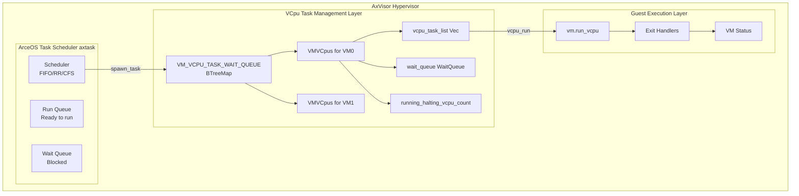

### 2.2 ArceOS 调度器架构

AxVisor 支持三种主要架构，其启动流程存在显著差异：

| 特性 | x86_64 | ARM64 (aarch64) | RISC-V |
|------|--------|-----------------|--------|
| **引导协议** | Multiboot/Multiboot2 | 设备树 (Device Tree) | 设备树 (Device Tree) |
| **虚拟化特权级** | VMX root mode (Ring -1) | EL2 (Exception Level 2) | HS Mode |
| **中断控制器** | APIC/IOAPIC | GIC (Generic Interrupt Controller) | PLIC/CLINT |
| **内存布局** | 高位内核 (0xffff_8000_0000_0000) | 平台相关 (通常 0x40_0000_0000) | 平台相关 |
| **平台抽象层** | axplat-x86_64 | axplat-aarch64-dyn | axplat-riscv64-dyn |
| **链接器脚本** | platform/x86-qemu-q35/linker.lds.S | axplat-aarch64 内置 | axplat-riscv64 内置 |

##### x86_64 启动流程

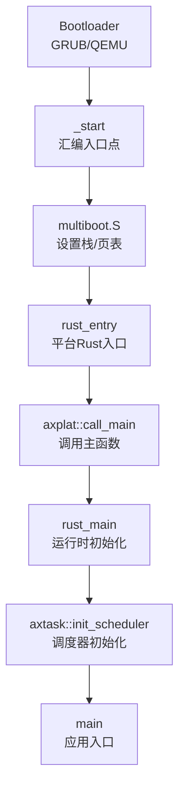

##### ARM64 启动流程

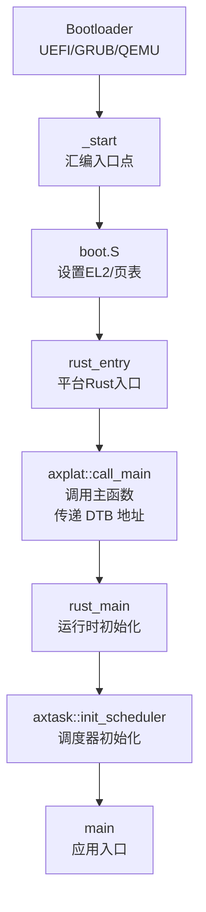

#### 2.2.1 链接器入口点配置

##### x86_64 平台

链接器脚本 [platform/x86-qemu-q35/linker.lds.S](platform/x86-qemu-q35/linker.lds.S) 定义了程序的入口点：

```assembly
OUTPUT_ARCH(i386:x86-64)

BASE_ADDRESS = 0xffff_8000_0000_0000;
SMP = %SMP%;

ENTRY(_start)    /* 设置入口点为 _start */
SECTIONS
{
    . = BASE_ADDRESS;
    _skernel = .;

    .text : ALIGN(4K) {
        _stext = .;
        *(.text.boot)    /* 启动代码段 */
        *(.text .text.*)
        . = ALIGN(4K);
        _etext = .;
    }
    /* ... 其他段 ... */
}
```

**关键特点**：
- 使用高位内核地址空间（`0xffff_8000_0000_0000`）
- 支持 Multiboot 协议
- 通过 `*(.text.boot)` 段放置启动代码

##### ARM64 平台

ARM64 平台的链接器脚本由 [modules/axplat-aarch64-dyn/link.ld](modules/axplat-aarch64-dyn/link.ld) 提供：

```assembly
OUTPUT_ARCH(aarch64)

__SMP = {{SMP}};              /* 由 build.rs 动态替换 */
STACK_SIZE = 0x40000;         /* 256KB 栈空间 */

ENTRY(_start)

INCLUDE "pie_boot.x"          /* PIE（位置无关可执行）引导支持 */

SECTIONS
{
    _skernel = .;

    /* 代码段 */
    .text : ALIGN(4K) {
        _stext = .;
        *(.text.boot)         /* 启动代码段，必须在 EL2 执行 */
        *(.text .text.*)
        . = ALIGN(4K);
        _etext = .;
    }

    /* 只读数据段 */
    .rodata : ALIGN(4K) {
        *(.rodata .rodata.*)
        *(.srodata .srodata.*)
    }

    /* 初始化数组 */
    .init_array : ALIGN(0x10) {
        __init_array_start = .;
        *(.init_array .init_array.*)
        __init_array_end = .;
    }

    /* 数据段 */
    .data : ALIGN(4K) {
        *(.data.boot_page_table)    /* 启动页表 */
        . = ALIGN(4K);

        /* 驱动注册段 */
        __sdriver_register = .;
        KEEP(*(.driver.register*))
        __edriver_register = .;

        *(.data .data.*)
        *(.got .got.*)
    }

    /* 线程局部存储 */
    .tdata : ALIGN(0x10) {
        _stdata = .;
        *(.tdata .tdata.*)
        _etdata = .;
    }

    .tbss : ALIGN(0x10) {
        _stbss = .;
        *(.tbss .tbss.*)
        *(.tcommon)
        _etbss = .;
    }

    /* Per-CPU 数据段 */
    . = ALIGN(4K);
    _percpu_start = .;
    _percpu_end = _percpu_start + SIZEOF(.percpu);
    .percpu 0x0 : AT(_percpu_start) {
        _percpu_load_start = .;
        *(.percpu .percpu.*)
        _percpu_load_end = .;
        . = _percpu_load_start + ALIGN(64) * __SMP;  /* 每个CPU 64字节对齐 */
    }
    . = _percpu_end;

    /* BSS 段 */
    .bss : AT(.) ALIGN(4K) {
        /* CPU0 栈 */
        __cpu0_stack = .;
        . += STACK_SIZE;
        __cpu0_stack_top = .;

        /* 启动栈 */
        boot_stack = .;
        *(.bss.stack)
        . = ALIGN(4K);
        boot_stack_top = .;

        _sbss = .;
        *(.bss .bss.*)
        *(.sbss .sbss.*)
        *(COMMON)
        . = ALIGN(4K);
        _ebss = .;
    }

    _ekernel = .;
}
```

**关键特点**：
- 使用 `OUTPUT_ARCH(aarch64)` 指定 ARM64 架构
- 通过 `INCLUDE "pie_boot.x"` 支持位置无关可执行文件
- 动态 SMP 数量（由 `build.rs` 在编译时替换）
- 256KB 栈空间（`STACK_SIZE = 0x40000`）
- 支持 per-CPU 数据段，每个 CPU 的数据按 64 字节对齐
- 包含驱动注册段（`.driver.register*`）
- 启动页表段（`.data.boot_page_table`）

**构建脚本**（[modules/axplat-aarch64-dyn/build.rs](modules/axplat-aarch64-dyn/build.rs)）：

```rust
fn main() {
    // 设置链接器搜索路径
    println!("cargo:rustc-link-search={}", out_dir().display());

    // 使用自定义链接器脚本
    println!("cargo::rustc-link-arg=-Tlink.x");
    println!("cargo:rustc-link-arg=-no-pie");           /* 禁用 PIE */
    println!("cargo:rustc-link-arg=-znostart-stop-gc"); /* 保留启动和停止代码 */

    // 读取链接器脚本模板
    let ld_content = std::fs::read_to_string("link.ld").unwrap();

    // 替换 SMP 占位符（默认为 16 核）
    let ld_content = ld_content.replace("{{SMP}}", &format!("{}", 16));

    // 写入最终的链接器脚本
    std::fs::write(out_dir().join("link.x"), ld_content)
        .expect("link.x write failed");
}
```

**平台配置**（[modules/axplat-aarch64-dyn/axconfig.toml](modules/axplat-aarch64-dyn/axconfig.toml)）：

```toml
[plat]
cpu-num = 1                                   # CPU 核心数
kernel-base-vaddr = "0xffff_8000_0000_0000"    # 内核虚拟地址
kernel-aspace-base = "0xffff_8000_0000_0000"   # 内核地址空间基址
kernel-aspace-size = "0x0000_7fff_ffff_f000"   # 内核地址空间大小

[devices]
timer-irq = 30  # 定时器中断号（PPI，物理定时器）
```

#### 2.2.2 汇编启动代码

##### x86_64 平台

在 [platform/x86-qemu-q35/src/boot.rs](platform/x86-qemu-q35/src/boot.rs) 中，通过 `global_asm!` 宏嵌入汇编代码：

```rust
global_asm!(
    include_str!("multiboot.S"),
    mb_magic = const MULTIBOOT_BOOTLOADER_MAGIC,
    entry = sym crate::rust_entry,           // Rust 入口点
    entry_secondary = sym crate::rust_entry_secondary,
    // ...
);
```

汇编代码（multiboot.S）会：
1. 设置 Multiboot 头部
2. 配置 CPU（CR0, CR4, EFER 寄存器）
3. 设置页表（开启 64 位长模式）
4. 设置栈指针
5. 跳转到 `rust_entry`

**关键汇编代码片段**：

```assembly
/* multiboot.S - x86_64 启动代码 */
.set MAGIC, 0x1BADB002            /* Multiboot 魔数 */
.set FLAGS, 0                     /* Multiboot 标志 */
.set CHECKSUM, -(MAGIC + FLAGS)   /* 校验和 */

.section .text.boot
.global _start
.type _start, @function

_start:
    /* 1. 设置 Multiboot 头部 */
    .long MAGIC
    .long FLAGS
    .long CHECKSUM

    /* 2. 设置栈指针 */
    mov $stack_top, %rsp

    /* 3. 设置页表并开启 64 位模式 */
    call setup_page_tables

    /* 4. 跳转到 Rust 入口点 */
    jmp rust_entry
```

##### ARM64 平台

ARM64 平台的启动代码在 [modules/axplat-aarch64-dyn/src/boot.rs](modules/axplat-aarch64-dyn/src/boot.rs) 中实现：

```rust
use core::arch::naked_asm;
use aarch64_cpu_ext::cache::{CacheOp, dcache_all};
use somehal::BootInfo;

const BOOT_STACK_SIZE: usize = 0x40000; // 256KB

/* 启动栈（BSS 段） */
#[unsafe(link_section = ".bss.stack")]
static mut BOOT_STACK: [u8; BOOT_STACK_SIZE] = [0; BOOT_STACK_SIZE];

/* 主 CPU 入口点（由 somehal::entry 宏标记） */
#[somehal::entry]
fn main(args: &BootInfo) -> ! {
    unsafe {
        switch_sp(args);
    }
}

/* 切换栈指针（naked 函数，纯汇编） */
#[unsafe(naked)]
unsafe extern "C" fn switch_sp(_args: &BootInfo) -> ! {
    naked_asm!(
        "
        /* 计算新栈顶地址 */
        adrp x8, {sp}              /* 获取 BOOT_STACK 的页地址 */
        add  x8, x8, :lo12:{sp}    /* 加上低 12 位偏移 */
        add  x8, x8, {size}        /* 加上栈大小，得到栈顶 */
        mov  sp, x8                /* 设置栈指针 */

        /* 跳转到下一个函数 */
        bl   {next}
        ",
        sp = sym BOOT_STACK,
        size = const BOOT_STACK_SIZE,
        next = sym sp_reset,
    )
}

/* 栈重置后的入口点 */
fn sp_reset(args: &BootInfo) -> ! {
    /* 调用 axplat::call_main，传递 FDT 地址 */
    axplat::call_main(
        0,  /* CPU ID（主 CPU 为 0） */
        args.fdt.map(|p| p.as_ptr() as usize).unwrap_or_default()
    );
}

/* 次级 CPU 入口点（仅在 smp feature 启用时编译） */
#[cfg(feature = "smp")]
#[somehal::secondary_entry]
fn secondary(cpu_id: usize) {
    /* 使数据缓存失效 */
    dcache_all(CacheOp::Invalidate);

    /* 将硬件 CPU ID 转换为逻辑 CPU 索引 */
    let cpu_idx = crate::smp::cpu_id_to_idx(cpu_id);

    /* 调用次级 CPU 主函数 */
    axplat::call_secondary_main(cpu_idx)
}
```

**关键特点**：
1. **使用 `somehal` crate**：提供硬件抽象层，包括 `BootInfo` 结构
2. **`#[somehal::entry]` 宏**：标记主 CPU 入口点
3. **`#[somehal::secondary_entry]` 宏**：标记次级 CPU 入口点
4. **naked_asm**：使用 naked 函数和内联汇编切换栈指针
5. **数据缓存失效**：次级 CPU 启动时使数据缓存失效（`dcache_all`）
6. **CPU ID 转换**：将硬件 CPU ID（MPIDR）转换为逻辑 CPU 索引

**BootInfo 结构**（由 `somehal` 提供）：

```rust
/* somehal 提供的启动信息结构（简化） */
pub struct BootInfo {
    /* FDT（设备树）物理地址 */
    pub fdt: Option<PhysAddr>,

    /* CPU ID（硬件 ID，来自 MPIDR_EL1） */
    pub cpu_id: usize,

    /* 内核镜像加载地址（物理地址） */
    pub kimage_start_lma: PhysAddr,

    /* 内核镜像虚拟地址 */
    pub kimage_start_vma: VirtAddr,

    /* 内核代码偏移（虚拟地址 - 物理地址） */
    pub kcode_offset: usize,

    /* 页表起始地址（物理地址） */
    pub pg_start: PhysAddr,

    /* 内存区域列表 */
    pub memory_regions: &'static [MemoryRegion],

    /* 调试控制台配置 */
    pub debug_console: Option<DebugConsole>,
}
```

**关键差异**：

| 特性 | x86_64 | ARM64 |
|------|--------|-------|
| **引导协议** | Multiboot 头部 | 设备树（由 `somehal` 解析） |
| **入口点标记** | `global_asm!` 嵌入汇编 | `#[somehal::entry]` 宏 |
| **栈切换** | 在汇编中直接设置 | 使用 naked_asm 切换 |
| **特权级检查** | 无（直接进入保护模式） | 由 `somehal` 在 EL2 启动 |
| **次级 CPU** | 通过 SIPI（Startup IPI） | 通过 `#[somehal::secondary_entry]` |
| **缓存处理** | 无特殊处理 | 次级 CPU 需要失效数据缓存 |
| **CPU ID** | 来自 Local APIC ID | 来自 MPIDR_EL1 寄存器 |

#### 2.2.3 平台 Rust 入口

##### x86_64 平台

在 [platform/x86-qemu-q35/src/lib.rs](platform/x86-qemu-q35/src/lib.rs#L40-L50) 中定义：

```rust
unsafe extern fn rust_entry(magic: usize, mbi: usize) {
    if magic == self::boot::MULTIBOOT_BOOTLOADER_MAGIC {
        axplat::call_main(current_cpu_id(), mbi);
    }
}

unsafe extern fn rust_entry_secondary(_magic: usize) {
    #[cfg(feature = "smp")]
    if _magic == self::boot::MULTIBOOT_BOOTLOADER_MAGIC {
        axplat::call_secondary_main(current_cpu_id());
    }
}
```

**参数说明**：
- `magic`: Multiboot 魔数（`0x2BADB002`），用于验证引导加载器
- `mbi`: Multiboot 信息结构体指针，包含内存布局、命令行参数等

##### ARM64 平台

ARM64 平台的 Rust 入口由 `axplat-aarch64-dyn` crate 提供，实际实现如上节所示（[boot.rs](modules/axplat-aarch64-dyn/src/boot.rs)）：

```rust
/* 主 CPU 入口点 */
#[somehal::entry]
fn main(args: &BootInfo) -> ! {
    unsafe {
        switch_sp(args);
    }
}

/* 栈重置后调用 axplat::call_main */
fn sp_reset(args: &BootInfo) -> ! {
    axplat::call_main(
        0,  /* CPU ID（主 CPU 为 0） */
        args.fdt.map(|p| p.as_ptr() as usize).unwrap_or_default()
    );
}

/* 次级 CPU 入口点 */
#[cfg(feature = "smp")]
#[somehal::secondary_entry]
fn secondary(cpu_id: usize) {
    dcache_all(CacheOp::Invalidate);
    let cpu_idx = crate::smp::cpu_id_to_idx(cpu_id);
    axplat::call_secondary_main(cpu_idx)
}
```

**参数说明**：
- `cpu_id`: CPU 逻辑 ID（主 CPU 为 0，次级 CPU 由 `smp::cpu_id_to_idx` 转换）
- `fdt_ptr`: 设备树（Device Tree Blob）物理地址，包含硬件配置信息

**设备树解析**（[modules/axplat-aarch64-dyn/src/lib.rs](modules/axplat-aarch64-dyn/src/lib.rs)）：

```rust
use fdt_parser::Fdt;
use axplat::mem::phys_to_virt;

/* 获取 FDT 解析器 */
fn fdt() -> Fdt<'static> {
    /* 从 somehal 获取 FDT 物理地址 */
    let paddr = somehal::boot_info()
        .fdt
        .expect("FDT is not available, please check the bootloader configuration");

    /* 将物理地址转换为虚拟地址 */
    let addr = phys_to_virt((paddr.as_ptr() as usize).into());

    /* 创建 FDT 解析器 */
    Fdt::from_ptr(NonNull::new(addr.as_mut_ptr()).unwrap())
        .expect("Failed to parse FDT")
}
```

**CPU ID 转换**（[modules/axplat-aarch64-dyn/src/smp.rs](modules/axplat-aarch64-dyn/src/smp.rs)）：

```rust
use alloc::vec::Vec;
use fdt_parser::Status;
use somehal::boot_info;
use spin::Once;

static CPU_ID_LIST: Once<Vec<usize>> = Once::new();

/* 初始化 CPU ID 列表 */
pub fn init() {
    CPU_ID_LIST.call_once(|| {
        let mut ls = Vec::new();
        let current = boot_info().cpu_id;
        ls.push(current);

        /* 从设备树中解析所有 CPU */
        let cpu_id_ls = cpu_id_list();
        for cpu_id in cpu_id_ls {
            if cpu_id != current {
                ls.push(cpu_id);
            }
        }
        ls
    });
}

/* 从设备树中获取 CPU ID 列表 */
fn cpu_id_list() -> Vec<usize> {
    let fdt = fdt();
    let nodes = fdt.find_nodes("/cpus/cpu");
    nodes
        .filter(|node| node.name().contains("cpu@"))
        .filter(|node| !matches!(node.status(), Some(Status::Disabled)))
        .map(|node| {
            /* 获取 CPU 的 reg 属性（MPIDR） */
            let reg = node
                .reg()
                .unwrap_or_else(|| panic!("cpu {} reg not found", node.name()))
                .next()
                .expect("cpu reg 0 not found");
            reg.address as usize
        })
        .collect()
}

/* 将逻辑 CPU 索引转换为硬件 CPU ID */
pub fn cpu_idx_to_id(cpu_idx: usize) -> usize {
    let cpu_id_list = CPU_ID_LIST.wait();
    if cpu_idx < cpu_id_list.len() {
        cpu_id_list[cpu_idx]
    } else {
        panic!("CPU index {} out of range", cpu_idx);
    }
}

/* 将硬件 CPU ID 转换为逻辑 CPU 索引 */
pub fn cpu_id_to_idx(cpu_id: usize) -> usize {
    let cpu_id_list = CPU_ID_LIST.wait();
    if let Some(idx) = cpu_id_list.iter().position(|&id| id == cpu_id) {
        idx
    } else {
        panic!("CPU ID {} not found in the list", cpu_id);
    }
}
```

**关键差异**：

| 特性 | x86_64 | ARM64 |
|------|--------|-------|
| **硬件描述** | Multiboot 信息结构体 | 设备树（Device Tree Blob） |
| **参数传递** | `mbi` 指针 | `fdt_ptr` 物理地址（通过 `BootInfo`） |
| **CPU ID 获取** | 通过 Local APIC ID | 通过 MPIDR_EL1 寄存器 |
| **CPU ID 转换** | 直接使用 APIC ID | 需要在硬件 ID 和逻辑索引间转换 |
| **多核启动** | 通过 SIPI（Startup IPI） | 通过 PSCI（Power State Coordination Interface） |
| **设备树解析** | 无 | 使用 `fdt_parser` crate |

#### 2.2.4 axplat 宏系统

`axplat` crate 提供了 `#[axplat::main]` 宏，用于标记运行时的主入口函数。在 [modules/axruntime/src/lib.rs](modules/axruntime/src/lib.rs#L111) 中：

```rust
/// The main entry point of the ArceOS runtime.
///
/// It is called from the bootstrapping code in the specific platform crate (see
/// [`axplat::main`]).
///
/// `cpu_id` is the logic ID of the current CPU, and `arg` is passed from the
/// bootloader (typically the device tree blob address).
///
/// In multi-core environment, this function is called on the primary core, and
/// secondary cores call [`rust_main_secondary`].
#[cfg_attr(not(test), axplat::main)]
pub fn rust_main(cpu_id: usize, arg: usize) -> ! {
    // ... 初始化代码 ...
}
```

`#[axplat::main]` 宏的工作原理：
1. 将 `rust_main` 函数标记为程序的主入口点
2. `axplat::call_main` 会查找并调用被此宏标记的函数
3. 这是一种依赖注入模式，允许平台代码调用运行时代码

**平台抽象层依赖**（[modules/axruntime/Cargo.toml](modules/axruntime/Cargo.toml)）：

```toml
# x86_64 平台
[target.'cfg(target_arch = "x86_64")'.dependencies]
axplat-x86_64 = { git = "https://github.com/arceos-org/axplat", tag = "v0.4.0", features = ["irq", "smp", "hv"] }

# ARM64 平台
[target.'cfg(target_arch = "aarch64")'.dependencies]
axplat-aarch64-dyn = { git = "https://github.com/arceos-hypervisor/axplat-aarch64-dyn.git", tag = "v0.4.0", features = ["irq", "smp", "hv"] }
```

**关键差异**：

| 特性 | x86_64 | ARM64 |
|------|--------|-------|
| **平台 crate** | `axplat-x86_64` | `axplat-aarch64-dyn` |
| **动态平台支持** | 否 | 是（`-dyn` 后缀） |
| **arg 参数含义** | Multiboot 信息结构体指针 | 设备树（DTB）物理地址 |
| **硬件抽象** | 基于 x86 特性（MSR, IO端口） | 基于 ARM 特性（系统寄存器） |

#### 2.2.5 完整的初始化流程

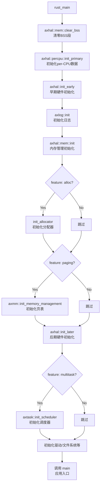

**平台特定的初始化差异**：

| 初始化步骤 | x86_64 | ARM64 |
|-----------|--------|-------|
| **axhal::init_early** | 解析 Multiboot 信息 | 解析设备树（DTB） |
| **axhal::mem::init** | 从 Multiboot 获取内存区域 | 从 `somehal::boot_info()` 获取内存区域 |
| **axhal::init_later** | 初始化 APIC/IOAPIC | 初始化 GIC（中断控制器） |
| **中断控制器** | Local APIC + I/O APIC | GICv2 或 GICv3 |
| **定时器** | LAPIC Timer | ARM Generic Timer |

**ARM64 特定的初始化步骤**（[modules/axplat-aarch64-dyn/src/init.rs](modules/axplat-aarch64-dyn/src/init.rs)）：

```rust
use axplat::init::InitIf;
use log::debug;

struct InitIfImpl;

/* 实现 InitIf trait */
#[impl_plat_interface]
impl InitIf for InitIfImpl {
    /* 早期初始化（主 CPU） */
    fn init_early(_cpu_id: usize, _arg: usize) {
        /* 1. 设置早期控制台 */
        console::setup_early();

        /* 2. 初始化陷阱处理（异常向量表） */
        axcpu::init::init_trap();

        /* 3. 设置内存管理 */
        crate::mem::setup();
    }

    /* 早期初始化（次级 CPU） */
    #[cfg(feature = "smp")]
    fn init_early_secondary(_cpu_id: usize) {
        /* 仅初始化陷阱处理 */
        axcpu::init::init_trap();
    }

    /* 后期初始化（主 CPU） */
    fn init_later(_cpu_id: usize, _arg: usize) {
        /* 1. 刷新 TLB */
        somehal::mem::flush_tlb(None);

        /* 2. 初始化 SMP（多核支持） */
        #[cfg(feature = "smp")]
        crate::smp::init();

        /* 3. 启用定时器 */
        crate::time::enable();

        /* 4. 设置驱动 */
        debug!("drivers setup...");
        driver::setup();

        /* 5. 初始化中断控制器 */
        #[cfg(feature = "irq")]
        {
            crate::irq::init();              /* 初始化 GIC */
            crate::irq::init_current_cpu();  /* 初始化当前 CPU 的中断接口 */
            crate::time::enable_irqs();      /* 启用定时器中断 */
        }
    }

    /* 后期初始化（次级 CPU） */
    #[cfg(feature = "smp")]
    fn init_later_secondary(_cpu_id: usize) {
        /* 1. 刷新 TLB */
        somehal::mem::flush_tlb(None);

        /* 2. 启用定时器 */
        crate::time::enable();

        /* 3. 初始化当前 CPU 的中断接口 */
        #[cfg(feature = "irq")]
        {
            crate::irq::init_current_cpu();
            crate::time::enable_irqs();
        }
    }
}
```

**内存管理初始化**（[modules/axplat-aarch64-dyn/src/mem.rs](modules/axplat-aarch64-dyn/src/mem.rs)）：

```rust
use axplat::mem::{MemIf, PhysAddr, VirtAddr};
use somehal::{boot_info, MemoryRegionKind};
use spin::Once;

struct MemIfImpl;

static RAM_LIST: Once<Vec<RawRange, 32>> = Once::new();
static RESERVED_LIST: Once<Vec<RawRange, 32>> = Once::new();
static MMIO: Once<Vec<RawRange, 32>> = Once::new();

/* 设置内存管理 */
pub fn setup() {
    /* 计算虚拟地址偏移 */
    unsafe {
        VA_OFFSET = boot_info().kimage_start_vma as usize
                  - boot_info().kimage_start_lma as usize;
    };

    /* 初始化 RAM 列表 */
    RAM_LIST.call_once(|| {
        let mut ram_list = Vec::new();
        for region in boot_info()
            .memory_regions
            .iter()
            .filter(|one| matches!(one.kind, MemoryRegionKind::Ram))
            .map(|one| (one.start, one.end - one.start))
        {
            let _ = ram_list.push(region);
        }
        ram_list
    });

    /* 初始化保留区域列表 */
    RESERVED_LIST.call_once(|| {
        let mut rsv_list = Vec::new();

        /* 添加内核镜像区域 */
        let head_start = boot_info().kimage_start_lma as usize;
        let head_section = (head_start, (_skernel as usize) - va_offset() - head_start);
        rsv_list.push(head_section).unwrap();

        /* 添加保留区域 */
        for region in boot_info()
            .memory_regions
            .iter()
            .filter(|one| {
                matches!(
                    one.kind,
                    MemoryRegionKind::Reserved | MemoryRegionKind::Bootloader
                )
            })
            .map(|one| {
                (
                    one.start.align_down_4k(),
                    one.end.align_up_4k() - one.start.align_down_4k(),
                )
            })
        {
            let _ = rsv_list.push(region);
        }

        rsv_list
    });

    /* 初始化 MMIO 区域 */
    MMIO.call_once(|| {
        let mut mmio_list = Vec::new();
        if let Some(debug) = &boot_info().debug_console {
            let start = debug.base_phys.align_down_4k();
            let _ = mmio_list.push((start, 0x1000));
        }
        mmio_list
    });
}

/* 实现 MemIf trait */
#[impl_plat_interface]
impl MemIf for MemIfImpl {
    /* 返回所有物理内存区域 */
    fn phys_ram_ranges() -> &'static [RawRange] {
        RAM_LIST.wait()
    }

    /* 返回所有保留的物理内存区域 */
    fn reserved_phys_ram_ranges() -> &'static [RawRange] {
        RESERVED_LIST.wait()
    }

    /* 返回所有 MMIO 区域 */
    fn mmio_ranges() -> &'static [RawRange] {
        MMIO.wait()
    }

    /* 物理地址到虚拟地址转换 */
    fn phys_to_virt(p: PhysAddr) -> VirtAddr {
        if kimage_range_phys().contains(&p) {
            /* 内核镜像区域 */
            VirtAddr::from_usize(p.as_usize() + va_offset())
        } else {
            /* MMIO 或其他保留区域 */
            VirtAddr::from_usize(p.as_usize() + KLINER_OFFSET)
        }
    }

    /* 虚拟地址到物理地址转换 */
    fn virt_to_phys(p: VirtAddr) -> PhysAddr {
        if (KIMAGE_VADDR..KIMAGE_VADDR + KIMAGE_VSIZE).contains(&p.as_usize()) {
            PhysAddr::from_usize(p.as_usize() - va_offset())
        } else {
            PhysAddr::from_usize(p.as_usize() - KLINER_OFFSET)
        }
    }

    /* 返回内核地址空间 */
    fn kernel_aspace() -> (VirtAddr, usize) {
        #[cfg(feature = "hv")]
        {
            /* 虚拟化模式：使用较小的地址空间 */
            (VirtAddr::from_usize(0), 0xffff_ffff_f000)
        }
        #[cfg(not(feature = "hv"))]
        {
            /* 非虚拟化模式：使用完整的地址空间 */
            (
                VirtAddr::from_usize(0xffff_8000_0000_0000),
                0x0000_7fff_ffff_f000,
            )
        }
    }
}
```

**中断控制器初始化**（[modules/axplat-aarch64-dyn/src/irq/mod.rs](modules/axplat-aarch64-dyn/src/irq/mod.rs)）：

```rust
use arm_gic_driver::{v2::Gic, v3::Gic};
use rdrive::Device;
use rdif_intc::Intc;
use core::sync::atomic::AtomicI32;

static VERSION: AtomicI32 = AtomicI32::new(0);

/* 初始化 GIC（分发器） */
pub(crate) fn init() {
    let intc = get_gicd();
    debug!("Initializing GICD...");
    let mut gic = intc.lock().unwrap();
    gic.open().unwrap();
    debug!("GICD initialized");
}

/* 初始化当前 CPU 的中断接口 */
pub(crate) fn init_current_cpu() {
    let mut intc = get_gicd().lock().unwrap();

    /* 检测 GIC 版本并初始化 */
    if let Some(v) = intc.typed_mut::<v2::Gic>() {
        let cpu = v.cpu_interface();
        v2::TRAP.call_once(|| cpu.trap_operations());
        v2::CPU_IF.with_current(|c| {
            c.call_once(|| Mutex::new(cpu));
        });
        VERSION.store(2, core::sync::atomic::Ordering::SeqCst);
    }

    if let Some(v) = intc.typed_mut::<v3::Gic>() {
        let cpu = v.cpu_interface();
        v3::TRAP.call_once(|| cpu.trap_operations());
        v3::CPU_IF.with_current(|c| {
            c.call_once(|| Mutex::new(cpu));
        });
        VERSION.store(3, core::sync::atomic::Ordering::SeqCst);
    }

    /* 调用特定版本的初始化函数 */
    match gic_version() {
        2 => v2::init_current_cpu(),
        3 => v3::init_current_cpu(),
        _ => panic!("Unsupported GIC version"),
    }

    debug!("GIC initialized for current CPU");
}

/* 获取 GIC 版本 */
fn gic_version() -> i32 {
    VERSION.load(core::sync::atomic::Ordering::SeqCst)
}
```

**定时器初始化**（[modules/axplat-aarch64-dyn/src/time.rs](modules/axplat-aarch64-dyn/src/time.rs)）：

```rust
use aarch64_cpu::registers::*;
use axplat::time::TimeIf;
use rdrive::{IrqConfig, PlatformDevice, module_driver};

static TIMER_IRQ_CONFIG: LazyInit<IrqConfig> = LazyInit::new();

struct TimeIfImpl;

/* 实现 TimeIf trait */
#[impl_plat_interface]
impl TimeIf for TimeIfImpl {
    /* 获取当前硬件时钟滴答数 */
    fn current_ticks() -> u64 {
        CNTPCT_EL0.get()  /* 物理计数寄存器 */
    }

    /* 将硬件滴答转换为纳秒 */
    fn ticks_to_nanos(ticks: u64) -> u64 {
        let freq = CNTFRQ_EL0.get();  /* 计数器频率 */
        (ticks * axplat::time::NANOS_PER_SEC) / freq
    }

    /* 将纳秒转换为硬件滴答 */
    fn nanos_to_ticks(nanos: u64) -> u64 {
        let freq = CNTFRQ_EL0.get();
        (nanos * freq) / axplat::time::NANOS_PER_SEC
    }

    /* 获取定时器中断号 */
    #[cfg(feature = "irq")]
    fn irq_num() -> usize {
        TIMER_IRQ_CONFIG.irq.into()
    }

    /* 设置单次定时器 */
    #[cfg(feature = "irq")]
    fn set_oneshot_timer(deadline_ns: u64) {
        let cnptct = CNTPCT_EL0.get();
        let cnptct_deadline = Self::nanos_to_ticks(deadline_ns);
        if cnptct < cnptct_deadline {
            let interval = cnptct_deadline - cnptct;
            debug_assert!(interval <= u32::MAX as u64);
            set_tval(interval);
        } else {
            set_tval(0);
        }
    }
}

/* 设置定时器值寄存器 */
fn set_tval(tval: u64) {
    #[cfg(feature = "hv")]
    unsafe {
        /* 虚拟化模式：使用 EL2 物理定时器 */
        core::arch::asm!("msr CNTHP_TVAL_EL2, {0:x}", in(reg) tval);
    }
    #[cfg(not(feature = "hv"))]
    {
        /* 非虚拟化模式：使用 EL0 物理定时器 */
        CNTP_TVAL_EL0.set(tval);
    }
}

/* 启用定时器 */
#[cfg(feature = "hv")]
pub fn enable() {
    CNTHP_CTL_EL2.write(CNTHP_CTL_EL2::ENABLE::SET);
    set_tval(0);
}
#[cfg(not(feature = "hv"))]
pub fn enable() {
    CNTP_CTL_EL0.write(CNTP_CTL_EL0::ENABLE::SET);
    set_tval(0);
}

/* 驱动探测（通过设备树） */
module_driver!(
    name: "ARMv8 Timer",
    level: ProbeLevel::PreKernel,
    priority: ProbePriority::DEFAULT,
    probe_kinds: &[
        ProbeKind::Fdt {
            compatibles: &["arm,armv8-timer"],
            on_probe: probe
        }
    ],
);

fn probe(_fdt: FdtInfo<'_>, _dev: PlatformDevice) -> Result<(), OnProbeError> {
    #[cfg(not(feature = "irq"))]
    let irq = IrqConfig {
        irq: 0.into(),
        trigger: rdif_intc::Trigger::EdgeBoth,
        is_private: true,
    };
    #[cfg(feature = "irq")]
    let irq = {
        /* 从设备树中解析定时器中断配置 */
        #[cfg(not(feature = "hv"))]
        let irq_idx = 1;  /* 非虚拟化模式 */
        #[cfg(feature = "hv")]
        let irq_idx = 3;  /* 虚拟化模式 */
        crate::irq::parse_fdt_irqs(&_fdt.interrupts()[irq_idx])
    };
    TIMER_IRQ_CONFIG.call_once(|| irq);
    Ok(())
}
```

关键代码（[modules/axruntime/src/lib.rs:115-180](modules/axruntime/src/lib.rs#L115-L180)）：

```rust
#[cfg_attr(not(test), axplat::main)]
pub fn rust_main(cpu_id: usize, arg: usize) -> ! {
    unsafe { axhal::mem::clear_bss() };
    axhal::percpu::init_primary(cpu_id);
    axhal::init_early(cpu_id, arg);

    ax_println!("{}", LOGO);
    ax_println!("smp = {}", cpu_count());

    axlog::init();
    log::set_max_level(log::LevelFilter::Trace);
    info!("Logging is enabled.");
    info!("Primary CPU {cpu_id} started, arg = {arg:#x}.");

    axhal::mem::init();
    info!("Found physical memory regions:");
    for r in axhal::mem::memory_regions() {
        info!(
            "  [{:x?}, {:x?}) {} ({:?})",
            r.paddr,
            r.paddr + r.size,
            r.name,
            r.flags
        );
    }

    #[cfg(feature = "alloc")]
    init_allocator();

    let (kernel_space_start, kernel_space_size) = axhal::mem::kernel_aspace();

    info!(
        "kernel aspace: [{:#x?}, {:#x?})",
        kernel_space_start,
        kernel_space_start + kernel_space_size,
    );

    #[cfg(feature = "paging")]
    axmm::init_memory_management();

    #[cfg(feature = "driver-dyn")]
    axdriver::setup(arg);

    info!("Initialize platform devices...");
    axhal::init_later(cpu_id, arg);

    #[cfg(feature = "multitask")]
    axtask::init_scheduler();  // 初始化调度器

    #[cfg(any(feature = "fs", feature = "net", feature = "display"))]
    {
        #[allow(unused_variables)]
        let all_devices = axdriver::init_drivers();

        #[cfg(feature = "fs")]
        axfs::init_filesystems(all_devices.block, axhal::dtb::get_chosen_bootargs());

        #[cfg(feature = "net")]
        axnet::init_network(all_devices.net);

        #[cfg(feature = "display")]
        axdisplay::init_display(all_devices.display);
    }

    #[cfg(feature = "smp")]
    self::mp::start_secondary_cpus(cpu_id);

    #[cfg(feature = "irq")]
    {
        info!("Initialize interrupt handlers...");
        init_interrupt();
    }

    #[cfg(all(feature = "tls", not(feature = "multitask")))]
    {
        info!("Initialize thread local storage...");
        init_tls();
    }

    ctor_bare::call_ctors();  // 调用 C++ 风格构造函数

    info!("Primary CPU {cpu_id} init OK.");
    INITED_CPUS.fetch_add(1, Ordering::Release);

    while !is_init_ok() {
        core::hint::spin_loop();
    }

    unsafe { main() };  // 调用应用 main 函数

    #[cfg(feature = "multitask")]
    axtask::exit(0);
    #[cfg(not(feature = "multitask"))]
    {
        debug!("main task exited: exit_code={}", 0);
        axhal::power::system_off();
    }
}
```

#### 2.2.6 依赖关系图

##### x86_64 平台

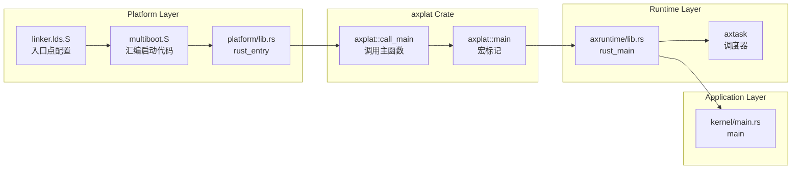

##### ARM64 平台

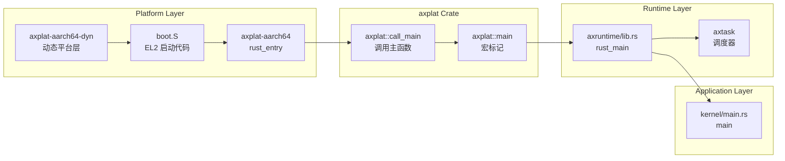

**关键差异**：

| 特性 | x86_64 | ARM64 |
|------|--------|-------|
| **平台层位置** | `platform/x86-qemu-q35/` | `axplat-aarch64-dyn`（外部 crate） |
| **链接器脚本** | 本地文件 `linker.lds.S` | 由 `axplat-aarch64-dyn` 提供 |
| **汇编启动代码** | `multiboot.S` | `boot.S`（EL2 特定） |
| **硬件描述** | Multiboot 信息结构体 | 设备树（DTB） |
| **中断控制器** | APIC（本地 + I/O） | GIC（Generic Interrupt Controller） |

#### 2.2.7 关键技术点

##### 通用技术点（跨平台）

1. **链接器脚本**：定义入口点和内存布局
2. **全局汇编**：通过 `global_asm!` 嵌入启动代码
3. **宏系统**：`#[axplat::main]` 实现依赖注入
4. **外部函数声明**：`extern { fn main(); }` 声明应用入口
5. **unsafe 调用**：`unsafe { main(); }` 调用应用代码

这种设计使得：
- 平台代码（boot、multiboot）与运行时代码解耦
- 运行时代码与应用代码解耦
- 支持多种平台和多种调度策略
- 通过 feature flags 灵活配置功能

##### x86_64 特有技术点

1. **Multiboot 协议**：与引导加载器（GRUB/QEMU）的标准化接口
2. **长模式切换**：从 32 位保护模式切换到 64 位长模式
3. **APIC 初始化**：本地 APIC 和 I/O APIC 的配置
4. **MSR 访问**：通过 `rdmsr`/`wrmsr` 访问模型特定寄存器

##### ARM64 特有技术点

1. **EL2 特权级**：必须在 EL2（Exception Level 2）运行以支持虚拟化
2. **设备树解析**：通过 DTB 获取硬件配置信息
3. **GIC 初始化**：配置通用中断控制器（GICv2 或 GICv3）
4. **系统寄存器访问**：通过 `mrs`/`msr` 访问系统控制寄存器
5. **Stage-2 页表**：配置虚拟机的地址转换（两阶段页表）

**ARM64 虚拟化相关系统寄存器**：

```rust
/* 虚拟化配置寄存器 */
const HCR_EL2: &str = "Hypervisor Configuration Register";
const VTTBR_EL2: &str = "Virtualization Translation Table Base Register";
const VTCR_EL2: &str = "Virtualization Translation Control Register";
const SCTLR_EL2: &str = "System Control Register (EL2)";

/* 中断相关寄存器 */
const ICC_SGI1R_EL1: &str = "Interrupt Controller Software Generated Interrupt Group 1";
const ICH_LR_EL2: &str = "Interrupt Controller List Register";

/* 示例：读取 ID_AA64PFR0_EL1 检查 EL2 支持 */
let id_aa64pfr0: u64;
unsafe {
    core::arch::asm!("mrs {}, id_aa64pfr0_el1", out(reg) id_aa64pfr0);
}
let el2_supported = (id_aa64pfr0 >> 12) & 0xF == 1;
assert!(el2_supported, "EL2 not supported");
```

### 2.3 VCpu 任务管理层


### 2.3 VCpu 任务管理层

在 [kernel/src/task.rs](kernel/src/task.rs) 中定义 VCpu 任务的扩展数据：

```rust
use alloc::sync::{Arc, Weak};
use std::os::arceos::modules::axtask::{TaskExt, TaskInner};
use crate::vmm::{VCpuRef, VM, VMRef};

/// Task extended data for the hypervisor.
pub struct VCpuTask {
    /// The VM (Weak reference to avoid keeping VM alive).
    pub vm: Weak<VM>,
    /// The virtual CPU.
    pub vcpu: VCpuRef,
}

impl VCpuTask {
    pub fn new(vm: &VMRef, vcpu: VCpuRef) -> Self {
        Self {
            vm: Arc::downgrade(vm),  // 使用 Weak 引用避免循环引用
            vcpu,
        }
    }

    pub fn vm(&self) -> VMRef {
        self.vm.upgrade().expect("VM has been dropped")
    }
}

// 实现 TaskExt trait，使 VCpuTask 可以作为任务扩展
#[extern_trait::extern_trait]
unsafe impl TaskExt for VCpuTask {}

pub trait AsVCpuTask {
    fn as_vcpu_task(&self) -> &VCpuTask;
}

impl AsVCpuTask for TaskInner {
    fn as_vcpu_task(&self) -> &VCpuTask {
        unsafe {
            self.task_ext()
                .expect("Not a VCpuTask")
                .downcast_ref::<VCpuTask>()
        }
    }
}
```

#### 2.3.1 VMVCpus 结构

在 [kernel/src/vmm/vcpus.rs](kernel/src/vmm/vcpus.rs#L60-L100) 中定义 VM 的 VCpu 管理结构：

```rust
/// A structure representing the VCpus of a specific VM, including a wait queue
/// and a list of tasks associated with the VCpus.
pub struct VMVCpus {
    // The ID of the VM to which these VCpus belong.
    _vm_id: usize,
    // A wait queue to manage task scheduling for the VCpus.
    wait_queue: WaitQueue,
    // A list of tasks associated with the VCpus of this VM.
    vcpu_task_list: Vec<AxTaskRef>,
    /// The number of currently running or halting VCpus.
    running_halting_vcpu_count: AtomicUsize,
}

impl VMVCpus {
    fn new(vm: VMRef) -> Self {
        Self {
            _vm_id: vm.id(),
            wait_queue: WaitQueue::new(),
            vcpu_task_list: Vec::with_capacity(vm.vcpu_num()),
            running_halting_vcpu_count: AtomicUsize::new(0),
        }
    }

    fn add_vcpu_task(&mut self, vcpu_task: AxTaskRef) {
        self.vcpu_task_list.push(vcpu_task);
    }

    fn wait(&self) {
        self.wait_queue.wait()
    }

    fn wait_until<F>(&self, condition: F)
    where
        F: Fn() -> bool,
    {
        self.wait_queue.wait_until(condition)
    }

    fn notify_one(&mut self) {
        self.wait_queue.notify_one(false);
    }

    fn notify_all(&mut self) {
        self.wait_queue.notify_all(false);
    }

    fn mark_vcpu_running(&self) {
        self.running_halting_vcpu_count.fetch_add(1, Ordering::Relaxed);
    }

    fn mark_vcpu_exiting(&self) -> bool {
        self.running_halting_vcpu_count.fetch_sub(1, Ordering::Relaxed) == 1
    }
}
```

#### 2.3.2 全局 VCpu 等待队列

在 [kernel/src/vmm/vcpus.rs](kernel/src/vmm/vcpus.rs#L35-L60) 中定义全局等待队列：

```rust
/// A global static BTreeMap that holds the wait queues for VCpus
/// associated with their respective VMs, identified by their VM IDs.
static VM_VCPU_TASK_WAIT_QUEUE: Queue = Queue::new();

/// A thread-safe queue that manages wait queues for VCpus across multiple VMs.
struct Queue(UnsafeCell<BTreeMap<usize, VMVCpus>>);

unsafe impl Sync for Queue {}
unsafe impl Send for Queue {}

impl Queue {
    const fn new() -> Self {
        Self(UnsafeCell::new(BTreeMap::new()))
    }

    fn get(&self, vm_id: &usize) -> Option<&VMVCpus> {
        unsafe { (*self.0.get()).get(vm_id) }
    }

    fn get_mut(&self, vm_id: &usize) -> Option<&mut VMVCpus> {
        unsafe { (*self.0.get()).get_mut(vm_id) }
    }

    fn insert(&self, vm_id: usize, vcpus: VMVCpus) {
        unsafe {
            (*self.0.get()).insert(vm_id, vcpus);
        }
    }

    fn remove(&self, vm_id: &usize) -> Option<VMVCpus> {
        unsafe { (*self.0.get()).remove(vm_id) }
    }
}
```

---

## 三、任务调度流程详解

通过 Cargo features 选择调度算法（[axtask/Cargo.toml](crates/arceos/modules/axtask/Cargo.toml)）：

```toml
[features]
sched-fifo = ["multitask"]      # FIFO 协作调度（默认）
sched-rr = ["multitask", "preempt"]  # Round-Robin 抢占调度
sched-cfs = ["multitask", "preempt"] # Completely Fair Scheduler
```

在 [axtask/src/api.rs](crates/arceos/modules/axtask/src/api.rs#L40-L50) 中定义类型别名：

```rust
cfg_if::cfg_if! {
    if #[cfg(feature = "sched-rr")] {
        const MAX_TIME_SLICE: usize = 5;
        pub(crate) type AxTask = axsched::RRTask<TaskInner, MAX_TIME_SLICE>;
        pub(crate) type Scheduler = axsched::RRScheduler<TaskInner, MAX_TIME_SLICE>;
    } else if #[cfg(feature = "sched-cfs")] {
        pub(crate) type AxTask = axsched::CFSTask<TaskInner>;
        pub(crate) type Scheduler = axsched::CFScheduler<TaskInner>;
    } else {
        // 默认使用 FIFO
        pub(crate) type AxTask = axsched::FifoTask<TaskInner>;
        pub(crate) type Scheduler = axsched::FifoScheduler<TaskInner>;
    }
}
```

#### 3.2.2 任务状态定义

在 [axtask/src/task.rs](crates/arceos/modules/axtask/src/task.rs#L28-L38) 中定义任务状态：

```rust
/// The possible states of a task.
#[repr(u8)]
#[derive(Debug, Clone, Copy, Eq, PartialEq)]
pub enum TaskState {
    /// Task is running on some CPU.
    Running = 1,
    /// Task is ready to run on some scheduler's ready queue.
    Ready = 2,
    /// Task is blocked (in the wait queue or timer list),
    /// and it has finished its scheduling process, it can be wake up by `notify()` on any run queue safely.
    Blocked = 3,
    /// Task is exited and waiting for being dropped.
    Exited = 4,
}
```

任务状态转换图：

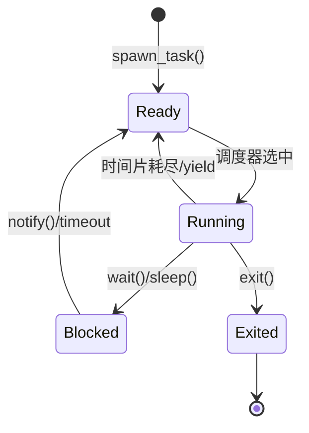

#### 3.2.3 TaskInner 结构

核心任务结构在 [axtask/src/task.rs](crates/arceos/modules/axtask/src/task.rs#L60-L120)：

```rust
pub struct TaskInner {
    id: TaskId,
    name: SpinNoIrq<String>,
    is_idle: bool,
    is_init: bool,

    entry: Cell<Option<Box<dyn FnOnce()>>>,
    state: AtomicU8,  // TaskState

    /// CPU affinity mask.
    cpumask: SpinNoIrq<AxCpuMask>,

    /// Used to indicate the CPU ID where the task is running or will run.
    cpu_id: AtomicU32,
    #[cfg(feature = "smp")]
    on_cpu: AtomicBool,

    #[cfg(feature = "preempt")]
    need_resched: AtomicBool,
    #[cfg(feature = "preempt")]
    preempt_disable_count: AtomicUsize,

    interrupted: AtomicBool,
    interrupt_waker: AtomicWaker,

    exit_code: AtomicI32,
    wait_for_exit: AtomicWaker,

    kstack: Option<TaskStack>,
    ctx: UnsafeCell<TaskContext>,

    #[cfg(feature = "task-ext")]
    task_ext: Option<AxTaskExt>,  // 用户扩展数据

    #[cfg(feature = "tls")]
    tls: TlsArea,
}
```

#### 3.2.4 运行队列管理

运行队列在 [axtask/src/run_queue.rs](crates/arceos/modules/axtask/src/run_queue.rs) 中实现：

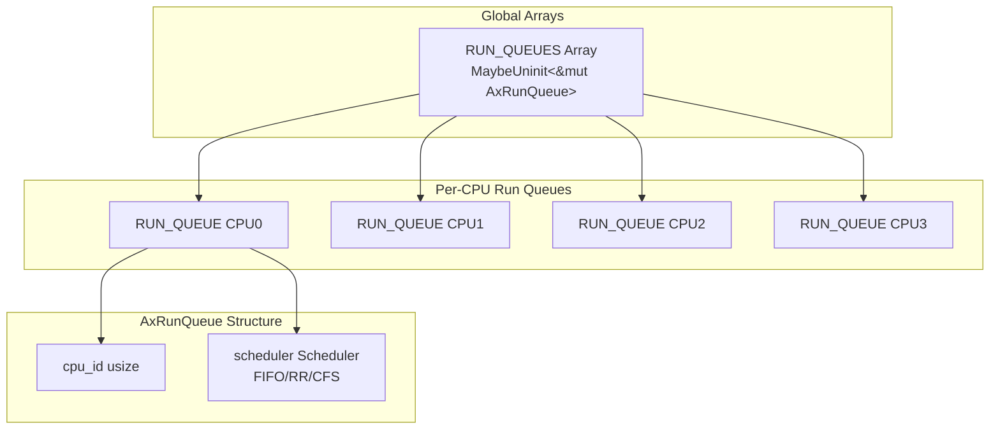

关键代码（[run_queue.rs:60-80](crates/arceos/modules/axtask/src/run_queue.rs#L60-L80)）：

```rust
percpu_static! {
    RUN_QUEUE: LazyInit<AxRunQueue> = LazyInit::new(),
    EXITED_TASKS: VecDeque<AxTaskRef> = VecDeque::new(),
    WAIT_FOR_EXIT: AtomicWaker = AtomicWaker::new(),
    IDLE_TASK: LazyInit<AxTaskRef> = LazyInit::new(),
    #[cfg(feature = "smp")]
    PREV_TASK: Weak<crate::AxTask> = Weak::new(),
}

static mut RUN_QUEUES: [MaybeUninit<&'static mut AxRunQueue>; axconfig::plat::CPU_NUM] =
    [ARRAY_REPEAT_VALUE; axconfig::plat::CPU_NUM];
```

### 3.3 VCpu 任务管理层

#### 3.3.1 VCpuTask 结构

在 [kernel/src/task.rs](kernel/src/task.rs) 中定义 VCpu 任务的扩展数据：

```rust
use alloc::sync::{Arc, Weak};
use std::os::arceos::modules::axtask::{TaskExt, TaskInner};
use crate::vmm::{VCpuRef, VM, VMRef};

/// Task extended data for the hypervisor.
pub struct VCpuTask {
    /// The VM (Weak reference to avoid keeping VM alive).
    pub vm: Weak<VM>,
    /// The virtual CPU.
    pub vcpu: VCpuRef,
}

impl VCpuTask {
    pub fn new(vm: &VMRef, vcpu: VCpuRef) -> Self {
        Self {
            vm: Arc::downgrade(vm),  // 使用 Weak 引用避免循环引用
            vcpu,
        }
    }

    pub fn vm(&self) -> VMRef {
        self.vm.upgrade().expect("VM has been dropped")
    }
}

// 实现 TaskExt trait，使 VCpuTask 可以作为任务扩展
#[extern_trait::extern_trait]
unsafe impl TaskExt for VCpuTask {}

pub trait AsVCpuTask {
    fn as_vcpu_task(&self) -> &VCpuTask;
}

impl AsVCpuTask for TaskInner {
    fn as_vcpu_task(&self) -> &VCpuTask {
        unsafe {
            self.task_ext()
                .expect("Not a VCpuTask")
                .downcast_ref::<VCpuTask>()
        }
    }
}
```

#### 3.3.2 VMVCpus 结构

在 [kernel/src/vmm/vcpus.rs](kernel/src/vmm/vcpus.rs#L60-L100) 中定义 VM 的 VCpu 管理结构：

```rust
/// A structure representing the VCpus of a specific VM, including a wait queue
/// and a list of tasks associated with the VCpus.
pub struct VMVCpus {
    // The ID of the VM to which these VCpus belong.
    _vm_id: usize,
    // A wait queue to manage task scheduling for the VCpus.
    wait_queue: WaitQueue,
    // A list of tasks associated with the VCpus of this VM.
    vcpu_task_list: Vec<AxTaskRef>,
    /// The number of currently running or halting VCpus.
    running_halting_vcpu_count: AtomicUsize,
}

impl VMVCpus {
    fn new(vm: VMRef) -> Self {
        Self {
            _vm_id: vm.id(),
            wait_queue: WaitQueue::new(),
            vcpu_task_list: Vec::with_capacity(vm.vcpu_num()),
            running_halting_vcpu_count: AtomicUsize::new(0),
        }
    }

    fn add_vcpu_task(&mut self, vcpu_task: AxTaskRef) {
        self.vcpu_task_list.push(vcpu_task);
    }

    fn wait(&self) {
        self.wait_queue.wait()
    }

    fn wait_until<F>(&self, condition: F)
    where
        F: Fn() -> bool,
    {
        self.wait_queue.wait_until(condition)
    }

    fn notify_one(&mut self) {
        self.wait_queue.notify_one(false);
    }

    fn notify_all(&mut self) {
        self.wait_queue.notify_all(false);
    }

    fn mark_vcpu_running(&self) {
        self.running_halting_vcpu_count.fetch_add(1, Ordering::Relaxed);
    }

    fn mark_vcpu_exiting(&self) -> bool {
        self.running_halting_vcpu_count.fetch_sub(1, Ordering::Relaxed) == 1
    }
}
```

#### 3.3.3 全局 VCpu 等待队列

在 [kernel/src/vmm/vcpus.rs](kernel/src/vmm/vcpus.rs#L35-L60) 中定义全局等待队列：

```rust
/// A global static BTreeMap that holds the wait queues for VCpus
/// associated with their respective VMs, identified by their VM IDs.
static VM_VCPU_TASK_WAIT_QUEUE: Queue = Queue::new();

/// A thread-safe queue that manages wait queues for VCpus across multiple VMs.
struct Queue(UnsafeCell<BTreeMap<usize, VMVCpus>>);

unsafe impl Sync for Queue {}
unsafe impl Send for Queue {}

impl Queue {
    const fn new() -> Self {
        Self(UnsafeCell::new(BTreeMap::new()))
    }

    fn get(&self, vm_id: &usize) -> Option<&VMVCpus> {
        unsafe { (*self.0.get()).get(vm_id) }
    }

    fn get_mut(&self, vm_id: &usize) -> Option<&mut VMVCpus> {
        unsafe { (*self.0.get()).get_mut(vm_id) }
    }

    fn insert(&self, vm_id: usize, vcpus: VMVCpus) {
        unsafe {
            (*self.0.get()).insert(vm_id, vcpus);
        }
    }

    fn remove(&self, vm_id: &usize) -> Option<VMVCpus> {
        unsafe { (*self.0.get()).remove(vm_id) }
    }
}
```

---

## 四、任务调度流程详解

### 4.1 VMM 初始化流程

在 [kernel/src/vmm/mod.rs](kernel/src/vmm/mod.rs#L30-L50) 中实现：

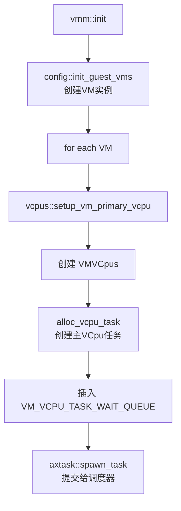

代码实现：

```rust
pub fn init() {
    info!("Initializing VMM...");
    config::init_guest_vms();  // 创建 VM 实例

    info!("Setting up vcpus...");
    for vm in vm_list::get_vm_list() {
        vcpus::setup_vm_primary_vcpu(vm);  // 设置主 VCpu
    }
}
```

### 4.2 VCpu 任务创建流程

在 [kernel/src/vmm/vcpus.rs](kernel/src/vmm/vcpus.rs#L380-L420) 中实现 `alloc_vcpu_task`：

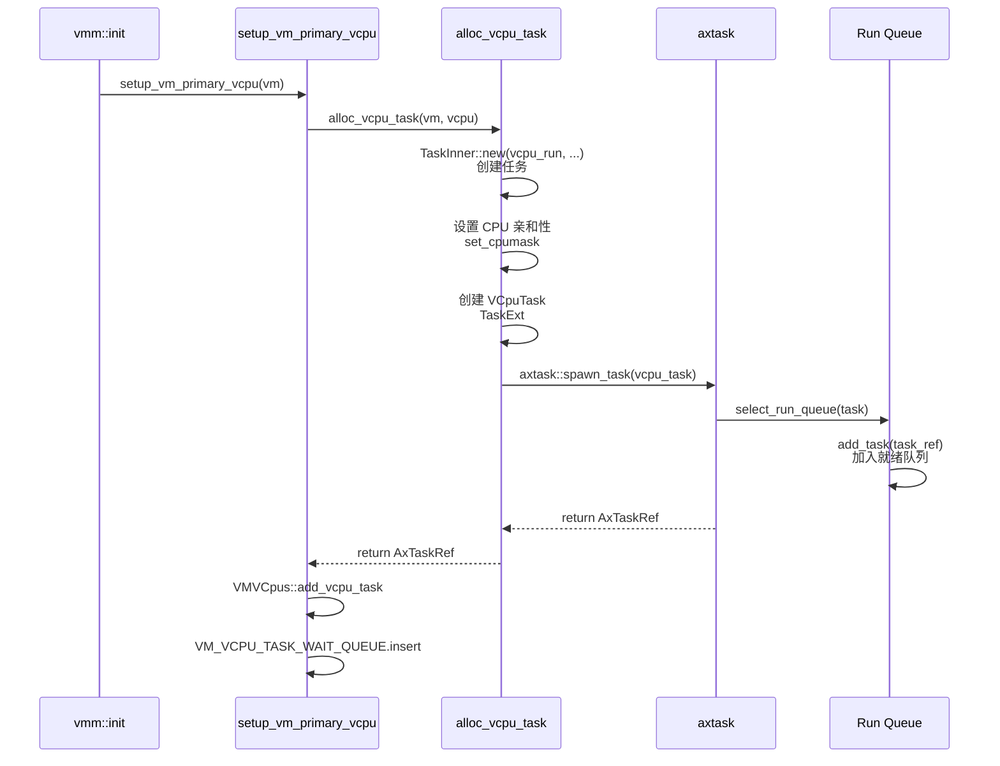

代码实现：

```rust
fn alloc_vcpu_task(vm: &VMRef, vcpu: VCpuRef) -> AxTaskRef {
    info!("Spawning task for VM[{}] VCpu[{}]", vm.id(), vcpu.id());

    // 1. 创建新 Task，入口函数为 vcpu_run()
    let mut vcpu_task = TaskInner::new(
        vcpu_run,
        format!("VM[{}]-VCpu[{}]", vm.id(), vcpu.id()),
        KERNEL_STACK_SIZE,  // 256 KiB
    );

    // 2. 设置 CPU 亲和性（如果配置了）
    if let Some(phys_cpu_set) = vcpu.phys_cpu_set() {
        vcpu_task.set_cpumask(AxCpuMask::from_raw_bits(phys_cpu_set));
    }

    // 3. 关联 VCpuTask 元数据（使用 Weak 引用避免循环引用）
    let inner = VCpuTask::new(vm, vcpu);
    *vcpu_task.task_ext_mut() = Some(unsafe { AxTaskExt::from_impl(inner) });

    info!(
        "VCpu task {} created {:?}",
        vcpu_task.id_name(),
        vcpu_task.cpumask()
    );

    // 4. 提交给宿主调度器
    axtask::spawn_task(vcpu_task)
}
```

### 4.3 VMM 启动流程

在 [kernel/src/vmm/mod.rs](kernel/src/vmm/mod.rs#L55-L80) 中实现：

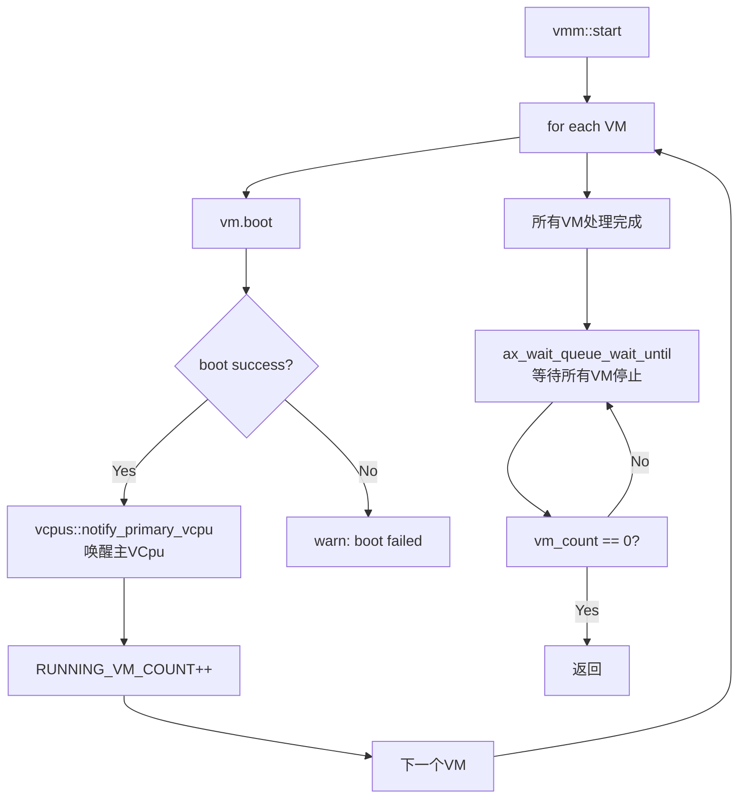

代码实现：

```rust
pub fn start() {
    info!("VMM starting, booting VMs...");

    for vm in vm_list::get_vm_list() {
        match vm.boot() {
            Ok(_) => {
                vcpus::notify_primary_vcpu(vm.id());
                RUNNING_VM_COUNT.fetch_add(1, Ordering::Release);
                info!("VM[{}] boot success", vm.id())
            }
            Err(err) => warn!("VM[{}] boot failed, error {:?}", vm.id(), err),
        }
    }

    // Do not exit until all VMs are stopped.
    task::ax_wait_queue_wait_until(
        &VMM,
        || {
            let vm_count = RUNNING_VM_COUNT.load(Ordering::Acquire);
            info!("a VM exited, current running VM count: {vm_count}");
            vm_count == 0
        },
        None,
    );
}
```

### 4.4 VCpu 任务执行流程

在 [kernel/src/vmm/vcpus.rs](kernel/src/vmm/vcpus.rs#L425-L600) 中实现 `vcpu_run`：

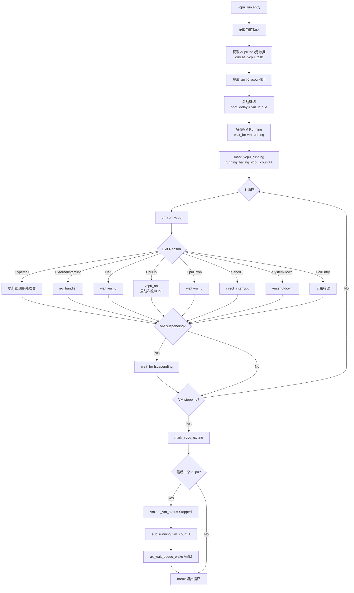

关键代码片段：

```rust
fn vcpu_run() {
    let curr = axtask::current();

    let vm = curr.as_vcpu_task().vm();
    let vcpu = curr.as_vcpu_task().vcpu.clone();
    let vm_id = vm.id();
    let vcpu_id = vcpu.id();

    // boot delay
    let boot_delay_sec = (vm_id - 1) * 5;
    info!("VM[{vm_id}] boot delay: {boot_delay_sec}s");
    busy_wait(Duration::from_secs(boot_delay_sec as _));

    info!("VM[{}] VCpu[{}] waiting for running", vm.id(), vcpu.id());
    wait_for(vm_id, || vm.running());

    info!("VM[{}] VCpu[{}] running...", vm.id(), vcpu.id());
    mark_vcpu_running(vm_id);

    loop {
        match vm.run_vcpu(vcpu_id) {
            Ok(exit_reason) => match exit_reason {
                AxVCpuExitReason::Hypercall { nr, args } => {
                    debug!("Hypercall [{nr}] args {args:x?}");
                    // 处理超调用
                }
                AxVCpuExitReason::ExternalInterrupt { vector } => {
                    debug!("VM[{vm_id}] run VCpu[{vcpu_id}] get irq {vector}");
                    axhal::irq::irq_handler(vector as usize);
                    super::timer::check_events();
                }
                AxVCpuExitReason::Halt => {
                    debug!("VM[{vm_id}] run VCpu[{vcpu_id}] Halt");
                    wait(vm_id)
                }
                AxVCpuExitReason::CpuUp {
                    target_cpu,
                    entry_point,
                    arg,
                } => {
                    info!("VM[{vm_id}]'s VCpu[{vcpu_id}] try to boot target_cpu [{target_cpu}]");
                    vcpu_on(vm.clone(), target_vcpu_id, entry_point, arg as _);
                    vcpu.set_gpr(0, 0);
                }
                AxVCpuExitReason::SystemDown => {
                    warn!("VM[{vm_id}] run VCpu[{vcpu_id}] SystemDown");
                    vm.shutdown().expect("VM shutdown failed");
                }
                // ... 其他 exit reason 处理
            }
            Err(err) => {
                error!("VM[{vm_id}] run VCpu[{vcpu_id}] get error {err:?}");
                vm.shutdown().expect("VM shutdown failed");
            }
        }

        // 检查 VM 暂停状态
        if vm.suspending() {
            debug!("VM[{}] VCpu[{}] is suspended, waiting for resume...", vm_id, vcpu_id);
            wait_for(vm_id, || !vm.suspending());
            info!("VM[{}] VCpu[{}] resumed from suspend", vm_id, vcpu_id);
            continue;
        }

        // 检查 VM 停止状态
        if vm.stopping() {
            warn!("VM[{}] VCpu[{}] stopping because of VM stopping", vm_id, vcpu_id);

            if mark_vcpu_exiting(vm_id) {
                info!("VM[{vm_id}] VCpu[{vcpu_id}] last VCpu exiting");
                vm.set_vm_status(axvm::VMStatus::Stopped);
                sub_running_vm_count(1);
                ax_wait_queue_wake(&super::VMM, 1);
            }
            break;
        }
    }

    info!("VM[{}] VCpu[{}] exiting...", vm_id, vcpu_id);
}
```

---

## 五、同步机制详解

### 5.1 WaitQueue 实现

WaitQueue 在 [axtask/src/wait_queue.rs](crates/arceos/modules/axtask/src/wait_queue.rs) 中实现，基于 `event-listener` crate：

```rust
use event_listener::{Event, listener};
use crate::future::{block_on, timeout_at};

pub struct WaitQueue {
    event: Event,
}

impl WaitQueue {
    pub const fn new() -> Self {
        Self {
            event: Event::new(),
        }
    }

    /// 阻塞当前任务直到被通知
    pub fn wait(&self) {
        listener!(self.event => listener);
        block_on(listener)
    }

    /// 阻塞当前任务直到条件满足
    pub fn wait_until<F>(&self, mut condition: F)
    where
        F: FnMut() -> bool,
    {
        block_on(async {
            loop {
                if condition() {
                    break;
                }
                listener!(self.event => listener);
                if condition() {
                    break;
                }
                listener.await;
            }
        });
    }

    /// 唤醒等待队列中的一个任务
    pub fn notify_one(&self, resched: bool) -> bool {
        self.notify_many(1, resched) == 1
    }

    /// 唤醒等待队列中的多个任务
    pub fn notify_many(&self, count: usize, resched: bool) -> usize {
        let n = self.event.notify(count);
        if resched {
            crate::yield_now();
        }
        n
    }

    /// 唤醒等待队列中的所有任务
    pub fn notify_all(&self, resched: bool) {
        self.notify_many(usize::MAX, resched);
    }
}
```

### 5.2 VCpu 等待/唤醒机制

在 [kernel/src/vmm/vcpus.rs](kernel/src/vmm/vcpus.rs#L170-L220) 中实现：

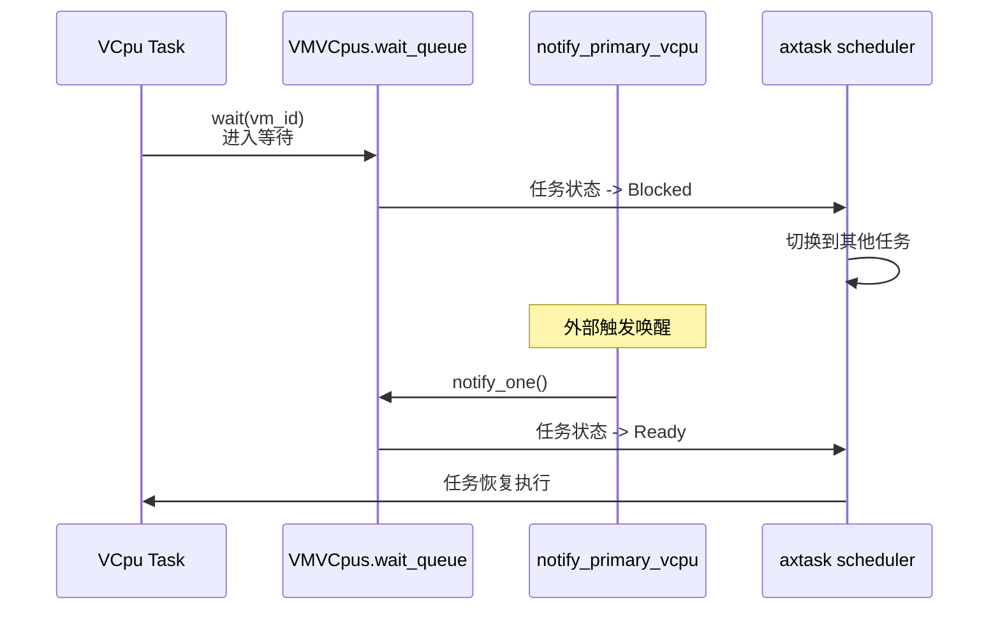

代码实现：

```rust
/// 阻塞当前线程直到被显式唤醒
fn wait(vm_id: usize) {
    VM_VCPU_TASK_WAIT_QUEUE.get(&vm_id).unwrap().wait()
}

/// 阻塞当前线程直到条件满足
fn wait_for<F>(vm_id: usize, condition: F)
where
    F: Fn() -> bool,
{
    VM_VCPU_TASK_WAIT_QUEUE
        .get(&vm_id)
        .unwrap()
        .wait_until(condition)
}

/// 唤醒指定 VM 的主 VCpu 任务
pub(crate) fn notify_primary_vcpu(vm_id: usize) {
    VM_VCPU_TASK_WAIT_QUEUE
        .get_mut(&vm_id)
        .unwrap()
        .notify_one()
}

/// 唤醒指定 VM 的所有 VCpu 任务
pub(crate) fn notify_all_vcpus(vm_id: usize) {
    if let Some(vm_vcpus) = VM_VCPU_TASK_WAIT_QUEUE.get_mut(&vm_id) {
        vm_vcpus.notify_all();
    }
}
```

### 5.3 VM 状态机

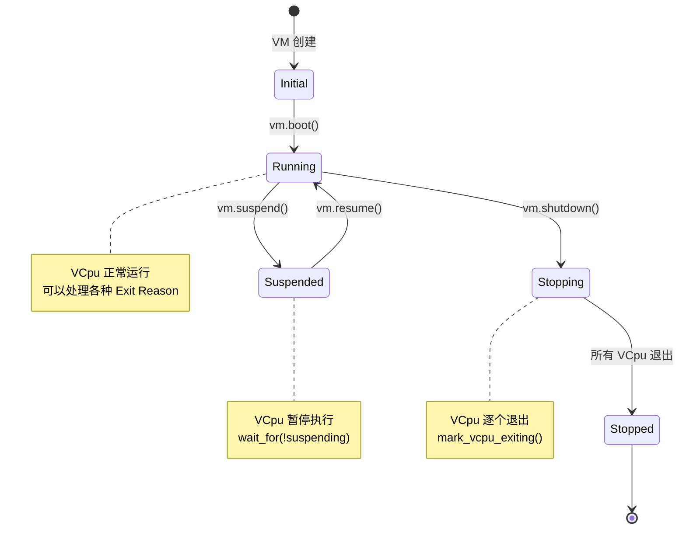

---

## 六、多核调度支持

### 6.1 Per-CPU 运行队列

在 [axtask/src/run_queue.rs](crates/arceos/modules/axtask/src/run_queue.rs#L60-L100) 中实现 per-CPU 运行队列：

```rust
percpu_static! {
    RUN_QUEUE: LazyInit<AxRunQueue> = LazyInit::new(),
    EXITED_TASKS: VecDeque<AxTaskRef> = VecDeque::new(),
    WAIT_FOR_EXIT: AtomicWaker = AtomicWaker::new(),
    IDLE_TASK: LazyInit<AxTaskRef> = LazyInit::new(),
    #[cfg(feature = "smp")]
    PREV_TASK: Weak<crate::AxTask> = Weak::new(),
}

static mut RUN_QUEUES: [MaybeUninit<&'static mut AxRunQueue>; axconfig::plat::CPU_NUM] =
    [ARRAY_REPEAT_VALUE; axconfig::plat::CPU_NUM];
```

### 6.2 运行队列选择

在 [axtask/src/run_queue.rs](crates/arceos/modules/axtask/src/run_queue.rs#L130-L180) 中实现：

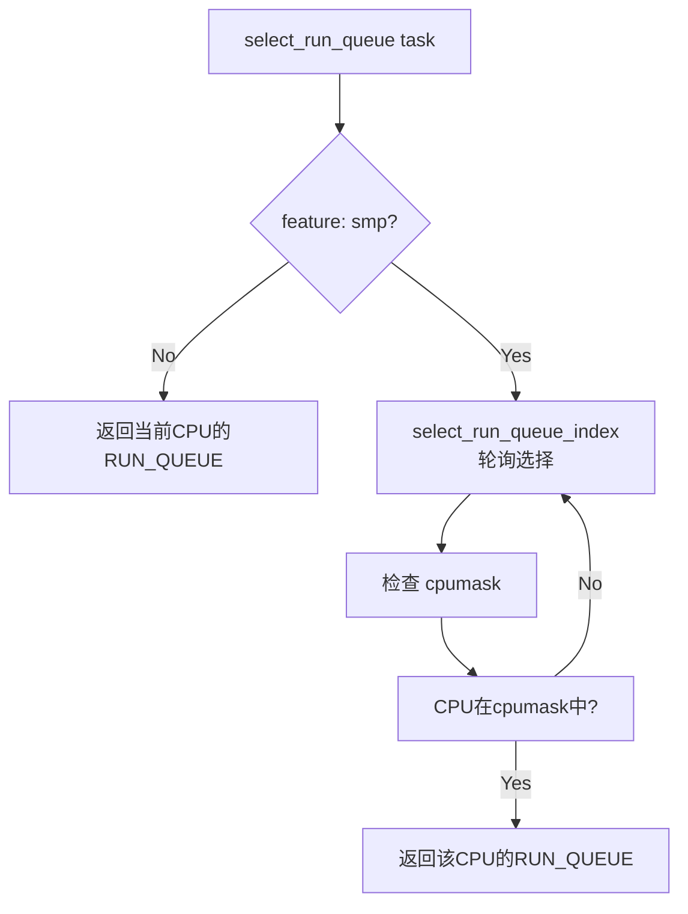

代码实现：

```rust
#[cfg(feature = "smp")]
fn select_run_queue_index(cpumask: AxCpuMask) -> usize {
    static RUN_QUEUE_INDEX: AtomicUsize = AtomicUsize::new(0);

    assert!(!cpumask.is_empty(), "No available CPU for task execution");

    // Round-robin selection
    loop {
        let index = RUN_QUEUE_INDEX.fetch_add(1, Ordering::SeqCst) % axconfig::plat::CPU_NUM;
        if cpumask.get(index) {
            return index;
        }
    }
}

#[inline]
pub(crate) fn select_run_queue<G: BaseGuard>(task: &AxTaskRef) -> AxRunQueueRef<'static, G> {
    let irq_state = G::acquire();

    #[cfg(not(feature = "smp"))]
    {
        AxRunQueueRef {
            inner: unsafe { RUN_QUEUE.current_ref_mut_raw() },
            state: irq_state,
            _phantom: core::marker::PhantomData,
        }
    }

    #[cfg(feature = "smp")]
    {
        let index = select_run_queue_index(task.cpumask());
        AxRunQueueRef {
            inner: get_run_queue(index),
            state: irq_state,
            _phantom: core::marker::PhantomData,
        }
    }
}
```

### 6.3 任务迁移

当任务的 CPU 亲和性改变时，需要迁移任务（[axtask/src/api.rs](crates/arceos/modules/axtask/src/api.rs#L200-L230)）：

```rust
pub fn set_current_affinity(cpumask: AxCpuMask) -> bool {
    if cpumask.is_empty() {
        false
    } else {
        let curr = current().clone();
        curr.set_cpumask(cpumask);

        // 检查当前 CPU 是否匹配新的亲和性
        #[cfg(feature = "smp")]
        if !cpumask.get(axhal::percpu::this_cpu_id()) {
            // 创建迁移任务
            const MIGRATION_TASK_STACK_SIZE: usize = 4096;
            let migration_task = TaskInner::new(
                move || crate::run_queue::migrate_entry(curr),
                "migration-task".into(),
                MIGRATION_TASK_STACK_SIZE,
            )
            .into_arc();

            spawn_task(migration_task);
        }

        true
    }
}
```

---

## 七、当前调度器的优缺点

### 7.1 优点

#### 1. 简单高效
- ✅ 依赖成熟的 ArceOS 调度器，无需重复造轮子
- ✅ 代码量小，易于维护和理解
- ✅ 调度开销低，直接使用底层调度器的高效实现

#### 2. 良好的虚拟化支持
- ✅ VCpu 与任务一一对应，映射关系清晰
- ✅ 支持多 VM 并发运行
- ✅ 支持 CPU 亲和性（通过 `cpumask`）
- ✅ 支持多核调度（per-CPU run queue）

#### 3. 灵活的同步机制
- ✅ WaitQueue 提供高效的等待/唤醒机制
- ✅ 支持条件等待（`wait_until`）
- ✅ 支持超时等待（`wait_timeout`）
- ✅ VM 状态机清晰，易于管理

#### 4. 可扩展的架构
- ✅ 通过 `TaskExt` trait 支持用户扩展数据
- ✅ 模块化设计，易于替换调度算法
- ✅ 支持多种调度策略（FIFO/RR/CFS）

#### 5. 资源管理
- ✅ 使用 Weak 引用避免 VM 循环引用
- ✅ 自动清理退出的 VCpu 任务
- ✅ 支持任务 join 等待退出

### 7.2 局限性

#### 1. 缺乏实时性保证
- ❌ **无显式优先级管理**：依赖底层调度器的优先级，无法针对 VM 特点设置优先级
- ❌ **无时间片配额控制**：无法限制 VM 的 CPU 使用时间
- ❌ **无截止时间监控**：无法保证实时任务的响应时间
- ❌ **无 WCET 监控**：无法预测最坏执行时间

#### 2. 缺乏优先级反转保护
- ❌ **无优先级继承机制**：高优先级 VM 等待低优先级 VM 持有的锁时，无法提升低优先级 VM 的优先级
- ❌ **可能发生优先级反转**：在多 VM 竞争资源时，可能导致系统响应延迟

#### 3. 缺乏死锁检测
- ❌ **无死锁检测机制**：无法自动检测 VM 间的死锁
- ❌ **依赖开发者避免死锁**：需要手动设计避免死锁的方案
- ❌ **无死锁恢复机制**：发生死锁时只能手动重启

#### 4. 调度策略单一
- ❌ **依赖宿主调度器的策略**：无法针对虚拟化场景优化
- ❌ **无 VM 级别的调度**：无法在 VM 层面实现公平调度或资源隔离
- ❌ **无分组调度**：无法按 VM 分组进行资源管理

#### 5. 资源隔离不足
- ❌ **无 CPU 配额管理**：VM 间资源竞争不可控
- ❌ **无内存配额限制**：无法限制 VM 的内存使用
- ❌ **无 I/O 带宽控制**：无法限制 VM 的 I/O 使用

#### 6. 缺乏统计和监控
- ❌ **无调度统计信息**：无法收集调度延迟、上下文切换次数等数据
- ❌ **无性能分析工具**：难以分析调度瓶颈
- ❌ **无调试支持**：难以追踪调度决策

#### 7. 同步原语有限
- ❌ **只有基础的 WaitQueue**：缺乏信号量、互斥锁、条件变量等高级同步原语
- ❌ **无优先级继承的锁**：在 VM 间共享资源时容易发生优先级反转

---

## 八、关键文件清单

| 文件路径 | 行数 | 职责 | 修改优先级 |
|---------|------|------|-----------|
| **kernel/src/vmm/vcpus.rs** | ~600 | VCpu 任务管理、等待队列、vcpu_run 主循环 | **高** |
| **kernel/src/vmm/mod.rs** | ~140 | VMM 初始化、启动流程 | **高** |
| **kernel/src/task.rs** | ~50 | VCpuTask 结构定义、TaskExt 实现 | **中** |
| **crates/arceos/modules/axtask/src/task.rs** | ~564 | TaskInner 结构、任务状态管理 | **中** |
| **crates/arceos/modules/axtask/src/run_queue.rs** | ~687 | 运行队列管理、per-CPU 调度 | **中** |
| **crates/arceos/modules/axtask/src/wait_queue.rs** | ~120 | WaitQueue 同步原语 | **中** |
| **crates/arceos/modules/axtask/src/api.rs** | ~254 | 公开 API、任务创建 | **低** |
| **crates/arceos/modules/axruntime/src/lib.rs** | ~317 | 运行时初始化 | **低** |

---

## 九、总结

AxVisor 的调度系统是一个**两层混合调度模型**：

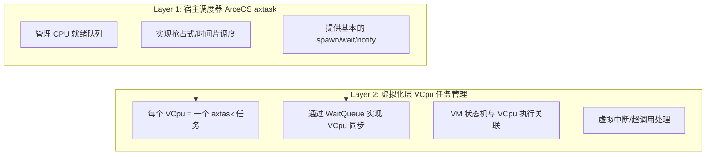

**核心特点**：
- 简单高效，依赖成熟的宿主调度器
- 良好的虚拟化支持，VCpu 与任务一一对应
- 灵活的同步机制，支持 VM 状态管理
- 支持多核调度和 CPU 亲和性

**主要局限**：
- 缺乏实时性保证和优先级管理
- 缺乏资源隔离和配额控制
- 缺乏死锁检测和优先级反转保护
- 缺乏统计监控和性能分析工具

这些局限为后续的 RTOS 调度器改造提供了明确的方向和目标。通过引入显式的优先级管理、时间片配额、死锁检测等机制，可以显著提升 AxVisor 在实时性和资源隔离方面的能力。
