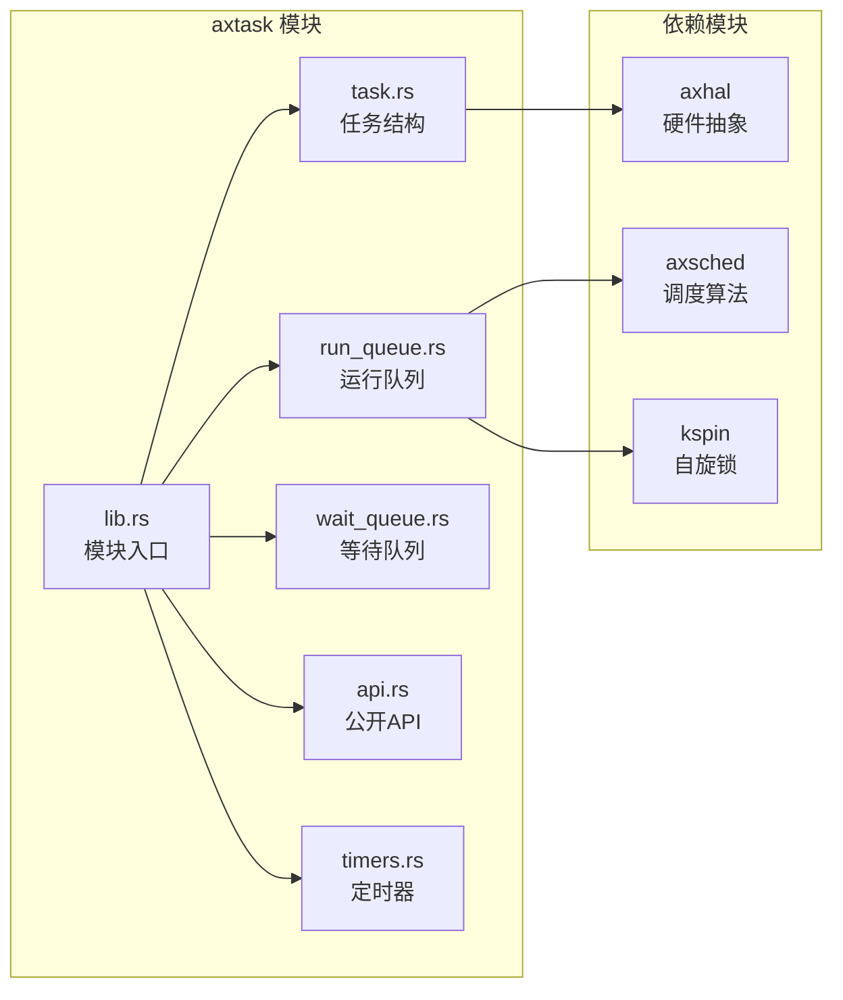

# AxVisor (ArceOS) 调度器实现分析

## 一、概述

AxVisor 是一个基于 ArceOS 框架的虚拟化平台，其任务调度系统采用**混合调度模型**：
- **宿主调度器**：使用 ArceOS 内置的 `axtask` 调度模块（位于 [crates/arceos/modules/axtask](crates/arceos/modules/axtask)）
- **虚拟机调度**：通过 VCpu 任务在宿主调度器上运行，实现虚拟机管理

本文档基于源代码详细分析 AxVisor 的调度架构、流程和实现细节。

---

## 二、系统启动与初始化流程

### 2.1 整体启动流程

系统启动从 [kernel/src/main.rs](kernel/src/main.rs) 的 `main()` 函数开始：

```rust
#[no_mangle]
fn main() {
    logo::print_logo();
    info!("Starting virtualization...");
    info!("Hardware support: {:?}", axvm::has_hardware_support());
    hal::enable_virtualization();

    vmm::init();    // 初始化 VMM
    vmm::start();   // 启动 VM

    info!("[OK] Default guest initialized");
    shell::console_init();
}
```

### 2.2 ArceOS 运行时初始化

在进入 `main()` 之前，[modules/axruntime/src/lib.rs](modules/axruntime/src/lib.rs) 中的 `rust_main()` 会先执行。这涉及到一个完整的启动链路：


#### 2.2.1 链接器入口点配置

链接器脚本 [platform/x86-qemu-q35/linker.lds.S](platform/x86-qemu-q35/linker.lds.S) 定义了程序的入口点：

```assembly
OUTPUT_ARCH(i386:x86-64)

BASE_ADDRESS = 0xffff_8000_0000_0000;
SMP = %SMP%;

ENTRY(_start)    /* 设置入口点为 _start */
SECTIONS
{
    . = BASE_ADDRESS;
    _skernel = .;

    .text : ALIGN(4K) {
        _stext = .;
        *(.text.boot)    /* 启动代码段 */
        *(.text .text.*)
        . = ALIGN(4K);
        _etext = .;
    }
    /* ... 其他段 ... */
}
```

#### 2.2.2 汇编启动代码

在 [platform/x86-qemu-q35/src/boot.rs](platform/x86-qemu-q35/src/boot.rs) 中，通过 `global_asm!` 宏嵌入汇编代码：

```rust
global_asm!(
    include_str!("multiboot.S"),
    mb_magic = const MULTIBOOT_BOOTLOADER_MAGIC,
    entry = sym crate::rust_entry,           // Rust 入口点
    entry_secondary = sym crate::rust_entry_secondary,
    // ...
);
```

汇编代码（multiboot.S）会：
1. 设置 Multiboot 头部
2. 配置 CPU（CR0, CR4, EFER 寄存器）
3. 设置页表
4. 设置栈指针
5. 跳转到 `rust_entry`

#### 2.2.3 平台 Rust 入口

在 [platform/x86-qemu-q35/src/lib.rs](platform/x86-qemu-q35/src/lib.rs#L40-L50) 中定义：

```rust
unsafe extern fn rust_entry(magic: usize, mbi: usize) {
    if magic == self::boot::MULTIBOOT_BOOTLOADER_MAGIC {
        axplat::call_main(current_cpu_id(), mbi);
    }
}

unsafe extern fn rust_entry_secondary(_magic: usize) {
    #[cfg(feature = "smp")]
    if _magic == self::boot::MULTIBOOT_BOOTLOADER_MAGIC {
        axplat::call_secondary_main(current_cpu_id());
    }
}
```

#### 2.2.4 axplat 宏系统

`axplat` crate 提供了 `#[axplat::main]` 宏，用于标记运行时的主入口函数。在 [modules/axruntime/src/lib.rs](modules/axruntime/src/lib.rs#L111) 中：

```rust
/// The main entry point of the ArceOS runtime.
///
/// It is called from the bootstrapping code in the specific platform crate (see
/// [`axplat::main`]).
///
/// `cpu_id` is the logic ID of the current CPU, and `arg` is passed from the
/// bootloader (typically the device tree blob address).
///
/// In multi-core environment, this function is called on the primary core, and
/// secondary cores call [`rust_main_secondary`].
#[cfg_attr(not(test), axplat::main)]
pub fn rust_main(cpu_id: usize, arg: usize) -> ! {
    // ... 初始化代码 ...
}
```

`#[axplat::main]` 宏的工作原理：
1. 将 `rust_main` 函数标记为程序的主入口点
2. `axplat::call_main` 会查找并调用被此宏标记的函数
3. 这是一种依赖注入模式，允许平台代码调用运行时代码

#### 2.2.5 完整的初始化流程


关键代码（[modules/axruntime/src/lib.rs:115-180](modules/axruntime/src/lib.rs#L115-L180)）：

```rust
#[cfg_attr(not(test), axplat::main)]
pub fn rust_main(cpu_id: usize, arg: usize) -> ! {
    unsafe { axhal::mem::clear_bss() };
    axhal::percpu::init_primary(cpu_id);
    axhal::init_early(cpu_id, arg);

    ax_println!("{}", LOGO);
    ax_println!("smp = {}", cpu_count());

    axlog::init();
    log::set_max_level(log::LevelFilter::Trace);
    info!("Logging is enabled.");
    info!("Primary CPU {cpu_id} started, arg = {arg:#x}.");

    axhal::mem::init();
    info!("Found physical memory regions:");
    for r in axhal::mem::memory_regions() {
        info!(
            "  [{:x?}, {:x?}) {} ({:?})",
            r.paddr,
            r.paddr + r.size,
            r.name,
            r.flags
        );
    }

    #[cfg(feature = "alloc")]
    init_allocator();

    let (kernel_space_start, kernel_space_size) = axhal::mem::kernel_aspace();

    info!(
        "kernel aspace: [{:#x?}, {:#x?})",
        kernel_space_start,
        kernel_space_start + kernel_space_size,
    );

    #[cfg(feature = "paging")]
    axmm::init_memory_management();

    #[cfg(feature = "driver-dyn")]
    axdriver::setup(arg);

    info!("Initialize platform devices...");
    axhal::init_later(cpu_id, arg);

    #[cfg(feature = "multitask")]
    axtask::init_scheduler();  // 初始化调度器

    #[cfg(any(feature = "fs", feature = "net", feature = "display"))]
    {
        #[allow(unused_variables)]
        let all_devices = axdriver::init_drivers();

        #[cfg(feature = "fs")]
        axfs::init_filesystems(all_devices.block, axhal::dtb::get_chosen_bootargs());

        #[cfg(feature = "net")]
        axnet::init_network(all_devices.net);

        #[cfg(feature = "display")]
        axdisplay::init_display(all_devices.display);
    }

    #[cfg(feature = "smp")]
    self::mp::start_secondary_cpus(cpu_id);

    #[cfg(feature = "irq")]
    {
        info!("Initialize interrupt handlers...");
        init_interrupt();
    }

    #[cfg(all(feature = "tls", not(feature = "multitask")))]
    {
        info!("Initialize thread local storage...");
        init_tls();
    }

    ctor_bare::call_ctors();  // 调用 C++ 风格构造函数

    info!("Primary CPU {cpu_id} init OK.");
    INITED_CPUS.fetch_add(1, Ordering::Release);

    while !is_init_ok() {
        core::hint::spin_loop();
    }

    unsafe { main() };  // 调用应用 main 函数

    #[cfg(feature = "multitask")]
    axtask::exit(0);
    #[cfg(not(feature = "multitask"))]
    {
        debug!("main task exited: exit_code={}", 0);
        axhal::power::system_off();
    }
}
```

#### 2.2.6 依赖关系图


#### 2.2.7 关键技术点

1. **链接器脚本**：定义入口点和内存布局
2. **全局汇编**：通过 `global_asm!` 嵌入启动代码
3. **宏系统**：`#[axplat::main]` 实现依赖注入
4. **外部函数声明**：`extern { fn main(); }` 声明应用入口
5. **unsafe 调用**：`unsafe { main(); }` 调用应用代码

这种设计使得：
- 平台代码（boot、multiboot）与运行时代码解耦
- 运行时代码与应用代码解耦
- 支持多种平台和多种调度策略
- 通过 feature flags 灵活配置功能

### 2.3 调度器初始化

调度器初始化在 [axtask/src/api.rs](crates/arceos/modules/axtask/src/api.rs) 中实现：

```rust
pub fn init_scheduler() {
    init_scheduler_with_cpu_num(axconfig::plat::CPU_NUM);
}

pub fn init_scheduler_with_cpu_num(cpu_num: usize) {
    info!("Initialize scheduling...");
    CPU_NUM.store(cpu_num, core::sync::atomic::Ordering::Relaxed);

    crate::run_queue::init();  // 初始化运行队列

    info!("  use {} scheduler.", Scheduler::scheduler_name());
}
```

---

## 三、核心调度架构

### 3.1 整体架构图


### 3.2 ArceOS 调度器架构

ArceOS 的调度器位于 [crates/arceos/modules/axtask](crates/arceos/modules/axtask)，采用模块化设计：



#### 3.2.1 调度算法选择

通过 Cargo features 选择调度算法（[axtask/Cargo.toml](crates/arceos/modules/axtask/Cargo.toml)）：

```toml
[features]
sched-fifo = ["multitask"]      # FIFO 协作调度（默认）
sched-rr = ["multitask", "preempt"]  # Round-Robin 抢占调度
sched-cfs = ["multitask", "preempt"] # Completely Fair Scheduler
```

在 [axtask/src/api.rs](crates/arceos/modules/axtask/src/api.rs#L40-L50) 中定义类型别名：

```rust
cfg_if::cfg_if! {
    if #[cfg(feature = "sched-rr")] {
        const MAX_TIME_SLICE: usize = 5;
        pub(crate) type AxTask = axsched::RRTask<TaskInner, MAX_TIME_SLICE>;
        pub(crate) type Scheduler = axsched::RRScheduler<TaskInner, MAX_TIME_SLICE>;
    } else if #[cfg(feature = "sched-cfs")] {
        pub(crate) type AxTask = axsched::CFSTask<TaskInner>;
        pub(crate) type Scheduler = axsched::CFScheduler<TaskInner>;
    } else {
        // 默认使用 FIFO
        pub(crate) type AxTask = axsched::FifoTask<TaskInner>;
        pub(crate) type Scheduler = axsched::FifoScheduler<TaskInner>;
    }
}
```

#### 3.2.2 任务状态定义

在 [axtask/src/task.rs](crates/arceos/modules/axtask/src/task.rs#L28-L38) 中定义任务状态：

```rust
/// The possible states of a task.
#[repr(u8)]
#[derive(Debug, Clone, Copy, Eq, PartialEq)]
pub enum TaskState {
    /// Task is running on some CPU.
    Running = 1,
    /// Task is ready to run on some scheduler's ready queue.
    Ready = 2,
    /// Task is blocked (in the wait queue or timer list),
    /// and it has finished its scheduling process, it can be wake up by `notify()` on any run queue safely.
    Blocked = 3,
    /// Task is exited and waiting for being dropped.
    Exited = 4,
}
```

任务状态转换图：


#### 3.2.3 TaskInner 结构

核心任务结构在 [axtask/src/task.rs](crates/arceos/modules/axtask/src/task.rs#L60-L120)：

```rust
pub struct TaskInner {
    id: TaskId,
    name: SpinNoIrq<String>,
    is_idle: bool,
    is_init: bool,

    entry: Cell<Option<Box<dyn FnOnce()>>>,
    state: AtomicU8,  // TaskState

    /// CPU affinity mask.
    cpumask: SpinNoIrq<AxCpuMask>,

    /// Used to indicate the CPU ID where the task is running or will run.
    cpu_id: AtomicU32,
    #[cfg(feature = "smp")]
    on_cpu: AtomicBool,

    #[cfg(feature = "preempt")]
    need_resched: AtomicBool,
    #[cfg(feature = "preempt")]
    preempt_disable_count: AtomicUsize,

    interrupted: AtomicBool,
    interrupt_waker: AtomicWaker,

    exit_code: AtomicI32,
    wait_for_exit: AtomicWaker,

    kstack: Option<TaskStack>,
    ctx: UnsafeCell<TaskContext>,

    #[cfg(feature = "task-ext")]
    task_ext: Option<AxTaskExt>,  // 用户扩展数据

    #[cfg(feature = "tls")]
    tls: TlsArea,
}
```

#### 3.2.4 运行队列管理

运行队列在 [axtask/src/run_queue.rs](crates/arceos/modules/axtask/src/run_queue.rs) 中实现：


关键代码（[run_queue.rs:60-80](crates/arceos/modules/axtask/src/run_queue.rs#L60-L80)）：

```rust
percpu_static! {
    RUN_QUEUE: LazyInit<AxRunQueue> = LazyInit::new(),
    EXITED_TASKS: VecDeque<AxTaskRef> = VecDeque::new(),
    WAIT_FOR_EXIT: AtomicWaker = AtomicWaker::new(),
    IDLE_TASK: LazyInit<AxTaskRef> = LazyInit::new(),
    #[cfg(feature = "smp")]
    PREV_TASK: Weak<crate::AxTask> = Weak::new(),
}

static mut RUN_QUEUES: [MaybeUninit<&'static mut AxRunQueue>; axconfig::plat::CPU_NUM] =
    [ARRAY_REPEAT_VALUE; axconfig::plat::CPU_NUM];
```

### 3.3 VCpu 任务管理层

#### 3.3.1 VCpuTask 结构

在 [kernel/src/task.rs](kernel/src/task.rs) 中定义 VCpu 任务的扩展数据：

```rust
use alloc::sync::{Arc, Weak};
use std::os::arceos::modules::axtask::{TaskExt, TaskInner};
use crate::vmm::{VCpuRef, VM, VMRef};

/// Task extended data for the hypervisor.
pub struct VCpuTask {
    /// The VM (Weak reference to avoid keeping VM alive).
    pub vm: Weak<VM>,
    /// The virtual CPU.
    pub vcpu: VCpuRef,
}

impl VCpuTask {
    pub fn new(vm: &VMRef, vcpu: VCpuRef) -> Self {
        Self {
            vm: Arc::downgrade(vm),  // 使用 Weak 引用避免循环引用
            vcpu,
        }
    }

    pub fn vm(&self) -> VMRef {
        self.vm.upgrade().expect("VM has been dropped")
    }
}

// 实现 TaskExt trait，使 VCpuTask 可以作为任务扩展
#[extern_trait::extern_trait]
unsafe impl TaskExt for VCpuTask {}

pub trait AsVCpuTask {
    fn as_vcpu_task(&self) -> &VCpuTask;
}

impl AsVCpuTask for TaskInner {
    fn as_vcpu_task(&self) -> &VCpuTask {
        unsafe {
            self.task_ext()
                .expect("Not a VCpuTask")
                .downcast_ref::<VCpuTask>()
        }
    }
}
```

#### 3.3.2 VMVCpus 结构

在 [kernel/src/vmm/vcpus.rs](kernel/src/vmm/vcpus.rs#L60-L100) 中定义 VM 的 VCpu 管理结构：

```rust
/// A structure representing the VCpus of a specific VM, including a wait queue
/// and a list of tasks associated with the VCpus.
pub struct VMVCpus {
    // The ID of the VM to which these VCpus belong.
    _vm_id: usize,
    // A wait queue to manage task scheduling for the VCpus.
    wait_queue: WaitQueue,
    // A list of tasks associated with the VCpus of this VM.
    vcpu_task_list: Vec<AxTaskRef>,
    /// The number of currently running or halting VCpus.
    running_halting_vcpu_count: AtomicUsize,
}

impl VMVCpus {
    fn new(vm: VMRef) -> Self {
        Self {
            _vm_id: vm.id(),
            wait_queue: WaitQueue::new(),
            vcpu_task_list: Vec::with_capacity(vm.vcpu_num()),
            running_halting_vcpu_count: AtomicUsize::new(0),
        }
    }

    fn add_vcpu_task(&mut self, vcpu_task: AxTaskRef) {
        self.vcpu_task_list.push(vcpu_task);
    }

    fn wait(&self) {
        self.wait_queue.wait()
    }

    fn wait_until<F>(&self, condition: F)
    where
        F: Fn() -> bool,
    {
        self.wait_queue.wait_until(condition)
    }

    fn notify_one(&mut self) {
        self.wait_queue.notify_one(false);
    }

    fn notify_all(&mut self) {
        self.wait_queue.notify_all(false);
    }

    fn mark_vcpu_running(&self) {
        self.running_halting_vcpu_count.fetch_add(1, Ordering::Relaxed);
    }

    fn mark_vcpu_exiting(&self) -> bool {
        self.running_halting_vcpu_count.fetch_sub(1, Ordering::Relaxed) == 1
    }
}
```

#### 3.3.3 全局 VCpu 等待队列

在 [kernel/src/vmm/vcpus.rs](kernel/src/vmm/vcpus.rs#L35-L60) 中定义全局等待队列：

```rust
/// A global static BTreeMap that holds the wait queues for VCpus
/// associated with their respective VMs, identified by their VM IDs.
static VM_VCPU_TASK_WAIT_QUEUE: Queue = Queue::new();

/// A thread-safe queue that manages wait queues for VCpus across multiple VMs.
struct Queue(UnsafeCell<BTreeMap<usize, VMVCpus>>);

unsafe impl Sync for Queue {}
unsafe impl Send for Queue {}

impl Queue {
    const fn new() -> Self {
        Self(UnsafeCell::new(BTreeMap::new()))
    }

    fn get(&self, vm_id: &usize) -> Option<&VMVCpus> {
        unsafe { (*self.0.get()).get(vm_id) }
    }

    fn get_mut(&self, vm_id: &usize) -> Option<&mut VMVCpus> {
        unsafe { (*self.0.get()).get_mut(vm_id) }
    }

    fn insert(&self, vm_id: usize, vcpus: VMVCpus) {
        unsafe {
            (*self.0.get()).insert(vm_id, vcpus);
        }
    }

    fn remove(&self, vm_id: &usize) -> Option<VMVCpus> {
        unsafe { (*self.0.get()).remove(vm_id) }
    }
}
```

---

## 四、任务调度流程详解

### 4.1 VMM 初始化流程

在 [kernel/src/vmm/mod.rs](kernel/src/vmm/mod.rs#L30-L50) 中实现：


代码实现：

```rust
pub fn init() {
    info!("Initializing VMM...");
    config::init_guest_vms();  // 创建 VM 实例

    info!("Setting up vcpus...");
    for vm in vm_list::get_vm_list() {
        vcpus::setup_vm_primary_vcpu(vm);  // 设置主 VCpu
    }
}
```

### 4.2 VCpu 任务创建流程

在 [kernel/src/vmm/vcpus.rs](kernel/src/vmm/vcpus.rs#L380-L420) 中实现 `alloc_vcpu_task`：


代码实现：

```rust
fn alloc_vcpu_task(vm: &VMRef, vcpu: VCpuRef) -> AxTaskRef {
    info!("Spawning task for VM[{}] VCpu[{}]", vm.id(), vcpu.id());

    // 1. 创建新 Task，入口函数为 vcpu_run()
    let mut vcpu_task = TaskInner::new(
        vcpu_run,
        format!("VM[{}]-VCpu[{}]", vm.id(), vcpu.id()),
        KERNEL_STACK_SIZE,  // 256 KiB
    );

    // 2. 设置 CPU 亲和性（如果配置了）
    if let Some(phys_cpu_set) = vcpu.phys_cpu_set() {
        vcpu_task.set_cpumask(AxCpuMask::from_raw_bits(phys_cpu_set));
    }

    // 3. 关联 VCpuTask 元数据（使用 Weak 引用避免循环引用）
    let inner = VCpuTask::new(vm, vcpu);
    *vcpu_task.task_ext_mut() = Some(unsafe { AxTaskExt::from_impl(inner) });

    info!(
        "VCpu task {} created {:?}",
        vcpu_task.id_name(),
        vcpu_task.cpumask()
    );

    // 4. 提交给宿主调度器
    axtask::spawn_task(vcpu_task)
}
```

### 4.3 VMM 启动流程

在 [kernel/src/vmm/mod.rs](kernel/src/vmm/mod.rs#L55-L80) 中实现：


代码实现：

```rust
pub fn start() {
    info!("VMM starting, booting VMs...");

    for vm in vm_list::get_vm_list() {
        match vm.boot() {
            Ok(_) => {
                vcpus::notify_primary_vcpu(vm.id());
                RUNNING_VM_COUNT.fetch_add(1, Ordering::Release);
                info!("VM[{}] boot success", vm.id())
            }
            Err(err) => warn!("VM[{}] boot failed, error {:?}", vm.id(), err),
        }
    }

    // Do not exit until all VMs are stopped.
    task::ax_wait_queue_wait_until(
        &VMM,
        || {
            let vm_count = RUNNING_VM_COUNT.load(Ordering::Acquire);
            info!("a VM exited, current running VM count: {vm_count}");
            vm_count == 0
        },
        None,
    );
}
```

### 4.4 VCpu 任务执行流程

在 [kernel/src/vmm/vcpus.rs](kernel/src/vmm/vcpus.rs#L425-L600) 中实现 `vcpu_run`：


关键代码片段：

```rust
fn vcpu_run() {
    let curr = axtask::current();

    let vm = curr.as_vcpu_task().vm();
    let vcpu = curr.as_vcpu_task().vcpu.clone();
    let vm_id = vm.id();
    let vcpu_id = vcpu.id();

    // boot delay
    let boot_delay_sec = (vm_id - 1) * 5;
    info!("VM[{vm_id}] boot delay: {boot_delay_sec}s");
    busy_wait(Duration::from_secs(boot_delay_sec as _));

    info!("VM[{}] VCpu[{}] waiting for running", vm.id(), vcpu.id());
    wait_for(vm_id, || vm.running());

    info!("VM[{}] VCpu[{}] running...", vm.id(), vcpu.id());
    mark_vcpu_running(vm_id);

    loop {
        match vm.run_vcpu(vcpu_id) {
            Ok(exit_reason) => match exit_reason {
                AxVCpuExitReason::Hypercall { nr, args } => {
                    debug!("Hypercall [{nr}] args {args:x?}");
                    // 处理超调用
                }
                AxVCpuExitReason::ExternalInterrupt { vector } => {
                    debug!("VM[{vm_id}] run VCpu[{vcpu_id}] get irq {vector}");
                    axhal::irq::irq_handler(vector as usize);
                    super::timer::check_events();
                }
                AxVCpuExitReason::Halt => {
                    debug!("VM[{vm_id}] run VCpu[{vcpu_id}] Halt");
                    wait(vm_id)
                }
                AxVCpuExitReason::CpuUp {
                    target_cpu,
                    entry_point,
                    arg,
                } => {
                    info!("VM[{vm_id}]'s VCpu[{vcpu_id}] try to boot target_cpu [{target_cpu}]");
                    vcpu_on(vm.clone(), target_vcpu_id, entry_point, arg as _);
                    vcpu.set_gpr(0, 0);
                }
                AxVCpuExitReason::SystemDown => {
                    warn!("VM[{vm_id}] run VCpu[{vcpu_id}] SystemDown");
                    vm.shutdown().expect("VM shutdown failed");
                }
                // ... 其他 exit reason 处理
            }
            Err(err) => {
                error!("VM[{vm_id}] run VCpu[{vcpu_id}] get error {err:?}");
                vm.shutdown().expect("VM shutdown failed");
            }
        }

        // 检查 VM 暂停状态
        if vm.suspending() {
            debug!("VM[{}] VCpu[{}] is suspended, waiting for resume...", vm_id, vcpu_id);
            wait_for(vm_id, || !vm.suspending());
            info!("VM[{}] VCpu[{}] resumed from suspend", vm_id, vcpu_id);
            continue;
        }

        // 检查 VM 停止状态
        if vm.stopping() {
            warn!("VM[{}] VCpu[{}] stopping because of VM stopping", vm_id, vcpu_id);

            if mark_vcpu_exiting(vm_id) {
                info!("VM[{vm_id}] VCpu[{vcpu_id}] last VCpu exiting");
                vm.set_vm_status(axvm::VMStatus::Stopped);
                sub_running_vm_count(1);
                ax_wait_queue_wake(&super::VMM, 1);
            }
            break;
        }
    }

    info!("VM[{}] VCpu[{}] exiting...", vm_id, vcpu_id);
}
```

---

## 五、同步机制详解

### 5.1 WaitQueue 实现

WaitQueue 在 [axtask/src/wait_queue.rs](crates/arceos/modules/axtask/src/wait_queue.rs) 中实现，基于 `event-listener` crate：

```rust
use event_listener::{Event, listener};
use crate::future::{block_on, timeout_at};

pub struct WaitQueue {
    event: Event,
}

impl WaitQueue {
    pub const fn new() -> Self {
        Self {
            event: Event::new(),
        }
    }

    /// 阻塞当前任务直到被通知
    pub fn wait(&self) {
        listener!(self.event => listener);
        block_on(listener)
    }

    /// 阻塞当前任务直到条件满足
    pub fn wait_until<F>(&self, mut condition: F)
    where
        F: FnMut() -> bool,
    {
        block_on(async {
            loop {
                if condition() {
                    break;
                }
                listener!(self.event => listener);
                if condition() {
                    break;
                }
                listener.await;
            }
        });
    }

    /// 唤醒等待队列中的一个任务
    pub fn notify_one(&self, resched: bool) -> bool {
        self.notify_many(1, resched) == 1
    }

    /// 唤醒等待队列中的多个任务
    pub fn notify_many(&self, count: usize, resched: bool) -> usize {
        let n = self.event.notify(count);
        if resched {
            crate::yield_now();
        }
        n
    }

    /// 唤醒等待队列中的所有任务
    pub fn notify_all(&self, resched: bool) {
        self.notify_many(usize::MAX, resched);
    }
}
```

### 5.2 VCpu 等待/唤醒机制

在 [kernel/src/vmm/vcpus.rs](kernel/src/vmm/vcpus.rs#L170-L220) 中实现：


代码实现：

```rust
/// 阻塞当前线程直到被显式唤醒
fn wait(vm_id: usize) {
    VM_VCPU_TASK_WAIT_QUEUE.get(&vm_id).unwrap().wait()
}

/// 阻塞当前线程直到条件满足
fn wait_for<F>(vm_id: usize, condition: F)
where
    F: Fn() -> bool,
{
    VM_VCPU_TASK_WAIT_QUEUE
        .get(&vm_id)
        .unwrap()
        .wait_until(condition)
}

/// 唤醒指定 VM 的主 VCpu 任务
pub(crate) fn notify_primary_vcpu(vm_id: usize) {
    VM_VCPU_TASK_WAIT_QUEUE
        .get_mut(&vm_id)
        .unwrap()
        .notify_one()
}

/// 唤醒指定 VM 的所有 VCpu 任务
pub(crate) fn notify_all_vcpus(vm_id: usize) {
    if let Some(vm_vcpus) = VM_VCPU_TASK_WAIT_QUEUE.get_mut(&vm_id) {
        vm_vcpus.notify_all();
    }
}
```

### 5.3 VM 状态机


---

## 六、多核调度支持

### 6.1 Per-CPU 运行队列

在 [axtask/src/run_queue.rs](crates/arceos/modules/axtask/src/run_queue.rs#L60-L100) 中实现 per-CPU 运行队列：

```rust
percpu_static! {
    RUN_QUEUE: LazyInit<AxRunQueue> = LazyInit::new(),
    EXITED_TASKS: VecDeque<AxTaskRef> = VecDeque::new(),
    WAIT_FOR_EXIT: AtomicWaker = AtomicWaker::new(),
    IDLE_TASK: LazyInit<AxTaskRef> = LazyInit::new(),
    #[cfg(feature = "smp")]
    PREV_TASK: Weak<crate::AxTask> = Weak::new(),
}

static mut RUN_QUEUES: [MaybeUninit<&'static mut AxRunQueue>; axconfig::plat::CPU_NUM] =
    [ARRAY_REPEAT_VALUE; axconfig::plat::CPU_NUM];
```

### 6.2 运行队列选择

在 [axtask/src/run_queue.rs](crates/arceos/modules/axtask/src/run_queue.rs#L130-L180) 中实现：


代码实现：

```rust
#[cfg(feature = "smp")]
fn select_run_queue_index(cpumask: AxCpuMask) -> usize {
    static RUN_QUEUE_INDEX: AtomicUsize = AtomicUsize::new(0);

    assert!(!cpumask.is_empty(), "No available CPU for task execution");

    // Round-robin selection
    loop {
        let index = RUN_QUEUE_INDEX.fetch_add(1, Ordering::SeqCst) % axconfig::plat::CPU_NUM;
        if cpumask.get(index) {
            return index;
        }
    }
}

#[inline]
pub(crate) fn select_run_queue<G: BaseGuard>(task: &AxTaskRef) -> AxRunQueueRef<'static, G> {
    let irq_state = G::acquire();

    #[cfg(not(feature = "smp"))]
    {
        AxRunQueueRef {
            inner: unsafe { RUN_QUEUE.current_ref_mut_raw() },
            state: irq_state,
            _phantom: core::marker::PhantomData,
        }
    }

    #[cfg(feature = "smp")]
    {
        let index = select_run_queue_index(task.cpumask());
        AxRunQueueRef {
            inner: get_run_queue(index),
            state: irq_state,
            _phantom: core::marker::PhantomData,
        }
    }
}
```

### 6.3 任务迁移

当任务的 CPU 亲和性改变时，需要迁移任务（[axtask/src/api.rs](crates/arceos/modules/axtask/src/api.rs#L200-L230)）：

```rust
pub fn set_current_affinity(cpumask: AxCpuMask) -> bool {
    if cpumask.is_empty() {
        false
    } else {
        let curr = current().clone();
        curr.set_cpumask(cpumask);

        // 检查当前 CPU 是否匹配新的亲和性
        #[cfg(feature = "smp")]
        if !cpumask.get(axhal::percpu::this_cpu_id()) {
            // 创建迁移任务
            const MIGRATION_TASK_STACK_SIZE: usize = 4096;
            let migration_task = TaskInner::new(
                move || crate::run_queue::migrate_entry(curr),
                "migration-task".into(),
                MIGRATION_TASK_STACK_SIZE,
            )
            .into_arc();

            spawn_task(migration_task);
        }

        true
    }
}
```

---

## 七、当前调度器的优缺点

### 7.1 优点

#### 1. 简单高效
- ✅ 依赖成熟的 ArceOS 调度器，无需重复造轮子
- ✅ 代码量小，易于维护和理解
- ✅ 调度开销低，直接使用底层调度器的高效实现

#### 2. 良好的虚拟化支持
- ✅ VCpu 与任务一一对应，映射关系清晰
- ✅ 支持多 VM 并发运行
- ✅ 支持 CPU 亲和性（通过 `cpumask`）
- ✅ 支持多核调度（per-CPU run queue）

#### 3. 灵活的同步机制
- ✅ WaitQueue 提供高效的等待/唤醒机制
- ✅ 支持条件等待（`wait_until`）
- ✅ 支持超时等待（`wait_timeout`）
- ✅ VM 状态机清晰，易于管理

#### 4. 可扩展的架构
- ✅ 通过 `TaskExt` trait 支持用户扩展数据
- ✅ 模块化设计，易于替换调度算法
- ✅ 支持多种调度策略（FIFO/RR/CFS）

#### 5. 资源管理
- ✅ 使用 Weak 引用避免 VM 循环引用
- ✅ 自动清理退出的 VCpu 任务
- ✅ 支持任务 join 等待退出

### 7.2 局限性

#### 1. 缺乏实时性保证
- ❌ **无显式优先级管理**：依赖底层调度器的优先级，无法针对 VM 特点设置优先级
- ❌ **无时间片配额控制**：无法限制 VM 的 CPU 使用时间
- ❌ **无截止时间监控**：无法保证实时任务的响应时间
- ❌ **无 WCET 监控**：无法预测最坏执行时间

#### 2. 缺乏优先级反转保护
- ❌ **无优先级继承机制**：高优先级 VM 等待低优先级 VM 持有的锁时，无法提升低优先级 VM 的优先级
- ❌ **可能发生优先级反转**：在多 VM 竞争资源时，可能导致系统响应延迟

#### 3. 缺乏死锁检测
- ❌ **无死锁检测机制**：无法自动检测 VM 间的死锁
- ❌ **依赖开发者避免死锁**：需要手动设计避免死锁的方案
- ❌ **无死锁恢复机制**：发生死锁时只能手动重启

#### 4. 调度策略单一
- ❌ **依赖宿主调度器的策略**：无法针对虚拟化场景优化
- ❌ **无 VM 级别的调度**：无法在 VM 层面实现公平调度或资源隔离
- ❌ **无分组调度**：无法按 VM 分组进行资源管理

#### 5. 资源隔离不足
- ❌ **无 CPU 配额管理**：VM 间资源竞争不可控
- ❌ **无内存配额限制**：无法限制 VM 的内存使用
- ❌ **无 I/O 带宽控制**：无法限制 VM 的 I/O 使用

#### 6. 缺乏统计和监控
- ❌ **无调度统计信息**：无法收集调度延迟、上下文切换次数等数据
- ❌ **无性能分析工具**：难以分析调度瓶颈
- ❌ **无调试支持**：难以追踪调度决策

#### 7. 同步原语有限
- ❌ **只有基础的 WaitQueue**：缺乏信号量、互斥锁、条件变量等高级同步原语
- ❌ **无优先级继承的锁**：在 VM 间共享资源时容易发生优先级反转

---

## 八、关键文件清单

| 文件路径 | 行数 | 职责 | 修改优先级 |
|---------|------|------|-----------|
| **kernel/src/vmm/vcpus.rs** | ~600 | VCpu 任务管理、等待队列、vcpu_run 主循环 | **高** |
| **kernel/src/vmm/mod.rs** | ~140 | VMM 初始化、启动流程 | **高** |
| **kernel/src/task.rs** | ~50 | VCpuTask 结构定义、TaskExt 实现 | **中** |
| **crates/arceos/modules/axtask/src/task.rs** | ~564 | TaskInner 结构、任务状态管理 | **中** |
| **crates/arceos/modules/axtask/src/run_queue.rs** | ~687 | 运行队列管理、per-CPU 调度 | **中** |
| **crates/arceos/modules/axtask/src/wait_queue.rs** | ~120 | WaitQueue 同步原语 | **中** |
| **crates/arceos/modules/axtask/src/api.rs** | ~254 | 公开 API、任务创建 | **低** |
| **crates/arceos/modules/axruntime/src/lib.rs** | ~317 | 运行时初始化 | **低** |

---

## 九、总结

AxVisor 的调度系统是一个**两层混合调度模型**：


**核心特点**：
- 简单高效，依赖成熟的宿主调度器
- 良好的虚拟化支持，VCpu 与任务一一对应
- 灵活的同步机制，支持 VM 状态管理
- 支持多核调度和 CPU 亲和性

**主要局限**：
- 缺乏实时性保证和优先级管理
- 缺乏资源隔离和配额控制
- 缺乏死锁检测和优先级反转保护
- 缺乏统计监控和性能分析工具

这些局限为后续的 RTOS 调度器改造提供了明确的方向和目标。通过引入显式的优先级管理、时间片配额、死锁检测等机制，可以显著提升 AxVisor 在实时性和资源隔离方面的能力。
